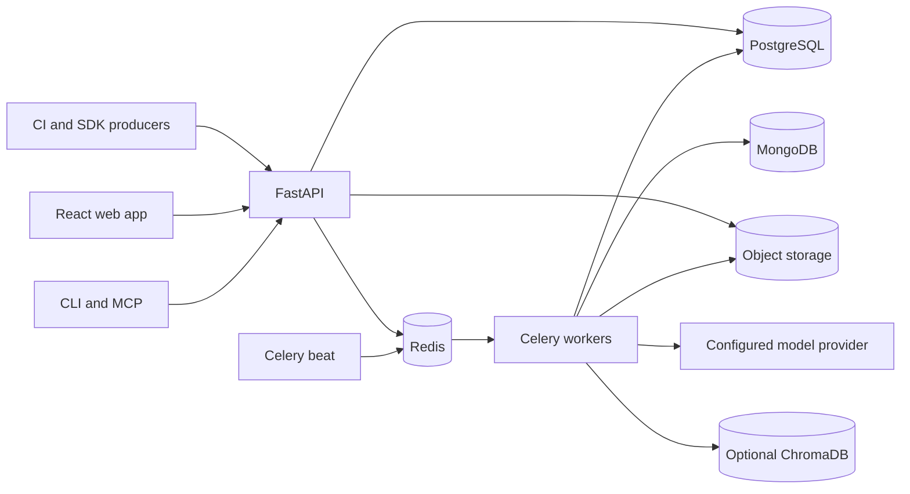

# TestLookup

**Local-first test result ingestion, failure intelligence, and release decision support.**

TestLookup collects results from test frameworks and CI, preserves execution evidence, and helps teams investigate failures, review AI findings, manage tests, and evaluate release readiness. It provides a React web application, FastAPI REST API, CLI, client SDKs, and an MCP server.

Test frameworks and CI systems execute the tests. TestLookup receives their results and runs the intelligence and reporting workflows described below.

## Start here

| Audience | Guide |
|---|---|
| Evaluating the product | [Product overview](docs/product/overview.md) and [user journeys](docs/product/workflows.md) |
| Joining the engineering team | [Developer handoff](docs/handoff/README.md) and [local development](docs/operations/development.md) |
| Integrating CI or a client | [API guide](docs/api/README.md), [all endpoints](docs/reference/api-index.md), [SDK/CLI/MCP](docs/architecture/integrations.md) |
| Understanding the system | [Architecture](docs/architecture/overview.md), [codebase map](docs/architecture/codebase-map.md), [data model](docs/architecture/data-model.md) |
| Operating an installation | [Deployment](docs/operations/deployment.md), [testing](docs/operations/testing.md), [limits and troubleshooting](docs/handoff/limitations.md) |

The [documentation suite](docs/README.md) is based on GitHub `main` commit `44be1f2023d50bbbd9554bc91ce668c5c0789db5` (2026-09-18). It includes **550 HTTP operations across 460 paths, 471 OpenAPI schemas, and 139 SQLAlchemy tables**. Counts describe the source snapshot, not a running installation. [Verification and scope](docs/handoff/verification.md) distinguish generated contracts, reviewed flows, and checks not run.

## Quick start

Prerequisites: Docker with Compose v2, Git, GNU Make and Bash. On Windows, use Git Bash or WSL for these commands. The deployment has multiple databases and workers; see [resource and model considerations](docs/operations/deployment.md) before enabling local models.

```bash
git clone https://github.com/test-intelligence/testlookup.git
cd testlookup
make quickstart
```

The Makefile creates `.env` with local development secrets if it is absent, builds the core stack and seeds demo data. Inspect the generated environment before using it outside development. Existing `.env` values are retained. Demo login is a development-only capability.

| Mode | Command | Behavior |
|---|---|---|
| Demo | `make quickstart` | Core services and sample data |
| Core | `make dev` | Ingestion, API, UI, workers and rules/available ML analysis |
| Local LLM | `make dev-llm` | Adds Ollama and ChromaDB; pulls the Makefile's pinned models |

Open the dashboard at [localhost:3000](http://localhost:3000), Swagger at [localhost:8000/api-docs](http://localhost:8000/api-docs), and the schema at [localhost:8000/api-docs/openapi.json](http://localhost:8000/api-docs/openapi.json). MCP SSE is served on port 8002 and requires the caller's bearer credentials. The frontend `/docs` page is the in-app user guide.

Default local model tags in the Makefile are `qwen2.5:3b-instruct-q5_K_M`, `qwen2.5:14b-instruct-q5_K_M`, and `nomic-embed-text:v1.5`. Download time and inference latency depend on hardware and model availability; this documentation does not promise benchmark timings. Model weights reside in Docker volumes. [AI pipeline](docs/pipelines/ai.md).

## What is implemented

| Area | Capabilities and qualification |
|---|---|
| Ingestion | JSON batches, live SDK events, object-storage sentinel events, file uploads and bounded ZIP archives; JUnit, TestNG, Allure, Cypress, Playwright, pytest, Robot, Cucumber, NUnit, TRX and xUnit parsers |
| Investigation | Rules/ML/LLM/auto routing; failure clusters, regression comparisons, anomaly evidence, optional deep workflow and bounded cluster investigations |
| Governance | Agent configuration and versioned workflows, decision trails, human report review, typed action proposals, release policies and override history |
| Test operations | Canonical suites/tests, authored test lifecycle, plans and strategies, failure assignment, flaky quarantine, ownership and retention |
| Reports | Run intelligence, project summaries, HTML/PDF reports, evidence bundles, share links and compliance packs with policy controls |
| Integrations | Jira, GitHub/GitLab, knowledge sources, notifications, CLI, Python/JS/Java/Go client code, MCP |
| Identity | JWT and API keys, project membership and role checks, MFA, SAML SSO and SCIM provisioning |
| Operations | Health probes, Prometheus metrics, optional tracing/monitoring, backups, migrations, Compose and Kubernetes deployment assets |

Presence in the repository does not mean every feature is enabled. Feature flags, project policies, role, provider availability and configuration determine behavior. `AI_OFFLINE_MODE=true` is the default AI egress ceiling; it allows approved local/private endpoints and is not a substitute for network isolation. `REVIEW_GATE_ENFORCED=false` defaults to observation mode for report distribution. [Security and policy boundaries](docs/architecture/security.md).

## Architecture



See [deployment](docs/operations/deployment.md) for queue topology, migration order, production secrets, homelab storage and air-gap packaging. Do not point a second Compose checkout at the same host stack without isolating its fixed container names, ports and volumes.

## Documentation and contribution

- [Complete documentation and suggested structure](docs/README.md)
- [Design decisions and trade-offs](docs/architecture/design-decisions.md)
- [Ingestion](docs/pipelines/ingestion.md), [test-run lifecycle](docs/pipelines/test-runs.md), [AI](docs/pipelines/ai.md), [reporting](docs/pipelines/reporting.md)
- [Generated OpenAPI JSON](docs/reference/openapi.json), [data dictionary](docs/reference/data-dictionary.md), [configuration](docs/reference/configuration.md)
- [Wiki publication instructions](docs/wiki/README.md)
- [Existing architecture deep dives](architecture/README.md), [user guide](user-guide/README.md), [contributing](CONTRIBUTING.md), [security reporting](SECURITY.md), [code of conduct](CODE_OF_CONDUCT.md)

Regenerate references with `python scripts/generate_handoff_reference.py` in an environment containing the backend dependencies. Check documentation with `python scripts/check_handoff_docs.py` and `python scripts/generate_handoff_reference.py --check`. [Maintenance workflow](docs/handoff/maintenance.md).

Apache 2.0 — [LICENSE](LICENSE).
