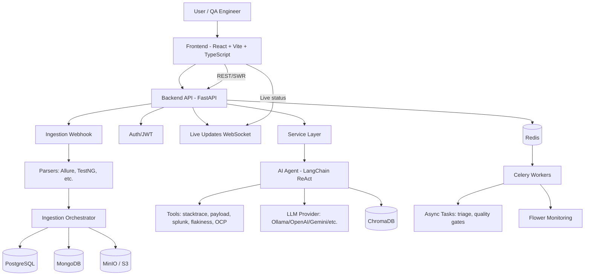

# TestLookup 🔭

> **360° AI-Powered Software Testing Intelligence Platform**
> Local-LLM capable · Multi-framework · OpenShift/Kubernetes native · MCP-enabled

[](LICENSE)
[](https://python.org)
[](https://reactjs.org)
[](https://fastapi.tiangolo.com)
[](https://modelcontextprotocol.io)

## Overview

TestLookup bridges the gap between automated test execution and defect resolution. It ingests test results from 50+ frameworks, applies a LangChain ReAct agent (running locally via Ollama — **no internet required**) to correlate failures across stack traces, Splunk logs, and Kubernetes pod events, and pushes structured root-cause summaries to Jira in one click.

It also ships a first-class **MCP (Model Context Protocol) server** so AI assistants (AI Desktop Clients, IDE plugins, CI pipelines) can query test quality, investigate failures, and gate releases through natural-language conversations — no browser required.

## Key Features

| Domain | Capability |
|--------|-----------|
| **Ingestion** | TestNG, JUnit, Allure, Cucumber, pytest, Robot Framework, JUnit XML (universal) |
| **AI Triage** | LangChain ReAct agent · 5 investigation tools · Ollama/OpenAI/Gemini |
| **Deep Investigation** | Multi-agent network (LangGraph) — semantic clustering, distributed trace reconstruction, log anomaly detection, API contract validation, flaky lifecycle, test health scoring |
| **Release Gate** | LLM-backed GO / NO_GO / CONDITIONAL_GO recommendation · risk score · QA Lead override with audit trail |
| **Offline AI** | Fully air-gapped with Ollama (qwen2.5, llama3, mistral) |
| **Continuous Learning** | Self-improving models — fine-tuned on your own verified failure data, no external labelling required |
| **Live Reporting** | Real-time WebSocket dashboard during test execution · Redis Streams event pipeline |
| **Fault Tolerance** | Consumer group ACK model · XAUTOCLAIM stale reclaim · Dead-letter queue · LLM circuit breaker |
| **Dashboards** | Pass/fail trends, coverage heatmaps, flaky leaderboard, defect burn-down |
| **Quality Gates** | Automated GO/NO-GO feedback to Jenkins/GitHub Actions |
| **Async Processing** | Celery priority queues (`critical` → `ingestion` → `ai_analysis` → `default`) + beat scheduler |
| **User Management** | Role-based team management (VIEWER → TESTER → QA_ENGINEER → QA_LEAD → ADMIN) · admin direct-create with temp password · email invitation flow |
| **API Key Management** | Scoped personal access tokens (PATs) · SHA-256 hashing · per-user key lifecycle (create / list / revoke) |
| **Observability** | OpenTelemetry tracing → Jaeger · Prometheus metrics endpoint · Grafana dashboards · deep health checks with dependency status |
| **Security** | JWT-based authentication with role-based access control (RBAC) · scoped API keys |
| **MCP Server** | 20 tools · 10 resources · 6 prompt workflows for AI assistant integration |
| **Search** | Full-text + semantic (ChromaDB) + hybrid search across all test history |
| **Run Intelligence** | Single-pane view: 4-layer summary, release gate, cluster cards, role actions, regression diff |
| **Regression Watchman** | Classifies failure clusters: new_regression / known_flaky_recurrence / environmental_anomaly |
| **Defect Commander** | Auto-promotes clusters to Jira using 7-dimension severity scoring + duplicate dedup |
| **Honest AI Progress** | Shows actual ReAct tools invoked (not simulated) after analysis completes |
| **Integrations** | Jira, Splunk, Prometheus, GitHub, OpenShift API, Slack, Teams |

## Architecture



```
[Tests/CI Upload] -> [FastAPI Backend/API]
                          |
                          +-> [PostgreSQL]   structured results, AI analyses, feedback, model versions,
                          |                  failure_clusters, deep_findings, release_decisions
                          +-> [MongoDB]      raw logs, Allure JSON, audit trails, rest_api_payloads
                          +-> [MinIO/S3]     test artifacts, training JSONL exports
                          +-> [Redis]        broker, live run state, model registry, circuit breaker
                          |
                          +-> [Standard Pipeline (LangGraph)]
                          |     ingestion → anomaly_detection → root_cause_analysis
                          |     → summary → triage → END
                          |
                          +-> [Deep Investigation Pipeline (LangGraph)]
                          |     ingestion → (parallel) anomaly_detection
                          |                          + root_cause_analysis
                          |                          + failure_clustering (ClusterAgent)
                          |     → summary → triage → flaky_sentinel → test_health → release_risk
                          |
                          +-> [AI Agent (LangChain ReAct)] -> [Ollama or Cloud LLM]
                          +-> [Fast Classifier]             -> [Fine-tuned model (registry)]
                          |
                          +-> [Redis Streams] -> [Live Event Consumer] -> [WebSocket broadcast]

[Redis] <-> [Celery Worker]   ingestion · ai_analysis · critical · default queues
[Redis] <-> [Celery Beat]     weekly export · daily trigger check · coverage snapshots

[Continuous Learning Flywheel]
  Resolved Jira tickets → AIFeedback → TrainingDataExporter → MinIO JSONL
  → FineTuningPipeline → ModelEvaluator → ModelRegistry (Redis hot-swap)
  → FastClassifier / ReAct agent uses promoted model automatically

[Frontend SPA] <-> [Backend API]
[MCP Server :8002] <-> [Backend API]

Deployment targets:
- Local Docker Compose (full stack) / docker-compose.dev-lite.yml (~4 GB RAM)
- Kubernetes (dev/staging/prod overlays via Kustomize)
- OpenShift overlay (Route-based exposure)
- Cloud deployment paths (GCP Cloud Run/Cloud SQL and multi-cloud Kubernetes)
```

## System Architecture

The following diagram reflects the current runtime architecture, async processing, and deployment targets:

```mermaid
graph TD
    subgraph Client_Layer [Client and Ingestion]
        UI[React SPA Frontend]
        SDK[Client SDKs: Java, Python, JS, .NET]
        CICD[CI/CD: Jenkins, GitHub Actions]
        MCP_CLIENT[AI Clients: MCP Client / IDE / CI]
    end

    subgraph MCP_Layer [MCP Integration]
        MCP[MCP Server port 8002]
        MCP_TOOLS[20 Tools]
        MCP_RES[10 Resources]
        MCP_PROMPTS[6 Prompt Workflows]
    end

    subgraph API_Layer [API and Application]
        FastAPI[FastAPI Backend Service]
        REST[REST API & Webhook SDK]
        SSE[SSE / WebSocket Streaming]
        Auth[JWT Authentication & Security Middleware]
        Analytics[Analytics Engine]
        UserMgmt[User Management & API Keys]
        Notify[Notification Services - Slack, Teams, Email]
    end

    subgraph Observability_Layer [Observability]
        OTEL[OpenTelemetry Collector]
        Jaeger[Jaeger Tracing port 16686]
        Prometheus[Prometheus Metrics port 9090]
        Grafana[Grafana Dashboards port 3001]
        HealthCheck[Deep Health Checks /health/full]
    end

    subgraph AI_Intelligence_Layer [AI and Intelligence]
        Agent[LangChain ReAct Agent]
        Classifier[Fast Classifier single LLM call]
        Factory[LLM Factory + Model Registry]
        Ollama[Ollama Service / Local LLM]
        CloudLLM[Cloud API: OpenAI / Gemini]
        RAG[Semantic Search / Embeddings]
        CircuitBreaker[LLM Circuit Breaker]
    end

    subgraph Deep_Investigation_Layer [Deep Investigation Agent Network]
        ClusterAgent[ClusterAgent: semantic failure clustering]
        LogIntel[LogIntelligenceAgent: trace + anomaly]
        ContractAgent[ContractAgent: API schema drift]
        FlakySentinel[FlakySentinelAgent: flaky lifecycle]
        TestHealth[TestHealthAgent: automation code quality]
        ReleaseRisk[ReleaseRiskAgent: GO / NO_GO / CONDITIONAL_GO]
    end

    subgraph Continuous_Learning [Continuous Fine-Tuning]
        Feedback[AIFeedback Table]
        JiraHook[Jira Resolution Webhook]
        Exporter[TrainingDataExporter weekly]
        FineTuner[FineTuningPipeline OpenAI / Ollama]
        Evaluator[ModelEvaluator holdout A/B]
        Registry[ModelRegistry Redis hot-swap]
        TrainingData[(MinIO: training-data JSONL)]
    end

    subgraph Async_Processing_Layer [Async Processing]
        Redis[Redis Message Broker]
        Worker[Celery Worker]
        Beat[Celery Beat Scheduler]
        Gates[Quality Gate Engine]
    end

    subgraph Data_Persistence_Layer [Data Persistence]
        PG[(PostgreSQL - Relational)]
        Mongo[(MongoDB - Unstructured)]
        MinIO[(MinIO - Object Storage)]
        Chroma[(ChromaDB - Vector Store)]
    end

    subgraph External_Integrations [External Integrations]
        Jira[Bug Tracking: Jira]
        Slack[Notifications: Slack / Teams]
    end

    subgraph Deployment_Targets [Deployment Targets]
        Compose[Docker Compose local and dev]
        K8s[Kubernetes overlays dev staging prod]
        OCP[OpenShift overlay and Routes]
        Cloud[GCP Cloud Run and Cloud SQL path]
    end

    %% MCP Client connections
    MCP_CLIENT -->|MCP Protocol stdio/SSE| MCP
    MCP --> MCP_TOOLS
    MCP --> MCP_RES
    MCP --> MCP_PROMPTS
    MCP_TOOLS -->|HTTP/REST + JWT| FastAPI
    MCP_RES -->|HTTP/REST + JWT| FastAPI

    %% Client to API Connections
    UI -->|HTTP/REST| FastAPI
    UI -->|Real-Time Data| SSE
    UI -->|Auth & Token| Auth
    UI -->|Trend Data| Analytics
    UI -->|User & Key Mgmt| UserMgmt
    SDK -->|Test Results| REST
    CICD -->|Trigger/Webhooks| REST
    CICD -->|Quality Gate check via MCP| MCP
    REST --> FastAPI
    SSE --- FastAPI
    Auth --- FastAPI
    Analytics --- FastAPI
    UserMgmt --- FastAPI

    %% Observability Connections
    FastAPI -->|OTEL spans| OTEL
    OTEL -->|traces| Jaeger
    FastAPI -->|/metrics scrape| Prometheus
    Prometheus -->|data source| Grafana
    FastAPI -->|health status| HealthCheck

    %% API to Storage Connections
    FastAPI -->|Structured Metrics| PG
    FastAPI -->|Raw Logs| Mongo
    FastAPI -->|Artifacts| MinIO
    FastAPI -->|Enqueue Jobs| Redis
    FastAPI -->|Notification Events| Notify

    %% Async Worker Connections
    Redis -->|Consume Jobs| Worker
    Redis -->|Schedules| Beat
    Worker -->|Update Status| PG
    Worker -->|Evaluate Rules| Gates
    Beat -->|Periodic Tasks| Worker
    Gates -->|GO/NO-GO Webhooks| CICD
    Gates -->|Alerts| Slack

    %% AI Connections
    FastAPI -->|Trigger AI Triage| Classifier
    Classifier -->|Fast path hit| Factory
    Classifier -->|Low confidence fallback| Agent
    FastAPI -->|Trigger AI Triage| Agent
    FastAPI -->|Trigger Deep Investigation| ClusterAgent
    Worker -->|Tier 3 Background Triage| Agent
    Worker -->|Tier 2 Similarity Matching| RAG
    Worker -->|Deep pipeline execution| ClusterAgent
    RAG <-->|Query Vectors| Chroma
    Agent -->|Route Provider| Factory
    Classifier -->|Route Provider| Factory
    ClusterAgent -->|Route Provider| Factory
    FlakySentinel -->|Route Provider| Factory
    TestHealth -->|Route Provider| Factory
    ReleaseRisk -->|Route Provider| Factory
    Factory -->|Check active fine-tuned model| Registry
    Factory -->|Air-Gapped Inference| Ollama
    Factory -->|Cloud Inference| CloudLLM
    Agent -->|Guard LLM calls| CircuitBreaker
    Worker -->|Guard LLM calls| CircuitBreaker
    ClusterAgent --> LogIntel
    ClusterAgent --> ContractAgent
    ClusterAgent --> FlakySentinel
    FlakySentinel --> TestHealth
    TestHealth --> ReleaseRisk
    ReleaseRisk -->|Persist decision| PG

    %% External Tool Invocations
    Agent -->|Auto-Create Defects| Jira

    %% Continuous Learning Connections
    Jira -->|Resolution webhook| JiraHook
    JiraHook -->|Implicit feedback| Feedback
    FastAPI -->|Explicit rating| Feedback
    Beat -->|Weekly export task| Exporter
    Exporter -->|Read verified examples| PG
    Exporter -->|Read ReAct traces| Mongo
    Exporter -->|Write JSONL| TrainingData
    TrainingData -->|Training file| FineTuner
    FineTuner -->|OpenAI fine-tuning API| CloudLLM
    FineTuner -->|ollama create| Ollama
    FineTuner -->|Candidate model| Evaluator
    Evaluator -->|Read holdout JSONL| TrainingData
    Evaluator -->|Approve/reject| Registry
    Registry -->|Active model name| Factory

    FastAPI --- Compose
    FastAPI --- K8s
    FastAPI --- OCP
    FastAPI --- Cloud
```



## Quick Start (Local Development)

### Prerequisites
- Docker Desktop 4.x+
- Node.js 20 LTS
- Python 3.11+

### 1. Clone & Configure
```bash
git clone https://github.com/yourorg/testlookup.git
cd testlookup
cp .env.example .env
# Edit .env — see Environment Variables section
```

Windows PowerShell equivalent:

```powershell
Copy-Item .env.example .env
```

### 2. Start the Stack
```bash
docker compose up -d --build
```

### 3. Pull Local LLM (Ollama)
```bash
docker compose exec ollama ollama pull qwen2.5:7b
docker compose exec ollama ollama pull nomic-embed-text
```

> **Note:** Database migrations run automatically when the backend container starts (`alembic upgrade head` is prepended to the Docker CMD). No manual migration step is needed.

### 4. Access Services
| Service | URL | Credentials |
|---------|-----|-------------|
| Dashboard | http://localhost:3000 | Register via API Docs first |
| API Docs | http://localhost:8000/docs | — |
| MinIO Console | http://localhost:9001 | admin / password123 |
| Flower (Celery) | http://localhost:5555 | — |
| MCP SSE Server | http://localhost:8002/sse | — |
| Jaeger UI | http://localhost:16686 | — |
| Prometheus | http://localhost:9090 | — |
| Grafana | http://localhost:3001 | admin / admin |

### 5. Connect the MCP Server (AI Assistant)

Install dependencies and configure your MCP client:

```bash
make mcp-install
```

Add to your MCP client configuration (e.g., Claude Desktop, Cursor, etc.):

```json
{
  "mcpServers": {
    "testlookup": {
      "command": "python",
      "args": ["/absolute/path/to/testlookup/mcp/server.py"],
      "env": {
        "TESTLOOKUP_API_URL": "http://localhost:8000",
        "TESTLOOKUP_USERNAME": "your-user",
        "TESTLOOKUP_PASSWORD": "your-pass"
      }
    }
  }
}
```

Then ask the AI Assistant: *"List all QA projects"* or *"Check release readiness for project-alpha"*.

## Project Structure

```
testlookup/
├── backend/                    # FastAPI Python backend
│   ├── app/
│   │   ├── main.py             # Application entry point + lifespan (live consumer)
│   │   ├── core/               # Config, security, dependencies
│   │   ├── routers/            # API route handlers
│   │   │   └── feedback.py     # Feedback + training management endpoints
│   │   ├── services/           # Business logic
│   │   │   ├── model_registry.py        # Redis-backed hot-swap model registry
│   │   │   └── training/                # Continuous fine-tuning pipeline
│   │   │       ├── exporter.py          # Training data export (all 3 tracks)
│   │   │       ├── classifier.py        # Fast single-call failure classifier
│   │   │       ├── finetuner.py         # Provider-specific job submission
│   │   │       └── evaluator.py         # Holdout A/B evaluation gate
│   │   ├── agents/             # LangGraph multi-agent workflow
│   │   │   ├── workflow.py              # Standard + deep LangGraph pipelines
│   │   │   ├── state.py                 # WorkflowState (shared typed dict)
│   │   │   ├── base.py                  # BaseAgent (stage tracking + broadcast)
│   │   │   ├── cluster_agent.py         # Semantic failure clustering (Stage 2b)
│   │   │   ├── log_intelligence_agent.py # Specialist: trace + anomaly detection
│   │   │   ├── contract_agent.py        # Specialist: API schema drift validation
│   │   │   ├── flaky_sentinel_agent.py  # Flaky lifecycle investigation (Stage 6)
│   │   │   ├── test_health_agent.py     # Automation code quality scan (Stage 7)
│   │   │   └── release_risk_agent.py    # GO/NO_GO recommendation (Stage 8)
│   │   ├── streams/            # Redis Streams infrastructure
│   │   │   ├── __init__.py              # Stream/group/key constants
│   │   │   ├── producer.py              # XADD publishers
│   │   │   ├── live_consumer.py         # Asyncio stream consumer
│   │   │   ├── live_run_state.py        # Redis Hash live run state
│   │   │   └── circuit_breaker.py       # CLOSED/OPEN/HALF_OPEN LLM guard
│   │   ├── tools/              # LangChain agent tools (11 tools)
│   │   │   ├── fetch_stacktrace.py      # Retrieve stack traces from MongoDB
│   │   │   ├── fetch_rest_payload.py    # GET request/response payloads
│   │   │   ├── query_splunk.py          # Splunk log search
│   │   │   ├── check_flakiness.py       # Historical flakiness rate from PostgreSQL
│   │   │   ├── analyze_ocp.py           # OpenShift pod events
│   │   │   ├── embed_and_cluster.py     # ChromaDB + Jaccard semantic clustering
│   │   │   ├── reconstruct_trace.py     # Multi-service distributed trace reconstruction
│   │   │   ├── detect_log_anomaly.py    # Error rate anomaly vs 7-day baseline
│   │   │   ├── validate_api_contract.py # OpenAPI schema drift from MongoDB payloads
│   │   │   ├── fetch_build_changes.py   # GitHub API commits between builds
│   │   │   └── fetch_app_metrics.py     # Prometheus metrics during test window
│   │   ├── routers/            # API route handlers
│   │   │   ├── deep_investigation.py    # POST /deep-investigate, GET /clusters, GET /findings
│   │   │   ├── release_readiness.py     # GET /release-readiness, POST /override
│   │   │   ├── users.py                 # User management: list, invite, admin create
│   │   │   └── api_keys.py              # Personal access tokens: create, list, revoke
│   │   ├── models/             # SQLAlchemy ORM + Pydantic schemas
│   │   │   └── postgres.py              # FailureCluster, DeepFinding, ReleaseDecision, ContractViolation, ApiKey, UserInvitation
│   │   ├── db/                 # Database connections
│   │   └── worker/             # Celery background tasks
│   │       ├── tasks.py                 # Ingestion + analysis + pipeline tasks
│   │       └── training_tasks.py        # Export · trigger-check · fine-tune pipeline
│   ├── migrations/             # Alembic migrations (0001–0012)
│   ├── tests/                  # pytest test suite
│   │   └── test_user_management.py  # 16 unit tests for user/API key management
│   ├── requirements.txt
│   └── Dockerfile
├── frontend/                   # React + Vite SPA
│   ├── src/
│   │   ├── pages/              # Route-level page components
│   │   │   ├── DeepInvestigationPage.tsx  # Cluster list + finding detail panel
│   │   │   ├── ReleaseGatePage.tsx        # GO/NO_GO banner, risk gauge, override form
│   │   │   ├── AgentStatusPage.tsx        # Live pipeline stage monitor (extended)
│   │   │   └── UserManagementPage.tsx     # Users tab (list/invite/add) + API Keys tab
│   │   ├── components/         # Reusable UI components & ProtectedRoute
│   │   ├── services/
│   │   │   ├── deepInvestigationService.ts  # Deep investigate + release readiness API calls
│   │   │   └── userManagementService.ts     # Users, invitations, API keys API calls
│   │   ├── hooks/
│   │   │   └── useDeepInvestigation.ts      # useFailureClusters, useDeepFindings, useReleaseDecision
│   │   ├── store/              # Zustand state management (authStore)
│   │   ├── components/layout/
│   │   │   └── Sidebar.tsx     # Navigation: Main | AI Agents | Management | Settings
│   │   └── utils/              # Helpers and formatters
│   ├── package.json
│   └── Dockerfile
├── mcp/                        # MCP Server — AI assistant integration
│   ├── server.py               # Entry point (stdio + SSE transport)
│   ├── config.py               # Settings (TESTLOOKUP_API_URL, credentials)
│   ├── client.py               # httpx async client with JWT auto-auth
│   ├── tools/                  # 20 callable tools
│   ├── resources/              # 10 readable resources (testlookup:// URIs)
│   ├── prompts/                # 6 investigation workflow templates
│   ├── Dockerfile
│   └── requirements.txt
├── k8s/                        # Kubernetes/OpenShift manifests
│   ├── base/                   # Kustomize base resources
│   └── overlays/               # Environment-specific patches (dev/staging/prod)
├── infra/cloudrun/             # Cloud Run + Cloud SQL deployment assets
├── .github/workflows/ci.yml    # GitHub Actions CI/CD pipeline
├── docker-compose.yml          # Local development stack
├── .env.example                # Environment variable template
├── Makefile                    # Developer convenience commands
└── scripts/                    # Setup and utility scripts
```

## Development

```bash
# Start all services
make dev

# Alternative (if make is unavailable on your shell)
docker compose up -d --build

# Run backend tests
make test-backend

# Run frontend tests
make test-frontend

# Apply DB migrations
make migrate

# Lint all code
make lint

# Build production images
make build

# MCP server (local — for AI Assistants)
make mcp-install && make mcp-start

# MCP server (SSE — for CI/web clients)
make mcp-sse

# Kubernetes async rollout checks
make k8s-rollout-async-dev
make k8s-rollout-async-staging
make k8s-rollout-async-prod
```

## Deployment Documentation

- `installation.md` - installation + deployment entry points (local, GCP VM, Cloud Run)
- `deployment_and_testing_strategy.md` - validation and release strategy by environment
- `deploymentsteps.md` - detailed GCP VM operational runbook
- `docs/cloud-run-cloud-sql.md` - managed GCP deployment path
- `docs/JENKINS_PIPELINE.md` - Jenkins CI/CD pipeline usage

## MCP Server

TestLookup ships a full MCP server under `mcp/` that gives AI assistants direct access to your test quality data.

### Available Tools (20)

| Group | Tools |
|-------|-------|
| Auth | `login`, `health_check` |
| Projects | `list_projects`, `get_project`, `create_project` |
| Runs | `list_test_runs`, `get_run_details`, `list_test_cases`, `get_test_case` |
| Metrics | `get_dashboard_metrics`, `get_test_trends` |
| Analytics | `get_flaky_tests`, `get_failure_categories`, `get_top_failing_tests`, `get_coverage_report`, `get_defects`, `get_ai_analysis_summary` |
| Analysis | `trigger_ai_analysis`, `search_tests` |
| Release | `check_release_readiness` |

### Available Prompts (6)

| Prompt | Workflow |
|--------|---------|
| `investigate_failure` | Full root-cause investigation for a failing test |
| `release_readiness_report` | Executive go/no-go assessment |
| `weekly_quality_digest` | Weekly summary for team sharing |
| `flakiness_investigation` | Deep-dive with remediation plan |
| `defect_triage_session` | Structured defect prioritisation |
| `suite_health_check` | Health report for a specific test suite |

### Example Conversations

```
You: "What's our pass rate this week for project-alpha?"
You: "Why is CheckoutTest failing? Investigate it."
You: "Can we release v2.4.0 today?"
You: "Which tests are most flaky this month?"
You: "Generate the weekly quality digest for project-alpha"
```

## Deep Investigation Agent Network

For complex test runs the standard single-pass ReAct pipeline is augmented by an on-demand **Deep Investigation** mode. Triggering `POST /api/v1/deep-investigate/{run_id}` queues a 9-stage LangGraph pipeline that runs O(k) cluster investigations rather than O(n) individual analyses (k << n).

### Pipeline Graph

```
ingestion → (parallel) anomaly_detection
                      + root_cause_analysis
                      + failure_clustering (ClusterAgent)
          → summary → triage → flaky_sentinel → test_health → release_risk → END
```

### Agents

| Agent | Stage | Purpose |
|-------|-------|---------|
| `ClusterAgent` | `failure_clustering` | Groups semantically similar failures via ChromaDB embeddings + Jaccard fallback; produces `failure_clusters` + `cluster_map` |
| `LogIntelligenceAgent` | specialist (called by others) | Reconstructs Splunk distributed traces; detects log-rate anomalies vs 7-day baseline |
| `ContractAgent` | specialist (called by others) | Validates REST API response schemas against historical MongoDB baselines; flags `schema_drift` and `missing_field` violations |
| `FlakySentinelAgent` | `flaky_sentinel` | Full lifecycle investigation — finds flakiness onset build, correlates with GitHub commits, recommends QUARANTINE / INVESTIGATE / MONITOR |
| `TestHealthAgent` | `test_health` | Scans automation source code for anti-patterns (empty catch, hardcoded sleeps, brittle selectors); computes health score 0–100 |
| `ReleaseRiskAgent` | `release_risk` | LLM-backed GO / NO_GO / CONDITIONAL_GO with heuristic fast-path; persists to `release_decisions` table; QA Lead can override |

### New Tools (6)

| Tool | What it does |
|------|-------------|
| `embed_and_cluster` | ChromaDB + cosine similarity clustering with Jaccard fallback |
| `reconstruct_distributed_trace` | Multi-service Splunk log correlation using correlation IDs |
| `detect_log_anomaly` | ERROR/WARN rate vs 7-day daily-average baseline |
| `validate_api_contract` | Schema drift detection from MongoDB REST payloads |
| `fetch_build_changes` | GitHub API — commits between last stable and first flaky build |
| `fetch_app_metrics` | Prometheus range query — error rate, CPU, memory, P99 latency |

### Database Tables (migration 0006)

| Table | Purpose |
|-------|---------|
| `failure_clusters` | Cluster label, member_test_ids (JSONB), cohesion score |
| `deep_findings` | Per-cluster root cause, causal chain (JSONB), contract violations |
| `release_decisions` | GO/NO_GO recommendation, risk score, blocking issues, human override |
| `contract_violations` | Endpoint, violation type, field path, expected vs actual, severity |

### API Endpoints

| Endpoint | Method | Role |
|----------|--------|------|
| `/api/v1/deep-investigate/{run_id}` | POST | Trigger deep pipeline (queues Celery task) |
| `/api/v1/deep-investigate/{run_id}/clusters` | GET | Return failure clusters |
| `/api/v1/deep-investigate/{run_id}/findings` | GET | Return deep findings per cluster |
| `/api/v1/release-readiness/{run_id}` | GET | Fetch cached release decision |
| `/api/v1/release-readiness/{run_id}/override` | POST | QA Lead override (role-protected) |

### Configuration

```bash
DEEP_INVESTIGATION_ENABLED=true      # Enable/disable the deep pipeline
RELEASE_PASS_RATE_THRESHOLD=90.0     # % below which NO_GO fast-path triggers
DEEP_CLUSTER_THRESHOLD=0.75          # Jaccard similarity threshold for clustering
DEEP_MAX_CLUSTERS_PER_RUN=20         # Cap on clusters per deep investigation
PROMETHEUS_URL=http://prometheus:9090 # Optional — enables fetch_app_metrics tool
GITHUB_TOKEN=ghp_...                  # Optional — enables fetch_build_changes tool
GITHUB_REPO=yourorg/yourrepo         # Required when GITHUB_TOKEN is set
```

---

## User Management

TestLookup includes a full team management system accessible from the **Management → Users** section.

### Roles

| Role | Description |
|------|-------------|
| `VIEWER` | Read-only dashboard access |
| `TESTER` | Execute test runs and view results |
| `QA_ENGINEER` | Full test management + API key generation |
| `QA_LEAD` | Quality gate overrides + training data export |
| `ADMIN` | Full access including user management |

### User Endpoints

| Endpoint | Method | Role | Description |
|----------|--------|------|-------------|
| `GET /api/v1/users` | GET | QA_LEAD | List all users |
| `POST /api/v1/users` | POST | ADMIN | Create a user directly with a one-time temp password |
| `POST /api/v1/users/invite` | POST | ADMIN | Send an email invitation link |
| `GET /api/v1/keys` | GET | QA_ENGINEER | List your API keys |
| `POST /api/v1/keys` | POST | QA_ENGINEER | Generate a new scoped API key |
| `DELETE /api/v1/keys/{id}` | DELETE | QA_ENGINEER | Revoke an API key |

### Admin Create User Flow

Admins can create users directly without requiring an invitation. The backend generates a one-time temporary password and returns it in the response — it is shown once in the UI and must be shared with the new user. The user should change it on first login.

### API Key Management

API keys are scoped personal access tokens (PATs) with the prefix `qai_`. Keys are stored as SHA-256 hashes — the raw key is only shown once at creation. Keys support:
- Named labels (e.g., `CI Pipeline`, `Local Dev`)
- Optional expiry (`expires_days`)
- Scope tagging (e.g., `test:read`, `run:write`)
- Soft revocation (keys are deactivated, not deleted)

---

## Observability

TestLookup ships a full observability stack out of the box.

### Distributed Tracing (Jaeger)

All API requests are instrumented with **OpenTelemetry** spans. Traces are exported to Jaeger and visible at `http://localhost:16686`. Every test run ingestion, AI pipeline invocation, and database query is tracked end-to-end.

### Metrics (Prometheus + Grafana)

The backend exposes a `/metrics` endpoint (Prometheus format) with:
- HTTP request counts and latency histograms by route
- Active WebSocket connection counts
- AI pipeline invocation counts and durations
- Celery task queue depth

Grafana dashboards at `http://localhost:3001` (default credentials: `admin / admin`) provide pre-built panels for API health, AI triage throughput, and test run ingestion rates.

### Health Checks

| Endpoint | Purpose |
|----------|---------|
| `GET /health` | Basic liveness probe |
| `GET /health/full` | Deep health: PostgreSQL, MongoDB, Redis, MinIO, Ollama connectivity |

### Configuration

```bash
OTEL_ENABLED=true                        # Enable OpenTelemetry tracing (default: true)
OTEL_EXPORTER_OTLP_ENDPOINT=http://jaeger:4317  # OTLP gRPC endpoint
METRICS_ENABLED=true                     # Enable Prometheus /metrics endpoint (default: true)
PROMETHEUS_URL=http://prometheus:9090    # Prometheus URL for fetch_app_metrics tool
```

---

## Iterative Development Plan

| Phase | Focus | Weeks |
|-------|-------|-------|
| **Phase 1** | Infrastructure foundation (DB, MinIO, skeleton APIs) | 1–2 |
| **Phase 2** | Java ingestion pipeline (Allure JSON + TestNG XML) | 3–4 |
| **Phase 3** | Core dashboards (Executive, Run Explorer, Log Viewer) | 5–6 |
| **Phase 4** | Coverage, trends, failure analysis, search | 7–8 |
| **Phase 5** | AI triage agent (Ollama + LangChain ReAct) | 9–10 |
| **Phase 6** | Quality Gates, manual test management, BDD | 11–12 |
| **Phase 7** | MCP Server — AI assistant integration layer | 13 |
| **Phase 8** | Production deployment (OpenShift + CI/CD) | 14–15 |
| **Phase 9** | Performance & scalability (connection pools, parallel ingestion, WS limits) | 16 |
| **Phase 10** | Context engineering + LangGraph multi-agent pipeline | 17 |
| **Phase 11** | Redis Streams event pipeline · live test reporting · circuit breaker · DLQ | 18 |
| **Phase 12** | Continuous fine-tuning pipeline (3 tracks, Jira webhook, model registry) | 19–20 |
| **Phase 13** | Deep Investigation Agent Network (semantic clustering, release gate, flaky lifecycle, API contract, test health) | 21–22 |
| **Phase 14** | Observability stack — OpenTelemetry → Jaeger, Prometheus metrics, Grafana dashboards, deep health checks, frontend ErrorBoundary + Web Vitals | 23 |
| **Phase 15** | User Management — RBAC roles, admin direct-create, email invitations, scoped API keys, user lifecycle | 24 |

## Continuous Fine-Tuning

TestLookup includes a self-improving model pipeline that learns from every resolved defect, every engineer correction, and every Jira ticket outcome — with no external labelling or manual data preparation required.

### How it works

```
Test failures → AI analysis → Jira ticket created
                                      ↓
                             Engineer resolves ticket
                                      ↓
                         Jira webhook → AIFeedback record
                                      ↓
                    Weekly export → MinIO JSONL (train + holdout)
                                      ↓
                    FineTuningPipeline → OpenAI API or ollama create
                                      ↓
                    ModelEvaluator → holdout A/B: must beat baseline by ≥ 2%
                                      ↓
                    ModelRegistry → Redis hot-swap (no restart needed)
                                      ↓
                FastClassifier / ReAct agent uses promoted model automatically
```

### Three training tracks

| Track | Model role | Fast-path latency | Trigger threshold |
|-------|-----------|-------------------|-------------------|
| **classifier** | Single-call failure category prediction (skips full ReAct agent when confidence ≥ 85%) | ~50–200 ms | 500 verified examples |
| **reasoning** | Full ReAct agent — fine-tuned on verified tool-call chains | 10–30 s (same as base, but more accurate) | 2 000 verified traces |
| **embedding** | Domain semantic search — contrastive failure pairs for ChromaDB | — | 1 000 labeled pairs |

### Training signal sources

The system accumulates ground-truth labels passively from three sources:

| Source | Signal type | How captured |
|--------|------------|-------------|
| Jira ticket **resolved** | Positive — AI was correct | `POST /api/v1/feedback/jira-webhook` (configure in Jira) |
| Jira ticket **closed as invalid** | Negative — AI was wrong | Same webhook, `resolution = "Won't Fix"` |
| Engineer rates analysis **correct** | Strong positive | `POST /api/v1/feedback/{analysis_id}` |
| Engineer rates analysis **incorrect** + provides corrected category | Correction | Same endpoint with `corrected_category` field |
| Engineer edits `failure_category` in UI | Category correction | Stored as `source=category_correction` |

### Enabling fine-tuning

Fine-tuning is **disabled by default** (`FINETUNE_ENABLED=false`). Enable it once enough feedback has accumulated:

```bash
# .env
FINETUNE_ENABLED=true
FINETUNE_CLASSIFIER_MIN_EXAMPLES=500    # trigger Track 1
FINETUNE_REASONING_MIN_EXAMPLES=2000   # trigger Track 2
FINETUNE_EMBED_MIN_PAIRS=1000          # trigger Track 3
FINETUNE_INCREMENTAL_TRIGGER=200       # re-trigger after every 200 new verified examples
FINETUNE_EVAL_HOLDOUT=0.10             # 10% of examples held out for A/B evaluation
FINETUNE_MIN_ACCURACY_GAIN=0.02        # candidate must beat current model by ≥ 2%
FINETUNE_EXPORT_BUCKET=training-data   # MinIO bucket for JSONL files
CLASSIFIER_CONFIDENCE_THRESHOLD=85    # fast-path confidence floor (0–100)
```

For **OpenAI fine-tuning** (cloud):
```bash
LLM_PROVIDER=openai
OPENAI_API_KEY=sk-...
FINETUNE_OPENAI_SUFFIX=testlookup       # fine-tune job name suffix
```

For **Ollama fine-tuning** (local/air-gapped):
```bash
LLM_PROVIDER=ollama
# Pre-requisite: train with Unsloth/llama.cpp, export GGUF, upload to MinIO:
#   training-data/classifier/YYYY-MM-DD.gguf
# The pipeline will run: ollama create <model_name> -f Modelfile
```

### Configuring the Jira webhook (recommended)

The most powerful signal source is passive — no engineer action required.

1. In Jira, go to **Settings → System → WebHooks → Create a WebHook**
2. Set URL: `https://your-backend/api/v1/feedback/jira-webhook`
3. Select events: **Issue Updated**
4. Filter: `project = QA AND status changed to (Done, Resolved, Closed)`

From that point, every resolved Jira ticket automatically becomes a training example.

### API reference

| Endpoint | Role | Auth |
|----------|------|------|
| `POST /api/v1/feedback/{analysis_id}` | Rate an AI analysis (correct / incorrect / partially_correct) | Any user |
| `PUT  /api/v1/feedback/{analysis_id}` | Update a previous rating | Same user |
| `GET  /api/v1/feedback/stats` | Feedback counts by rating | Any user |
| `POST /api/v1/feedback/jira-webhook` | Jira resolution webhook receiver | No auth (webhook secret recommended) |
| `GET  /api/v1/training/status` | Registry status, feedback counts, thresholds | Any user |
| `POST /api/v1/training/export` | Manually trigger training data export | QA Lead |
| `POST /api/v1/training/finetune` | Manually trigger fine-tuning for a track | QA Lead |
| `POST /api/v1/training/promote` | Manually promote an externally fine-tuned model | Admin |

### Submitting feedback from the UI

Rate an AI analysis result via the dashboard or directly via the API:

```bash
# Mark analysis as correct
curl -X POST https://your-backend/api/v1/feedback/<analysis_id> \
  -H "Authorization: Bearer <token>" \
  -H "Content-Type: application/json" \
  -d '{"rating": "correct"}'

# Correct a wrong category
curl -X POST https://your-backend/api/v1/feedback/<analysis_id> \
  -H "Authorization: Bearer <token>" \
  -H "Content-Type: application/json" \
  -d '{
    "rating": "incorrect",
    "corrected_category": "INFRASTRUCTURE",
    "corrected_root_cause": "Pod OOMKilled during test — not a product bug",
    "comment": "This was an infra issue, not application code"
  }'
```

### Manually promoting an externally fine-tuned model

For providers without an automated fine-tuning API (vLLM, LM Studio, etc.), train the model externally using Unsloth or your preferred tool, then promote it:

```bash
# After fine-tuning with Unsloth and loading into Ollama as "qwen2.5:7b-testlookup-v2"
curl -X POST https://your-backend/api/v1/training/promote \
  -H "Authorization: Bearer <admin-token>" \
  -H "Content-Type: application/json" \
  -d '{
    "track": "classifier",
    "model_name": "qwen2.5:7b-testlookup-v2",
    "eval_accuracy": 0.91,
    "baseline_accuracy": 0.83
  }'
```

The model is hot-swapped via Redis immediately — no backend restart required.

### Checking status

```bash
curl https://your-backend/api/v1/training/status \
  -H "Authorization: Bearer <token>"
```

```json
{
  "finetune_enabled": true,
  "feedback": { "total": 847, "unexported": 212 },
  "thresholds": {
    "classifier": 500,
    "reasoning": 2000,
    "embedding": 1000,
    "incremental_retrigger": 200
  },
  "active_models": {
    "classifier": {
      "active_model": "qwen2.5:7b-testlookup-classifier-20260301",
      "metrics": { "eval_accuracy": 0.91, "baseline_accuracy": 0.83, "improvement": 0.08 }
    },
    "reasoning": { "active_model": null, "metrics": null },
    "embedding": { "active_model": null, "metrics": null }
  }
}
```

### Expected timeline

| Milestone | Approximate calendar time (100k tests/day, 5% failure rate, 30% Jira resolution) |
|-----------|------------|
| 100 resolved defects | ~1 week — validate feedback pipeline |
| 500 resolved defects | ~3–4 weeks — first classifier fine-tune |
| 1 000 labeled pairs | ~6 weeks — embedding model fine-tune |
| 2 000 verified traces | ~12 weeks — full reasoning model fine-tune |
| Continuous improvement | Every 200 new verified examples trigger an incremental retrain |

### Automatic schedule

| Task | Schedule | What it does |
|------|----------|-------------|
| `export_training_data` | Weekly, Sunday 02:00 UTC | Exports all three JSONL tracks to MinIO, triggers fine-tuning if threshold crossed |
| `check_finetune_trigger` | Daily, 03:00 UTC | Fires export if ≥ 200 unexported feedback records accumulated |

---

## What's New — AI Enhancements (v0.0.1 build 03302026)

### 1. Honest AI Progress — Real Tool Disclosure

The AI analysis panel no longer simulates fake progress stages. It now shows the exact
LangChain ReAct tools actually invoked during investigation, extracted from the
`intermediate_steps` trace returned by the agent. Fast-path classifier results show
"Fast-path classifier — no external tool calls required" explicitly.

**New field:** `tools_used: List[str]` on every `AnalysisResponse` and `AIAnalysis` record.
**New migration:** `0015_ai_enhancements.py` — `ai_analyses.tools_used` JSONB column.

### 2. Semantic & Hybrid Search

The search endpoint (`GET /api/v1/search`) now supports three modes:

| Mode | Behaviour |
|------|-----------|
| `keyword` (default) | ILIKE substring matching (original behaviour) |
| `semantic` | ChromaDB vector-similarity search — finds conceptually similar failures |
| `hybrid` | Merges keyword + semantic results, deduplicates by test ID, re-ranks by relevance score |

Semantic and hybrid modes fall back to keyword when ChromaDB returns no results.
The response always includes `search_type` reflecting the mode actually used.

**New service:** `backend/app/services/semantic_search.py`
**New functions:** `semantic_search()`, `hybrid_search()`, `index_test_cases()`

### 3. 4-Layer Structured Run Summaries

`SummaryAgent` now generates a four-layer structured report stored in MongoDB:

| Layer | Content |
|-------|---------|
| Layer 1 | Executive summary (plain text, 3–4 sentences) |
| Layer 2 | Incident view — what failed, likely cause, scope, criticality |
| Layer 3 | Evidence pack — tool findings, anomaly sources, contract violations |
| Layer 4 | Action plan — immediate fixes, owner hints per role (QA/Dev/SRE/Release) |

Legacy `executive_summary` markdown field is still populated for backward compatibility.
Schema version 2 records include all four layers plus `schema_version: 2`.

**Updated:** `backend/app/agents/summary_agent.py`
**New state field:** `structured_summary: Optional[dict]` in `WorkflowState`

### 4. Deterministic 7-Dimension Release Risk Scoring

`ReleaseRiskAgent` now uses a fully deterministic two-step approach:

**Step 1 — Deterministic scoring (no LLM required):**

| Dimension | Weight | Measures |
|-----------|--------|---------|
| `user_impact` | 25% | PRODUCT_BUG count + open defect pressure |
| `regression_likely` | 20% | New regressions vs historical baseline |
| `reproducibility` | 15% | Non-flaky failure fraction |
| `blast_radius` | 15% | Clusters spanning multiple suites |
| `env_sensitivity` | 10% | Infrastructure failures + HIGH anomalies |
| `hist_recurrence` | 10% | Known recurring issues (low-confidence analyses) |
| `diagnosis_conf` | 5% | Inverse of average AI analysis confidence |

Composite risk < 20 → **GO** · 20–54 → **CONDITIONAL_GO** · ≥ 55 → **NO_GO**

Pass rate hard floor: if pass_rate < threshold × 0.7 → always **NO_GO**.

**Step 2 — LLM reasoning (optional, non-blocking):** LLM writes a narrative explanation only.
The recommendation is derived from the composite score, not the LLM — making it tamper-proof.

**New columns:** `release_decisions.dimension_scores` JSONB, `release_decisions.composite_risk` FLOAT (migration 0015).

### 5. Run Intelligence Page

New frontend page at `/runs/:runId/intelligence` providing a single-pane-of-glass view:

- **Release gate banner** — GO / CONDITIONAL_GO / NO_GO with risk score and blocking issues
- **4-layer summary** — executive summary, incident view grid, evidence pack, action plan
- **Failure clusters** — semantic cluster cards with representative errors
- **Category breakdown** — PRODUCT_BUG / INFRASTRUCTURE / etc. counts
- **Role action hints** — per-role (QA, Developer, SRE, Release Manager) remediation steps
- **Pipeline stage timeline** — agent execution status for each pipeline stage

**New backend route:** `GET /api/v1/runs/{run_id}/intelligence`
**New file:** `backend/app/routers/run_intelligence.py`
**New frontend files:** `RunIntelligencePage.tsx`, `runIntelligenceService.ts`, `useRunIntelligence.ts`

Access via the "Run Intelligence" button on the Run Detail page.

### 6. Regression Watchman Agent

New agent that classifies each failure cluster as one of three categories using
deterministic pre-classification (no LLM needed for clear cases):

- **`new_regression`** — not seen in recent baseline runs, likely caused by a code change
- **`known_flaky_recurrence`** — historically flaky cluster, expected intermittent failures
- **`environmental_anomaly`** — ≥ 50% INFRASTRUCTURE failures, likely infra-induced

LLM is only invoked for uncertain cases (confidence < 70).

**New agent:** `backend/app/agents/regression_watchman.py`
**New endpoint:** `POST /api/v1/agents/regression-watch`

### 7. Defect Commander Agent

Automatically promotes failure clusters to Jira tickets using the same 7-dimension
scoring model as the release risk agent. For each cluster:

1. Computes composite severity (CRITICAL / HIGH / MEDIUM / LOW)
2. Checks for duplicate open defects to avoid double-filing
3. Generates structured Jira title + description via LLM (one call per cluster)
4. Creates the Jira ticket and persists a `Defect` record to PostgreSQL

**New agent:** `backend/app/agents/defect_commander.py`
**New endpoint:** `POST /api/v1/agents/defect-command`

### 8. Regression Diff Panel

The Run Detail page now shows a collapsible "What changed since last good run?" panel:

- Pass rate delta vs. last passing baseline run
- New failing tests (test name + suite)
- Resolved failures (tests that passed this time)
- Commit range from GitHub API (if `GITHUB_TOKEN` configured)

**New endpoint:** `GET /api/v1/runs/{run_id}/regression-diff`

### 9. Workflow Fast-Path Fix

Previously, when a test run had zero failures, the LangGraph pipeline would still invoke
`AnalysisAgent` and `ClusterAgent` (wasting compute). These nodes now return early when
`failed_test_ids` is empty, skipping all LLM calls and marking stages as completed.

### 10. Confidence + Why Evidence Panel

The AI analysis panel now shows a **Confidence + Why** breakdown instead of just a score:

| Field | Meaning |
|-------|---------|
| Score | 0–100 confidence percentage |
| Investigation depth | `Fast-path classifier` / `Standard ReAct investigation` / `Deep ReAct investigation` |
| Evidence count | Number of evidence references gathered by tools |
| Data sources | Which telemetry sources were consulted (Splunk, Stack trace, OCP events, Flakiness DB) |
| Inference type | `LLM inference` (tools were used) or `Deterministic` (fast-path classifier only) |
| Explanation | Human-readable sentence: High / Medium / Low confidence rationale |

`confidence_why` is derived deterministically in the backend from existing `evidence_references`
and `tools_used` data — no new LLM call required. Backward-compatible: the frontend falls back
gracefully for older analysis records without the field.

**New schema types:** `ConfidenceWhy` (backend + frontend), `_build_confidence_why()` in `analyze.py`.

### 11. Role-Aware Recommended Actions

The AI analysis result now includes a **Role-Aware Actions** panel with separate, targeted
actions for each stakeholder role:

| Role | Icon |
|------|------|
| QA Engineer | Flask icon |
| Developer | Code icon |
| SRE / Platform | Server icon |
| Release Manager | Chart icon |

The ReAct agent generates role-specific actions as part of its JSON output via an updated
SYSTEM_PROMPT. Empty role actions are hidden; the entire panel is omitted when all are blank.

**New schema types:** `RoleActions` (backend + frontend).
**New DB column:** `ai_analysis.role_actions` JSONB (migration 0016).
**New router helpers:** `_build_role_actions()` in `analyze.py`.

### Database Migrations (cumulative)

| Revision | Description |
|----------|-------------|
| 0013 | User registration — `must_change_password` column + first-time reset endpoint |
| 0014 | Self-registration enhancements |
| 0015 | AI enhancements — `ai_analysis.tools_used`, `release_decisions.dimension_scores`, `release_decisions.composite_risk` |
| 0016 | Role-aware actions — `ai_analysis.role_actions` JSONB column |

---

## Environment Variables

See [`.env.example`](.env.example) for complete reference.

Key variables:

**LLM / AI**
- `LLM_PROVIDER` — `ollama` (default, offline) | `openai` | `gemini` | `lmstudio` | `vllm`
- `LLM_MODEL` — `qwen2.5:7b` (default for Ollama)
- `AI_OFFLINE_MODE` — `true` enforces local-only inference
- `AI_CONFIDENCE_THRESHOLD` — minimum confidence (0–100) to auto-create Jira ticket (default: 80)

**Fine-Tuning**
- `FINETUNE_ENABLED` — `false` by default; set `true` to enable the continuous learning pipeline
- `FINETUNE_CLASSIFIER_MIN_EXAMPLES` — examples needed to trigger Track 1 fine-tune (default: 500)
- `FINETUNE_REASONING_MIN_EXAMPLES` — examples needed to trigger Track 2 fine-tune (default: 2000)
- `FINETUNE_EMBED_MIN_PAIRS` — pairs needed to trigger Track 3 fine-tune (default: 1000)
- `FINETUNE_INCREMENTAL_TRIGGER` — re-trigger fine-tuning after this many new verified examples (default: 200)
- `FINETUNE_EVAL_HOLDOUT` — fraction of examples held out for A/B evaluation (default: 0.10)
- `FINETUNE_MIN_ACCURACY_GAIN` — candidate model must beat baseline by this margin to be promoted (default: 0.02)
- `FINETUNE_EXPORT_BUCKET` — MinIO bucket for training JSONL files (default: `training-data`)
- `CLASSIFIER_CONFIDENCE_THRESHOLD` — fast-path classifier confidence floor (default: 85)
- `CLASSIFIER_MODEL` — override model for fast classifier (default: same as `LLM_MODEL`)

**Deep Investigation**
- `DEEP_INVESTIGATION_ENABLED` — `true` (default) to enable the deep LangGraph pipeline
- `RELEASE_PASS_RATE_THRESHOLD` — pass rate % below which NO_GO fast-path triggers without calling the LLM (default: 90.0)
- `DEEP_CLUSTER_THRESHOLD` — Jaccard similarity threshold for failure grouping (default: 0.75)
- `DEEP_MAX_CLUSTERS_PER_RUN` — maximum failure clusters investigated per run (default: 20)
- `PROMETHEUS_URL` — Prometheus base URL (optional); enables `fetch_app_metrics` tool
- `GITHUB_TOKEN` — GitHub personal access token (optional); enables `fetch_build_changes` tool
- `GITHUB_REPO` — `owner/repo` slug (required when `GITHUB_TOKEN` is set)

**Authentication & User Management**
- `JWT_SECRET_KEY` — randomly generated secret for encoding authentication tokens
- `MCP_USERNAME` / `MCP_PASSWORD` — credentials for the containerised MCP service

**Observability**
- `OTEL_ENABLED` — `true` (default) to enable OpenTelemetry tracing
- `OTEL_EXPORTER_OTLP_ENDPOINT` — OTLP gRPC endpoint (default: `http://jaeger:4317`)
- `METRICS_ENABLED` — `true` (default) to expose Prometheus `/metrics` endpoint

## License

Apache 2.0 — see [LICENSE](LICENSE)
