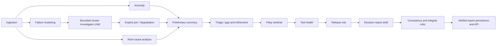

# Agent Decision Report Architecture

Status: Phase 1, durable verification, decision UI, and Phase 2 evidence authority implemented
Date: 2026-08-11

## Purpose

The deep agent workflow historically generated its four-layer summary before
the flaky-sentinel, test-health, and release-risk specialists ran. That summary
remains useful as a preliminary briefing for triage, but it cannot be the final
decision artifact.

Phase 1 adds a `decision_report` draft agent after `release_risk`, followed by
a terminal `decision_report_critic`. The draft deterministically assembles
`decision_intelligence` from completed specialist outputs. The critic performs
an independent consistency/integrity pass, applies at most one bounded
deterministic repair, and is the only stage allowed to publish the final report.
Neither stage asks an LLM to recompute facts in prose.

## Deep Workflow

## Contract

`decision_intelligence` schema version 1 contains:

- deterministic run and specialist counts;
- failure clusters and honest cluster-level deep findings;
- flaky and test-health findings;
- selected cluster-Investigator outcomes, spend, and stop reasons;
- the final release-policy decision;
- missing/failed specialist disclosure;
- preliminary-vs-final release contradictions and their resolution;
- human-review status;
- contributing stage names;
- a stable SHA-256 fingerprint of the evidence bundle.
- critic checks, repairs, unresolved failures, and verification timestamp.

The Phase 2 evidence-foundation slice adds a frozen `RunEvidenceBundleV1` and
`RunMetricSnapshotV1`. The metric snapshot declares its schema, definition,
single-run window, exact source fields, pass-rate denominator, quality flags,
and content fingerprint. It preserves passed, failed, broken, skipped, and
unknown outcomes from ingestion, and error-severity metric-quality flags are a
terminal verification failure rather than an advisory warning.

The evidence bundle is tenant/run/pipeline scoped, deeply immutable after
validation, bounded before persistence, and hashed with the same strict
canonical JSON implementation as the decision snapshot. Persisted specialist
payloads and evidence excerpts pass through a recursive fail-closed sanitizer;
unsupported types and excessive nesting are rejected, sensitive patterns are
redacted before final length bounds, and reference sensitivity defaults to
`restricted` unless explicitly classified `internal`.

Phase 2 completes the citation-authorization boundary with
`EvidenceReferenceV2` and `RunEvidenceBundleV2`. Only observations emitted by
an executed, server-scoped investigation tool can become evidence candidates.
Each candidate carries an HMAC attestation bound to project, run, pipeline,
test case, tool, and sanitized content checksum. Model-authored references,
foreign identifiers, restored references from another pipeline, and missing or
invalid attestations are rejected.

Migration `0120` makes `EvidenceArtifact` tenant-authoritative and immutable.
Verified rows bind project, run, producer pipeline, optional test case,
content checksum and size, source/schema versions, media type, sensitivity,
freshness, observation time, and retention class. PostgreSQL triggers validate
the relational scope on insert and reject every update to a verified row.
Capture is collision-aware and idempotent; a reused identity is accepted only
when all immutable fields match. The terminal critic independently reloads
every referenced artifact and compares the full canonical projection before
publication. Legacy schema-2/V1 snapshots remain readable but are read-only:
they cannot be newly republished as artifact-authorized decisions.

Tool output is sanitized before it reaches the LLM, telemetry, audit storage,
or caches. HTTP credential headers are dropped, bodies are bounded and
redacted, and caches never retain evidence references. Artifact excerpts are
not included in report ZIP exports until a publication-bound snapshot allowlist
and a dedicated restricted-evidence permission are available; decision reports
expose only opaque artifact identity and checksums.

The fingerprint covers the canonical decision payload, including metrics,
specialist evidence, cluster-child join results, release decision, quality review, status, and source
stages. Timestamps and verification metadata are excluded. Mutable source
objects are deep-copied at the draft boundary so critic authority cannot be
changed through shared references.

Before the draft leaves `decision_report`, its contract metadata is created and
bound into the signed authority. The same canonical projection is then
written once to `decision_evidence_snapshots`. Its deterministic identity is
scoped by project, test run, and pipeline run. The document uses strict JSON
canonicalization, an 8 MiB size ceiling, SHA-256 content hashing, and an
HMAC-SHA256 signature whose key identifier is validated against the current or
previous application key. A duplicate write is accepted only when its content
hash is identical and the stored snapshot still validates; divergent or
corrupt reuse of the identity fails closed. The critic reads the signed
decision-report contract and never merges mutable live contract metadata.

The snapshot also freezes the exact release-policy inputs, resolved thresholds,
dimension weights, rules, score-model version, evaluator version, and semantic
result. The critic replays that policy without loading the currently active
tenant policy and compares the result with both the snapshot and the persisted
PostgreSQL release-decision row. Migration `0119` binds that mutable singleton
row to its producing pipeline so later pipeline writes are detectable.

The enclosing Mongo `run_summaries` document is schema version 5. Existing
four-layer fields remain unchanged for backward compatibility. Run Intelligence
serializes the terminal section under `structured_summary.decision_intelligence`.

The Run Intelligence UI derives one fail-closed trust state from the retained
report, latest verification, and latest attempt. A verified report is shown
only when all terminal markers agree. A retained verified report remains
visible with a prominent stale warning after a newer rejected attempt; no
decision-ready verdict is shown for rejected-without-report, pending, or
inconsistent envelopes. Browser-local legacy decisions are ignored whenever a
terminal envelope exists, and durable overrides are directed to Release Gate.

## Failure Behavior

- Missing required specialist output produces a `degraded` report rather than
  fabricating a conclusion.
- A preliminary/final release contradiction is visible, resolved in favor of
  the deterministic final release policy, and requires human review.
- The draft is never written to the public summary document. Only a report with
  `verification.status=passed` is published.
- A critic exception writes a failed verification marker when persistence is
  available, without publishing the unverified draft.
- The critic checks schema, exact deterministic metrics, source payload
  fidelity, fingerprint integrity, reference integrity, contract structure,
  release-decision internal consistency, disclosures, and conservative status.
- Evidence or metric schema errors, checksum mismatches, failed identity
  reconciliation, invalid reference scope, or bounded-input truncation fail the
  terminal critic and require human review.
- Missing, foreign, tampered, unattested, or legacy-unverified evidence
  artifacts fail the terminal critic and cannot publish a new decision.
- The terminal critic writes its decision, evidence count, confidence, cost and
  lifecycle through the existing `BaseAgent` observability contract.
- A failed durable binding, policy replay, or persisted-record comparison marks
  the required critic stage failed, makes the pipeline partial, and fails the
  workflow verifier. The prior verified report remains available, while
  `latest_decision_attempt` and `decision_report_verification` explicitly expose
  the newer rejection.
- Cross-pipeline retries reuse safe upstream checkpoints but always rerun
  `release_risk`, `decision_report`, and `decision_report_critic`, because their
  records and evidence identities are bound to the producing pipeline.

The critic combines canonical consistency checks with an independent replay of
the frozen release-policy material. It intentionally does not consult mutable
active policy configuration during verification.

## Retention and Key Rotation

Decision evidence follows the existing run-retention clock. Preview reports its
Mongo candidate count and project cache candidates; execute removes snapshots,
verified artifacts, project-scoped Redis entries, and expired Chroma entries
before the PostgreSQL run is deleted. Verified artifacts are deleted rather
than mutated; deleting a test case cascades its artifact rows. HMAC verification
accepts the configured current or previous key,
but the stored key identifier must match the key that validates. Operators must
retain `APP_SECRET_KEY_PREVIOUS` during rotation for snapshots signed by the old
key to remain verifiable.

## Compatibility and Rollout

This stage is currently wired only into the deep workflow. Offline and live
workflows retain their existing latency and output behavior. The frontend
contract and initial Phase 5 decision-report experience are additive. Legacy
runs without a terminal envelope keep their prior display; terminal-envelope
runs use the centralized trust reducer and terminal-only verdict provenance.

## Validation

- Deterministic builder, critic, repair, exception, aliasing, zero-metric, and
  adversarial tampering tests.
- Deep graph topology and required-stage assertions.
- Agent planner/contract verifier regression coverage.
- Repository quality gate, Ruff, Python compilation, frontend type-check and
  production frontend build.
- Broader agent regression suite.
- Synthetic hardcoded-policy replay, cross-pipeline checkpoint recovery,
  signature-key provenance, fail-closed pipeline status, retention, and stale
  verified-report/latest-rejection regressions.
- Adversarial Phase 2 coverage for unknown-status ingestion parity, zero and
  broken-only metrics, malformed/fractional metrics, non-hex hashes, nested
  immutability, redaction expansion, conservative sensitivity, reference
  deduplication/capacity/scope/checksums, signed-contract authority, corrupt
  retries, real schema-v2 loading, and current/previous signing-key rotation.
- Tenant authorization, server-bound tool identity, producer attestation,
  deterministic artifact capture, foreign-test rejection, immutable checksum
  re-resolution, legacy read-only behavior, HTTP credential redaction, and
  Redis/Chroma retention coverage.

## Homelab Deployment

The Phase 1 critic implementation was deployed on 2026-08-11 as immutable tag
`build-20260811-182144` to the three-node K3s homelab. All application
deployments use that tag, ingress live/ready checks passed, and an in-pod smoke
proved the terminal graph topology, source-state isolation, bounded repair of a
self-consistently rehashed tampered payload, passed verification, and a valid
64-character fingerprint. The durable snapshot/replay hardening was deployed as
immutable tag `build-20260811-192630`. Migration `0119` is current/head, all
application rollouts are available, live/ready checks pass, the unique snapshot
index is present, and an in-pod smoke passed HMAC validation, frozen policy
replay, and a real Mongo insert/read followed by exact cleanup of its synthetic
document.

The initial decision-intelligence UI was deployed as immutable tag
`build-20260811-202941`. All application deployments are available, migration
`0119` is current/head, the deployed frontend bundle contains the fail-closed
decision-report surface, and live/ready checks pass PostgreSQL, MongoDB, and
Redis. An authenticated browser smoke opened the AI Reports hub and a concrete
Run Intelligence page without console errors.

The Phase 2 evidence-foundation slice was deployed as immutable tag
`build-20260811-212846`. Backend, frontend, MCP, beat, and all worker
deployments are available on that tag; migration `0119` remains current/head;
live and ready checks pass PostgreSQL, MongoDB, and Redis. An in-pod smoke
validated structured-key redaction, nonzero unknown-status metrics,
`RunEvidenceBundleV1`, snapshot schema 2, HMAC verification, and a 64-character
content fingerprint. The deployed frontend bundle contains the data-quality
disclosure. The browser login boundary loaded without console errors; the
saved browser session had expired, so this rollout's authenticated page check
was covered by the prior UI deployment smoke rather than bypassing sign-in.

The Phase 2 tenant-authorized evidence-artifact slice was deployed as immutable
tag `build-20260811-224506`. Migration `0120` is current/head, and backend,
frontend, MCP, beat, and every worker deployment use the same tag and are
available. A rollback-only PostgreSQL smoke proved verified artifact insertion,
cross-run test-case rejection, immutable-update rejection, idempotency collision
rejection, and `TestCase` cascade deletion. An in-pod smoke passed recursive
secret sanitization, production-shaped `EvidenceReferenceV2` validation, and an
explicit export projection that structurally excludes evidence bundles,
references, excerpts, raw bodies, headers, and tool steps from ZIP/PDF output.
Ingress live and ready checks passed PostgreSQL, MongoDB, and Redis.
