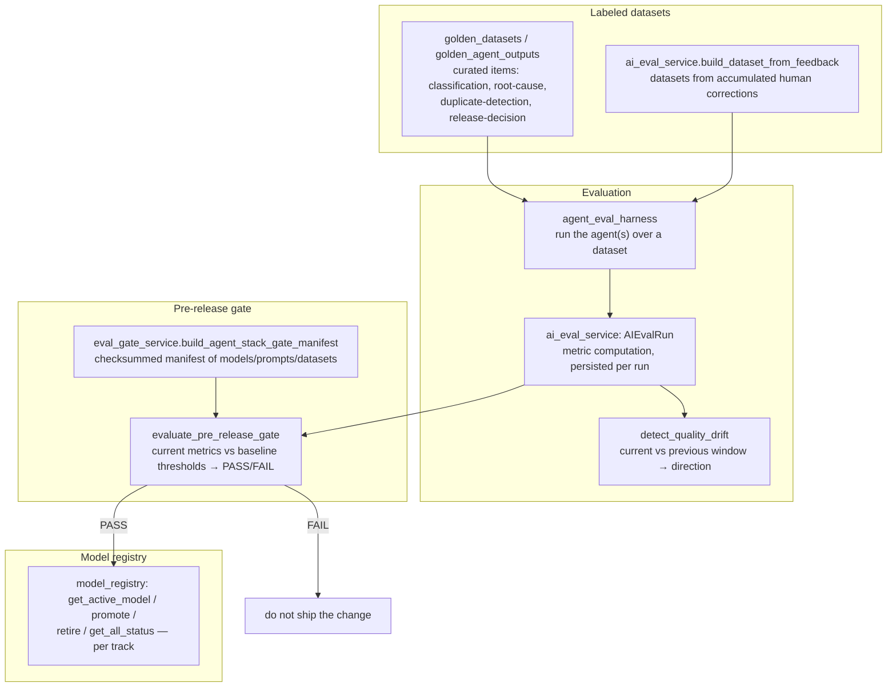

# AI Evaluation & Model-Ops — subsystem architecture

> Companion to [AI_QUALITY.md](./AI_QUALITY.md). Where AI_QUALITY keeps the AI
> layer honest *at runtime* (cache, corrections, evidence), this subsystem keeps
> it honest *across changes*: golden datasets, evaluation runs, drift detection,
> the model registry, and the **pre-release gate that blocks a prompt/model/
> routing change from shipping if it regresses quality**. Verified against the
> implementation 2026-07-02.

The governing idea: **the AI is a shipped artifact, so it gets its own release
gate.** A code change goes through CI; an AI change (new prompt, new model, new
routing) goes through *this*.

## 1. The evaluation loop

## 2. Golden datasets & feedback datasets

Two sources of labeled truth:

- **Golden datasets** (`golden_datasets`, `golden_agent_outputs`) — curated,
  version-controlled items with known-correct answers, one set per capability:
  `get_golden_classification_items`, `get_golden_root_cause_items`,
  `get_golden_duplicate_detection_items`, `get_golden_release_decision_items`.
  These are the fixed yardstick.
- **Feedback datasets** (`ai_eval_service.build_dataset_from_feedback`) — built
  from accumulated human corrections (the `AIFeedback` rows the
  [correction loop](./AI_QUALITY.md#2-the-correction-learning-loop-servicesanalysis_correctionspy)
  captures). This is what turns "users keep fixing X" into a regression test
  for X.

## 3. Evaluation runs & drift

`ai_eval_service` (OPS-02) runs the agents over a dataset via
`agent_eval_harness`, computes metrics, and persists an **`AIEvalRun`** per
evaluation. `detect_quality_drift` compares recent runs to prior windows and
reports the direction — so a slow degradation (a model drifting, a data-shape
shift) is caught as a trend, not only at a release boundary. Results surface on
the **AI Evaluation Dashboard** (`/settings/ai-eval`).

## 4. The pre-release gate (`eval_gate_service`)

This is the enforcement point, and it mirrors the shape of the product
[release gate](./RELEASE_GATE.md) — fail-closed, evidence-backed:

- `build_agent_stack_gate_manifest` — a **checksummed manifest**
  (`_manifest_checksum`) of the AI stack under test: models, prompt versions,
  datasets. The checksum makes "what exactly did we evaluate" tamper-evident.
- `evaluate_agent_stack_release_gate` / `evaluate_pre_release_gate` — compares
  current metrics against baseline thresholds and returns **PASS/FAIL with
  per-rule results**; `_overall_manifest_status` folds the per-gate results.
- `persist_agent_stack_gate_run` — the run is stored, so the decision to ship
  (or not) an AI change is auditable.
- The `POST /api/v1/ai-evaluation/pre-release-gate` endpoint is **admin-only**,
  and the docstring states the contract plainly: *prompt, model, or routing
  changes should not ship if the gate returns FAIL.*

## 5. Model registry (`model_registry`)

Per **track** (e.g. classification, root-cause), the registry records which
model is live: `get_active_model`, `promote(track, model, metrics)`,
`retire(track)`, `get_all_status`. Promotion carries the metrics that
justified it — you can always answer "why is *this* model live for *this*
capability, and what did it score." The gate (§4) is what a promotion should
pass first.

## 6. Cost as a first-class signal (`agent_cost_service`)

Model-ops includes spend: `get_pipeline_cost_summary` and `check_alerts` track
per-pipeline AI cost and fire alerts, feeding the **Intelligence spend** the
[Intelligence Hub](../user-guide/ai-features.md#run-intelligence-intelligence-runsidintelligence)
shows and complementing the per-project [LLM budget gate](./INGESTION_SCALE.md#6-keeping-the-ai-layer-affordable-under-volume).
A "better" model that costs 10× is a trade-off the numbers make visible.

## 7. Design invariants

- **AI changes are gated like code** — no prompt/model/routing change ships on
  vibes; it passes an evidence-backed, checksummed gate or it doesn't ship.
- **Two yardsticks** — fixed golden sets catch regressions against known-good;
  feedback-derived sets catch regressions against *what real users corrected*.
- **Drift is a trend, not an event** — degradation is watched continuously, not
  only at release.
- **Everything auditable** — eval runs, gate runs, and promotions are all
  persisted with their metrics.

## Related docs

- Runtime AI honesty (the other half): [AI_QUALITY.md](./AI_QUALITY.md)
- The product release gate this mirrors: [RELEASE_GATE.md](./RELEASE_GATE.md)
- User-facing eval dashboard: [user-guide/ai-features.md](../user-guide/ai-features.md#configuring-the-ai-tier-settingsai-settingsai-eval)
