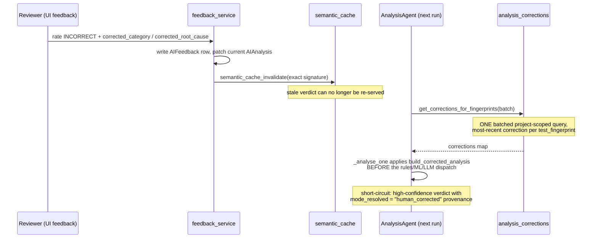
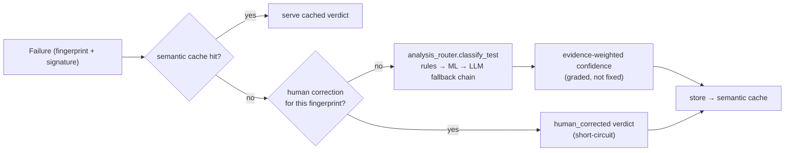

# AI Quality — caching, corrections, and evidence integrity

> Companion to [README.md](./README.md) §5 (the LangGraph pipeline and the
> rules/ML/LLM router). This doc covers the AIQ mechanisms that keep the AI
> layer *honest over time*: the semantic cache, the human-correction learning
> loop, real-signal evidence grading, and cluster integrity. Verified against
> the implementation 2026-07-02.

The theme: **the pipeline's outputs must improve with feedback and never
overstate their evidence.** Each mechanism below closes a specific way an AI
verdict could silently be wrong, stale, or fake-precise.

## 1. Semantic cache (`services/semantic_cache.py`)

Analyzing the same error twice is wasted LLM budget, so verdicts are cached
content-addressably in ChromaDB:

- `_build_signature(test_name, error_message, stack_trace)` — the cache key is
  the failure's semantic content, not the run it came from.
- `semantic_cache_lookup` / `semantic_cache_store` — collections are created
  **per project** (`_get_or_create_collection(project_id)`), a tenant-scoping
  invariant: one customer's cached analyses are never served to another.
- `semantic_cache_invalidate` — evicts the exact signature's entry; see the
  correction loop below for why this exists.
- `get_semantic_cache_stats` — hit/size telemetry for the AI settings pages.

## 2. The correction learning loop (`services/analysis_corrections.py`)

Human reclassifications must *stick* — the capture side always existed
(`feedback_service.submit_feedback` writes an `AIFeedback` row and patches the
current `AIAnalysis` when a reviewer marks a verdict INCORRECT with a corrected
category/root-cause), but nothing used to feed it back: the next run recomputed
the same test from scratch and could repeat the exact mistake. The loop now has
three legs:

Design points worth preserving:

- **Fresh each run, not via cached metadata** — the agent fetches corrections
  at analysis time, so a correction submitted a minute ago applies to the very
  next run.
- **Provenance is explicit** — corrected results flow through the same
  post-processing/audit as computed ones, but marked `human_corrected: true`
  with `mode_resolved: "human_corrected"`, so the UI can say *a person decided
  this*, and the router's `_routing` explanation stays truthful.
- **Best-effort** — any lookup failure falls through to normal analysis;
  corrections can only improve results, never block them.
- **Deterministic before ML** — this loop delivers compounding accuracy without
  retraining. Actual retraining from accumulated `AIFeedback` (the
  `build_dataset_from_feedback` path) is a deliberate, separate step.

## 3. Evidence grading (`agents/log_intelligence_agent.py`)

The AIQ-P3 confidence aggregation weighs each piece of evidence by `strength`
and `contribution` — which is only meaningful if those values reflect the real
signal. Two pure graders replace what used to be a fixed `medium/80` on every
emission (which made the weighting cosmetic — even "no anomaly detected" was
recorded as medium-strength evidence):

| Grader | Reads | Emits |
|---|---|---|
| `_grade_anomaly_evidence` | `anomaly_detected` + per-level spike `ratio` | no spike → weak/15 · ≥6× spike → strong/85 · else medium/60 |
| `_grade_trace_evidence` | the distributed trace's ERROR/FATAL step count | error chain → medium/strong scaled by depth · context-only/empty → weak |

Both degrade gracefully (weak) when fields are absent — e.g. when the log
backend integration is disabled — so missing telemetry lowers confidence
instead of faking it.

## 4. Cluster integrity (`agents/cluster_agent.py`)

Failure clustering exists to turn O(n) failures into O(k) investigations — so
its own limits must not fragment real clusters:

- The nearest-neighbour lookup uses `_MAX_NEIGHBOR_QUERY = 100` (it was
  `min(len(errors), 5)`, which capped any cluster at 5 members and shattered a
  30-test same-cause outage into 6+ clusters, multiplying downstream
  per-cluster LLM cost).
- The greedy star-clustering is a pure `_cluster_from_neighbours` helper with
  an O(1) id→index map, unit-testable without Chroma.
- Beyond the cap, truncation is **logged, never silent** — a bounded sweep must
  say it was bounded.

## 5. How this composes

A correction beats the cache (the invalidation guarantees it), the cache beats
recomputation, and every computed confidence is traceable to graded evidence.

## Related docs

- Pipeline structure & mode routing: [README.md §5](./README.md#5-ai-analysis-pipeline-langgraph)
- What verdicts feed: [RELEASE_GATE.md](./RELEASE_GATE.md)
- The flaky-specific evidence layers: [FLAKY_INTELLIGENCE.md](./FLAKY_INTELLIGENCE.md)
- The user-facing correction workflow: [user-guide/triaging-failures.md](../user-guide/triaging-failures.md)
