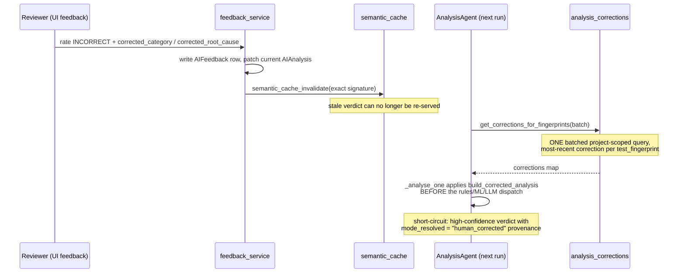
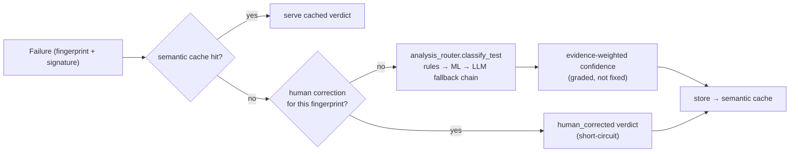

# AI Quality — caching, corrections, and evidence integrity

> Companion to [README.md](./README.md) §5 (the LangGraph pipeline and the
> rules/ML/LLM router) and §6 (the agentic layer). This doc covers the
> mechanisms that keep the AI layer *honest over time*: the semantic cache, the
> human-correction learning loop, real-signal evidence grading, cluster
> integrity, the pinned prompt registry with its eval attestation, and the
> confidence gate. Verified against the implementation 2026-08-08.

The theme: **the pipeline's outputs must improve with feedback and never
overstate their evidence.** Each mechanism below closes a specific way an AI
verdict could silently be wrong, stale, or fake-precise.

Sections 1–4 keep a single *answer* honest. Sections 5–7 keep the system that
produces answers honest: which prompts produced it (§5), whether it was
confident enough to act on (§6), and what an acting agent was permitted to do
(§7).

## 1. Semantic cache (`services/semantic_cache.py`)

Analyzing the same error twice is wasted LLM budget, so verdicts are cached
content-addressably in ChromaDB:

- `_build_signature(test_name, error_message, stack_trace)` — the cache key is
  the failure's semantic content, not the run it came from.
- `semantic_cache_lookup` / `semantic_cache_store` — collections are created
  **per project** (`_get_or_create_collection(project_id)`), a tenant-scoping
  invariant: one customer's cached analyses are never served to another.
- `semantic_cache_invalidate` — evicts the exact signature's entry; see the
  correction loop below for why this exists.
- `get_semantic_cache_stats` — hit/size telemetry for the AI settings pages.

## 2. The correction learning loop (`services/analysis_corrections.py`)

Human reclassifications must *stick* — the capture side always existed
(`feedback_service.submit_feedback` writes an `AIFeedback` row and patches the
current `AIAnalysis` when a reviewer marks a verdict INCORRECT with a corrected
category/root-cause), but nothing used to feed it back: the next run recomputed
the same test from scratch and could repeat the exact mistake. The loop now has
three legs:

Design points worth preserving:

- **Fresh each run, not via cached metadata** — the agent fetches corrections
  at analysis time, so a correction submitted a minute ago applies to the very
  next run.
- **Provenance is explicit** — corrected results flow through the same
  post-processing/audit as computed ones, but marked `human_corrected: true`
  with `mode_resolved: "human_corrected"`, so the UI can say *a person decided
  this*, and the router's `_routing` explanation stays truthful.
- **Best-effort** — any lookup failure falls through to normal analysis;
  corrections can only improve results, never block them.
- **Deterministic before ML** — this loop delivers compounding accuracy without
  retraining. Actual retraining from accumulated `AIFeedback` (the
  `build_dataset_from_feedback` path) is a deliberate, separate step.

## 3. Evidence grading (`agents/log_intelligence_agent.py`)

The AIQ-P3 confidence aggregation weighs each piece of evidence by `strength`
and `contribution` — which is only meaningful if those values reflect the real
signal. Two pure graders replace what used to be a fixed `medium/80` on every
emission (which made the weighting cosmetic — even "no anomaly detected" was
recorded as medium-strength evidence):

| Grader | Reads | Emits |
|---|---|---|
| `_grade_anomaly_evidence` | `anomaly_detected` + per-level spike `ratio` | no spike → weak/15 · ≥6× spike → strong/85 · else medium/60 |
| `_grade_trace_evidence` | the distributed trace's ERROR/FATAL step count | error chain → medium/strong scaled by depth · context-only/empty → weak |

Both degrade gracefully (weak) when fields are absent — e.g. when the log
backend integration is disabled — so missing telemetry lowers confidence
instead of faking it.

## 4. Cluster integrity (`agents/cluster_agent.py`)

Failure clustering exists to turn O(n) failures into O(k) investigations — so
its own limits must not fragment real clusters:

- The nearest-neighbour lookup uses `_MAX_NEIGHBOR_QUERY = 100` (it was
  `min(len(errors), 5)`, which capped any cluster at 5 members and shattered a
  30-test same-cause outage into 6+ clusters, multiplying downstream
  per-cluster LLM cost).
- The greedy star-clustering is a pure `_cluster_from_neighbours` helper with
  an O(1) id→index map, unit-testable without Chroma.
- Beyond the cap, truncation is **logged, never silent** — a bounded sweep must
  say it was bounded.

## 5. Prompt registry + eval attestation (`services/prompt_manifest.json`)

Cache, corrections, evidence and clustering all keep a *single answer* honest.
The registry keeps the **prompts that produce answers** honest across changes.

- **Every LLM prompt is content-hashed and pinned.** `prompt_manifest.json`
  carries `schema_version`, `hash_algorithm`, and one pinned hash per prompt —
  **35 prompts** at the time of writing, covering the registry and the MCP
  templates.
- **A prompt cannot change silently.** The `ai.prompt-manifest-sync` quality
  gate recomputes every hash and fails CI on any mismatch. Editing a prompt is
  therefore a deliberate act that shows up in review as a manifest change.
- **The manifest digest carries an eval attestation.**
  `prompt_manifest_eval.json` records `manifest_digest`, `eval_gate_run_id`,
  `gate_results`, `prompt_versions`, `mode`, `attested_at` and `change_id`. The
  same gate checks the digest is attested *green* — so a prompt set can only
  ship if the eval gate has actually been run against **that exact set**, not
  against some earlier one.

This is what makes AI changes reviewable rather than vibes-based: the diff shows
which prompt moved, and the attestation shows the evals were re-run for it.

## 6. Confidence gating (`services/confidence_gate.py`)

The question "is this output trustworthy enough for an automation to act on it?"
used to be answered by a magic number at each call site. It is now one module.

- **One configurable threshold**, resolved with explicit precedence:
  `app_settings.ai_config.ai_confidence_threshold` (source `ai_config`), else
  `settings.AI_CONFIDENCE_THRESHOLD` (source `env_default`). An operator moves
  the line once in `/settings/ai` and every gated automation follows.
- **Each decision records a `threshold_check`** on the returned policy dict —
  the observed score, the threshold, the source, and the verdict. The gate's
  reasoning is auditable after the fact rather than implied.
- **`>=` is deliberate**, not arbitrary: every pre-existing gate was written as
  `confidence < THRESHOLD -> needs review`, so centralising on `>=` left those
  call sites byte-identical at the boundary.
- **An absent confidence never passes.** `None` is not "good enough by
  default" — treating unknown as acceptable is the exact failure this mechanism
  exists to prevent.

> Two fabricated "AI confidence" values were removed from the UI before this
> existed. The gate is the structural answer to that class: a confidence that
> isn't real can't satisfy a recorded threshold check.

## 7. Agent governance

The [Investigator and Fixer](./README.md#6-agentic-layer-investigator--fixer)
are governed separately, because they *act* rather than merely classify:
per-project `agent_policies` (`enabled`, `mode`, `budgets`), `shadow` mode that
records what an agent would have done without doing it, and an `agent_runs`
ledger that stores `prompt_registry_digest` — tying every agent decision back to
the pinned prompt set in §5. See the architecture README for the full picture.

## 8. How this composes

A correction beats the cache (the invalidation guarantees it), the cache beats
recomputation, and every computed confidence is traceable to graded evidence.

**Before an automation acts on that verdict**, two further gates apply: the
confidence must clear the recorded threshold (§6), and — if an agent is doing
the acting — its policy must permit it and its budget must allow it (§7). The
prompt set that produced the verdict is pinned and attested (§5), so the whole
chain from prompt to action is reconstructable after the fact.

## Related docs

- Pipeline structure & mode routing: [README.md §5](./README.md#5-ai-analysis-pipeline-langgraph)
- What verdicts feed: [RELEASE_GATE.md](./RELEASE_GATE.md)
- The flaky-specific evidence layers: [FLAKY_INTELLIGENCE.md](./FLAKY_INTELLIGENCE.md)
- The user-facing correction workflow: [user-guide/triaging-failures.md](../user-guide/triaging-failures.md)
