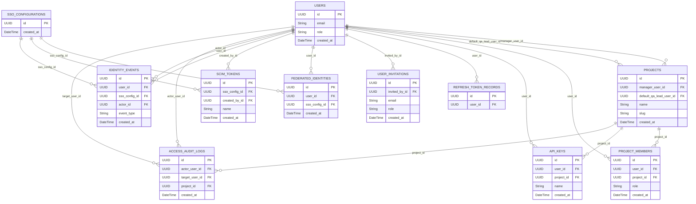
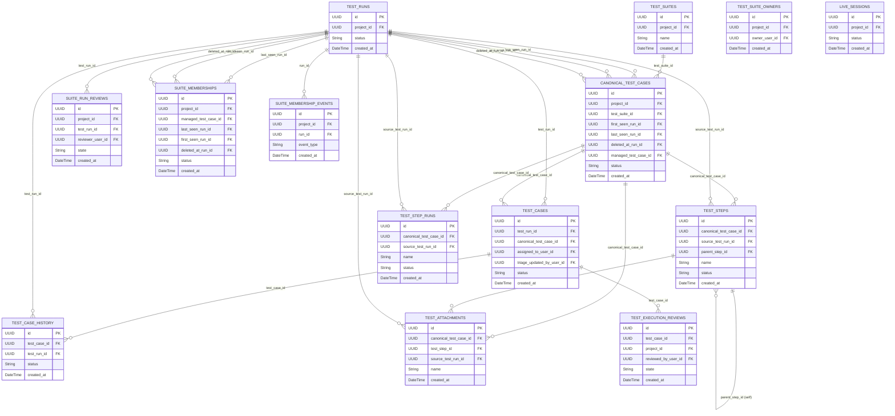
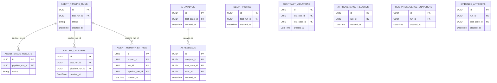
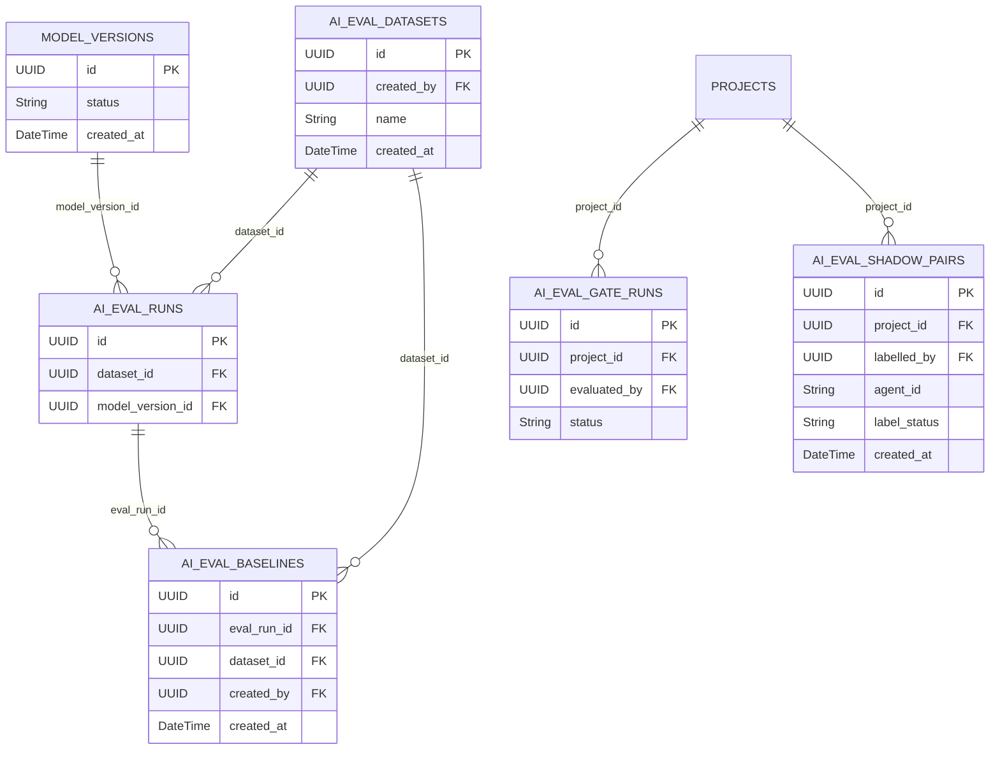
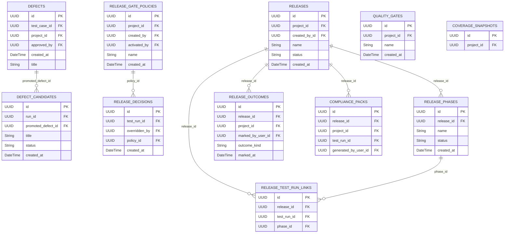
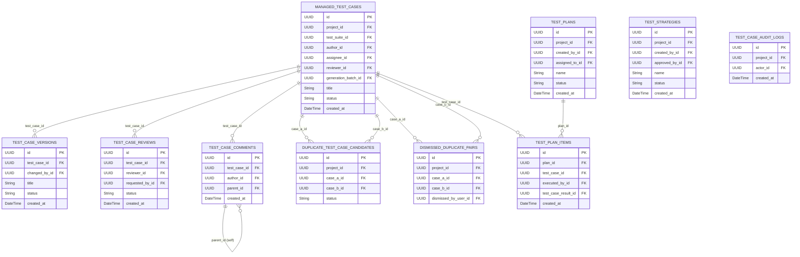
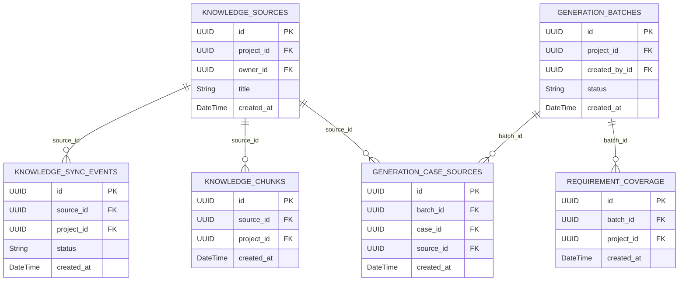

```mermaid
erDiagram
    RUN_BASELINES {
        UUID id PK
        UUID run_id FK
        UUID baseline_run_id FK
    }
    RUN_DIFFS {
        UUID id PK
        UUID run_id FK
        UUID baseline_run_id FK
    }
    RUN_COMPARISON_REPORTS {
        UUID id PK
        UUID project_id FK
        UUID left_run_id FK
        UUID right_run_id FK
        UUID created_by_user_id FK
        String status
        DateTime created_at
    }
    PERF_BASELINES {
        UUID id PK
        UUID project_id FK
        DateTime created_at
    }
    TENANT_METRIC_SNAPSHOTS {
        UUID id PK
        UUID project_id FK
    }
    TENANT_ONBOARDING_STATUS {
        UUID id PK
        UUID project_id FK
        UUID completed_by FK
        String status
        DateTime created_at
    }
    PRODUCT_USAGE_EVENTS {
        UUID id PK
        UUID user_id FK
        UUID project_id FK
        DateTime created_at
    }
    FLAKY_COACH_RESULTS {
        UUID id PK
        UUID project_id FK
        DateTime created_at
    }
    TEST_HEALTH_RECOMMENDATIONS {
        UUID id PK
        UUID test_run_id FK
        UUID test_case_id FK
        DateTime created_at
    }
    FLAKY_QUARANTINE_REQUESTS {
        UUID id PK
        UUID project_id FK
        UUID approved_by_user_id FK
        UUID rejected_by_user_id FK
        String status
        DateTime created_at
    }
```

> Current complete field/constraint reference: [generated data dictionary](../docs/reference/data-dictionary.md). The diagrams below are historical domain views; the generated dictionary is the complete current model inventory.

# TestLookup — Database & Schema Design

> Originally generated 2026-06-25 from the live implementation (`backend/app/models/postgres.py`,
> `backend/migrations/versions/`). Current table-inventory pointers were added through migration 0191; legacy field descriptions and domain diagrams were not fully regenerated.
> Regenerate the ER diagrams and the schema
> reference with the extractor in `architecture/` after model changes — see
> [Keeping these docs current](#keeping-these-docs-current).

PostgreSQL is the **relational system of record** (139 declared tables, Alembic head `0191`). Authority is distributed by data type: published decision-report bodies and evidence are also stored in MongoDB, and original uploads/artifacts in object storage. These stores are not all disposable caches. See the current [data architecture](../docs/architecture/data-model.md) and [backup guidance](../docs/operations/deployment.md); this historical document focuses on relational structure.

## Storage responsibilities at a glance

| Store | Holds | Source of truth? |
|-------|-------|------------------|
| **PostgreSQL** | Users, projects, runs, test cases, AI pipeline results, defects, releases, authored test cases, audit | **Yes** — relational system of record |
| **MongoDB** | Raw/sanitized evidence, API and AI payloads, pod events, run summaries, published decision reports/attempts and live timelines | Authoritative for stored document bodies/evidence; relational authority remains in PostgreSQL |
| **Redis** | Celery broker + result backend, live-session state (hashes/sorted-sets), live-event Streams, the AI-pipeline debounce queue, feature-flag + analysis-mode cache | No — ephemeral / in-flight |
| **MinIO (S3)** | Raw uploaded report files, generated report PDFs, compliance-pack ZIPs, RAG knowledge docs, training-data exports | Authoritative payload/artifact storage; some derived objects can be regenerated |
| **ChromaDB** | Per-project embeddings for semantic search (optional) | No — derived index |

See [`architecture/README.md`](./README.md) for which services write to each store.

## Relational schema conventions

These conventions are enforced by the `add-migration` skill and the quality
gates; follow them for every new table or column (see the
[Developer Guide](./DEVELOPER_GUIDE.md#4-migrations)):

- **Primary keys are UUID** — `mapped_column(UUID(as_uuid=True), primary_key=True, default=uuid.uuid4)`. A handful of singleton/config tables use a small surrogate. UUIDs avoid cross-tenant id guessing and let the SDK/ingest path mint ids client-side.
- **Enums are stored as `String(N)`, not native PostgreSQL enums** — the Python `enum.Enum` classes in `models/postgres.py` / `models/enums.py` define the vocabulary, but the column is a plain string to avoid migration lock-in when a value is added. *Keep producer and consumer vocab in sync* — a drifted enum value 422s through the strict Pydantic layer (see [recurring bug classes](./DEVELOPER_GUIDE.md#7-recurring-bug-classes)).
- **Timestamps are timezone-aware** — `mapped_column(DateTime(timezone=True), server_default=func.now())`; updated columns add `onupdate=func.now()`.
- **Foreign keys** carry an explicit `ondelete` where cascade/set-null semantics matter; most analytical/audit children are kept on `RESTRICT`/no-cascade so history survives.
- **JSON vs JSONB** — opaque payloads use `JSON`; anything you filter or index on uses `JSONB`.
- **Multi-tenancy** — almost every domain table carries a `project_id` (directly or one hop away through `test_runs`). Tenant isolation is defence-in-depth: router guard → service scope → query filter. Never write a cross-project query without a `project_id` (or `IN :allowed_project_ids`) predicate.
- **Soft-delete / lineage** — canonical and suite-membership rows are not hard-deleted; they carry `status` + `deleted_at_run_id` so test inventory has a full lineage across runs.

## The core hubs

Five tables anchor the whole schema. Reading the ER diagrams, trace everything back to these:

- **`users`** — every actor (auth, SSO, API keys) and every `*_by`/`owner`/`assignee` column.
- **`projects`** — the tenant boundary. Almost every table is project-scoped.
- **`test_runs`** — one test execution (a build/CI run or a live session). The ingestion root.
- **`test_cases`** — per-run test results (one row per test per run).
- **`canonical_test_cases`** / **`managed_test_cases`** — the *deduped, cross-run* identity of a test (observed) and the *authored* test case (curated), respectively.

## Domains

The curated domain map groups the documented core tables into nine functional domains:

| Domain | Tables | What it covers |
|--------|-------:|----------------|
| Identity, Tenancy & Access | 12 | Users, projects, membership, API keys, SSO/SCIM, refresh tokens, access audit |
| Test Execution & Ingestion | 15 | Runs, per-run cases, suites, steps, attachments, canonical inventory, live sessions, reviews |
| AI Analysis Pipeline | 15 | Agent pipeline runs + per-stage results, classifications, clusters, deep findings, provenance, agent memory |
| AI Evaluation & Models | 6 | Model versions, eval datasets/runs/baselines, pre-release and tier gates, shadow pairs |
| Defects, Releases & Gates | 11 | Defects + candidates, release decisions and outcomes, releases/phases, gate policies, compliance packs, coverage |
| Test Management (Authored Cases) | 10 | Managed cases, versions, reviews, comments, duplicate review, plans, strategies, case audit |
| Knowledge, RAG & Generation | 6 | Knowledge sources, sync events, chunks, generation batches + sources, requirement coverage |
| Analytics, Comparison & Health | 12 | Run baselines/diffs/compare reports, perf baselines, tenant metrics, onboarding, usage, flaky coach/quarantine, health recs |
| Platform, Ops & Integrations | 24 | Settings + secrets, feature flags, notifications, integration health, webhooks, GitHub, saved views, digests, share links, ownership, LLM quota/usage, chat |

## Cross-domain hub map

Each domain connects to the rest of the schema through a handful of hub tables.
The edges below are labelled with the **number of foreign keys** pointing from
that domain into each hub — a quick read of how tightly each domain couples to
identity, tenancy, and the run/test core.

```mermaid
flowchart TB
    USERS[(users)]:::hub
    PROJECTS[(projects)]:::hub
    TEST_RUNS[(test_runs)]:::hub
    TEST_CASES[(test_cases)]:::hub
    CANON[(canonical_test_cases)]:::hub
    MANAGED[(managed_test_cases)]:::hub
    D0["Identity Tenancy  Access<br/>(11 tables)"]
    D1["Test Execution  Ingestion<br/>(14 tables)"]
    D1 -->|5 FK| USERS
    D1 -->|9 FK| PROJECTS
    D1 -->|2 FK| MANAGED
    D2["AI Analysis Pipeline<br/>(11 tables)"]
    D2 -->|1 FK| USERS
    D2 -->|1 FK| PROJECTS
    D2 -->|8 FK| TEST_RUNS
    D2 -->|4 FK| TEST_CASES
    D3["AI Evaluation  Models<br/>(6 tables)"]
    D3 -->|4 FK| USERS
    D4["Defects Releases  Gates<br/>(11 tables)"]
    D4 -->|7 FK| USERS
    D4 -->|7 FK| PROJECTS
    D4 -->|4 FK| TEST_RUNS
    D4 -->|1 FK| TEST_CASES
    D5["Test Management Authored Cas<br/>(10 tables)"]
    D5 -->|14 FK| USERS
    D5 -->|6 FK| PROJECTS
    D5 -->|1 FK| TEST_CASES
    D6["Knowledge RAG  Generation<br/>(6 tables)"]
    D6 -->|2 FK| USERS
    D6 -->|5 FK| PROJECTS
    D6 -->|1 FK| MANAGED
    D7["Analytics Comparison  Health<br/>(10 tables)"]
    D7 -->|5 FK| USERS
    D7 -->|7 FK| PROJECTS
    D7 -->|7 FK| TEST_RUNS
    D7 -->|1 FK| TEST_CASES
    D8["Platform Ops  Integrations<br/>(19 tables)"]
    D8 -->|14 FK| USERS
    D8 -->|11 FK| PROJECTS
    D8 -->|2 FK| TEST_RUNS
    classDef hub fill:#1f2937,stroke:#60a5fa,color:#fff;
```


## Per-domain entity-relationship diagrams

Each diagram shows the **intra-domain** foreign-key relationships. Columns are abbreviated to the primary key (`PK`), foreign keys (`FK`), and a few notable attributes; the full column list for every table is in [the schema reference below](#full-schema-reference). Cross-domain foreign keys (e.g. to `projects`, `users`, `test_runs`) are marked `FK` on the column but their relationship line is drawn only in the [cross-domain hub map](#cross-domain-hub-map) to keep each diagram legible.

### Identity, Tenancy & Access



### Test Execution & Ingestion



### AI Analysis Pipeline



### AI Evaluation & Models



### Defects, Releases & Gates



### Test Management (Authored Cases)



### Knowledge, RAG & Generation



### Analytics, Comparison & Health



### Platform, Ops & Integrations



```mermaid
erDiagram
    SECRET_REFS ||--o{ APP_SETTINGS : "secret_ref_id"
    WEBHOOK_SUBSCRIPTIONS ||--o{ WEBHOOK_DELIVERIES : "subscription_id"
    SAVED_VIEWS ||--o{ DIGEST_SUBSCRIPTIONS : "saved_view_id"
    CHAT_SESSIONS ||--o{ CHAT_MESSAGES : "session_id"
    APP_SETTINGS {
        String key PK
        UUID secret_ref_id FK
        UUID updated_by FK
    }
    SECRET_REFS {
        UUID id PK
        UUID updated_by FK
        DateTime created_at
    }
    SETTINGS_AUDIT_LOG {
        UUID id PK
        UUID actor_id FK
        DateTime created_at
    }
    FEATURE_FLAGS {
        UUID id PK
        UUID updated_by_user_id FK
        DateTime created_at
    }
    NOTIFICATION_PREFERENCES {
        UUID id PK
        UUID user_id FK
        UUID project_id FK
        DateTime created_at
    }
    NOTIFICATION_LOGS {
        UUID id PK
        UUID user_id FK
        UUID project_id FK
        UUID run_id FK
        String event_type
        String title
        String status
        DateTime created_at
    }
    INTEGRATION_HEALTH_CHECKS {
        String provider PK
        String status
    }
    INTEGRATION_PROBE_RESULTS {
        UUID id PK
        String status
    }
    WEBHOOK_SUBSCRIPTIONS {
        UUID id PK
        UUID project_id FK
        UUID updated_by_user_id FK
        String name
        DateTime created_at
    }
    WEBHOOK_DELIVERIES {
        UUID id PK
        UUID subscription_id FK
        String event_type
        String status
        DateTime created_at
    }
    GITHUB_INTEGRATIONS {
        UUID id PK
        UUID project_id FK
        UUID updated_by_user_id FK
        DateTime created_at
    }
    SAVED_VIEWS {
        UUID id PK
        UUID user_id FK
        UUID project_id FK
        String name
        DateTime created_at
    }
    DIGEST_SUBSCRIPTIONS {
        UUID id PK
        UUID user_id FK
        UUID project_id FK
        UUID saved_view_id FK
        String name
        DateTime created_at
    }
    REPORT_SHARE_LINKS {
        UUID id PK
        UUID run_id FK
        UUID project_id FK
        UUID created_by_id FK
        DateTime created_at
    }
    SERVICE_OWNERSHIP_RULES {
        UUID id PK
        UUID project_id FK
        UUID created_by FK
        DateTime created_at
    }
    PROJECT_LLM_QUOTA {
        UUID id PK
        UUID project_id FK
        UUID updated_by_user_id FK
        DateTime created_at
    }
    PROJECT_LLM_USAGE {
        UUID id PK
        UUID project_id FK
    }
    CHAT_SESSIONS {
        UUID id PK
        UUID user_id FK
        UUID project_id FK
        String title
        DateTime created_at
    }
    CHAT_MESSAGES {
        UUID id PK
        UUID session_id FK
        String role
        DateTime created_at
    }
```

## Non-relational stores

These hold data that is keyed back to PostgreSQL ids but does not live in the
relational schema. (Collection/key names reflect the current implementation —
verify against `backend/app/db/mongo.py`, `redis_client.py`, `storage.py`,
`chroma.py` before relying on an exact name.)

### MongoDB collections (immutable logs / large blobs)

| Collection | Keyed by | Holds |
|------------|----------|-------|
| `raw_allure_json` | `test_case_id` | Raw Allure result JSON per test |
| `raw_testng_xml` | `test_case_id` | Raw TestNG XML fragment per test |
| `rest_api_payloads` | `test_case_id` | Captured REST request/response bodies (for contract validation) |
| `ai_analysis_payloads` | `test_case_id` | Full LLM chain-of-thought + token counts per classification |
| `ocp_pod_events` | `test_run_id`, `timestamp` | OpenShift pod events correlated to a run |
| `execution_logs` | `test_run_id`, `timestamp` | Splunk/OCP logs correlated to a run |
| `run_summaries` | `test_run_id` (unique) | Generated executive run summary |
| `live_execution_events` | `session_id`, `seq` | Raw live-runner event timeline |

### Redis key spaces (broker, cache, live state)

| Key / Stream | Type | Purpose |
|--------------|------|---------|
| `testlookup:stream:live_events` | Stream | Live test events; consumed by the FastAPI `LiveEventStreamConsumer` (group `testlookup_live_group`) |
| `testlookup:stream:ingestion` | Stream | MinIO-sentinel ingestion jobs |
| `testlookup:stream:dlq` | Stream | Dead-letter for events that exhausted the retry budget |
| `session::{session_id}` | Hash | Per-live-session state (status, run_id, counters) |
| `session::{session_id}:tests` | Sorted Set | Buffered per-test events (capped, drained mid-session) |
| `ai_pipeline_queue:{project_id}` | Sorted Set | Debounced run ids awaiting the AI pipeline (Phase 3 debouncer) |
| `config:analysis_mode` | String | Cached analysis-mode override |
| Celery broker / result backend | — | `REDIS_URL` (db 0) broker, result backend (db 1) |

### MinIO / S3 buckets (artifacts)

| Bucket (default) | Holds |
|------------------|-------|
| `test-telemetry` | Raw uploaded report files + parsed JSON |
| `knowledge-docs` | Cached + chunked RAG knowledge docs |
| `training-data` | JSONL fine-tune exports |
| (presigned) | Report PDFs, compliance-pack ZIPs |

### ChromaDB (optional)

Per-project collection `{project_id}_embeddings` — embedded test cases / error
messages / stack traces for semantic search. Disabled when `AI_OFFLINE_MODE` or
the optional vector backend is not configured.

## Keeping these docs current

The [full schema reference](#full-schema-reference) is generated, not
hand-maintained. The extractor is **`scripts/gen_schema_docs.py`** — it walks
`backend/app/models/postgres.py` with Python's `ast` module, so it needs no
database connection and no app import, and is safe to run anywhere including an
air-gapped box.

```bash
python scripts/gen_schema_docs.py --check          # drift vs this file (exit 1 on drift)
python scripts/gen_schema_docs.py --emit <table>   # regenerate one entry
python scripts/gen_schema_docs.py --list           # table -> model
```

After changing `models/postgres.py`:

1. `--check` to see what drifted.
2. `--emit` the affected tables and paste the entries back into the matching
   domain section, updating the per-domain counts in [Domains](#domains).
3. Add the matching Alembic migration (`backend/migrations/versions/NNNN_*.py`)
   and confirm `database.single-alembic-head` stays green.

> **Why the script is now committed.** The previous version of this section said
> the extractor "lives in the PR that introduced these docs" — so it was not in
> the repo and this file could not actually be regenerated. It drifted **13
> tables** (96 documented against 109 declared) plus **31 columns across 8
> already-documented tables** before that was noticed. A generated document
> whose generator is missing is a hand-maintained document that nobody knows
> they are hand-maintaining.

---
## Full schema reference

Generated incrementally from `backend/app/models/postgres.py` — **112 of 140 declared tables** are currently documented. The extractor reports the remaining historical gaps. Types are the SQLAlchemy column types (PostgreSQL dialect). `PK`=primary key, `FK →`=foreign key target, `NN`=NOT NULL, `U`=unique, `IX`=indexed, `def`=has default/server_default.

### Identity, Tenancy & Access

#### `users`  <sub>(model `User`)</sub>

| Column | Type | Key | Flags | References |
|---|---|---|---|---|
| `id` | `UUID` | PK | NN def |  |
| `email` | `String(255)` |  | NN U IX |  |
| `username` | `String(100)` |  | NN U IX |  |
| `full_name` | `String(255)` |  |  |  |
| `hashed_password` | `String(255)` |  | NN |  |
| `role` | `String(20)` |  | NN def |  |
| `is_active` | `Boolean` |  | NN def |  |
| `must_change_password` | `Boolean` |  | NN def |  |
| `avatar_color` | `String(20)` |  |  |  |
| `mfa_enabled` | `Boolean` |  | NN def |  |
| `mfa_enrolled_at` | `DateTime` |  |  |  |
| `mfa_last_used_step` | `BigInteger` |  |  |  |
| `last_login_at` | `DateTime` |  |  |  |
| `failed_login_attempts` | `Integer` |  | NN def |  |
| `locked_until` | `DateTime` |  |  |  |
| `created_at` | `DateTime` |  | NN def |  |
| `updated_at` | `DateTime` |  | NN def |  |

#### `projects`  <sub>(model `Project`)</sub>

| Column | Type | Key | Flags | References |
|---|---|---|---|---|
| `id` | `UUID` | PK | NN def |  |
| `name` | `String(255)` |  | NN IX |  |
| `slug` | `String(100)` |  | NN U IX |  |
| `description` | `Text` |  |  |  |
| `jira_project_key` | `String(50)` |  |  |  |
| `splunk_index` | `String(255)` |  |  |  |
| `ocp_namespace` | `String(255)` |  |  |  |
| `jenkins_job_pattern` | `String(500)` |  |  |  |
| `component_owner_map` | `JSON` |  |  |  |
| `start_date` | `DateTime` |  |  |  |
| `end_date` | `DateTime` |  |  |  |
| `tags` | `JSON` |  |  |  |
| `is_active` | `Boolean` |  | NN def |  |
| `manager_user_id` | `UUID` | FK | IX | → `users.id` |
| `default_qa_lead_user_id` | `UUID` | FK | IX | → `users.id` |
| `created_at` | `DateTime` |  | NN def |  |
| `updated_at` | `DateTime` |  | NN def |  |

#### `project_members`  <sub>(model `ProjectMember`)</sub>

| Column | Type | Key | Flags | References |
|---|---|---|---|---|
| `id` | `UUID` | PK | NN def |  |
| `user_id` | `UUID` | FK | NN | → `users.id` |
| `project_id` | `UUID` | FK | NN | → `projects.id` |
| `role` | `String(20)` |  | NN def |  |
| `created_at` | `DateTime` |  | NN def |  |

_Constraints:_ UniqueConstraint(`user_id`, `project_id`)

#### `api_keys`  <sub>(model `ApiKey`)</sub>

| Column | Type | Key | Flags | References |
|---|---|---|---|---|
| `id` | `UUID` | PK | NN def |  |
| `user_id` | `UUID` | FK | NN | → `users.id` |
| `project_id` | `UUID` | FK | IX | → `projects.id` |
| `name` | `String(100)` |  | NN |  |
| `key_hash` | `String(255)` |  | NN U |  |
| `key_hint` | `String(12)` |  | NN |  |
| `scopes` | `JSON` |  | NN def |  |
| `is_active` | `Boolean` |  | NN def |  |
| `expires_at` | `DateTime` |  |  |  |
| `last_used_at` | `DateTime` |  |  |  |
| `created_at` | `DateTime` |  | NN def |  |

#### `refresh_token_records`  <sub>(model `RefreshTokenRecord`)</sub>

| Column | Type | Key | Flags | References |
|---|---|---|---|---|
| `id` | `UUID` | PK | NN def |  |
| `user_id` | `UUID` | FK | NN | → `users.id` |
| `jti_hash` | `String(64)` |  | NN |  |
| `issued_at` | `DateTime` |  | NN def |  |
| `expires_at` | `DateTime` |  | NN |  |
| `revoked_at` | `DateTime` |  |  |  |
| `rotated_to_id` | `UUID` |  |  |  |
| `replay_detected` | `Boolean` |  | NN def |  |

_Constraints:_ Index(`ix_rtr_jti_hash`, `jti_hash`); Index(`ix_rtr_user_id`, `user_id`); Index(`ix_rtr_expires_at`, `expires_at`)

#### `user_invitations`  <sub>(model `UserInvitation`)</sub>

| Column | Type | Key | Flags | References |
|---|---|---|---|---|
| `id` | `UUID` | PK | NN def |  |
| `email` | `String(255)` |  | NN IX |  |
| `role` | `String(20)` |  | NN def |  |
| `token` | `String(64)` |  | NN U |  |
| `invited_by_id` | `UUID` | FK |  | → `users.id` |
| `is_used` | `Boolean` |  | NN def |  |
| `expires_at` | `DateTime` |  | NN |  |
| `created_at` | `DateTime` |  | NN def |  |

#### `sso_configurations`  <sub>(model `SSOConfiguration`)</sub>

| Column | Type | Key | Flags | References |
|---|---|---|---|---|
| `id` | `UUID` | PK | NN def |  |
| `display_name` | `String(255)` |  | NN |  |
| `provider_type` | `String(20)` |  | NN def |  |
| `idp_entity_id` | `String(1000)` |  | NN |  |
| `idp_sso_url` | `String(2000)` |  | NN |  |
| `idp_slo_url` | `String(2000)` |  |  |  |
| `idp_certificate` | `Text` |  | NN |  |
| `sp_entity_id` | `String(1000)` |  | NN |  |
| `sp_acs_url` | `String(2000)` |  | NN |  |
| `audience` | `String(1000)` |  |  |  |
| `role_mapping` | `JSON` |  | def |  |
| `default_role` | `String(20)` |  | NN def |  |
| `group_attribute` | `String(255)` |  |  |  |
| `enforcement_mode` | `String(20)` |  | NN def |  |
| `is_active` | `Boolean` |  | NN def |  |
| `last_test_at` | `DateTime` |  |  |  |
| `last_test_success` | `Boolean` |  |  |  |
| `last_test_error` | `Text` |  |  |  |
| `created_at` | `DateTime` |  | NN def |  |
| `updated_at` | `DateTime` |  | NN def |  |

_Constraints:_ Index(`ix_sso_config_active`, `is_active`)

#### `federated_identities`  <sub>(model `FederatedIdentity`)</sub>

| Column | Type | Key | Flags | References |
|---|---|---|---|---|
| `id` | `UUID` | PK | NN def |  |
| `user_id` | `UUID` | FK | NN | → `users.id` |
| `sso_config_id` | `UUID` | FK | NN | → `sso_configurations.id` |
| `external_id` | `String(1000)` |  | NN |  |
| `external_email` | `String(255)` |  |  |  |
| `external_display_name` | `String(500)` |  |  |  |
| `external_groups` | `JSON` |  | def |  |
| `last_login_at` | `DateTime` |  |  |  |
| `created_at` | `DateTime` |  | NN def |  |
| `updated_at` | `DateTime` |  | NN def |  |

_Constraints:_ UniqueConstraint(`sso_config_id`, `external_id`); Index(`ix_federated_user`, `user_id`)

#### `scim_tokens`  <sub>(model `SCIMToken`)</sub>

| Column | Type | Key | Flags | References |
|---|---|---|---|---|
| `id` | `UUID` | PK | NN def |  |
| `name` | `String(255)` |  | NN |  |
| `token_hash` | `String(64)` |  | NN U |  |
| `token_hint` | `String(12)` |  | NN |  |
| `sso_config_id` | `UUID` | FK |  | → `sso_configurations.id` |
| `created_by_id` | `UUID` | FK |  | → `users.id` |
| `is_active` | `Boolean` |  | NN def |  |
| `last_used_at` | `DateTime` |  |  |  |
| `expires_at` | `DateTime` |  |  |  |
| `created_at` | `DateTime` |  | NN def |  |

_Constraints:_ Index(`ix_scim_token_hash`, `token_hash`)

#### `identity_events`  <sub>(model `IdentityEvent`)</sub>

| Column | Type | Key | Flags | References |
|---|---|---|---|---|
| `id` | `UUID` | PK | NN def |  |
| `event_type` | `String(40)` |  | NN |  |
| `user_id` | `UUID` | FK |  | → `users.id` |
| `sso_config_id` | `UUID` | FK |  | → `sso_configurations.id` |
| `actor_id` | `UUID` | FK |  | → `users.id` |
| `actor_name` | `String(200)` |  |  |  |
| `detail` | `JSON` |  |  |  |
| `ip_address` | `String(45)` |  |  |  |
| `success` | `Boolean` |  | NN def |  |
| `error_message` | `Text` |  |  |  |
| `created_at` | `DateTime` |  | NN def |  |

_Constraints:_ Index(`ix_identity_event_type`, `event_type`); Index(`ix_identity_event_user`, `user_id`); Index(`ix_identity_event_created`, `created_at`)

#### `access_audit_logs`  <sub>(model `AccessAuditLog`)</sub>

| Column | Type | Key | Flags | References |
|---|---|---|---|---|
| `id` | `UUID` | PK | NN def |  |
| `actor_user_id` | `UUID` | FK |  | → `users.id` |
| `actor_name` | `String(200)` |  |  |  |
| `target_user_id` | `UUID` | FK |  | → `users.id` |
| `project_id` | `UUID` | FK |  | → `projects.id` |
| `action` | `String(50)` |  | NN |  |
| `before_value` | `JSON` |  |  |  |
| `after_value` | `JSON` |  |  |  |
| `created_at` | `DateTime` |  | NN def |  |

_Constraints:_ Index(`ix_aal_actor`, `actor_user_id`); Index(`ix_aal_target`, `target_user_id`); Index(`ix_aal_created`, `created_at`)

#### `mfa_recovery_codes`  <sub>(model `MfaRecoveryCode`)</sub>

| Column | Type | Key | Flags | References |
|---|---|---|---|---|
| `id` | `UUID` | PK | NN def |  |
| `user_id` | `ForeignKey` | FK | NN | `users.id` |
| `code_hash` | `String(64)` |  | NN U |  |
| `used_at` | `DateTime` |  |  |  |
| `created_at` | `DateTime` |  | NN def |  |

### Test Execution & Ingestion

#### `test_runs`  <sub>(model `TestRun`)</sub>

| Column | Type | Key | Flags | References |
|---|---|---|---|---|
| `id` | `UUID` | PK | NN def |  |
| `project_id` | `ForeignKey` | FK | NN | `projects.id` |
| `build_number` | `String(100)` |  | NN |  |
| `jenkins_job` | `String(500)` |  |  |  |
| `trigger_source` | `String(50)` |  |  |  |
| `branch` | `String(255)` |  |  |  |
| `commit_hash` | `String(64)` |  |  |  |
| `status` | `String(20)` |  | NN def |  |
| `ingestion_source` | `String(20)` |  | NN def |  |
| `ci_provider` | `String(30)` |  |  |  |
| `ci_repo` | `String(300)` |  |  |  |
| `pr_number` | `Integer` |  |  |  |
| `ci_actor` | `String(120)` |  |  |  |
| `ci_run_url` | `String(1000)` |  |  |  |
| `total_tests` | `Integer` |  | NN def |  |
| `passed_tests` | `Integer` |  | NN def |  |
| `failed_tests` | `Integer` |  | NN def |  |
| `skipped_tests` | `Integer` |  | NN def |  |
| `broken_tests` | `Integer` |  | NN def |  |
| `pass_rate` | `Float` |  |  |  |
| `duration_ms` | `Integer` |  |  |  |
| `ocp_pod_name` | `String(255)` |  |  |  |
| `ocp_node` | `String(255)` |  |  |  |
| `ocp_namespace` | `String(255)` |  |  |  |
| `ocp_metadata` | `JSON` |  |  |  |
| `minio_prefix` | `String(1000)` |  |  |  |
| `tags` | `JSON` |  |  |  |
| `primary_suite_name` | `String(500)` |  | IX |  |
| `suite_names` | `JSON` |  |  |  |
| `event_archive` | `JSONB` |  |  |  |
| `event_archive_at` | `DateTime` |  |  |  |
| `start_time` | `DateTime` |  |  |  |
| `end_time` | `DateTime` |  |  |  |
| `created_at` | `DateTime` |  | NN def |  |
| `updated_at` | `DateTime` |  | NN def |  |

_Constraints:_ UniqueConstraint(`project_id`, `build_number`, `jenkins_job`); Index(`ix_test_runs_project_status`, `project_id`, `status`); Index(`ix_test_runs_created_at`, `created_at`); Index(`ix_test_runs_project_status_created`, `project_id`, `status`, `created_at`)

#### `test_cases`  <sub>(model `TestCase`)</sub>

| Column | Type | Key | Flags | References |
|---|---|---|---|---|
| `id` | `UUID` | PK | NN def |  |
| `test_run_id` | `UUID` | FK | NN | → `test_runs.id` |
| `test_fingerprint` | `String(64)` |  | NN IX |  |
| `canonical_test_case_id` | `UUID` | FK |  | → `canonical_test_cases.id` |
| `test_name` | `String(1000)` |  | NN |  |
| `full_name` | `String(2000)` |  |  |  |
| `suite_name` | `String(500)` |  |  |  |
| `class_name` | `String(500)` |  |  |  |
| `package_name` | `String(500)` |  |  |  |
| `status` | `String(20)` |  | NN def |  |
| `duration_ms` | `Integer` |  |  |  |
| `severity` | `String(20)` |  |  |  |
| `feature` | `String(500)` |  |  |  |
| `story` | `String(500)` |  |  |  |
| `epic` | `String(500)` |  |  |  |
| `owner` | `String(255)` |  |  |  |
| `tags` | `JSON` |  |  |  |
| `failure_category` | `String(30)` |  |  |  |
| `error_message` | `Text` |  |  |  |
| `assigned_to_user_id` | `UUID` | FK | IX | → `users.id` |
| `triage_status` | `String(30)` |  | NN def |  |
| `triage_notes` | `String(2000)` |  |  |  |
| `triage_updated_at` | `DateTime` |  |  |  |
| `triage_updated_by_user_id` | `UUID` | FK |  | → `users.id` |
| `retry_count` | `Integer` |  |  |  |
| `is_flaky_run` | `Boolean` |  |  |  |
| `stack_trace` | `Text` |  |  |  |
| `step_count` | `Integer` |  |  |  |
| `minio_s3_prefix` | `String(1000)` |  |  |  |
| `has_attachments` | `Boolean` |  | NN def |  |
| `search_vector` | `TSVECTOR` |  |  |  |
| `created_at` | `DateTime` |  | NN def |  |
| `updated_at` | `DateTime` |  | NN def |  |

_Constraints:_ UniqueConstraint(`test_run_id`, `test_fingerprint`); Index(`ix_test_cases_run_status`, `test_run_id`, `status`); Index(`ix_test_cases_run_suite`, `test_run_id`, `suite_name`); Index(`ix_test_cases_fingerprint`, `test_fingerprint`); Index(`ix_test_cases_search`, `search_vector`); Index(`ix_test_cases_canonical`, `canonical_test_case_id`); Index(`ix_test_cases_assignee_triage`, `assigned_to_user_id`, `triage_status`)

#### `test_suites`  <sub>(model `TestSuite`)</sub>

| Column | Type | Key | Flags | References |
|---|---|---|---|---|
| `id` | `UUID` | PK | NN def |  |
| `project_id` | `UUID` | FK | NN | → `projects.id` |
| `name` | `String(500)` |  | NN |  |
| `description` | `Text` |  |  |  |
| `is_default` | `Boolean` |  | NN def |  |
| `tags` | `JSON` |  |  |  |
| `created_at` | `DateTime` |  | NN def |  |
| `updated_at` | `DateTime` |  | NN def |  |

_Constraints:_ UniqueConstraint(`project_id`, `name`); Index(`ix_test_suites_project_id`, `project_id`); Index(`ix_test_suites_project_default`, `project_id`)

#### `test_suite_owners`  <sub>(model `TestSuiteOwner`)</sub>

| Column | Type | Key | Flags | References |
|---|---|---|---|---|
| `id` | `UUID` | PK | NN def |  |
| `project_id` | `UUID` | FK | NN | → `projects.id` |
| `suite_name` | `String(500)` |  | NN |  |
| `owner_user_id` | `UUID` | FK |  | → `users.id` |
| `created_at` | `DateTime` |  | NN def |  |
| `updated_at` | `DateTime` |  | NN def |  |

_Constraints:_ UniqueConstraint(`project_id`, `suite_name`); Index(`ix_test_suite_owners_project_id`, `project_id`)

#### `test_case_history`  <sub>(model `TestCaseHistory`)</sub>

| Column | Type | Key | Flags | References |
|---|---|---|---|---|
| `id` | `UUID` | PK | NN def |  |
| `test_case_id` | `UUID` | FK | NN | → `test_cases.id` |
| `test_run_id` | `UUID` | FK | NN | → `test_runs.id` |
| `test_fingerprint` | `String(64)` |  | NN |  |
| `status` | `String(20)` |  | NN |  |
| `duration_ms` | `Integer` |  |  |  |
| `failure_category` | `String(30)` |  |  |  |
| `created_at` | `DateTime` |  | NN def |  |

_Constraints:_ Index(`ix_history_fingerprint_date`, `test_fingerprint`, `created_at`); Index(`ix_history_test_case_id`, `test_case_id`); Index(`ix_history_test_run_id`, `test_run_id`)

#### `canonical_test_cases`  <sub>(model `CanonicalTestCase`)</sub>

| Column | Type | Key | Flags | References |
|---|---|---|---|---|
| `id` | `UUID` | PK | NN def |  |
| `project_id` | `UUID` | FK | NN | → `projects.id` |
| `test_suite_id` | `UUID` | FK | NN | → `test_suites.id` |
| `test_fingerprint` | `String(64)` |  | NN |  |
| `test_name` | `String(1000)` |  | NN |  |
| `class_name` | `String(500)` |  |  |  |
| `status` | `String(20)` |  | NN def |  |
| `source` | `String(20)` |  | NN def |  |
| `first_seen_run_id` | `UUID` | FK |  | → `test_runs.id` |
| `last_seen_run_id` | `UUID` | FK |  | → `test_runs.id` |
| `deleted_at_run_id` | `UUID` | FK |  | → `test_runs.id` |
| `managed_test_case_id` | `UUID` | FK |  | → `managed_test_cases.id` |
| `review_tag` | `String(50)` |  |  |  |
| `tags` | `JSON` |  |  |  |
| `created_at` | `DateTime` |  | NN def |  |
| `updated_at` | `DateTime` |  | NN def |  |

_Constraints:_ UniqueConstraint(`project_id`, `test_fingerprint`); Index(`ix_ctc_project_id`, `project_id`); Index(`ix_ctc_test_suite_id`, `test_suite_id`); Index(`ix_ctc_project_status`, `project_id`, `status`); Index(`ix_ctc_fingerprint`, `test_fingerprint`)

#### `test_steps`  <sub>(model `TestStep`)</sub>

| Column | Type | Key | Flags | References |
|---|---|---|---|---|
| `id` | `UUID` | PK | NN def |  |
| `canonical_test_case_id` | `UUID` | FK | NN | → `canonical_test_cases.id` |
| `source_test_run_id` | `UUID` | FK |  | → `test_runs.id` |
| `parent_step_id` | `UUID` | FK |  | → `test_steps.id` |
| `ordinal` | `Integer` |  | NN |  |
| `depth` | `Integer` |  | NN def |  |
| `name` | `String(2000)` |  | NN |  |
| `keyword` | `String(50)` |  |  |  |
| `status` | `String(20)` |  | NN |  |
| `duration_ms` | `Integer` |  |  |  |
| `start_ms` | `BigInteger` |  |  |  |
| `assertion_message` | `Text` |  |  |  |
| `assertion_trace` | `Text` |  |  |  |
| `expected_value` | `Text` |  |  |  |
| `actual_value` | `Text` |  |  |  |
| `parameters` | `JSONB` |  |  |  |
| `created_at` | `DateTime` |  | NN def |  |

_Constraints:_ Index(`ix_test_steps_canonical_ordinal`, `canonical_test_case_id`, `ordinal`); Index(`ix_test_steps_parent`, `parent_step_id`); Index(`ix_test_steps_source_run`, `source_test_run_id`)

#### `test_step_runs`  <sub>(model `TestStepRun`)</sub>

| Column | Type | Key | Flags | References |
|---|---|---|---|---|
| `id` | `UUID` | PK | NN def |  |
| `canonical_test_case_id` | `UUID` | FK | NN | → `canonical_test_cases.id` |
| `source_test_run_id` | `UUID` | FK | NN | → `test_runs.id` |
| `ordinal` | `Integer` |  | NN |  |
| `depth` | `Integer` |  | NN def |  |
| `name` | `String(2000)` |  | NN |  |
| `keyword` | `String(50)` |  |  |  |
| `status` | `String(20)` |  | NN |  |
| `duration_ms` | `Integer` |  |  |  |
| `created_at` | `DateTime` |  | NN def |  |

_Constraints:_ UniqueConstraint(`canonical_test_case_id`, `source_test_run_id`, `ordinal`); Index(`ix_test_step_runs_source_run`, `source_test_run_id`)

#### `test_attachments`  <sub>(model `TestAttachment`)</sub>

| Column | Type | Key | Flags | References |
|---|---|---|---|---|
| `id` | `UUID` | PK | NN def |  |
| `canonical_test_case_id` | `UUID` | FK | NN | → `canonical_test_cases.id` |
| `test_step_id` | `UUID` | FK |  | → `test_steps.id` |
| `source_test_run_id` | `UUID` | FK |  | → `test_runs.id` |
| `name` | `String(500)` |  | NN |  |
| `source_ref` | `String(1000)` |  |  |  |
| `media_type` | `String(100)` |  |  |  |
| `created_at` | `DateTime` |  | NN def |  |

_Constraints:_ Index(`ix_test_attachments_canonical`, `canonical_test_case_id`); Index(`ix_test_attachments_step`, `test_step_id`)

#### `live_sessions`  <sub>(model `LiveSession`)</sub>

| Column | Type | Key | Flags | References |
|---|---|---|---|---|
| `id` | `UUID` | PK | NN def |  |
| `project_id` | `UUID` | FK | NN | → `projects.id` |
| `run_id` | `String(100)` |  | NN IX |  |
| `client_name` | `String(255)` |  | NN |  |
| `machine_id` | `String(255)` |  |  |  |
| `build_number` | `String(100)` |  |  |  |
| `framework` | `String(50)` |  |  |  |
| `branch` | `String(255)` |  |  |  |
| `commit_hash` | `String(64)` |  |  |  |
| `session_token_hash` | `String(64)` |  | NN U IX |  |
| `status` | `String(20)` |  | NN IX def |  |
| `release_name` | `String(255)` |  |  |  |
| `launch_name` | `String(255)` |  |  |  |
| `suite_name` | `String(500)` |  |  |  |
| `total_tests` | `Integer` |  | NN def |  |
| `events_received` | `Integer` |  | NN def |  |
| `extra_metadata` | `JSON` |  |  |  |
| `started_at` | `DateTime` |  | NN |  |
| `last_event_at` | `DateTime` |  |  |  |
| `completed_at` | `DateTime` |  |  |  |
| `created_at` | `DateTime` |  | NN def |  |

_Constraints:_ Index(`ix_live_sessions_project_status`, `project_id`, `status`); Index(`ix_live_sessions_token_hash`, `session_token_hash`); Index(`ix_live_sessions_started_at`, `started_at`); Index(`ux_live_sessions_active_project_run`, `project_id`, `run_id`)

#### `suite_run_reviews`  <sub>(model `SuiteRunReview`)</sub>

| Column | Type | Key | Flags | References |
|---|---|---|---|---|
| `id` | `UUID` | PK | NN def |  |
| `project_id` | `UUID` | FK | NN | → `projects.id` |
| `suite_name` | `String(500)` |  | NN |  |
| `test_run_id` | `UUID` | FK | NN | → `test_runs.id` |
| `reviewer_user_id` | `UUID` | FK |  | → `users.id` |
| `state` | `String(20)` |  | NN def |  |
| `note` | `Text` |  |  |  |
| `reviewed_at` | `DateTime` |  |  |  |
| `created_at` | `DateTime` |  | NN def |  |
| `updated_at` | `DateTime` |  | NN def |  |

_Constraints:_ UniqueConstraint(`test_run_id`, `suite_name`); Index(`ix_suite_run_reviews_project_suite`, `project_id`, `suite_name`); Index(`ix_suite_run_reviews_state`, `state`); Index(`ix_suite_run_reviews_test_run_id`, `test_run_id`)

#### `test_execution_reviews`  <sub>(model `TestExecutionReview`)</sub>

| Column | Type | Key | Flags | References |
|---|---|---|---|---|
| `id` | `UUID` | PK | NN def |  |
| `test_case_id` | `UUID` | FK | NN | → `test_cases.id` |
| `project_id` | `UUID` | FK | NN | → `projects.id` |
| `state` | `String(30)` |  | NN def |  |
| `reviewed_by_user_id` | `UUID` | FK |  | → `users.id` |
| `defect_link` | `String(2000)` |  |  |  |
| `note` | `Text` |  |  |  |
| `transitioned_at` | `DateTime` |  |  |  |
| `created_at` | `DateTime` |  | NN def |  |
| `updated_at` | `DateTime` |  | NN def |  |

_Constraints:_ UniqueConstraint(`test_case_id`); CheckConstraint(`state IN ('pending_review', 'reviewed', 'defect_filed', 'false_positive', 'reproducible')`); CheckConstraint(`state <> 'defect_filed' OR NULLIF(BTRIM(defect_link), '') IS NOT NULL`); Index(`ix_ter_project_state`, `project_id`, `state`); Index(`ix_ter_reviewed_by`, `reviewed_by_user_id`)

#### `suite_memberships`  <sub>(model `SuiteMembership`)</sub>

| Column | Type | Key | Flags | References |
|---|---|---|---|---|
| `id` | `UUID` | PK | NN def |  |
| `project_id` | `UUID` | FK | NN | → `projects.id` |
| `suite_name` | `String(500)` |  | NN |  |
| `test_fingerprint` | `String(64)` |  | NN |  |
| `test_name` | `String(1000)` |  | NN |  |
| `class_name` | `String(500)` |  |  |  |
| `managed_test_case_id` | `UUID` | FK |  | → `managed_test_cases.id` |
| `source` | `String(20)` |  | NN def |  |
| `status` | `String(20)` |  | NN def |  |
| `last_seen_run_id` | `UUID` | FK |  | → `test_runs.id` |
| `first_seen_run_id` | `UUID` | FK |  | → `test_runs.id` |
| `deleted_at_run_id` | `UUID` | FK |  | → `test_runs.id` |
| `review_tag` | `String(50)` |  |  |  |
| `tags` | `JSON` |  |  |  |
| `created_at` | `DateTime` |  | NN def |  |
| `updated_at` | `DateTime` |  | NN def |  |

_Constraints:_ UniqueConstraint(`project_id`, `suite_name`, `test_fingerprint`); Index(`ix_sm_project_suite`, `project_id`, `suite_name`); Index(`ix_sm_fingerprint`, `test_fingerprint`); Index(`ix_sm_status`, `status`)

#### `suite_membership_events`  <sub>(model `SuiteMembershipEvent`)</sub>

| Column | Type | Key | Flags | References |
|---|---|---|---|---|
| `id` | `UUID` | PK | NN def |  |
| `project_id` | `UUID` | FK | NN | → `projects.id` |
| `suite_name` | `String(500)` |  | NN |  |
| `test_fingerprint` | `String(64)` |  | NN |  |
| `test_name` | `String(1000)` |  | NN def |  |
| `event_type` | `String(20)` |  | NN |  |
| `run_id` | `UUID` | FK |  | → `test_runs.id` |
| `old_values` | `JSON` |  |  |  |
| `new_values` | `JSON` |  |  |  |
| `details` | `Text` |  |  |  |
| `created_at` | `DateTime` |  | NN def |  |

_Constraints:_ Index(`ix_sme_project_suite`, `project_id`, `suite_name`, `created_at`); Index(`ix_sme_run`, `run_id`)

#### `run_commit_ranges`  <sub>(model `RunCommitRange`)</sub>

| Column | Type | Key | Flags | References |
|---|---|---|---|---|
| `id` | `UUID` | PK | NN def |  |
| `run_id` | `ForeignKey` | FK | NN | `test_runs.id` |
| `project_id` | `ForeignKey` | FK | NN | `projects.id` |
| `base_commit` | `String(64)` |  |  |  |
| `head_commit` | `String(64)` |  |  |  |
| `base_run_id` | `UUID` |  |  |  |
| `source` | `String(20)` |  | NN def |  |
| `base_source` | `String(30)` |  | NN def |  |
| `commits` | `JSONB` |  | NN def |  |
| `resolved_at` | `DateTime` |  | NN def |  |
| `created_at` | `DateTime` |  | NN def |  |

### AI Analysis Pipeline

#### `agent_pipeline_runs`  <sub>(model `AgentPipelineRun`)</sub>

| Column | Type | Key | Flags | References |
|---|---|---|---|---|
| `id` | `UUID` | PK | NN def |  |
| `test_run_id` | `UUID` | FK | NN | → `test_runs.id` |
| `requested_by` | `UUID` | FK |  | → `users.id` |
| `workflow_type` | `String(20)` |  | NN def |  |
| `status` | `String(20)` |  | NN def |  |
| `started_at` | `DateTime` |  |  |  |
| `completed_at` | `DateTime` |  |  |  |
| `error` | `Text` |  |  |  |
| `created_at` | `DateTime` |  | NN def |  |
| `execution_metadata` | `JSON` |  |  |  |
| `provenance_metadata` | `JSON` |  |  |  |

_Constraints:_ Index(`ix_pipeline_runs_test_run`, `test_run_id`); Index(`ix_pipeline_runs_status`, `status`)

#### `agent_stage_results`  <sub>(model `AgentStageResult`)</sub>

| Column | Type | Key | Flags | References |
|---|---|---|---|---|
| `id` | `UUID` | PK | NN def |  |
| `pipeline_run_id` | `UUID` | FK | NN | → `agent_pipeline_runs.id` |
| `stage_name` | `String(50)` |  | NN |  |
| `status` | `String(20)` |  | NN def |  |
| `started_at` | `DateTime` |  |  |  |
| `completed_at` | `DateTime` |  |  |  |
| `result_data` | `JSON` |  |  |  |
| `error` | `Text` |  |  |  |
| `skipped_reason` | `Text` |  |  |  |
| `execution_path` | `String(50)` |  |  |  |
| `fallback_used` | `Boolean` |  |  |  |
| `checkpoint_data` | `JSON` |  |  |  |
| `input_tokens` | `Integer` |  |  |  |
| `output_tokens` | `Integer` |  |  |  |
| `total_tokens` | `Integer` |  |  |  |
| `llm_calls_count` | `Integer` |  |  |  |
| `cost_usd` | `Float` |  |  |  |
| `error_category` | `String(30)` |  |  |  |
| `confidence_score` | `Integer` |  |  |  |
| `evidence_count` | `Integer` |  |  |  |
| `route_rationale` | `Text` |  |  |  |
| `decision_log` | `JSON` |  |  |  |
| `fallback_reason` | `String(200)` |  |  |  |
| `analysis_mode` | `String(20)` |  |  |  |

_Constraints:_ Index(`ix_stage_results_pipeline`, `pipeline_run_id`); Index(`ix_agent_stage_results_stage_status`, `stage_name`, `status`)

#### `ai_analysis`  <sub>(model `AIAnalysis`)</sub>

| Column | Type | Key | Flags | References |
|---|---|---|---|---|
| `id` | `UUID` | PK | NN def |  |
| `test_case_id` | `UUID` | FK | NN U | → `test_cases.id` |
| `root_cause_summary` | `Text` |  |  |  |
| `failure_category` | `String(30)` |  |  |  |
| `backend_error_found` | `Boolean` |  | NN def |  |
| `pod_issue_found` | `Boolean` |  | NN def |  |
| `is_flaky` | `Boolean` |  | NN def |  |
| `confidence_score` | `Integer` |  |  |  |
| `recommended_actions` | `JSON` |  |  |  |
| `evidence_references` | `JSON` |  |  |  |
| `tools_used` | `JSON` |  |  |  |
| `role_actions` | `JSON` |  |  |  |
| `llm_provider` | `String(50)` |  |  |  |
| `llm_model` | `String(100)` |  |  |  |
| `requires_human_review` | `Boolean` |  | NN def |  |
| `created_at` | `DateTime` |  | NN def |  |
| `routing_metadata` | `JSONB` |  |  |  |

#### `ai_feedback`  <sub>(model `AIFeedback`)</sub>

| Column | Type | Key | Flags | References |
|---|---|---|---|---|
| `id` | `UUID` | PK | NN def |  |
| `analysis_id` | `UUID` | FK | NN | → `ai_analysis.id` |
| `test_case_id` | `UUID` | FK | NN IX | → `test_cases.id` |
| `user_id` | `UUID` | FK |  | → `users.id` |
| `rating` | `String(25)` |  | NN |  |
| `corrected_category` | `String(30)` |  |  |  |
| `corrected_root_cause` | `Text` |  |  |  |
| `comment` | `Text` |  |  |  |
| `source` | `String(50)` |  | NN def |  |
| `exported` | `Boolean` |  | NN IX def |  |
| `eval_manifest_checksum` | `String(64)` |  |  |  |
| `created_at` | `DateTime` |  | NN IX def |  |

_Constraints:_ `eval_manifest_checksum` is NULL for legacy/direct labels or a 64-character lowercase SHA-256; Index(`ix_ai_feedback_analysis`, `analysis_id`); Index(`ix_ai_feedback_created`, `created_at`); Index(`ix_ai_feedback_rating`, `rating`)

#### `failure_clusters`  <sub>(model `FailureCluster`)</sub>

| Column | Type | Key | Flags | References |
|---|---|---|---|---|
| `id` | `UUID` | PK | NN def |  |
| `test_run_id` | `UUID` | FK | NN | → `test_runs.id` |
| `pipeline_run_id` | `UUID` | FK |  | → `agent_pipeline_runs.id` |
| `cluster_id` | `String(20)` |  | NN |  |
| `label` | `String(500)` |  | NN |  |
| `representative_error` | `Text` |  |  |  |
| `member_test_ids` | `JSON` |  | NN def |  |
| `size` | `Integer` |  | NN def |  |
| `cohesion_score` | `Float` |  |  |  |
| `regression_classification` | `String(50)` |  |  |  |
| `created_at` | `DateTime` |  | NN def |  |

_Constraints:_ Index(`ix_failure_clusters_run`, `test_run_id`)

#### `deep_findings`  <sub>(model `DeepFinding`)</sub>

| Column | Type | Key | Flags | References |
|---|---|---|---|---|
| `id` | `UUID` | PK | NN def |  |
| `test_run_id` | `UUID` | FK | NN | → `test_runs.id` |
| `cluster_id` | `String(20)` |  | NN |  |
| `root_cause` | `Text` |  |  |  |
| `failure_category` | `String(30)` |  |  |  |
| `confidence_score` | `Integer` |  |  |  |
| `causal_chain` | `JSON` |  |  |  |
| `evidence` | `JSON` |  |  |  |
| `affected_services` | `JSON` |  |  |  |
| `contract_violations` | `JSON` |  |  |  |
| `log_evidence` | `JSON` |  |  |  |
| `recommended_actions` | `JSON` |  |  |  |
| `created_at` | `DateTime` |  | NN def |  |

_Constraints:_ Index(`ix_deep_findings_run`, `test_run_id`)

#### `contract_violations`  <sub>(model `ContractViolation`)</sub>

| Column | Type | Key | Flags | References |
|---|---|---|---|---|
| `id` | `UUID` | PK | NN def |  |
| `test_run_id` | `UUID` | FK | NN | → `test_runs.id` |
| `test_case_id` | `UUID` | FK | NN | → `test_cases.id` |
| `endpoint` | `String(500)` |  |  |  |
| `violation_type` | `String(50)` |  | NN |  |
| `field_path` | `String(500)` |  |  |  |
| `expected` | `String(500)` |  |  |  |
| `actual` | `String(500)` |  |  |  |
| `severity` | `String(20)` |  | NN def |  |
| `created_at` | `DateTime` |  | NN def |  |

_Constraints:_ Index(`ix_contract_violations_run`, `test_run_id`); Index(`ix_contract_violations_tc`, `test_case_id`)

#### `agent_memory_entries`  <sub>(model `AgentMemoryEntry`)</sub>

| Column | Type | Key | Flags | References |
|---|---|---|---|---|
| `id` | `UUID` | PK | NN def |  |
| `project_id` | `UUID` | FK | NN | → `projects.id` |
| `run_id` | `UUID` | FK | NN | → `test_runs.id` |
| `pipeline_run_id` | `UUID` | FK |  | → `agent_pipeline_runs.id` |
| `entity_type` | `String(50)` |  | NN |  |
| `entity_id` | `String(200)` |  | NN |  |
| `error_signature` | `Text` |  |  |  |
| `failure_category` | `String(50)` |  |  |  |
| `root_cause_summary` | `Text` |  |  |  |
| `payload` | `JSON` |  |  |  |
| `confidence` | `Integer` |  |  |  |
| `resolution` | `String(50)` |  |  |  |
| `created_at` | `DateTime` |  | NN def |  |

_Constraints:_ Index(`ix_ame_project_id`, `project_id`); Index(`ix_ame_run_id`, `run_id`); Index(`ix_ame_entity`, `entity_type`, `entity_id`); Index(`ix_ame_project_entity`, `project_id`, `entity_type`); Index(`ix_ame_created`, `created_at`)

#### `ai_provenance_records`  <sub>(model `AIProvenanceRecord`)</sub>

| Column | Type | Key | Flags | References |
|---|---|---|---|---|
| `id` | `UUID` | PK | NN def |  |
| `entity_type` | `String(50)` |  | NN |  |
| `entity_id` | `UUID` |  | NN |  |
| `run_id` | `ForeignKey` | FK |  | `test_runs.id` |
| `project_id` | `ForeignKey` | FK |  | `projects.id` |
| `model_name` | `String(200)` |  |  |  |
| `fallback_used` | `Boolean` |  | NN def |  |
| `confidence` | `Integer` |  |  |  |
| `confidence_reason` | `Text` |  |  |  |
| `evidence_count` | `Integer` |  | NN def |  |
| `sources_used` | `JSON` |  |  |  |
| `deterministic_checks_used` | `JSON` |  |  |  |
| `created_at` | `DateTime` |  | NN def |  |

_Constraints:_ Index(`ix_provenance_entity`, `entity_type`, `entity_id`); Index(`ix_provenance_run`, `run_id`)

#### `run_intelligence_snapshots`  <sub>(model `RunIntelligenceSnapshot`)</sub>

| Column | Type | Key | Flags | References |
|---|---|---|---|---|
| `id` | `UUID` | PK | NN def |  |
| `run_id` | `UUID` | FK | NN U | → `test_runs.id` |
| `schema_version` | `Integer` |  | NN def |  |
| `payload` | `JSON` |  | NN |  |
| `generated_at` | `DateTime` |  | NN def |  |
| `fallback_used` | `Boolean` |  | NN def |  |
| `stale` | `Boolean` |  | NN def |  |
| `created_at` | `DateTime` |  | NN def |  |
| `updated_at` | `DateTime` |  | NN def |  |

_Constraints:_ Index(`ix_ris_run_id`, `run_id`); Index(`ix_ris_generated`, `generated_at`)

#### `evidence_artifacts`  <sub>(model `EvidenceArtifact`)</sub>

| Column | Type | Key | Flags | References |
|---|---|---|---|---|
| `id` | `UUID` | PK | NN def |  |
| `run_id` | `UUID` | FK | NN | → `test_runs.id` |
| `cluster_id` | `String(20)` |  |  |  |
| `test_case_id` | `UUID` | FK |  | → `test_cases.id` |
| `artifact_type` | `String(50)` |  | NN |  |
| `source_system` | `String(100)` |  | NN |  |
| `uri_or_ref` | `String(1000)` |  |  |  |
| `summary_excerpt` | `Text` |  |  |  |
| `relevance_score` | `Float` |  |  |  |
| `created_at` | `DateTime` |  | NN def |  |

_Constraints:_ Index(`ix_evidence_run_id`, `run_id`); Index(`ix_evidence_cluster`, `cluster_id`)

#### `agent_investigations`  <sub>(model `AgentInvestigation`)</sub>

| Column | Type | Key | Flags | References |
|---|---|---|---|---|
| `id` | `UUID` | PK | NN def |  |
| `project_id` | `ForeignKey` | FK | NN | `projects.id` |
| `run_id` | `ForeignKey` | FK | NN | `test_runs.id` |
| `status` | `String(20)` |  | NN def |  |
| `mode` | `String(10)` |  | NN def |  |
| `triggered_by` | `String(40)` |  | NN def |  |
| `budget` | `JSONB` |  | NN def |  |
| `spend` | `JSONB` |  | NN def |  |
| `hypotheses` | `JSONB` |  | NN def |  |
| `verdict` | `JSONB` |  |  |  |
| `prompt_versions` | `JSONB` |  |  |  |
| `model_info` | `JSONB` |  |  |  |
| `cancel_requested` | `Boolean` |  | NN def |  |
| `cancelled_by` | `String(255)` |  |  |  |
| `error` | `Text` |  |  |  |
| `started_at` | `DateTime` |  |  |  |
| `completed_at` | `DateTime` |  |  |  |
| `created_at` | `DateTime` |  | NN def |  |
| `updated_at` | `DateTime` |  | NN def |  |

#### `agent_configs`  <sub>(model `AgentConfig`)</sub>

| Column | Type | Key | Flags | References |
|---|---|---|---|---|
| `id` | `UUID` | PK | NN def |  |
| `project_id` | `ForeignKey` | FK | NN | `projects.id` |
| `agent_id` | `String(80)` |  | NN |  |
| `enabled` | `Boolean` |  | NN def |  |
| `mode` | `String(10)` |  | NN def |  |
| `config` | `JSONB` |  | NN def |  |
| `config_version` | `Integer` |  | NN def |  |
| `updated_by` | `ForeignKey` | FK |  | `users.id` |
| `created_at` | `DateTime` |  | NN def |  |
| `updated_at` | `DateTime` |  | NN def |  |

#### `agent_runs`  <sub>(model `AgentRun`)</sub>

| Column | Type | Key | Flags | References |
|---|---|---|---|---|
| `id` | `UUID` | PK | NN def |  |
| `agent_id` | `String(50)` |  | NN |  |
| `project_id` | `ForeignKey` | FK | NN | `projects.id` |
| `run_id` | `ForeignKey` | FK |  | `test_runs.id` |
| `mode` | `String(10)` |  | NN def |  |
| `trigger` | `String(40)` |  | NN def |  |
| `status` | `String(20)` |  | NN |  |
| `summary` | `Text` |  | NN def |  |
| `actions_proposed` | `JSONB` |  | NN def |  |
| `actions_taken` | `JSONB` |  | NN def |  |
| `tokens` | `Integer` |  | NN def |  |
| `cost_usd` | `Float` |  | NN def |  |
| `duration_ms` | `Integer` |  | NN def |  |
| `prompt_registry_digest` | `String(64)` |  |  |  |
| `details_path` | `String(500)` |  |  |  |
| `created_at` | `DateTime` |  | NN def |  |

#### `fix_attempts`  <sub>(model `FixAttempt`)</sub>

| Column | Type | Key | Flags | References |
|---|---|---|---|---|
| `id` | `UUID` | PK | NN def |  |
| `project_id` | `ForeignKey` | FK | NN | `projects.id` |
| `fixer_run_id` | `UUID` |  | NN |  |
| `test_fingerprint` | `String(64)` |  | NN |  |
| `test_name` | `String(500)` |  |  |  |
| `status` | `String(30)` |  | NN def |  |
| `attempt_no` | `Integer` |  | NN def |  |
| `patch_summary` | `Text` |  |  |  |
| `patch` | `Text` |  |  |  |
| `validation_reruns` | `Integer` |  |  |  |
| `validation_passed` | `Integer` |  |  |  |
| `runner_type` | `String(30)` |  |  |  |
| `runner_log_digest` | `String(128)` |  |  |  |
| `egress_opened` | `Boolean` |  | NN def |  |
| `pr_url` | `String(1000)` |  |  |  |
| `pr_number` | `Integer` |  |  |  |
| `pr_state` | `String(20)` |  |  |  |
| `ledger_run_id` | `UUID` |  |  |  |
| `reason` | `Text` |  |  |  |
| `created_at` | `DateTime` |  | NN def |  |
| `completed_at` | `DateTime` |  |  |  |

#### `review_requests`  <sub>(model `ReviewRequest`)</sub>

| Column | Type | Key | Flags | References |
|---|---|---|---|---|
| `id` | `UUID` | PK | NN def |  |
| `project_id` | `ForeignKey` | FK | NN | `projects.id` |
| `kind` | `String(20)` |  | NN def |  |
| `subject_type` | `String(30)` |  | NN |  |
| `subject_id` | `String(128)` |  | NN |  |
| `pipeline_run_id` | `ForeignKey` | FK |  | `agent_pipeline_runs.id` |
| `test_run_id` | `ForeignKey` | FK |  | `test_runs.id` |
| `workflow_type` | `String(20)` |  |  |  |
| `capability_id` | `String(160)` |  |  |  |
| `state` | `String(20)` |  | NN def |  |
| `requested_by` | `ForeignKey` | FK |  | `users.id` |
| `created_by` | `String(40)` |  | NN def |  |
| `reviewed_by` | `ForeignKey` | FK |  | `users.id` |
| `reviewed_at` | `DateTime` |  |  |  |
| `reason_code` | `String(40)` |  |  |  |
| `notes` | `Text` |  |  |  |
| `evidence_bundle_sha256` | `String(64)` |  |  |  |
| `eval_manifest_checksum` | `String(64)` |  |  |  |
| `ai_disclaimer_version` | `String(40)` |  | NN |  |
| `superseded_by` | `ForeignKey` | FK |  | `review_requests.id` |
| `created_at` | `DateTime` |  | NN def |  |
| `updated_at` | `DateTime` |  | NN def |  |

One live row per report-producing run (partial unique index on `kind, subject_type, subject_id WHERE state <> 'superseded'`); superseded rows are kept as history. `state` is `pending_review | accepted | rejected | superseded`; a rejection must carry `reason_code`. `eval_manifest_checksum` is NULL for legacy rows or the 64-character lowercase SHA-256 of the manifest that produced the reviewed subject. Added by migration 0175 (architecture E8.1); label provenance added by migration 0186 (E9.10).

### AI Evaluation & Models

#### `model_versions`  <sub>(model `ModelVersion`)</sub>

| Column | Type | Key | Flags | References |
|---|---|---|---|---|
| `id` | `UUID` | PK | NN def |  |
| `track` | `String(30)` |  | NN |  |
| `model_name` | `String(200)` |  | NN |  |
| `provider` | `String(30)` |  | NN |  |
| `status` | `String(20)` |  | NN def |  |
| `training_examples` | `Integer` |  | NN def |  |
| `holdout_examples` | `Integer` |  | NN def |  |
| `eval_accuracy` | `Float` |  |  |  |
| `baseline_accuracy` | `Float` |  |  |  |
| `eval_details` | `JSON` |  |  |  |
| `provider_job_id` | `String(200)` |  |  |  |
| `training_file_path` | `String(1000)` |  |  |  |
| `promoted_at` | `DateTime` |  |  |  |
| `retired_at` | `DateTime` |  |  |  |
| `created_at` | `DateTime` |  | NN def |  |
| `updated_at` | `DateTime` |  | NN def |  |

_Constraints:_ Index(`ix_model_versions_track_status`, `track`, `status`)

#### `ai_eval_datasets`  <sub>(model `AIEvalDataset`)</sub>

| Column | Type | Key | Flags | References |
|---|---|---|---|---|
| `id` | `UUID` | PK | NN def |  |
| `name` | `String(255)` |  | NN |  |
| `description` | `Text` |  |  |  |
| `task_type` | `String(50)` |  | NN |  |
| `items` | `JSON` |  | NN def |  |
| `item_count` | `Integer` |  | NN def |  |
| `created_by` | `UUID` | FK |  | → `users.id` |
| `is_active` | `Boolean` |  | NN def |  |
| `created_at` | `DateTime` |  | NN def |  |
| `updated_at` | `DateTime` |  | NN def |  |

_Constraints:_ Index(`ix_aed_task_type`, `task_type`)

#### `ai_eval_runs`  <sub>(model `AIEvalRun`)</sub>

| Column | Type | Key | Flags | References |
|---|---|---|---|---|
| `id` | `UUID` | PK | NN def |  |
| `dataset_id` | `UUID` | FK | NN | → `ai_eval_datasets.id` |
| `model_name` | `String(200)` |  | NN |  |
| `model_version_id` | `UUID` | FK |  | → `model_versions.id` |
| `task_type` | `String(50)` |  | NN |  |
| `precision` | `Float` |  |  |  |
| `recall` | `Float` |  |  |  |
| `f1_score` | `Float` |  |  |  |
| `accuracy` | `Float` |  |  |  |
| `agreement_rate` | `Float` |  |  |  |
| `item_results` | `JSONB` |  |  |  |
| `total_items` | `Integer` |  | NN def |  |
| `correct_items` | `Integer` |  | NN def |  |
| `fallback_used` | `Boolean` |  | NN def |  |
| `evaluated_at` | `DateTime` |  | NN def |  |
| `duration_ms` | `Integer` |  |  |  |

_Constraints:_ Index(`ix_aer_dataset`, `dataset_id`); Index(`ix_aer_time`, `evaluated_at`)

#### `ai_eval_baselines`  <sub>(model `AIEvalBaseline`)</sub>

| Column | Type | Key | Flags | References |
|---|---|---|---|---|
| `id` | `UUID` | PK | NN def |  |
| `task_type` | `String(50)` |  | NN |  |
| `agent_name` | `String(100)` |  | NN |  |
| `prompt_version` | `String(50)` |  | NN def |  |
| `model_name` | `String(200)` |  |  |  |
| `baseline_accuracy` | `Float` |  |  |  |
| `baseline_precision` | `Float` |  |  |  |
| `baseline_recall` | `Float` |  |  |  |
| `baseline_f1` | `Float` |  |  |  |
| `min_accuracy` | `Float` |  | NN def |  |
| `min_f1` | `Float` |  | NN def |  |
| `max_regression_pct` | `Float` |  | NN def |  |
| `eval_run_id` | `UUID` | FK |  | → `ai_eval_runs.id` |
| `dataset_id` | `UUID` | FK |  | → `ai_eval_datasets.id` |
| `is_active` | `Boolean` |  | NN def |  |
| `created_by` | `UUID` | FK |  | → `users.id` |
| `created_at` | `DateTime` |  | NN def |  |
| `updated_at` | `DateTime` |  | NN def |  |

_Constraints:_ Index(`ix_aeb_task_agent`, `task_type`, `agent_name`); UniqueConstraint(`task_type`, `agent_name`, `prompt_version`)

#### `ai_eval_gate_runs`  <sub>(model `AIEvalGateRun`)</sub>

| Column | Type | Key | Flags | References |
|---|---|---|---|---|
| `id` | `UUID` | PK | NN def |  |
| `change_id` | `String(200)` |  | NN |  |
| `status` | `String(20)` |  | NN |  |
| `manifest_checksum_sha256` | `String(64)` |  | NN |  |
| `manifest` | `JSONB` |  | NN |  |
| `gate_results` | `JSONB` |  | NN def |  |
| `blocking_gates` | `JSONB` |  | NN def |  |
| `version_changes` | `JSONB` |  | NN def |  |
| `gate_type` | `String(40)` |  |  |  |
| `project_id` | `UUID` | FK |  | → `projects.id` |
| `agent_id` | `String(80)` |  |  |  |
| `baseline_tier` | `String(20)` |  |  |  |
| `candidate_tier` | `String(20)` |  |  |  |
| `sample_count` | `Integer` |  |  |  |
| `evaluated_by` | `UUID` | FK |  | → `users.id` |
| `evaluated_at` | `DateTime` |  | NN def |  |

_Constraints:_ Index(`ix_aeg_change_id`, `change_id`); Index(`ix_aeg_status`, `status`); Index(`ix_aeg_manifest_checksum`, `manifest_checksum_sha256`); Index(`ix_aeg_evaluated_at`, `evaluated_at`); partial Index(`ix_aeg_tier_comparison_lookup`, `project_id`, `agent_id`, `candidate_tier`, `evaluated_at`) for G2 rows

#### `ai_eval_shadow_pairs`  <sub>(model `AIEvalShadowPair`)</sub>

| Column | Type | Key | Flags | References |
|---|---|---|---|---|
| `id` | `UUID` | PK | NN def |  |
| `project_id` | `UUID` | FK | NN | → `projects.id` |
| `agent_id` | `String(80)` |  | NN |  |
| `sample_key` | `String(128)` |  | NN |  |
| `incumbent_tier` | `String(20)` |  | NN |  |
| `candidate_tier` | `String(20)` |  | NN |  |
| `incumbent_output` | `JSONB` |  | NN |  |
| `candidate_output` | `JSONB` |  | NN |  |
| `incumbent_tokens` | `Integer` |  | NN def |  |
| `candidate_tokens` | `Integer` |  | NN def |  |
| `total_tokens` | `Integer` |  | NN def |  |
| `label_status` | `String(20)` |  | NN def |  |
| `label` | `JSONB` |  |  |  |
| `labelled_by` | `UUID` | FK |  | → `users.id` |
| `labelled_at` | `DateTime` |  |  |  |
| `created_at` | `DateTime` |  | NN def |  |

_Constraints:_ UniqueConstraint(`project_id`, `agent_id`, `sample_key`); CheckConstraint label status is `pending | human_labelled | golden_match`; CheckConstraint(`total_tokens >= 0`); Index(`ix_aesp_project_agent_created`, `project_id`, `agent_id`, `created_at`)

### Defects, Releases & Gates

#### `defects`  <sub>(model `Defect`)</sub>

| Column | Type | Key | Flags | References |
|---|---|---|---|---|
| `id` | `UUID` | PK | NN def |  |
| `test_case_id` | `ForeignKey` | FK |  | `test_cases.id` |
| `project_id` | `ForeignKey` | FK | NN | `projects.id` |
| `jira_ticket_id` | `String(50)` |  |  |  |
| `jira_ticket_url` | `String(1000)` |  |  |  |
| `jira_status` | `String(50)` |  |  |  |
| `ai_confidence_score` | `Integer` |  |  |  |
| `failure_category` | `String(30)` |  |  |  |
| `resolution_status` | `String(50)` |  | NN def |  |
| `created_at` | `DateTime` |  | NN def |  |
| `resolved_at` | `DateTime` |  |  |  |
| `cluster_id` | `String(255)` |  |  |  |
| `title` | `String(255)` |  |  |  |
| `description` | `Text` |  |  |  |
| `severity` | `String(20)` |  |  |  |
| `component` | `String(255)` |  |  |  |
| `owner_team` | `String(255)` |  |  |  |
| `labels` | `JSON` |  |  |  |
| `criticality_scores` | `JSON` |  |  |  |
| `evidence_bundle` | `JSON` |  |  |  |
| `duplicate_of` | `UUID` |  |  |  |
| `is_duplicate` | `Boolean` |  | NN def |  |
| `promotion_source` | `String(50)` |  |  |  |
| `approval_status` | `String(20)` |  | NN def |  |
| `approved_by` | `ForeignKey` | FK |  | `users.id` |
| `approved_at` | `DateTime` |  |  |  |
| `policy_evaluation` | `JSON` |  |  |  |
| `signature_fingerprint` | `String(64)` |  |  |  |
| `recurrence_count` | `Integer` |  | NN def |  |
| `last_recurrence_at` | `DateTime` |  |  |  |
| `external_status_at` | `DateTime` |  |  |  |
| `external_status_conflict` | `Boolean` |  | NN def |  |

_Constraints:_ Index(`ix_defects_test_case_open_unique`, `test_case_id`); Index(`ix_defects_project_id`, `project_id`)

#### `defect_candidates`  <sub>(model `DefectCandidate`)</sub>

| Column | Type | Key | Flags | References |
|---|---|---|---|---|
| `id` | `UUID` | PK | NN def |  |
| `run_id` | `UUID` | FK | NN | → `test_runs.id` |
| `cluster_id` | `String(20)` |  | NN |  |
| `severity` | `String(20)` |  | NN def |  |
| `owner_team` | `String(255)` |  |  |  |
| `component` | `String(255)` |  |  |  |
| `title` | `String(500)` |  | NN |  |
| `description` | `Text` |  |  |  |
| `duplicate_of` | `UUID` |  |  |  |
| `is_duplicate` | `Boolean` |  | NN def |  |
| `evidence_bundle` | `JSON` |  |  |  |
| `criticality_scores` | `JSON` |  |  |  |
| `composite_score` | `Float` |  |  |  |
| `failure_category` | `String(30)` |  |  |  |
| `member_count` | `Integer` |  | NN def |  |
| `status` | `String(30)` |  | NN def |  |
| `promoted_defect_id` | `UUID` | FK |  | → `defects.id` |
| `created_at` | `DateTime` |  | NN def |  |
| `updated_at` | `DateTime` |  | NN def |  |

_Constraints:_ Index(`ix_defect_cand_run`, `run_id`); Index(`ix_defect_cand_status`, `status`)

#### `release_decisions`  <sub>(model `ReleaseDecision`)</sub>

| Column | Type | Key | Flags | References |
|---|---|---|---|---|
| `id` | `UUID` | PK | NN def |  |
| `test_run_id` | `UUID` | FK | NN U | → `test_runs.id` |
| `recommendation` | `String(20)` |  | NN |  |
| `risk_score` | `Integer` |  | NN def |  |
| `blocking_issues` | `JSON` |  |  |  |
| `conditions_for_go` | `JSON` |  |  |  |
| `reasoning` | `Text` |  |  |  |
| `dimension_scores` | `JSON` |  |  |  |
| `composite_risk` | `Float` |  |  |  |
| `score_model_version` | `Integer` |  |  |  |
| `human_override` | `Text` |  |  |  |
| `overridden_by` | `UUID` | FK |  | → `users.id` |
| `input_snapshot` | `JSON` |  |  |  |
| `override_audit` | `JSON` |  |  |  |
| `original_recommendation` | `String(20)` |  |  |  |
| `original_risk_score` | `Integer` |  |  |  |
| `policy_id` | `UUID` | FK |  | → `release_gate_policies.id` |
| `policy_evaluation` | `JSON` |  |  |  |
| `created_at` | `DateTime` |  | NN def |  |
| `updated_at` | `DateTime` |  | NN def |  |

#### `releases`  <sub>(model `Release`)</sub>

| Column | Type | Key | Flags | References |
|---|---|---|---|---|
| `id` | `UUID` | PK | NN def |  |
| `project_id` | `UUID` | FK | NN | → `projects.id` |
| `name` | `String(255)` |  | NN |  |
| `version` | `String(100)` |  |  |  |
| `description` | `Text` |  |  |  |
| `status` | `String(30)` |  | NN def |  |
| `is_default` | `Boolean` |  | NN def |  |
| `planned_date` | `DateTime` |  |  |  |
| `released_at` | `DateTime` |  |  |  |
| `created_by_id` | `UUID` | FK |  | → `users.id` |
| `created_at` | `DateTime` |  | NN def |  |
| `updated_at` | `DateTime` |  | NN def |  |

_Constraints:_ Index(`ix_releases_project_status`, `project_id`, `status`); Index(`ix_releases_project_default`, `project_id`)

#### `release_outcomes`  <sub>(model `ReleaseOutcome`)</sub>

| Column | Type | Key | Flags | References |
|---|---|---|---|---|
| `id` | `UUID` | PK | NN def |  |
| `release_id` | `ForeignKey` | FK | NN | `releases.id` |
| `project_id` | `ForeignKey` | FK | NN | `projects.id` |
| `outcome_kind` | `String(20)` |  | NN |  |
| `reason` | `Text` |  | NN |  |
| `marked_by_user_id` | `ForeignKey` | FK |  | `users.id` |
| `marked_at` | `DateTime` |  | NN def |  |

_Constraints:_ CheckConstraint outcome is `incident | rollback`; CheckConstraint reason has at least 3 non-whitespace characters; Index(`ix_release_outcomes_release_marked`, `release_id`, `marked_at`); Index(`ix_release_outcomes_project_marked`, `project_id`, `marked_at`)

#### `release_phases`  <sub>(model `ReleasePhase`)</sub>

| Column | Type | Key | Flags | References |
|---|---|---|---|---|
| `id` | `UUID` | PK | NN def |  |
| `release_id` | `UUID` | FK | NN | → `releases.id` |
| `name` | `String(255)` |  | NN |  |
| `phase_type` | `String(50)` |  | NN def |  |
| `status` | `String(30)` |  | NN def |  |
| `description` | `Text` |  |  |  |
| `order_index` | `Integer` |  | NN def |  |
| `planned_start` | `DateTime` |  |  |  |
| `planned_end` | `DateTime` |  |  |  |
| `actual_start` | `DateTime` |  |  |  |
| `actual_end` | `DateTime` |  |  |  |
| `exit_criteria` | `JSON` |  |  |  |
| `notes` | `Text` |  |  |  |
| `created_at` | `DateTime` |  | NN def |  |
| `updated_at` | `DateTime` |  | NN def |  |

_Constraints:_ Index(`ix_release_phases_release`, `release_id`)

#### `release_test_run_links`  <sub>(model `ReleaseTestRunLink`)</sub>

| Column | Type | Key | Flags | References |
|---|---|---|---|---|
| `id` | `UUID` | PK | NN def |  |
| `release_id` | `UUID` | FK | NN | → `releases.id` |
| `test_run_id` | `UUID` | FK | NN | → `test_runs.id` |
| `phase_id` | `UUID` | FK |  | → `release_phases.id` |
| `linked_at` | `DateTime` |  | NN def |  |

_Constraints:_ UniqueConstraint(`release_id`, `test_run_id`); Index(`ix_rtr_links_release`, `release_id`)

#### `release_gate_policies`  <sub>(model `ReleaseGatePolicy`)</sub>

| Column | Type | Key | Flags | References |
|---|---|---|---|---|
| `id` | `UUID` | PK | NN def |  |
| `project_id` | `UUID` | FK |  | → `projects.id` |
| `version` | `Integer` |  | NN |  |
| `name` | `String(255)` |  | NN |  |
| `description` | `Text` |  |  |  |
| `rules` | `JSON` |  | NN |  |
| `is_active` | `Boolean` |  | NN def |  |
| `is_draft` | `Boolean` |  | NN def |  |
| `created_by` | `UUID` | FK | NN | → `users.id` |
| `activated_by` | `UUID` | FK |  | → `users.id` |
| `activated_at` | `DateTime` |  |  |  |
| `created_at` | `DateTime` |  | NN def |  |
| `updated_at` | `DateTime` |  | NN def |  |

_Constraints:_ Index(`ix_rgp_project_active`, `project_id`, `is_active`); UniqueConstraint(`project_id`, `version`)

#### `compliance_packs`  <sub>(model `CompliancePack`)</sub>

| Column | Type | Key | Flags | References |
|---|---|---|---|---|
| `id` | `UUID` | PK | NN def |  |
| `release_id` | `UUID` | FK |  | → `releases.id` |
| `project_id` | `UUID` | FK | NN | → `projects.id` |
| `test_run_id` | `UUID` | FK |  | → `test_runs.id` |
| `minio_key` | `String(500)` |  | NN |  |
| `manifest_sha256` | `String(64)` |  | NN |  |
| `file_count` | `Integer` |  | NN def |  |
| `bytes` | `Integer` |  | NN def |  |
| `retention_expires_at` | `DateTime` |  | NN |  |
| `generated_at` | `DateTime` |  | NN def |  |
| `generated_by_user_id` | `UUID` | FK |  | → `users.id` |
| `metadata_snapshot` | `JSONB` |  |  |  |
| `notes` | `Text` |  |  |  |

_Constraints:_ Index(`ix_compliance_packs_release`, `release_id`); Index(`ix_compliance_packs_project`, `project_id`, `generated_at`)

#### `quality_gates`  <sub>(model `QualityGate`)</sub>

| Column | Type | Key | Flags | References |
|---|---|---|---|---|
| `id` | `UUID` | PK | NN def |  |
| `project_id` | `UUID` | FK | NN | → `projects.id` |
| `name` | `String(255)` |  | NN |  |
| `rules` | `JSON` |  | NN def |  |
| `is_active` | `Boolean` |  | NN def |  |
| `created_at` | `DateTime` |  | NN def |  |

_Constraints:_ Index(`ix_quality_gates_project`, `project_id`)

#### `coverage_snapshots`  <sub>(model `CoverageSnapshot`)</sub>

| Column | Type | Key | Flags | References |
|---|---|---|---|---|
| `id` | `UUID` | PK | NN def |  |
| `project_id` | `UUID` | FK | NN | → `projects.id` |
| `snapshot_date` | `DateTime` |  | NN def |  |
| `total_suites` | `Integer` |  | NN def |  |
| `total_tests` | `Integer` |  | NN def |  |
| `automated_count` | `Integer` |  | NN def |  |
| `suite_coverage` | `JSON` |  |  |  |

_Constraints:_ UniqueConstraint(`project_id`, `snapshot_date`)

### Test Management (Authored Cases)

#### `managed_test_cases`  <sub>(model `ManagedTestCase`)</sub>

| Column | Type | Key | Flags | References |
|---|---|---|---|---|
| `id` | `UUID` | PK | NN def |  |
| `project_id` | `UUID` | FK | NN | → `projects.id` |
| `title` | `String(500)` |  | NN |  |
| `description` | `Text` |  |  |  |
| `objective` | `Text` |  |  |  |
| `preconditions` | `Text` |  |  |  |
| `steps` | `JSON` |  |  |  |
| `expected_result` | `Text` |  |  |  |
| `test_data` | `Text` |  |  |  |
| `test_type` | `String(50)` |  | NN def |  |
| `priority` | `String(20)` |  | NN def |  |
| `severity` | `String(20)` |  | NN def |  |
| `feature_area` | `String(500)` |  |  |  |
| `suite_name` | `String(500)` |  |  |  |
| `test_suite_id` | `UUID` | FK |  | → `test_suites.id` |
| `tags` | `JSON` |  |  |  |
| `status` | `String(30)` |  | NN IX def |  |
| `version` | `Integer` |  | NN def |  |
| `author_id` | `UUID` | FK |  | → `users.id` |
| `assignee_id` | `UUID` | FK |  | → `users.id` |
| `reviewer_id` | `UUID` | FK |  | → `users.id` |
| `is_automated` | `Boolean` |  | NN def |  |
| `automation_status` | `String(30)` |  | NN def |  |
| `test_fingerprint` | `String(64)` |  |  |  |
| `dup_fingerprint` | `String(64)` |  |  |  |
| `ai_generated` | `Boolean` |  | NN def |  |
| `ai_generation_prompt` | `Text` |  |  |  |
| `ai_quality_score` | `Integer` |  |  |  |
| `ai_review_notes` | `JSON` |  |  |  |
| `estimated_duration_minutes` | `Integer` |  |  |  |
| `last_executed_at` | `DateTime` |  |  |  |
| `last_execution_status` | `String(20)` |  |  |  |
| `generation_batch_id` | `UUID` | FK |  | → `generation_batches.id` |
| `is_stale` | `Boolean` |  | NN def |  |
| `stale_reason` | `Text` |  |  |  |
| `faithfulness_score` | `Float` |  |  |  |
| `faithfulness_evaluator` | `String(30)` |  |  |  |
| `faithfulness_evaluated_at` | `DateTime` |  |  |  |
| `needs_review_reason` | `String(500)` |  |  |  |
| `created_at` | `DateTime` |  | NN def |  |
| `updated_at` | `DateTime` |  | NN def |  |

_Constraints:_ Index(`ix_mtc_project_status`, `project_id`, `status`); Index(`ix_mtc_author`, `author_id`); Index(`ix_mtc_fingerprint`, `test_fingerprint`); Index(`ix_mtc_dup_fingerprint`, `dup_fingerprint`)

#### `test_case_versions`  <sub>(model `TestCaseVersion`)</sub>

| Column | Type | Key | Flags | References |
|---|---|---|---|---|
| `id` | `UUID` | PK | NN def |  |
| `test_case_id` | `UUID` | FK | NN | → `managed_test_cases.id` |
| `version` | `Integer` |  | NN |  |
| `title` | `String(500)` |  | NN |  |
| `description` | `Text` |  |  |  |
| `steps` | `JSON` |  |  |  |
| `expected_result` | `Text` |  |  |  |
| `status` | `String(30)` |  | NN |  |
| `changed_by_id` | `UUID` | FK |  | → `users.id` |
| `change_summary` | `String(500)` |  |  |  |
| `change_type` | `String(30)` |  | NN def |  |
| `created_at` | `DateTime` |  | NN def |  |

_Constraints:_ Index(`ix_tcv_test_case`, `test_case_id`)

#### `test_case_reviews`  <sub>(model `TestCaseReview`)</sub>

| Column | Type | Key | Flags | References |
|---|---|---|---|---|
| `id` | `UUID` | PK | NN def |  |
| `test_case_id` | `UUID` | FK | NN | → `managed_test_cases.id` |
| `reviewer_id` | `UUID` | FK |  | → `users.id` |
| `requested_by_id` | `UUID` | FK |  | → `users.id` |
| `status` | `String(30)` |  | NN def |  |
| `ai_review_completed` | `Boolean` |  | NN def |  |
| `ai_quality_score` | `Integer` |  |  |  |
| `ai_review_notes` | `JSON` |  |  |  |
| `ai_reviewed_at` | `DateTime` |  |  |  |
| `human_notes` | `Text` |  |  |  |
| `reviewed_at` | `DateTime` |  |  |  |
| `created_at` | `DateTime` |  | NN def |  |
| `updated_at` | `DateTime` |  | NN def |  |

_Constraints:_ Index(`ix_tcr_test_case`, `test_case_id`); Index(`ix_tcr_reviewer`, `reviewer_id`)

#### `test_case_comments`  <sub>(model `TestCaseComment`)</sub>

| Column | Type | Key | Flags | References |
|---|---|---|---|---|
| `id` | `UUID` | PK | NN def |  |
| `test_case_id` | `UUID` | FK | NN | → `managed_test_cases.id` |
| `author_id` | `UUID` | FK |  | → `users.id` |
| `content` | `Text` |  | NN |  |
| `comment_type` | `String(30)` |  | NN def |  |
| `parent_id` | `UUID` | FK |  | → `test_case_comments.id` |
| `step_number` | `Integer` |  |  |  |
| `is_resolved` | `Boolean` |  | NN def |  |
| `created_at` | `DateTime` |  | NN def |  |
| `updated_at` | `DateTime` |  | NN def |  |

_Constraints:_ Index(`ix_tcc_test_case`, `test_case_id`)

#### `duplicate_test_case_candidates`  <sub>(model `DuplicateTestCaseCandidate`)</sub>

| Column | Type | Key | Flags | References |
|---|---|---|---|---|
| `id` | `UUID` | PK | NN def |  |
| `project_id` | `UUID` | FK | NN | → `projects.id` |
| `case_a_id` | `UUID` | FK | NN | → `managed_test_cases.id` |
| `case_b_id` | `UUID` | FK | NN | → `managed_test_cases.id` |
| `band` | `String(20)` |  | NN |  |
| `score` | `Float` |  | NN |  |
| `reason` | `Text` |  |  |  |
| `method` | `String(20)` |  | NN |  |
| `component_scores` | `JSONB` |  |  |  |
| `detected_at` | `DateTime` |  | NN def |  |
| `status` | `String(20)` |  | NN def |  |

_Constraints:_ UniqueConstraint(`project_id`, `case_a_id`, `case_b_id`); CheckConstraint(`case_a_id < case_b_id`); Index(`ix_dup_candidate_project_status`, `project_id`, `status`)

#### `dismissed_duplicate_pairs`  <sub>(model `DismissedDuplicatePair`)</sub>

| Column | Type | Key | Flags | References |
|---|---|---|---|---|
| `id` | `UUID` | PK | NN def |  |
| `project_id` | `UUID` | FK | NN | → `projects.id` |
| `case_a_id` | `UUID` | FK | NN | → `managed_test_cases.id` |
| `case_b_id` | `UUID` | FK | NN | → `managed_test_cases.id` |
| `dismissed_by_user_id` | `UUID` | FK |  | → `users.id` |
| `dismissed_at` | `DateTime` |  | NN def |  |

_Constraints:_ UniqueConstraint(`project_id`, `case_a_id`, `case_b_id`); CheckConstraint(`case_a_id < case_b_id`); Index(`ix_dismissed_dup_project`, `project_id`)

#### `test_plans`  <sub>(model `TestPlan`)</sub>

| Column | Type | Key | Flags | References |
|---|---|---|---|---|
| `id` | `UUID` | PK | NN def |  |
| `project_id` | `UUID` | FK | NN | → `projects.id` |
| `name` | `String(500)` |  | NN |  |
| `description` | `Text` |  |  |  |
| `objective` | `Text` |  |  |  |
| `status` | `String(30)` |  | NN def |  |
| `planned_start_date` | `DateTime` |  |  |  |
| `planned_end_date` | `DateTime` |  |  |  |
| `actual_start_date` | `DateTime` |  |  |  |
| `actual_end_date` | `DateTime` |  |  |  |
| `created_by_id` | `UUID` | FK |  | → `users.id` |
| `assigned_to_id` | `UUID` | FK |  | → `users.id` |
| `ai_generated` | `Boolean` |  | NN def |  |
| `ai_generation_context` | `Text` |  |  |  |
| `total_cases` | `Integer` |  | NN def |  |
| `executed_cases` | `Integer` |  | NN def |  |
| `passed_cases` | `Integer` |  | NN def |  |
| `failed_cases` | `Integer` |  | NN def |  |
| `blocked_cases` | `Integer` |  | NN def |  |
| `tags` | `JSON` |  |  |  |
| `created_at` | `DateTime` |  | NN def |  |
| `updated_at` | `DateTime` |  | NN def |  |

_Constraints:_ Index(`ix_tp_project`, `project_id`); Index(`ix_tp_status`, `status`)

#### `test_plan_items`  <sub>(model `TestPlanItem`)</sub>

| Column | Type | Key | Flags | References |
|---|---|---|---|---|
| `id` | `UUID` | PK | NN def |  |
| `plan_id` | `UUID` | FK | NN | → `test_plans.id` |
| `test_case_id` | `UUID` | FK | NN | → `managed_test_cases.id` |
| `order_index` | `Integer` |  | NN def |  |
| `priority_override` | `String(20)` |  |  |  |
| `execution_status` | `String(30)` |  | NN def |  |
| `executed_by_id` | `UUID` | FK |  | → `users.id` |
| `executed_at` | `DateTime` |  |  |  |
| `execution_notes` | `Text` |  |  |  |
| `actual_duration_minutes` | `Integer` |  |  |  |
| `test_case_result_id` | `UUID` | FK |  | → `test_cases.id` |
| `created_at` | `DateTime` |  | NN def |  |

_Constraints:_ Index(`ix_tpi_plan`, `plan_id`); UniqueConstraint(`plan_id`, `test_case_id`)

#### `test_strategies`  <sub>(model `TestStrategy`)</sub>

| Column | Type | Key | Flags | References |
|---|---|---|---|---|
| `id` | `UUID` | PK | NN def |  |
| `project_id` | `UUID` | FK | NN | → `projects.id` |
| `name` | `String(500)` |  | NN |  |
| `version_label` | `String(50)` |  | NN def |  |
| `status` | `String(30)` |  | NN def |  |
| `objective` | `Text` |  |  |  |
| `scope` | `Text` |  |  |  |
| `out_of_scope` | `Text` |  |  |  |
| `test_approach` | `Text` |  |  |  |
| `risk_assessment` | `JSON` |  |  |  |
| `test_types` | `JSON` |  |  |  |
| `entry_criteria` | `JSON` |  |  |  |
| `exit_criteria` | `JSON` |  |  |  |
| `environments` | `JSON` |  |  |  |
| `automation_approach` | `Text` |  |  |  |
| `defect_management` | `Text` |  |  |  |
| `ai_generated` | `Boolean` |  | NN def |  |
| `generation_context` | `Text` |  |  |  |
| `ai_model_used` | `String(100)` |  |  |  |
| `created_by_id` | `UUID` | FK |  | → `users.id` |
| `approved_by_id` | `UUID` | FK |  | → `users.id` |
| `approved_at` | `DateTime` |  |  |  |
| `created_at` | `DateTime` |  | NN def |  |
| `updated_at` | `DateTime` |  | NN def |  |

_Constraints:_ Index(`ix_ts_project`, `project_id`)

#### `test_case_audit_logs`  <sub>(model `TestCaseAuditLog`)</sub>

| Column | Type | Key | Flags | References |
|---|---|---|---|---|
| `id` | `UUID` | PK | NN def |  |
| `entity_type` | `String(30)` |  | NN |  |
| `entity_id` | `UUID` |  | NN |  |
| `project_id` | `UUID` | FK |  | → `projects.id` |
| `action` | `String(50)` |  | NN |  |
| `actor_id` | `UUID` | FK |  | → `users.id` |
| `actor_name` | `String(200)` |  |  |  |
| `old_values` | `JSON` |  |  |  |
| `new_values` | `JSON` |  |  |  |
| `details` | `Text` |  |  |  |
| `created_at` | `DateTime` |  | NN IX def |  |

_Constraints:_ Index(`ix_tcal_entity`, `entity_type`, `entity_id`); Index(`ix_tcal_project_created`, `project_id`, `created_at`); Index(`ix_tcal_actor`, `actor_id`)

### Knowledge, RAG & Generation

#### `knowledge_sources`  <sub>(model `KnowledgeSource`)</sub>

| Column | Type | Key | Flags | References |
|---|---|---|---|---|
| `id` | `UUID` | PK | NN def |  |
| `project_id` | `UUID` | FK | NN | → `projects.id` |
| `source_type` | `String(30)` |  | NN |  |
| `title` | `String(500)` |  | NN |  |
| `canonical_url` | `String(2000)` |  | NN |  |
| `external_id` | `String(500)` |  |  |  |
| `owner_id` | `UUID` | FK |  | → `users.id` |
| `sync_status` | `String(20)` |  | NN def |  |
| `last_synced_at` | `DateTime` |  |  |  |
| `sync_error` | `Text` |  |  |  |
| `content_hash` | `String(64)` |  |  |  |
| `classification` | `String(20)` |  | NN def |  |
| `is_archived` | `Boolean` |  | NN def |  |
| `storage_path` | `String(1000)` |  |  |  |
| `created_at` | `DateTime` |  | NN def |  |
| `updated_at` | `DateTime` |  | NN def |  |

_Constraints:_ UniqueConstraint(`project_id`, `canonical_url`); Index(`ix_ks_project_type`, `project_id`, `source_type`); Index(`ix_ks_project_status`, `project_id`, `sync_status`); Index(`ix_ks_owner`, `owner_id`)

#### `knowledge_sync_events`  <sub>(model `KnowledgeSyncEvent`)</sub>

| Column | Type | Key | Flags | References |
|---|---|---|---|---|
| `id` | `UUID` | PK | NN def |  |
| `source_id` | `UUID` | FK | NN | → `knowledge_sources.id` |
| `project_id` | `UUID` | FK | NN | → `projects.id` |
| `trigger` | `String(20)` |  | NN def |  |
| `status` | `String(20)` |  | NN |  |
| `content_hash` | `String(64)` |  |  |  |
| `previous_hash` | `String(64)` |  |  |  |
| `content_changed` | `Boolean` |  | NN def |  |
| `chunk_count` | `Integer` |  |  |  |
| `duration_ms` | `Integer` |  |  |  |
| `error_message` | `Text` |  |  |  |
| `created_at` | `DateTime` |  | NN def |  |

_Constraints:_ Index(`ix_kse_source_created`, `source_id`, `created_at`); Index(`ix_kse_project_created`, `project_id`, `created_at`)

#### `knowledge_chunks`  <sub>(model `KnowledgeChunk`)</sub>

| Column | Type | Key | Flags | References |
|---|---|---|---|---|
| `id` | `UUID` | PK | NN def |  |
| `source_id` | `UUID` | FK | NN | → `knowledge_sources.id` |
| `project_id` | `UUID` | FK | NN | → `projects.id` |
| `vector_id` | `String(64)` |  | NN U |  |
| `section_heading` | `String(500)` |  |  |  |
| `requirement_id` | `String(200)` |  |  |  |
| `chunk_index` | `Integer` |  | NN |  |
| `chunk_text_preview` | `String(500)` |  |  |  |
| `token_count` | `Integer` |  |  |  |
| `sync_version` | `Integer` |  | NN def |  |
| `is_active` | `Boolean` |  | NN def |  |
| `created_at` | `DateTime` |  | NN def |  |

_Constraints:_ Index(`ix_kc_source_active`, `source_id`, `is_active`); Index(`ix_kc_project_active`, `project_id`, `is_active`); Index(`ix_kc_sync_version`, `source_id`, `sync_version`)

#### `generation_batches`  <sub>(model `GenerationBatch`)</sub>

| Column | Type | Key | Flags | References |
|---|---|---|---|---|
| `id` | `UUID` | PK | NN def |  |
| `project_id` | `UUID` | FK | NN | → `projects.id` |
| `created_by_id` | `UUID` | FK |  | → `users.id` |
| `prompt_text` | `Text` |  |  |  |
| `source_ids` | `JSON` |  |  |  |
| `generation_mode` | `String(20)` |  | NN def |  |
| `generation_config` | `JSON` |  |  |  |
| `cases_generated` | `Integer` |  | NN def |  |
| `cases_accepted` | `Integer` |  | NN def |  |
| `cases_rejected` | `Integer` |  | NN def |  |
| `coverage_score` | `Integer` |  |  |  |
| `status` | `String(20)` |  | NN def |  |
| `error_message` | `Text` |  |  |  |
| `prompt_redacted` | `Boolean` |  | NN def |  |
| `llm_model_used` | `String(200)` |  |  |  |
| `created_at` | `DateTime` |  | NN def |  |
| `completed_at` | `DateTime` |  |  |  |

_Constraints:_ Index(`ix_gb_project_created`, `project_id`, `created_at`); Index(`ix_gb_author`, `created_by_id`)

#### `generation_case_sources`  <sub>(model `GenerationCaseSource`)</sub>

| Column | Type | Key | Flags | References |
|---|---|---|---|---|
| `id` | `UUID` | PK | NN def |  |
| `batch_id` | `UUID` | FK | NN | → `generation_batches.id` |
| `case_id` | `UUID` | FK | NN | → `managed_test_cases.id` |
| `source_id` | `UUID` | FK | NN | → `knowledge_sources.id` |
| `chunk_vector_id` | `String(64)` |  | NN |  |
| `relevance_score` | `float` |  |  |  |
| `section_heading` | `String(500)` |  |  |  |
| `chunk_text_preview` | `String(500)` |  |  |  |
| `source_content_hash_at_generation` | `String(64)` |  |  |  |
| `is_stale` | `Boolean` |  | NN def |  |
| `stale_detected_at` | `DateTime` |  |  |  |
| `created_at` | `DateTime` |  | NN def |  |

_Constraints:_ UniqueConstraint(`case_id`, `chunk_vector_id`); Index(`ix_gcs_case_id`, `case_id`); Index(`ix_gcs_batch_id`, `batch_id`); Index(`ix_gcs_source_id`, `source_id`); Index(`ix_gcs_stale`, `is_stale`)

#### `requirement_coverage`  <sub>(model `RequirementCoverage`)</sub>

| Column | Type | Key | Flags | References |
|---|---|---|---|---|
| `id` | `UUID` | PK | NN def |  |
| `batch_id` | `UUID` | FK | NN | → `generation_batches.id` |
| `project_id` | `UUID` | FK | NN | → `projects.id` |
| `requirement_id` | `String(200)` |  | NN |  |
| `requirement_text` | `Text` |  |  |  |
| `coverage_status` | `String(20)` |  | NN def |  |
| `covered_by_case_ids` | `JSON` |  |  |  |
| `created_at` | `DateTime` |  | NN def |  |

_Constraints:_ UniqueConstraint(`batch_id`, `requirement_id`); Index(`ix_rc_batch_id`, `batch_id`); Index(`ix_rc_project_req`, `project_id`, `requirement_id`)

### Analytics, Comparison & Health

#### `run_baselines`  <sub>(model `RunBaseline`)</sub>

| Column | Type | Key | Flags | References |
|---|---|---|---|---|
| `id` | `UUID` | PK | NN def |  |
| `run_id` | `UUID` | FK | NN U | → `test_runs.id` |
| `baseline_run_id` | `UUID` | FK |  | → `test_runs.id` |
| `selection_reason` | `String(100)` |  | NN |  |
| `classification` | `String(50)` |  | NN |  |
| `baseline_build_number` | `String(100)` |  |  |  |
| `pass_rate_delta` | `Float` |  |  |  |
| `commit_range` | `JSON` |  |  |  |
| `config_drift` | `JSON` |  |  |  |
| `computed_at` | `DateTime` |  | NN def |  |

_Constraints:_ Index(`ix_run_baselines_run_id`, `run_id`); Index(`ix_run_baselines_baseline`, `baseline_run_id`)

#### `run_diffs`  <sub>(model `RunDiff`)</sub>

| Column | Type | Key | Flags | References |
|---|---|---|---|---|
| `id` | `UUID` | PK | NN def |  |
| `run_id` | `UUID` | FK | NN U | → `test_runs.id` |
| `baseline_run_id` | `UUID` | FK |  | → `test_runs.id` |
| `diff_payload` | `JSON` |  | NN |  |
| `computed_at` | `DateTime` |  | NN def |  |

_Constraints:_ Index(`ix_run_diffs_run_id`, `run_id`); Index(`ix_run_diffs_baseline_run_id`, `baseline_run_id`)

#### `run_comparison_reports`  <sub>(model `RunComparisonReport`)</sub>

| Column | Type | Key | Flags | References |
|---|---|---|---|---|
| `id` | `UUID` | PK | NN def |  |
| `project_id` | `UUID` | FK | NN | → `projects.id` |
| `left_run_id` | `UUID` | FK | NN | → `test_runs.id` |
| `right_run_id` | `UUID` | FK | NN | → `test_runs.id` |
| `suite_name` | `String(500)` |  |  |  |
| `suite_name_normalized` | `String(500)` |  | NN def |  |
| `compare_payload` | `JSON` |  | NN |  |
| `ai_report` | `JSON` |  |  |  |
| `status` | `String(20)` |  | NN def |  |
| `fallback_used` | `Boolean` |  | NN def |  |
| `prompt_version` | `String(50)` |  | NN def |  |
| `model_name` | `String(200)` |  |  |  |
| `created_by_user_id` | `UUID` | FK |  | → `users.id` |
| `error_message` | `Text` |  |  |  |
| `created_at` | `DateTime` |  | NN def |  |
| `updated_at` | `DateTime` |  | NN def |  |

_Constraints:_ UniqueConstraint(`project_id`, `left_run_id`, `right_run_id`, `suite_name_normalized`, `prompt_version`); Index(`ix_run_comparison_reports_project`, `project_id`, `created_at`); Index(`ix_run_comparison_reports_runs`, `left_run_id`, `right_run_id`)

#### `perf_baselines`  <sub>(model `PerfBaseline`)</sub>

| Column | Type | Key | Flags | References |
|---|---|---|---|---|
| `id` | `UUID` | PK | NN def |  |
| `project_id` | `UUID` | FK | NN | → `projects.id` |
| `test_fingerprint` | `String(64)` |  | NN |  |
| `test_name` | `String(500)` |  |  |  |
| `suite_name` | `String(500)` |  |  |  |
| `sample_count` | `Integer` |  | NN def |  |
| `mean_ms` | `Float` |  | NN def |  |
| `m2` | `Float` |  | NN def |  |
| `stddev_ms` | `Float` |  | NN def |  |
| `p95_ms` | `Float` |  |  |  |
| `last_observed_ms` | `Integer` |  |  |  |
| `last_observed_at` | `DateTime` |  |  |  |
| `created_at` | `DateTime` |  | NN def |  |
| `updated_at` | `DateTime` |  | NN def |  |

_Constraints:_ Index(`ix_perf_baseline_project`, `project_id`); UniqueConstraint(`project_id`, `test_fingerprint`)

#### `tenant_metric_snapshots`  <sub>(model `TenantMetricSnapshot`)</sub>

| Column | Type | Key | Flags | References |
|---|---|---|---|---|
| `id` | `UUID` | PK | NN def |  |
| `project_id` | `UUID` | FK | NN | → `projects.id` |
| `recorded_at` | `DateTime` |  | NN def |  |
| `total_runs` | `Integer` |  | NN def |  |
| `total_tests` | `Integer` |  | NN def |  |
| `avg_pass_rate` | `Float` |  |  |  |
| `failed_runs` | `Integer` |  | NN def |  |
| `ai_analyses_count` | `Integer` |  | NN def |  |
| `release_decisions_count` | `Integer` |  | NN def |  |
| `audit_events_count` | `Integer` |  | NN def |  |

_Constraints:_ Index(`ix_tms_project_time`, `project_id`, `recorded_at`)

#### `tenant_onboarding_status`  <sub>(model `TenantOnboardingStatus`)</sub>

| Column | Type | Key | Flags | References |
|---|---|---|---|---|
| `id` | `UUID` | PK | NN def |  |
| `project_id` | `UUID` | FK | NN | → `projects.id` |
| `step_key` | `String(50)` |  | NN |  |
| `status` | `String(20)` |  | NN def |  |
| `completed_at` | `DateTime` |  |  |  |
| `completed_by` | `UUID` | FK |  | → `users.id` |
| `created_at` | `DateTime` |  | NN def |  |

_Constraints:_ Index(`ix_tos_project_step`, `project_id`, `step_key`)

#### `product_usage_events`  <sub>(model `ProductUsageEvent`)</sub>

| Column | Type | Key | Flags | References |
|---|---|---|---|---|
| `id` | `UUID` | PK | NN def |  |
| `user_id` | `UUID` | FK |  | → `users.id` |
| `project_id` | `UUID` | FK |  | → `projects.id` |
| `event_name` | `String(100)` |  | NN |  |
| `event_payload` | `JSON` |  |  |  |
| `created_at` | `DateTime` |  | NN def |  |

_Constraints:_ Index(`ix_pue_user`, `user_id`); Index(`ix_pue_event`, `event_name`); Index(`ix_pue_created`, `created_at`)

#### `flaky_coach_results`  <sub>(model `FlakyCoachResult`)</sub>

| Column | Type | Key | Flags | References |
|---|---|---|---|---|
| `id` | `UUID` | PK | NN def |  |
| `project_id` | `UUID` | FK | NN | → `projects.id` |
| `test_fingerprint` | `String(64)` |  | NN |  |
| `test_name` | `String(1000)` |  | NN |  |
| `suite_name` | `String(500)` |  |  |  |
| `failure_rate` | `Float` |  | NN |  |
| `total_runs` | `Integer` |  | NN def |  |
| `failed_runs` | `Integer` |  | NN def |  |
| `flaky_since` | `DateTime` |  |  |  |
| `last_failure_at` | `DateTime` |  |  |  |
| `quarantine_recommendation` | `String(30)` |  | NN def |  |
| `stabilization_actions` | `JSON` |  | def |  |
| `impact_score` | `Float` |  | NN def |  |
| `status_history` | `JSON` |  | def |  |
| `flaky_confidence_low` | `Float` |  |  |  |
| `flaky_confidence_high` | `Float` |  |  |  |
| `is_flaky_confidence` | `Float` |  |  |  |
| `created_at` | `DateTime` |  | NN def |  |
| `updated_at` | `DateTime` |  | NN def |  |

_Constraints:_ Index(`ix_fcr_project`, `project_id`); Index(`ix_fcr_fingerprint`, `test_fingerprint`); Index(`ix_fcr_quarantine`, `quarantine_recommendation`)

#### `test_health_recommendations`  <sub>(model `TestHealthRecommendation`)</sub>

| Column | Type | Key | Flags | References |
|---|---|---|---|---|
| `id` | `UUID` | PK | NN def |  |
| `test_run_id` | `UUID` | FK | NN | → `test_runs.id` |
| `test_case_id` | `UUID` | FK | NN | → `test_cases.id` |
| `test_name` | `String(1000)` |  | NN |  |
| `health_score` | `Integer` |  | NN |  |
| `violations` | `JSON` |  | def |  |
| `critical_count` | `Integer` |  | NN def |  |
| `warning_count` | `Integer` |  | NN def |  |
| `recommendation` | `Text` |  |  |  |
| `anti_patterns` | `JSON` |  | def |  |
| `created_at` | `DateTime` |  | NN def |  |

_Constraints:_ Index(`ix_thr_run`, `test_run_id`); Index(`ix_thr_test_case`, `test_case_id`)

#### `flaky_quarantine_requests`  <sub>(model `FlakyQuarantineRequest`)</sub>

| Column | Type | Key | Flags | References |
|---|---|---|---|---|
| `id` | `UUID` | PK | NN def |  |
| `project_id` | `ForeignKey` | FK | NN | `projects.id` |
| `test_fingerprint` | `String(64)` |  | NN |  |
| `test_name` | `String(500)` |  |  |  |
| `suite_name` | `String(500)` |  |  |  |
| `status` | `String(32)` |  | NN def |  |
| `detection_method` | `String(50)` |  | NN def |  |
| `flip_rate` | `Float` |  |  |  |
| `flip_window_size` | `Integer` |  |  |  |
| `pass_count` | `Integer` |  |  |  |
| `fail_count` | `Integer` |  |  |  |
| `detected_at` | `DateTime` |  | NN def |  |
| `last_failure_at` | `DateTime` |  |  |  |
| `proposed_at` | `DateTime` |  |  |  |
| `approved_at` | `DateTime` |  |  |  |
| `approved_by_user_id` | `ForeignKey` | FK |  | `users.id` |
| `rejected_at` | `DateTime` |  |  |  |
| `rejected_by_user_id` | `ForeignKey` | FK |  | `users.id` |
| `quarantine_start` | `DateTime` |  |  |  |
| `quarantine_expires_at` | `DateTime` |  |  |  |
| `quarantine_duration_days` | `Integer` |  | NN def |  |
| `recheck_at` | `DateTime` |  |  |  |
| `rationale` | `JSONB` |  |  |  |
| `reviewer_notes` | `Text` |  |  |  |
| `owner_user_id` | `ForeignKey` | FK |  | `users.id` |
| `defect_id` | `ForeignKey` | FK |  | `defects.id` |
| `sla_days` | `Integer` |  |  |  |
| `stale_at` | `DateTime` |  |  |  |
| `stale_notified_at` | `DateTime` |  |  |  |
| `consecutive_passes` | `Integer` |  | NN def |  |
| `last_stability_run_id` | `ForeignKey` | FK |  | `test_runs.id` |
| `ready_to_promote` | `Boolean` |  | NN def |  |
| `ready_notified_at` | `DateTime` |  |  |  |
| `created_at` | `DateTime` |  | NN def |  |
| `updated_at` | `DateTime` |  | NN def |  |

_Constraints:_ Index(`ix_fqr_project_status`, `project_id`, `status`); Index(`ix_fqr_fingerprint`, `project_id`, `test_fingerprint`)

#### `quarantine_lifecycle_policies`  <sub>(model `QuarantineLifecyclePolicy`)</sub>

| Column | Type | Key | Flags | References |
|---|---|---|---|---|
| `id` | `UUID` | PK | NN def |  |
| `project_id` | `ForeignKey` | FK | NN U | `projects.id` |
| `sla_days` | `Integer` |  | NN def |  |
| `auto_create_defect` | `Boolean` |  | NN def |  |
| `auto_promote` | `Boolean` |  | NN def |  |
| `promote_after_passes` | `Integer` |  | NN def |  |
| `detection_flip_rate_threshold` | `Float` |  | NN def |  |
| `detection_min_runs` | `Integer` |  | NN def |  |
| `created_at` | `DateTime` |  | NN def |  |
| `updated_at` | `DateTime` |  | NN def |  |

#### `value_metric_assumptions`  <sub>(model `ValueMetricAssumptions`)</sub>

| Column | Type | Key | Flags | References |
|---|---|---|---|---|
| `id` | `UUID` | PK | NN def |  |
| `project_id` | `ForeignKey` | FK | NN U | `projects.id` |
| `triage_minutes_per_failure` | `Float` |  | NN def |  |
| `blocked_run_wait_minutes` | `Float` |  | NN def |  |
| `defect_filing_minutes` | `Float` |  | NN def |  |
| `created_at` | `DateTime` |  | NN def |  |
| `updated_at` | `DateTime` |  | NN def |  |
| `updated_by_user_id` | `ForeignKey` | FK |  | `users.id` |

### Platform, Ops & Integrations

#### `app_settings`  <sub>(model `AppSetting`)</sub>

| Column | Type | Key | Flags | References |
|---|---|---|---|---|
| `key` | `String(100)` | PK | NN |  |
| `value` | `JSON` |  |  |  |
| `secret_ref_id` | `UUID` | FK |  | → `secret_refs.id` |
| `is_secret_backed` | `Boolean` |  | NN def |  |
| `updated_by` | `UUID` | FK |  | → `users.id` |
| `updated_at` | `DateTime` |  | NN def |  |

#### `secret_refs`  <sub>(model `SecretRef`)</sub>

| Column | Type | Key | Flags | References |
|---|---|---|---|---|
| `id` | `UUID` | PK | NN def |  |
| `scope` | `String(100)` |  | NN |  |
| `provider` | `String(50)` |  | NN def |  |
| `key_name` | `String(255)` |  | NN |  |
| `encrypted_value` | `Text` |  |  |  |
| `masked_value` | `String(50)` |  |  |  |
| `rotation_status` | `String(30)` |  | NN def |  |
| `updated_by` | `UUID` | FK |  | → `users.id` |
| `created_at` | `DateTime` |  | NN def |  |
| `updated_at` | `DateTime` |  | NN def |  |

_Constraints:_ Index(`ix_secret_refs_scope_key`, `scope`, `key_name`)

#### `settings_audit_log`  <sub>(model `SettingsAuditLog`)</sub>

| Column | Type | Key | Flags | References |
|---|---|---|---|---|
| `id` | `UUID` | PK | NN def |  |
| `setting_key` | `String(100)` |  | NN |  |
| `action` | `String(30)` |  | NN |  |
| `actor_id` | `UUID` | FK |  | → `users.id` |
| `actor_name` | `String(200)` |  |  |  |
| `changed_fields` | `JSON` |  |  |  |
| `created_at` | `DateTime` |  | NN def |  |

_Constraints:_ Index(`ix_settings_audit_key`, `setting_key`); Index(`ix_settings_audit_actor`, `actor_id`)

#### `feature_flags`  <sub>(model `FeatureFlag`)</sub>

| Column | Type | Key | Flags | References |
|---|---|---|---|---|
| `id` | `UUID` | PK | NN def |  |
| `key` | `String(80)` |  | NN U IX |  |
| `description` | `Text` |  |  |  |
| `enabled_global` | `Boolean` |  | NN def |  |
| `enabled_projects` | `JSONB` |  |  |  |
| `enabled_roles` | `JSONB` |  |  |  |
| `rollout_percent` | `Integer` |  | NN def |  |
| `created_at` | `DateTime` |  | NN def |  |
| `updated_at` | `DateTime` |  | NN def |  |
| `updated_by_user_id` | `UUID` | FK |  | → `users.id` |

#### `notification_preferences`  <sub>(model `NotificationPreference`)</sub>

| Column | Type | Key | Flags | References |
|---|---|---|---|---|
| `id` | `UUID` | PK | NN def |  |
| `user_id` | `UUID` | FK | NN | → `users.id` |
| `project_id` | `UUID` | FK |  | → `projects.id` |
| `channel` | `String(20)` |  | NN |  |
| `enabled` | `Boolean` |  | NN def |  |
| `events` | `JSONB` |  | NN def |  |
| `failure_rate_threshold` | `Float` |  | def |  |
| `email_override` | `String(255)` |  |  |  |
| `slack_webhook_url` | `String(2000)` |  |  |  |
| `teams_webhook_url` | `String(2000)` |  |  |  |
| `created_at` | `DateTime` |  | NN def |  |
| `updated_at` | `DateTime` |  | NN def |  |

_Constraints:_ UniqueConstraint(`user_id`, `project_id`, `channel`)

#### `notification_logs`  <sub>(model `NotificationLog`)</sub>

| Column | Type | Key | Flags | References |
|---|---|---|---|---|
| `id` | `UUID` | PK | NN def |  |
| `user_id` | `ForeignKey` | FK |  | `users.id` |
| `project_id` | `ForeignKey` | FK |  | `projects.id` |
| `run_id` | `ForeignKey` | FK |  | `test_runs.id` |
| `channel` | `String(20)` |  | NN |  |
| `event_type` | `String(50)` |  | NN |  |
| `title` | `String(500)` |  | NN |  |
| `body` | `Text` |  | NN |  |
| `status` | `String(20)` |  | NN def |  |
| `error_detail` | `Text` |  |  |  |
| `routed_team` | `String(255)` |  |  |  |
| `routing_fallback` | `String(50)` |  |  |  |
| `is_read` | `Boolean` |  | NN def |  |
| `sent_at` | `DateTime` |  |  |  |
| `created_at` | `DateTime` |  | NN def |  |

_Constraints:_ Index(`ix_notif_log_user_created`, `user_id`, `created_at`); Index(`ix_notif_log_project`, `project_id`)

#### `integration_health_checks`  <sub>(model `IntegrationHealthCheck`)</sub>

| Column | Type | Key | Flags | References |
|---|---|---|---|---|
| `provider` | `String(50)` | PK | NN |  |
| `status` | `String(20)` |  | NN def |  |
| `last_checked_at` | `DateTime` |  |  |  |
| `message` | `Text` |  |  |  |
| `response_ms` | `Integer` |  |  |  |
| `consecutive_failures` | `Integer` |  | NN def |  |
| `last_success_at` | `DateTime` |  |  |  |

#### `integration_probe_results`  <sub>(model `IntegrationProbeResult`)</sub>

| Column | Type | Key | Flags | References |
|---|---|---|---|---|
| `id` | `UUID` | PK | NN def |  |
| `provider` | `String(50)` |  | NN |  |
| `status` | `String(20)` |  | NN |  |
| `response_ms` | `Integer` |  |  |  |
| `message` | `Text` |  |  |  |
| `auth_valid` | `Boolean` |  |  |  |
| `payload_valid` | `Boolean` |  |  |  |
| `checked_at` | `DateTime` |  | NN def |  |

_Constraints:_ Index(`ix_ipr_provider_time`, `provider`, `checked_at`)

#### `webhook_subscriptions`  <sub>(model `WebhookSubscription`)</sub>

| Column | Type | Key | Flags | References |
|---|---|---|---|---|
| `id` | `UUID` | PK | NN def |  |
| `project_id` | `UUID` | FK | NN | → `projects.id` |
| `name` | `String(255)` |  | NN |  |
| `target_url` | `String(1000)` |  | NN |  |
| `events` | `JSONB` |  | NN def |  |
| `enabled` | `Boolean` |  | NN def |  |
| `has_secret` | `Boolean` |  | NN def |  |
| `max_retries` | `Integer` |  | NN def |  |
| `last_delivered_at` | `DateTime` |  |  |  |
| `last_failure_at` | `DateTime` |  |  |  |
| `last_error` | `Text` |  |  |  |
| `failure_count` | `Integer` |  | NN def |  |
| `total_delivered` | `Integer` |  | NN def |  |
| `created_at` | `DateTime` |  | NN def |  |
| `updated_at` | `DateTime` |  | NN def |  |
| `updated_by_user_id` | `UUID` | FK |  | → `users.id` |

_Constraints:_ Index(`ix_webhook_sub_project`, `project_id`); Index(`ix_webhook_sub_enabled`, `enabled`, `project_id`)

#### `webhook_deliveries`  <sub>(model `WebhookDelivery`)</sub>

| Column | Type | Key | Flags | References |
|---|---|---|---|---|
| `id` | `UUID` | PK | NN def |  |
| `subscription_id` | `UUID` | FK | NN | → `webhook_subscriptions.id` |
| `event_type` | `String(64)` |  | NN |  |
| `event_payload` | `JSONB` |  |  |  |
| `status` | `String(20)` |  | NN def |  |
| `attempt_count` | `Integer` |  | NN def |  |
| `http_status` | `Integer` |  |  |  |
| `response_preview` | `String(2000)` |  |  |  |
| `error` | `Text` |  |  |  |
| `delivered_at` | `DateTime` |  |  |  |
| `created_at` | `DateTime` |  | NN def |  |

_Constraints:_ Index(`ix_webhook_delivery_sub_created`, `subscription_id`, `created_at`); Index(`ix_webhook_delivery_status`, `status`, `created_at`)

#### `github_integrations`  <sub>(model `GitHubIntegration`)</sub>

| Column | Type | Key | Flags | References |
|---|---|---|---|---|
| `id` | `UUID` | PK | NN def |  |
| `project_id` | `ForeignKey` | FK | NN U | `projects.id` |
| `enabled` | `Boolean` |  | NN def |  |
| `repo_owner` | `String(255)` |  | NN |  |
| `repo_name` | `String(255)` |  | NN |  |
| `api_base_url` | `String(500)` |  | NN def |  |
| `has_pat` | `Boolean` |  | NN def |  |
| `pr_comment_mode` | `String(20)` |  | NN def |  |
| `last_posted_at` | `DateTime` |  |  |  |
| `last_error` | `Text` |  |  |  |
| `last_error_at` | `DateTime` |  |  |  |
| `created_at` | `DateTime` |  | NN def |  |
| `updated_at` | `DateTime` |  | NN def |  |
| `updated_by_user_id` | `ForeignKey` | FK |  | `users.id` |

_Constraints:_ Index(`ix_github_integrations_project`, `project_id`)

#### `saved_views`  <sub>(model `SavedView`)</sub>

| Column | Type | Key | Flags | References |
|---|---|---|---|---|
| `id` | `UUID` | PK | NN def |  |
| `user_id` | `UUID` | FK | NN | → `users.id` |
| `project_id` | `UUID` | FK |  | → `projects.id` |
| `name` | `String(255)` |  | NN |  |
| `description` | `Text` |  |  |  |
| `page` | `String(50)` |  |  |  |
| `filters` | `JSON` |  | NN |  |
| `is_shared` | `Boolean` |  | NN def |  |
| `is_default` | `Boolean` |  | NN def |  |
| `created_at` | `DateTime` |  | NN def |  |
| `updated_at` | `DateTime` |  | NN def |  |

_Constraints:_ Index(`ix_sv_user`, `user_id`); Index(`ix_sv_project`, `project_id`)

#### `digest_subscriptions`  <sub>(model `DigestSubscription`)</sub>

| Column | Type | Key | Flags | References |
|---|---|---|---|---|
| `id` | `UUID` | PK | NN def |  |
| `user_id` | `ForeignKey` | FK | NN | `users.id` |
| `project_id` | `ForeignKey` | FK |  | `projects.id` |
| `saved_view_id` | `ForeignKey` | FK |  | `saved_views.id` |
| `name` | `String(255)` |  | NN |  |
| `schedule` | `String(20)` |  | NN def |  |
| `channel` | `String(20)` |  | NN def |  |
| `is_active` | `Boolean` |  | NN def |  |
| `is_paused` | `Boolean` |  | NN def |  |
| `scope_type` | `String(20)` |  | def |  |
| `scope_value` | `String(255)` |  |  |  |
| `trigger_filter` | `String(20)` |  | def |  |
| `send_when_unchanged` | `Boolean` |  | NN def |  |
| `report_attachment` | `Boolean` |  | NN def |  |
| `last_delivered_at` | `DateTime` |  |  |  |
| `next_delivery_at` | `DateTime` |  |  |  |
| `delivery_count` | `Integer` |  | NN def |  |
| `created_at` | `DateTime` |  | NN def |  |
| `updated_at` | `DateTime` |  | NN def |  |

_Constraints:_ Index(`ix_ds_user`, `user_id`); Index(`ix_ds_next`, `next_delivery_at`); Index(`ix_ds_schedule_active`, `schedule`, `is_active`, `is_paused`)

#### `report_share_links`  <sub>(model `ReportShareLink`)</sub>

| Column | Type | Key | Flags | References |
|---|---|---|---|---|
| `id` | `UUID` | PK | NN def |  |
| `run_id` | `UUID` | FK | NN | → `test_runs.id` |
| `project_id` | `UUID` | FK | NN | → `projects.id` |
| `token_hash` | `String(64)` |  | NN U |  |
| `report_layout` | `String(20)` |  | NN def |  |
| `created_by_id` | `UUID` | FK |  | → `users.id` |
| `created_by_name` | `String(200)` |  |  |  |
| `expires_at` | `DateTime` |  | NN |  |
| `is_revoked` | `Boolean` |  | NN def |  |
| `access_count` | `Integer` |  | NN def |  |
| `last_accessed_at` | `DateTime` |  |  |  |
| `storage_key_pdf` | `String(500)` |  |  |  |
| `storage_key_html` | `String(500)` |  |  |  |
| `created_at` | `DateTime` |  | NN def |  |

_Constraints:_ Index(`ix_rsl_token_hash`, `token_hash`); Index(`ix_rsl_run`, `run_id`); Index(`ix_rsl_expires`, `expires_at`)

#### `service_ownership_rules`  <sub>(model `ServiceOwnershipRule`)</sub>

| Column | Type | Key | Flags | References |
|---|---|---|---|---|
| `id` | `UUID` | PK | NN def |  |
| `project_id` | `UUID` | FK | NN | → `projects.id` |
| `match_type` | `String(30)` |  | NN |  |
| `match_pattern` | `String(500)` |  | NN |  |
| `service_name` | `String(255)` |  | NN |  |
| `team_name` | `String(255)` |  | NN |  |
| `team_contact` | `String(500)` |  |  |  |
| `priority` | `Integer` |  | NN def |  |
| `is_active` | `Boolean` |  | NN def |  |
| `created_by` | `UUID` | FK |  | → `users.id` |
| `created_at` | `DateTime` |  | NN def |  |
| `updated_at` | `DateTime` |  | NN def |  |

_Constraints:_ Index(`ix_sor_project`, `project_id`); Index(`ix_sor_active`, `project_id`, `is_active`)

#### `project_llm_quota`  <sub>(model `ProjectLlmQuota`)</sub>

| Column | Type | Key | Flags | References |
|---|---|---|---|---|
| `id` | `UUID` | PK | NN def |  |
| `project_id` | `UUID` | FK | NN U | → `projects.id` |
| `enabled` | `Boolean` |  | NN def |  |
| `period_type` | `String(20)` |  | NN def |  |
| `included_usd` | `Float` |  | NN def |  |
| `overage_rate_usd` | `Float` |  | NN def |  |
| `hard_cap_usd` | `Float` |  | NN def |  |
| `soft_warn_threshold_pct` | `Integer` |  | NN def |  |
| `at_cap_action` | `String(32)` |  | NN def |  |
| `created_at` | `DateTime` |  | NN def |  |
| `updated_at` | `DateTime` |  | NN def |  |
| `updated_by_user_id` | `UUID` | FK |  | → `users.id` |

#### `project_llm_usage`  <sub>(model `ProjectLlmUsage`)</sub>

| Column | Type | Key | Flags | References |
|---|---|---|---|---|
| `id` | `UUID` | PK | NN def |  |
| `project_id` | `UUID` | FK | NN | → `projects.id` |
| `period_start` | `DateTime` |  | NN |  |
| `period_end` | `DateTime` |  | NN |  |
| `total_cost_usd` | `Float` |  | NN def |  |
| `total_input_tokens` | `Integer` |  | NN def |  |
| `total_output_tokens` | `Integer` |  | NN def |  |
| `total_llm_calls` | `Integer` |  | NN def |  |
| `cap_hits` | `Integer` |  | NN def |  |
| `last_updated_at` | `DateTime` |  | NN def |  |

_Constraints:_ UniqueConstraint(`project_id`, `period_start`); Index(`ix_llm_usage_period`, `period_start`)

#### `chat_sessions`  <sub>(model `ChatSession`)</sub>

| Column | Type | Key | Flags | References |
|---|---|---|---|---|
| `id` | `UUID` | PK | NN def |  |
| `user_id` | `UUID` | FK | NN | → `users.id` |
| `project_id` | `UUID` | FK |  | → `projects.id` |
| `title` | `String(500)` |  |  |  |
| `created_at` | `DateTime` |  | NN def |  |
| `updated_at` | `DateTime` |  | NN def |  |

_Constraints:_ Index(`ix_chat_sessions_user`, `user_id`)

#### `chat_messages`  <sub>(model `ChatMessage`)</sub>

| Column | Type | Key | Flags | References |
|---|---|---|---|---|
| `id` | `UUID` | PK | NN def |  |
| `session_id` | `UUID` | FK | NN | → `chat_sessions.id` |
| `role` | `String(20)` |  | NN |  |
| `content` | `Text` |  | NN |  |
| `sources` | `JSON` |  |  |  |
| `created_at` | `DateTime` |  | NN def |  |

_Constraints:_ Index(`ix_chat_messages_session`, `session_id`, `created_at`)

#### `gitlab_integrations`  <sub>(model `GitLabIntegration`)</sub>

| Column | Type | Key | Flags | References |
|---|---|---|---|---|
| `id` | `UUID` | PK | NN def |  |
| `project_id` | `ForeignKey` | FK | NN U | `projects.id` |
| `enabled` | `Boolean` |  | NN def |  |
| `base_url` | `String(500)` |  | NN def |  |
| `project_path` | `String(500)` |  | NN def |  |
| `mr_comment_mode` | `String(20)` |  | NN def |  |
| `commit_status_enabled` | `Boolean` |  | NN def |  |
| `has_pat` | `Boolean` |  | NN def |  |
| `last_posted_at` | `DateTime` |  |  |  |
| `last_error` | `Text` |  |  |  |
| `last_error_at` | `DateTime` |  |  |  |
| `created_at` | `DateTime` |  | NN def |  |
| `updated_at` | `DateTime` |  | NN def |  |
| `updated_by_user_id` | `ForeignKey` | FK |  | `users.id` |

#### `notification_test_states`  <sub>(model `NotificationTestState`)</sub>

| Column | Type | Key | Flags | References |
|---|---|---|---|---|
| `id` | `UUID` | PK | NN def |  |
| `project_id` | `ForeignKey` | FK | NN | `projects.id` |
| `test_fingerprint` | `String(64)` |  | NN |  |
| `state` | `String(20)` |  | NN def |  |
| `consecutive_failures` | `Integer` |  | NN def |  |
| `last_notified_state` | `String(20)` |  |  |  |
| `is_known_flaky` | `Boolean` |  | NN def |  |
| `last_run_id` | `ForeignKey` | FK |  | `test_runs.id` |
| `created_at` | `DateTime` |  | NN def |  |
| `updated_at` | `DateTime` |  | NN def |  |

#### `notification_transition_policies`  <sub>(model `NotificationTransitionPolicy`)</sub>

| Column | Type | Key | Flags | References |
|---|---|---|---|---|
| `id` | `UUID` | PK | NN def |  |
| `project_id` | `ForeignKey` | FK | NN U | `projects.id` |
| `transitions_enabled` | `Boolean` |  | NN def |  |
| `per_run_events_enabled` | `Boolean` |  | NN def |  |
| `enabled_events` | `JSONB` |  | NN def |  |
| `consecutive_failure_threshold` | `Integer` |  | NN def |  |
| `created_at` | `DateTime` |  | NN def |  |
| `updated_at` | `DateTime` |  | NN def |  |

#### `project_retention_policies`  <sub>(model `ProjectRetentionPolicy`)</sub>

| Column | Type | Key | Flags | References |
|---|---|---|---|---|
| `id` | `UUID` | PK | NN def |  |
| `project_id` | `ForeignKey` | FK | NN U | `projects.id` |
| `enabled` | `Boolean` |  | NN def |  |
| `raw_events_days` | `Integer` |  | NN def |  |
| `runs_days` | `Integer` |  | NN def |  |
| `artifacts_days` | `Integer` |  | NN def |  |
| `audit_days` | `Integer` |  | NN def |  |
| `created_at` | `DateTime` |  | NN def |  |
| `updated_at` | `DateTime` |  | NN def |  |
| `updated_by_user_id` | `ForeignKey` | FK |  | `users.id` |

#### `team_notification_channels`  <sub>(model `TeamNotificationChannel`)</sub>

| Column | Type | Key | Flags | References |
|---|---|---|---|---|
| `id` | `UUID` | PK | NN def |  |
| `project_id` | `ForeignKey` | FK | NN | `projects.id` |
| `team_name` | `String(255)` |  | NN |  |
| `channel_type` | `String(20)` |  | NN |  |
| `target` | `String(2000)` |  | NN |  |
| `is_active` | `Boolean` |  | NN def |  |
| `created_at` | `DateTime` |  | NN def |  |
| `updated_at` | `DateTime` |  | NN def |  |

## Current-schema additions (2026-09-18)

The older per-domain sections omitted these tables. Their full field definitions, relationships and constraints are generated in the linked dictionary.

| Table | Model | Complete definition |
|---|---|---|
| `live_ingestion_attempts` | `LiveIngestionAttempt` | [Fields and constraints](../docs/reference/data-dictionary.md#live_ingestion_attempts) |
| `live_event_receipts` | `LiveEventReceipt` | [Fields and constraints](../docs/reference/data-dictionary.md#live_event_receipts) |
| `live_projection_checkpoints` | `LiveProjectionCheckpoint` | [Fields and constraints](../docs/reference/data-dictionary.md#live_projection_checkpoints) |
| `run_downstream_outbox` | `RunDownstreamOutbox` | [Fields and constraints](../docs/reference/data-dictionary.md#run_downstream_outbox) |
| `semantic_reindex_jobs` | `SemanticReindexJob` | [Fields and constraints](../docs/reference/data-dictionary.md#semantic_reindex_jobs) |
| `agent_child_dispatch_outbox` | `AgentChildDispatchOutbox` | [Fields and constraints](../docs/reference/data-dictionary.md#agent_child_dispatch_outbox) |
| `decision_report_feedback` | `DecisionReportFeedback` | [Fields and constraints](../docs/reference/data-dictionary.md#decision_report_feedback) |
| `release_attribution_rules` | `ReleaseAttributionRule` | [Fields and constraints](../docs/reference/data-dictionary.md#release_attribution_rules) |
| `release_gate_decisions` | `ReleaseGateDecision` | [Fields and constraints](../docs/reference/data-dictionary.md#release_gate_decisions) |
| `user_ui_dismissals` | `UserUIDismissal` | [Fields and constraints](../docs/reference/data-dictionary.md#user_ui_dismissals) |
| `ai_eval_reviewer_quality` | `AIEvalReviewerQuality` | [Fields and constraints](../docs/reference/data-dictionary.md#ai_eval_reviewer_quality) |
| `decision_report_eval_cycles` | `DecisionReportEvalCycle` | [Fields and constraints](../docs/reference/data-dictionary.md#decision_report_eval_cycles) |
| `decision_report_supersession_requests` | `DecisionReportSupersessionRequest` | [Fields and constraints](../docs/reference/data-dictionary.md#decision_report_supersession_requests) |
| `agent_action_ledger` | `AgentActionLedger` | [Fields and constraints](../docs/reference/data-dictionary.md#agent_action_ledger) |
| `agent_invocations` | `AgentInvocation` | [Fields and constraints](../docs/reference/data-dictionary.md#agent_invocations) |
| `workflow_definitions` | `WorkflowDefinition` | [Fields and constraints](../docs/reference/data-dictionary.md#workflow_definitions) |
| `workflow_replay_corpus` | `WorkflowReplayCorpus` | [Fields and constraints](../docs/reference/data-dictionary.md#workflow_replay_corpus) |
| `agent_action_dispatch_outbox` | `AgentActionDispatchOutbox` | [Fields and constraints](../docs/reference/data-dictionary.md#agent_action_dispatch_outbox) |
| `failure_attribution` | `FailureAttribution` | [Fields and constraints](../docs/reference/data-dictionary.md#failure_attribution) |
| `systemic_flake_cluster` | `SystemicFlakeCluster` | [Fields and constraints](../docs/reference/data-dictionary.md#systemic_flake_cluster) |
| `systemic_flake_cluster_member` | `SystemicFlakeClusterMember` | [Fields and constraints](../docs/reference/data-dictionary.md#systemic_flake_cluster_member) |
| `flaky_score` | `FlakyScore` | [Fields and constraints](../docs/reference/data-dictionary.md#flaky_score) |
| `flaky_classifier_calibration` | `FlakyClassifierCalibration` | [Fields and constraints](../docs/reference/data-dictionary.md#flaky_classifier_calibration) |
| `flaky_detection_state` | `FlakyDetectionState` | [Fields and constraints](../docs/reference/data-dictionary.md#flaky_detection_state) |
| `run_tombstones` | `RunTombstone` | [Fields and constraints](../docs/reference/data-dictionary.md#run_tombstones) |
| `deletion_jobs` | `DeletionJob` | [Fields and constraints](../docs/reference/data-dictionary.md#deletion_jobs) |
| `project_activity_events` | `ProjectActivityEvent` | [Fields and constraints](../docs/reference/data-dictionary.md#project_activity_events) |
