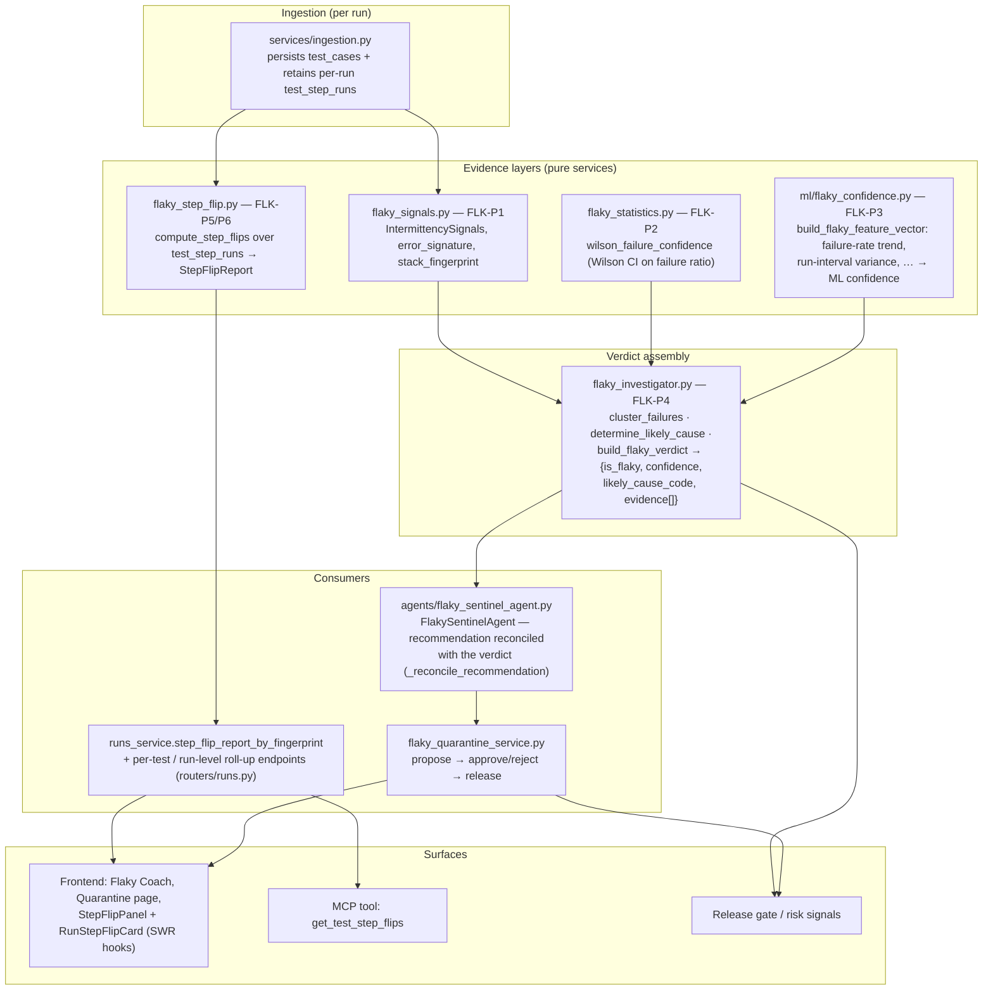
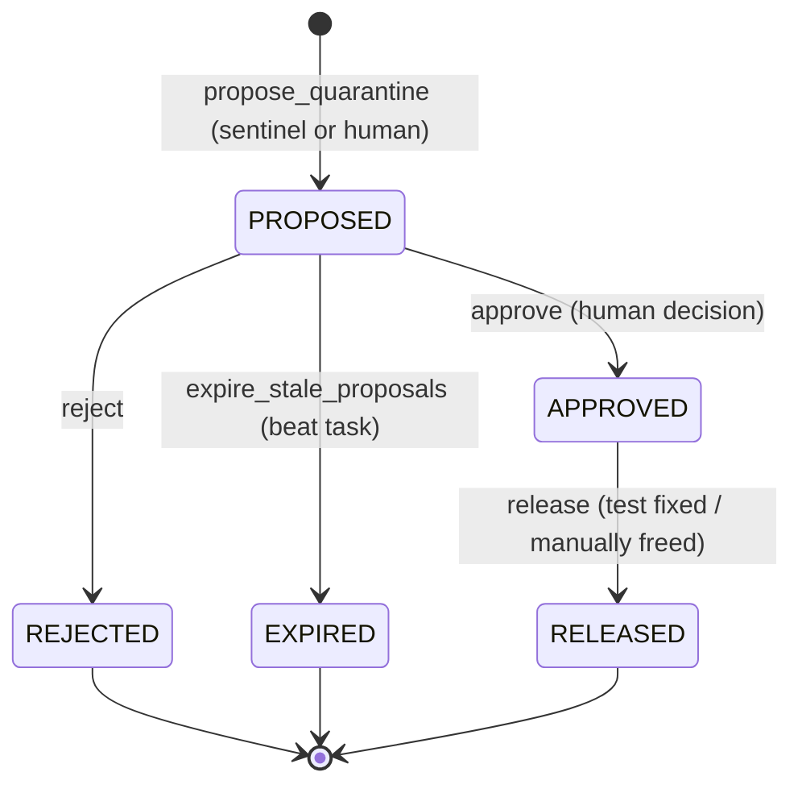
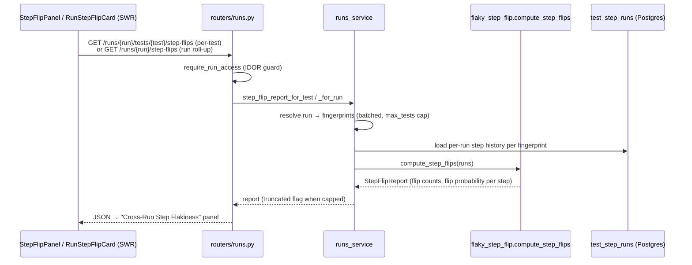

# Flaky Intelligence — subsystem architecture

> Companion to [README.md](./README.md). Covers the FLK series (P1–P6): how
> TestLookup decides a test is *flaky* rather than *broken*, down to the
> individual step, and what that decision drives (quarantine, release gates,
> UI/MCP surfaces). Verified against the implementation 2026-08-08.

The core design principle: **a flaky verdict is a structured, evidence-backed
claim, not a threshold on a failure rate.** Every layer below produces evidence
that `build_flaky_verdict` assembles into `{is_flaky, confidence, likely_cause,
likely_cause_code, evidence[]}` — and every consumer (sentinel agent,
quarantine, UI) works from that verdict rather than re-deriving its own.

## 1. Component map



## 2. The evidence layers

| Layer | Module | What it contributes |
|---|---|---|
| **Intermittency signals** (FLK-P1) | `services/flaky_signals.py` | Normalizes statuses across frameworks, derives an `error_signature` and `stack_fingerprint` per failure, and computes `IntermittencySignals` — pass/fail alternation across a fingerprint's run history. Same-signature repeated failures look like a *regression*; varied signatures with alternation look *flaky*. |
| **Statistical confidence** (FLK-P2) | `services/flaky_statistics.py` | `wilson_failure_confidence` puts a Wilson score interval around the failure ratio, so 2-fails-of-3-runs is treated as far weaker evidence than 20-of-30. Returns `FailureRatioConfidence` with the interval bounds the investigator reads (`wilson.low`). |
| **ML confidence** (FLK-P3) | `services/ml/flaky_confidence.py` | `build_flaky_feature_vector` extracts behavioral features per fingerprint — failure-rate *trend*, run-interval variance, and friends — for the flaky-confidence model. Deliberately separate from the 6-class triage classifier in `ml/classifier.py` (that one answers *what kind of failure*; this one answers *how confident are we it's flaky*). |
| **Step flips** (FLK-P5/P6) | `services/flaky_step_flip.py` | Ingestion retains per-run step outcomes in `test_step_runs` (it deletes/rewrites per-run rows but **retains history across runs** — that retention is what makes cross-run analysis possible). `compute_step_flips` walks a fingerprint's step history and emits a `StepFlipReport`: which *step* flips verdict across runs, isolating the flaky part of an otherwise stable test. |

## 3. Verdict assembly (FLK-P4)

`services/flaky_investigator.py` is the single assembly point:

- `cluster_failures` groups a fingerprint's failure records by signature (`FailureClusters`).
- `determine_likely_cause` maps the P1 signals plus the ML confidence to a `(cause_text, cause_code)` — e.g. `likely_regression` vs a flaky cause.
- `build_flaky_verdict` combines all of the above with the Wilson interval into the canonical verdict dict. Each contributing layer lands in `evidence[]` as an `EvidenceRef` with a `strength` (`weak|medium|strong`) and a numeric `contribution` — the AIQ-P3 evidence-weighting scheme, so the final `confidence` is auditable back to its inputs.

## 3a. One definition of "intermittent"

A test is flaky when its history **oscillates**, not when it merely fails often.
That distinction has one home:

```python
# services/flaky_signals.py
MIN_FLIPS_FOR_INTERMITTENCY = 2      # pass<->fail transitions, IN RUN ORDER
```

and one shared predicate for history-shaped checks:

```python
# services/test_health_coach_service.py
history_is_intermittent(status_history) -> bool
```

**Why this is centralised.** Four surfaces used to re-derive the rule
independently and disagreed on the same data — the dashboard KPI, the
`/failures` verdict, the flaky coach headline, and the ROI figure. A test that
broke once and stayed broken (`p f f f f`: one transition, a **regression**) was
counted as flaky by some and not others, so one project reported 2, 2 and 5
simultaneously. A persistent regression is a different problem with a different
fix, and calling it flaky sends it to the wrong queue.

Consumers, all importing rather than restating:

| surface | imports |
|---|---|
| `metrics_service` (dashboard KPI) | `MIN_FLIPS_FOR_INTERMITTENCY as _FLAKY_MIN_FLIPS` |
| `analytics_service` (`/failures` verdict) | same |
| `test_health_coach_service` (coach headline) | `history_is_intermittent` |
| `value_metrics_service` (ROI hours-saved) | `history_is_intermittent` |

**`BROKEN` counts as a failure** for flip purposes — an infra error that
alternates with passes is still oscillation. Note the coach's *list* still shows
persistent regressions (with a downgraded recommendation and "treat as a
regression, not a flake" guidance); only the **count** is gated on flips.

> **Ordering caveat.** Flip analysis replays history by ingest time
> (`created_at`), not build sequence — a deliberate decision, since
> `build_number` is not reliably numeric, present, or monotonic across branches.
> Where CI uploads out of order (parallel jobs, retries, backfills), the
> flake-vs-regression verdict can differ from a build-ordered replay.

## 4. The sentinel and the quarantine lifecycle

`FlakySentinelAgent` (in `app/agents/`, subject to the agent-contract ratchet) runs over a window of results and produces recommendations. Its `_reconcile_recommendation` guard exists because of a real bug class: the old failure-rate ladder could shout "QUARANTINE" at a consistently-failing test whose own verdict said `is_flaky: false, likely_cause_code: likely_regression`. The recommendation is now **derived from the verdict**, never allowed to contradict it — a regression gets "fix it", not "quarantine it".

Quarantine itself is a small, audited state machine in `services/flaky_quarantine_service.py` (feature-gated, every transition audit-logged):



`active_quarantines_for_project` is what the release-gate side reads: quarantined tests stop counting against the verdict while they're being fixed.


### Lifecycle policy (`quarantine_lifecycle_policies`)

Per-project, so a team can tune how aggressive quarantine is:

| column | meaning |
|---|---|
| `detection_flip_rate_threshold`, `detection_min_runs` | when a test is *proposed* |
| `sla_days` | how long a quarantine may sit before it is chased |
| `auto_create_defect` | file a defect on quarantine |
| `auto_promote`, `promote_after_passes` | release automatically after N consecutive passes |

Requests carry an `owner_user_id`, so a quarantined test has someone
accountable rather than sitting in a shared bucket.

**Transitions are guarded.** Every illegal move returns `409` naming the actual
state (`Cannot approve from status QUARANTINED`), and the
`(project_id, test_fingerprint)` live-uniqueness invariant is enforced by
idempotent upsert — a duplicate live proposal returns the **existing** row
rather than creating a second. Terminal rows are retained as history, so
re-proposing after a release creates a new row.

## 5. Step-flip read path (FLK-P6 surfaces)

The step-flip data has one compute service and three read surfaces, all funneled through `runs_service`:



The MCP tool `get_test_step_flips` (in `mcp/tools/runs.py`) reuses the same per-test endpoint — no separate backend path — and renders insufficient-history / stable / flicker-table states for agent consumers.

## 6. Design invariants

- **Pure evidence services** — the signal/statistics/step layers are pure functions over records; they take data, not sessions. That's what makes the verdict unit-testable and the pipeline cheap to re-run.
- **One verdict, many consumers** — nothing downstream (sentinel, quarantine, gates, UI) re-decides flakiness; they consume `build_flaky_verdict` output. Divergence between a recommendation and the verdict is treated as a bug.
- **Retention over recomputation** — `test_step_runs` retains prior runs on re-ingest precisely so step flips are computable without replaying old reports.
- **Fully offline** — every layer here is rules/ML on local data; nothing in the flaky path requires an LLM or leaves the machine.
