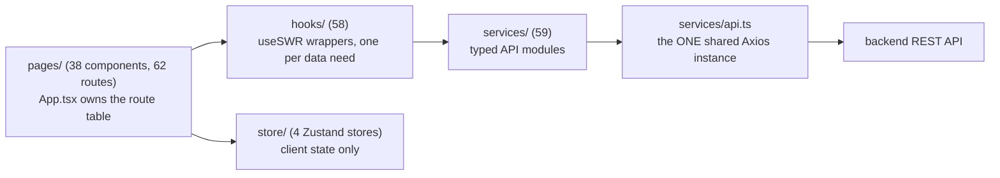

# Frontend — SPA architecture

> Companion to [README.md](./README.md). The React 18 + Vite + TypeScript SPA:
> its layering, state model, theme system, and the CI ratchets that hold the
> conventions in place. Verified against the implementation 2026-08-08.

## 1. Layering

One direction of data flow, enforced by quality gates (§5):

- **Pages** are route-level components (`App.tsx` is the single route table —
  check it before editing a page; files get renamed).
- **Hooks** wrap `useSWR` and are the only way pages read server data. A
  page-level data need = a hook; hooks call services, never Axios directly.
- **Services** are typed API modules; every one imports the shared base from
  `services/api.ts` — no ad-hoc `axios.create` anywhere.
- **Reads via SWR, writes via service calls + `mutate`** — optimistic updates
  revalidate the affected SWR keys rather than duplicating server state.

## 2. The shared Axios instance (`services/api.ts`)

Both interceptors carry deliberate policy:

- **Request** — attaches auth; base URL is empty when `VITE_API_BASE_URL` is
  unset, making the production bundle deploy-target agnostic (same-origin
  relative URLs behind any ingress — see
  [DEPLOYMENT.md](./DEPLOYMENT.md)).
- **Response** — on 401, a **single-flight token refresh** (one refresh even
  when many requests fail together, with a queue that replays the rest); then
  the toast policy in `services/apiErrors.ts`: **422s toast** (a silent 422 was
  the historical "empty page, no error" footgun), 401/404 stay quiet, and
  FastAPI's array-form validation `detail` is flattened into a readable
  message instead of `[object Object]`.

## 3. Client state — Zustand, and only client state

Four stores, all cross-cutting *client* concerns — server data never lives in
Zustand:

| Store | Holds |
|---|---|
| `authStore` | the session user + token lifecycle |
| `projectStore` | the active project (`ALL_PROJECTS_ID` sentinel is a named constant — never inline the string) |
| `themeStore` | the selected theme |
| `timeWindowStore` | the **global shared time window** — one window across all analytics pages; each page snaps it to its allowed set (pages must agree on the canonical values or they drift each other) |

Selector discipline: components select **primitive slices**
(`useAuthStore(s => s.user?.role)`) so Zustand's `Object.is` equality prevents
re-render storms; object-returning selectors were a real bug class.

## 4. The theme system

Six themes (`signal` default, `midnight`, `slate`, `console`, `ember`, and
`lab` — the light one) are CSS custom-property sets under `[data-theme="…"]`
in `src/index.css`. Components consume **tokens**, never palette colors:
`--color-*` (surfaces/text/accent), `--status-passed|failed|broken|skipped|flaky`
(+ derived `-bg`/`-bd` via `color-mix`), and `--gate-go|conditional|no-go`.

Raw Tailwind palette classes (`text-emerald-400`, …) bypass the system and
break light themes — a `no-restricted-syntax` ESLint rule flags them (a
warn-ratchet being driven to zero; avatar-color swatches are exempt as user
data). The `.badge-*` primitives already sit on the tokens.

## 5. What CI enforces

- **Quality gates** (`scripts/quality_gate.py`): `frontend.swr-only-fetching`,
  `frontend.single-axios`, `frontend.all-projects-literal`,
  `frontend.clipboard-util` — the layering rules above are checks, not lore.
- **ESLint ratchets, all at `error` after their burn-downs**: the full
  react-hooks v7 React-Compiler set (purity, set-state-in-effect, refs,
  immutability, exhaustive-deps), `@typescript-eslint/no-explicit-any`, and
  `no-non-null-assertion`. The palette rule (§4) is the one remaining `warn`
  ratchet. Promotion regressions (`*.promotion.test.ts`) pin each rule at
  `error` so it can't quietly slip back.
- **`tsc --noEmit` strict** and a production `vite build` (vite 8 bundles with
  **rolldown** — `manualChunks` must be the function form).

## 6. Patterns worth copying (from the ratchet burn-downs)

- **Reset/derive-on-change**: track the previous value and adjust state
  *during render* (the React-endorsed pattern) instead of a `useEffect` —
  this is how the set-state-in-effect ratchet was cleared.
- **Fetch-on-mount** → an SWR hook + `mutate`, not an effect.
- **Narrowing over assertion**: guards/early-returns/`throw` instead of `x!`;
  in JSX, hoist the optional chain into a local so closures capture the
  narrowed value.
- **Stable identities**: wrap derived arrays (`data?.items ?? []`) in
  `useMemo` before using them as dependencies.
- Genuine DOM/network effects that must stay effects carry a **scoped,
  justified** `eslint-disable-next-line` — never a file-wide disable.

## Related docs

- Route-level UX behaviors users see: [user-guide/](../user-guide/README.md)
- Theme-token remediation plan: `design_handoff_ui_improvements/` (local) + the palette ratchet in the auto-routine
- Build/deploy of the bundle: [DEPLOYMENT.md](./DEPLOYMENT.md)
