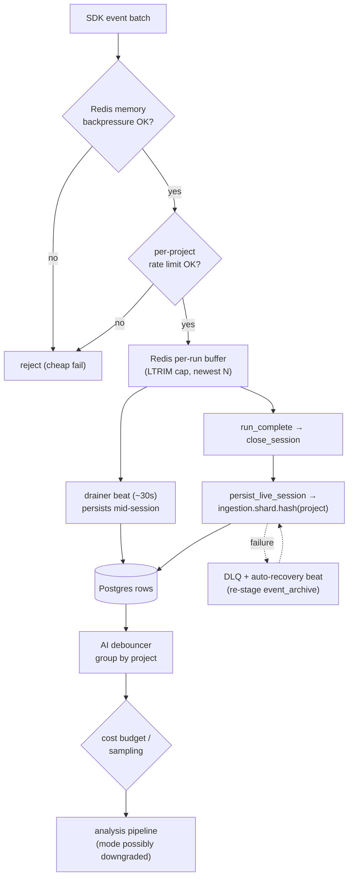

# Ingestion at Scale — backpressure, sharding, and loss-prevention

> Companion to [README.md](./README.md) §3–4 (the basic ingestion → analysis
> flow and Celery topology). This doc covers the *scalability* design layered
> onto that flow across the scalable-ingestion phases: how the system behaves
> when many projects stream many runs at once, and the machinery that keeps a
> hot producer from losing data or starving its neighbours. Verified against
> the implementation 2026-07-02.

The failure modes this design defends against, in order of appearance on the
ingest path:

| Failure mode | Defence |
|---|---|
| Redis OOM from a burst | memory **backpressure** gate |
| One noisy project starving others | per-project **rate limit** + **shard queues** |
| Unbounded live buffers | per-run **buffer cap** (LTRIM) |
| Long sessions outliving the cap | incremental **drainer** |
| Persist crashing silently | **DLQ** + recovery beats |
| LLM cost blow-up on high volume | **debouncer**, **budget gate**, **sampling** |

## 1. The admission gate (two layers, order matters)

`routers/stream.py::ingest_event_batch` gates every SDK event batch:

1. `enforce_redis_memory_backpressure()` — if Redis is at its red line, reject
   *before* doing anything else, so the failure path costs nothing extra.
2. `enforce_ingest_rate_limit(project_id)` — the per-project budget. Note the
   subtlety: SDK batches carry only `session_id`/`run_id`, so the project is
   resolved **server-side** from the session token before charging the bucket —
   otherwise a noisy session would escape its project's gate.

## 2. Per-run buffer cap

Live events buffer in Redis lists per run. `LTRIM start=-N` (O(1)) keeps the
most recent N entries so a runaway producer can't grow a list unboundedly even
while inside its rate budget. On its own this would *lose* early events for
very long runs — which is exactly what the drainer (§4) exists to prevent.

## 3. Shard queues (`worker/ingestion_routing.py`)

One global `ingestion` queue would let a single project's burst starve
everyone (head-of-line blocking). Instead persistence work is partitioned into
N shards keyed by project:

- **Same project → same shard**, so per-project ordering inside a worker is
  preserved.
- **No coordination** — the producer derives the shard locally from the
  project id; there's no broker-side router to configure or fail.
- **Stable scale-out** — adding shard N+1 re-homes only 1/N of projects.
- Count from `settings.LIVE_INGEST_SHARD_COUNT`; queues are declared at boot in
  `worker/celery_app.py`. The plain `ingestion` queue remains for
  non-shardable tasks (`ingest_test_run`, file ingests).

> **Operational invariant:** every ingestion worker must subscribe to **all**
> shard queues (`-Q ingestion,ingestion.shard.0,…`). A worker on `ingestion`
> only produces the classic symptom — `/runs` populated, `/suites` and
> per-test rows empty — because `persist_live_session` routes to a shard the
> worker never consumes.

## 4. The incremental drainer (`services/live_session_drainer.py`)

A beat task drains each active run's buffer into Postgres **mid-session**
(every ~30s), so the buffer cap and Redis eviction can no longer drop rows for
long-running sessions — by the time LTRIM would bite, the early events are
already persisted rows.

- `drain_run_buffer` takes a per-run Redis lock (`_acquire_lock`) so drain
  ticks and session-close persists don't double-process a buffer.
- `_resolved_started_at` reads the run's *real* start from Redis live-state
  rather than stamping the drain tick's `now` — otherwise every drained run
  would report a start time skewed to the first drain.
- `_resolved_suite` applies the session's default suite to events that omit
  one (the suite-name NULL pattern).

## 5. When persist fails: DLQ + recovery

- **DLQ** (`services/ingestion_dlq.py`) — `record_persist_failure` captures a
  failed `persist_live_session` with its payload reference;
  `list_recent_failures` / `get_dlq_count` feed the admin surfaces so failures
  are *visible*, not just logged.
- **Auto-recovery beat** — runs that closed with aggregates but no per-test
  rows (the classic silent persist failure) are detected every ~2 minutes; the
  run's `event_archive` is re-staged into Redis and persist re-queued, so real
  test names land within minutes.
- **Heartbeat reaper** — SDK sessions carry heartbeats; sessions whose
  producer died are closed by the reaper instead of hanging "in progress"
  forever.

## 6. Keeping the AI layer affordable under volume

Ingestion volume must not translate 1:1 into LLM spend:

- **Debouncer** (`services/ai_pipeline_debouncer.py`) — bursts of run
  completions are grouped by project; one pipeline is fanned out per run with
  the budget's `mode_override` baked in, instead of dispatching on every event.
- **Budget gate** — a per-project daily cost budget (default $10/project/day)
  consulted at fan-out; over budget, the pipeline downgrades mode (LLM → ML/
  rules) rather than silently spending.
- **High-volume sampling** — `HIGH_VOLUME_SAMPLE_EVERY_N` (default 2 = 50%)
  samples which high-volume runs get full analysis; `N=1` disables sampling.
  Sampling is logged, never silent.

## 7. The scaled path end-to-end

## Related docs

- The functional flow these mechanics protect: [README.md §3–4](./README.md#3-ingestion--analysis-flow)
- What analysis does with the persisted rows: [AI_QUALITY.md](./AI_QUALITY.md)
- The user-side view: [user-guide/getting-results-in.md](../user-guide/getting-results-in.md)
