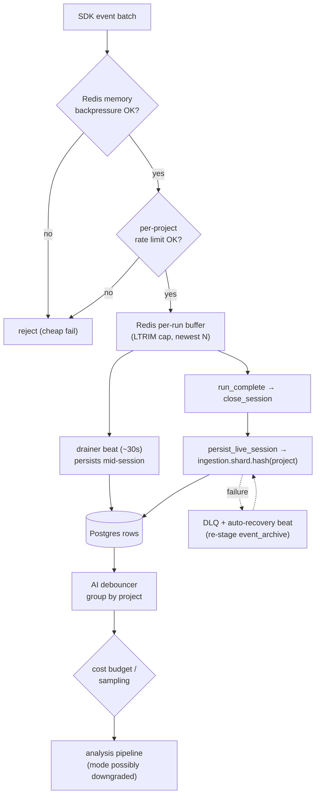

# Ingestion at Scale — backpressure, sharding, and loss-prevention

> Companion to [README.md](./README.md) §3–4 (the basic ingestion → analysis
> flow and Celery topology). This doc covers the *scalability* design layered
> onto that flow across the scalable-ingestion phases: how the system behaves
> when many projects stream many runs at once, and the machinery that keeps a
> hot producer from losing data or starving its neighbours. Verified against
> the implementation 2026-07-02.

The failure modes this design defends against, in order of appearance on the
ingest path:

| Failure mode | Defence |
|---|---|
| Redis OOM from a burst | memory **backpressure** gate |
| One noisy project starving others | per-project **rate limit** + **shard queues** |
| Unbounded live buffers | per-run **buffer cap** (LTRIM) |
| Long sessions outliving the cap | incremental **drainer** |
| Persist crashing silently | **DLQ** + recovery beats |
| LLM cost blow-up on high volume | **debouncer**, **budget gate**, **sampling** |

## 1. The admission gate (two layers, order matters)

`routers/stream.py::ingest_event_batch` gates every SDK event batch:

1. `enforce_redis_memory_backpressure()` — if Redis is at its red line, reject
   *before* doing anything else, so the failure path costs nothing extra.
2. `enforce_ingest_rate_limit(project_id)` — the per-project budget. Note the
   subtlety: SDK batches carry only `session_id`/`run_id`, so the project is
   resolved **server-side** from the session token before charging the bucket —
   otherwise a noisy session would escape its project's gate.

## 2. Per-run buffer cap

Live events buffer in Redis lists per run. `LTRIM start=-N` (O(1)) keeps the
most recent N entries so a runaway producer can't grow a list unboundedly even
while inside its rate budget. On its own this would *lose* early events for
very long runs — which is exactly what the drainer (§4) exists to prevent.

## 3. Shard queues (`worker/ingestion_routing.py`)

One global `ingestion` queue would let a single project's burst starve
everyone (head-of-line blocking). Instead persistence work is partitioned into
N shards keyed by project:

- **Same project → same shard**, so per-project ordering inside a worker is
  preserved.
- **No coordination** — the producer derives the shard locally from the
  project id; there's no broker-side router to configure or fail.
- **Stable scale-out** — adding shard N+1 re-homes only 1/N of projects.
- Count from `settings.LIVE_INGEST_SHARD_COUNT`; queues are declared at boot in
  `worker/celery_app.py`. The plain `ingestion` queue remains for
  non-shardable tasks (`ingest_test_run`, file ingests).

> **Operational invariant:** every ingestion worker must subscribe to **all**
> shard queues (`-Q ingestion,ingestion.shard.0,…`). A worker on `ingestion`
> only produces the classic symptom — `/runs` populated, `/suites` and
> per-test rows empty — because `persist_live_session` routes to a shard the
> worker never consumes.

## 4. The incremental drainer (`services/live_session_drainer.py`)

A beat task drains each active run's buffer into Postgres **mid-session**
(every ~30s), so the buffer cap and Redis eviction can no longer drop rows for
long-running sessions — by the time LTRIM would bite, the early events are
already persisted rows.

- `drain_run_buffer` takes a per-run Redis lock (`_acquire_lock`) so drain
  ticks and session-close persists don't double-process a buffer.
- `_resolved_started_at` reads the run's *real* start from Redis live-state
  rather than stamping the drain tick's `now` — otherwise every drained run
  would report a start time skewed to the first drain.
- `_resolved_suite` applies the session's default suite to events that omit
  one (the suite-name NULL pattern).

## 5. When persist fails: DLQ + recovery

- **DLQ** (`services/ingestion_dlq.py`) — `record_persist_failure` captures a
  failed `persist_live_session` with its payload reference;
  `list_recent_failures` / `get_dlq_count` feed the admin surfaces so failures
  are *visible*, not just logged.
- **Auto-recovery beat** — runs that closed with aggregates but no per-test
  rows (the classic silent persist failure) are detected every ~2 minutes; the
  run's `event_archive` is re-staged into Redis and persist re-queued, so real
  test names land within minutes.
- **Heartbeat reaper** — SDK sessions carry heartbeats; sessions whose
  producer died are closed by the reaper instead of hanging "in progress"
  forever.

## 5a. Worker DB-engine lifecycle (a bulk-ingest hazard)

Two failure modes that only appear under **bulk** ingest, both fixed, both worth
knowing before touching worker DB code:

**1. A disposed engine behind a live-looking name.** `_run_async` disposes the
SQLAlchemy engine and clears its caches after every Celery task. PEP 562
`__getattr__` runs **once per importing module**, so a module-level
`from app.db.postgres import AsyncSessionLocal` permanently binds whichever
factory existed at import time — pointing at the *disposed* engine from task #2
onward, while in-function importers re-resolved and got a fresh one.

Symptom under a 60-run ingest: `cannot perform operation: another operation is
in progress`, runs stuck `IN_PROGRESS`, aggregates never populating.
Instrumentation showed 32 engine builds, 32 clean disposes, **0** dispose
failures — eliminating fork inheritance, teardown failure and pool reuse at
once. Teardown was never broken; a stale *reference* surviving it was.

`AsyncSessionLocal` is now a **callable proxy** that resolves the factory late,
so the name is stable and the binding is not. No call site changed.

**2. Retries that could never succeed.** `routers/ingest.py` mints `run_id` up
front and passes it to the task, which inserts a `TestRun` with that id. A task
failing *after* the insert retried with the **same** id and died on
`test_runs_pkey` — forever. Any transient failure became a permanently stuck
run: measured flat at 56/60 `IN_PROGRESS` across ten minutes, with 38 tasks in
retry loops and 145 duplicate-key events.

`create_run_from_payload` now **resumes** an existing run when the explicit id
already exists in that project, so the write is idempotent per
`(entity, run)` — the convention `backend/CLAUDE.md` already required.

> **Diagnostic note.** Redis queue depths read **0** throughout, because the
> tasks were in retry-ETA rather than queued. "The queue is empty" is actively
> misleading here — check task state, not depth.

## 6. Keeping the AI layer affordable under volume

Ingestion volume must not translate 1:1 into LLM spend:

- **Debouncer** (`services/ai_pipeline_debouncer.py`) — bursts of run
  completions are grouped by project; one pipeline is fanned out per run with
  the budget's `mode_override` baked in, instead of dispatching on every event.
- **Budget gate** — a per-project daily cost budget (default $10/project/day)
  consulted at fan-out; over budget, the pipeline downgrades mode (LLM → ML/
  rules) rather than silently spending.
- **High-volume sampling** — `HIGH_VOLUME_SAMPLE_EVERY_N` (default 2 = 50%)
  samples which high-volume runs get full analysis; `N=1` disables sampling.
  Sampling is logged, never silent.

## 7. The scaled path end-to-end

## 8. The live stream runs inside the API processes (re-audit N4)

`app/main.py`'s lifespan starts two background tasks in **every** API worker
process, gunicorn workers times replicas:

| Task | What it reads | How many do real work |
| --- | --- | --- |
| `live-event-consumer` (`streams/live_consumer.py`) | the source stream, through a Redis consumer group | **one per fleet**: a leader lease (`LIVE_PROCESSOR_LEADER_KEY`, 30 s TTL, renewed every 10 s). The rest poll for the lease once a second and do nothing else. |
| `live-fanout-subscriber` (`streams/live_fanout.py`) | the ordered fan-out stream, with plain `XREAD` | **every process**, by design: each delivers to the WebSocket and SSE clients connected to that process. |

The second is not a design smell. A process can only push to its own
sockets, so every process has to hear every fan-out entry. Starting it
elsewhere would need a second hop back into each API process.

**The exposure is the first one.** Whichever API process holds the lease
processes the whole fleet's source stream: projecting run state, counting,
and the Postgres and Redis writes that follow. It does so on the same event
loop, CPU and connection pools as the HTTP requests that process is
serving. Under a heavy live stream, that one process's request latency
rises while its siblings stay idle, and nothing in the load balancer knows
why.

What already bounds it:

- **No loss on a crash.** Entries are acknowledged only once handled. A new
  leader first drains every entry left pending by its predecessor
  (`XAUTOCLAIM` from `0-0`, idle time 0) before it reads anything new, so
  order is kept. A dead leader delays the stream by up to the 30 s lease; it
  does not drop events. Poison entries reach the DLQ after the shared
  delivery threshold instead of blocking.
- **No death by exception.** Both loops log and retry: the consumer after 5 s,
  the subscriber after 1 s, marking itself not-ready. Only shutdown
  cancellation stops them.
- **Gaps are reconciled, not hidden.** A subscriber whose cursor falls behind
  the trimmed fan-out stream tells its clients to re-fetch.

Runbook, when one API pod's latency climbs during heavy live streaming:

1. Find the leader: `redis-cli GET <LIVE_PROCESSOR_LEADER_KEY>`. The value is
   `host:pid:uuid`, and the host is the pod.
2. Compare that pod's request latency with its siblings'. A gap that follows
   live-event volume is this coupling.
3. Relieve it: `redis-cli DEL` the key. The leader loses the lease at its next
   renewal and another process takes it, draining the pending list first.
   Or roll the pod. Either way nothing is lost.
4. If it recurs, give the API more workers or replicas. The leader's share
   of one process then matters less. Extracting the consumer into its own
   Deployment, the audit's recommendation, needs a standalone entrypoint and
   manifests. It is not done: the leader lease already keeps the work to one
   process, which is the correctness property an extraction would buy.

## Related docs

- The functional flow these mechanics protect: [README.md §3–4](./README.md#3-ingestion--analysis-flow)
- What analysis does with the persisted rows: [AI_QUALITY.md](./AI_QUALITY.md)
- The user-side view: [user-guide/getting-results-in.md](../user-guide/getting-results-in.md)
