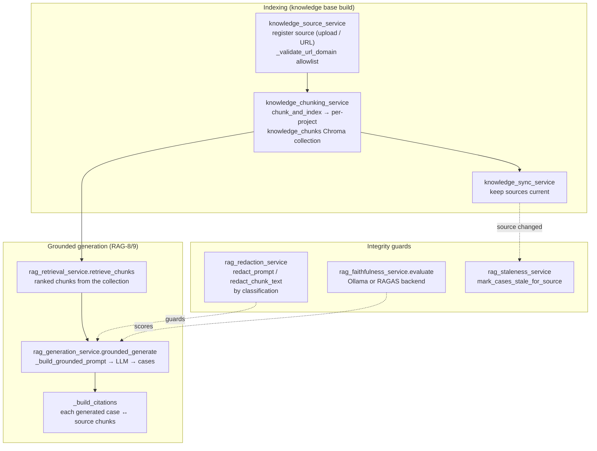

# Knowledge & RAG — subsystem architecture

> Companion to [README.md](./README.md). The optional retrieval-augmented layer
> (RAG-* series): how documents become a searchable knowledge base and how that
> base grounds test-case generation — with faithfulness, redaction, and
> staleness guards so a generated artifact is *traceable and safe*, never a
> confident hallucination. Verified against the implementation 2026-07-02.

**Optional by construction.** This whole subsystem sits behind ChromaDB +
Ollama (the opt-in AI stack) and a feature flag, and — like everything with an
outbound or LLM edge — behind `AI_OFFLINE_MODE`. In a default install it is
inert; `rag_generation` falls back to a deterministic stub rather than calling
a model.

## 1. Two flows: index, then generate

## 2. Indexing — sources → chunks → vectors

- **Sources** (`knowledge_source_service`) — a knowledge source is an uploaded
  document or a URL. URL sources go through `_validate_url_domain` against an
  **allowlist**, and `rag_redaction_service.validate_url_scheme` /
  `validate_document_upload` gate scheme and upload shape. (Scope note, same as
  [SECURITY.md](./SECURITY.md): the allowlist constrains *which hosts*; pair it
  with network egress policy for a hardened SSRF posture.)
- **Chunking** (`knowledge_chunking_service.chunk_and_index`) — documents are
  split and embedded into a **per-project** `knowledge_chunks` ChromaDB
  collection (`_get_or_create_knowledge_collection`). Per-project isolation is
  the same tenancy invariant as the semantic cache — one project's documents
  never surface in another's retrieval.
- **Sync** (`knowledge_sync_service`) — keeps indexed sources current as their
  upstreams change.

## 3. Grounded generation (RAG-8 / RAG-9)

`rag_generation_service.grounded_generate` is the payoff: generate test cases
*from* the knowledge base rather than from thin air.

1. `rag_retrieval_service.retrieve_chunks(project_id, …)` pulls the top-ranked
   chunks for the request.
2. `_build_grounded_prompt` composes the prompt from those chunks;
   `_call_llm_generate` runs it (or `_stub_generated_cases` when offline/no
   model — the flow never hard-fails on a missing LLM).
3. `_build_citations` links **each generated case back to the source chunks**
   it came from (capped per case), and `_persist_cases` / `_map_coverage`
   store the results and map them onto coverage. Every generated case is
   therefore *traceable to its evidence* — the anti-hallucination contract.

## 4. The integrity guards — why this is trustworthy

| Guard | Service | What it enforces |
|---|---|---|
| **Redaction** | `rag_redaction_service` | `redact_prompt` / `redact_chunk_text` strip sensitive content by **classification** before text reaches the model or a citation — PII redaction at the boundary, per the repo convention |
| **Faithfulness** | `rag_faithfulness_service.evaluate` | scores whether a generated case is actually supported by its cited chunks, via an Ollama judge or **RAGAS** backend (`_resolve_backend`); degrades gracefully when the backend is absent |
| **Staleness** | `rag_staleness_service` | when a source changes, `mark_cases_stale_for_source` flags the cases generated from it; `get_stale_cases` / `dismiss_stale` drive the review — generated artifacts don't silently rot when their evidence moves |
| **Review / eval** | `rag_review_service`, `rag_eval_service` | human review of generated cases and offline evaluation of the RAG pipeline's own quality |

## 5. Where it surfaces

- **Knowledge sources** are managed from the settings/knowledge UI; retrieval
  and grounded generation feed the AI features ([Ask AI chat](../user-guide/ai-features.md)
  and test-case generation).
- **Faithfulness / staleness** results surface as review queues so a human
  gates what enters the catalog.

## 6. Design invariants

- **Traceability over fluency** — a generated case that can't cite its chunks
  is not shippable; citations are built for every case, not best-effort.
- **Per-project everything** — collections, retrieval, and generated cases are
  project-scoped (tenancy, same as [SECURITY.md §3](./SECURITY.md#3-tenancy--project-scoping-as-defence-in-depth)).
- **Offline-safe** — no model, no network, no problem: the stub path keeps the
  flow working and the redaction/allowlist guards mean nothing sensitive leaves
  even when the LLM tier *is* enabled.
- **Guarded, not assumed** — redaction, faithfulness, and staleness are
  separate services precisely so each can be tested and enforced independently.

## Related docs

- The non-RAG analysis quality mechanisms: [AI_QUALITY.md](./AI_QUALITY.md)
- Tenancy & the URL-allowlist scope note: [SECURITY.md](./SECURITY.md)
- Schema for knowledge/RAG tables: [DATABASE_SCHEMA.md](./DATABASE_SCHEMA.md) (Knowledge/RAG domain)
