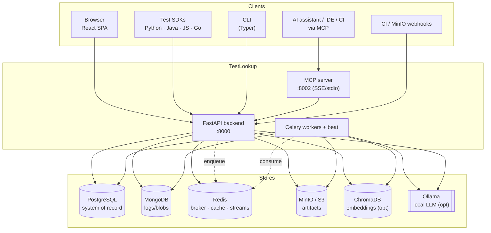
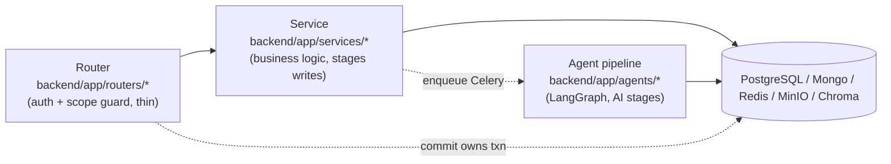
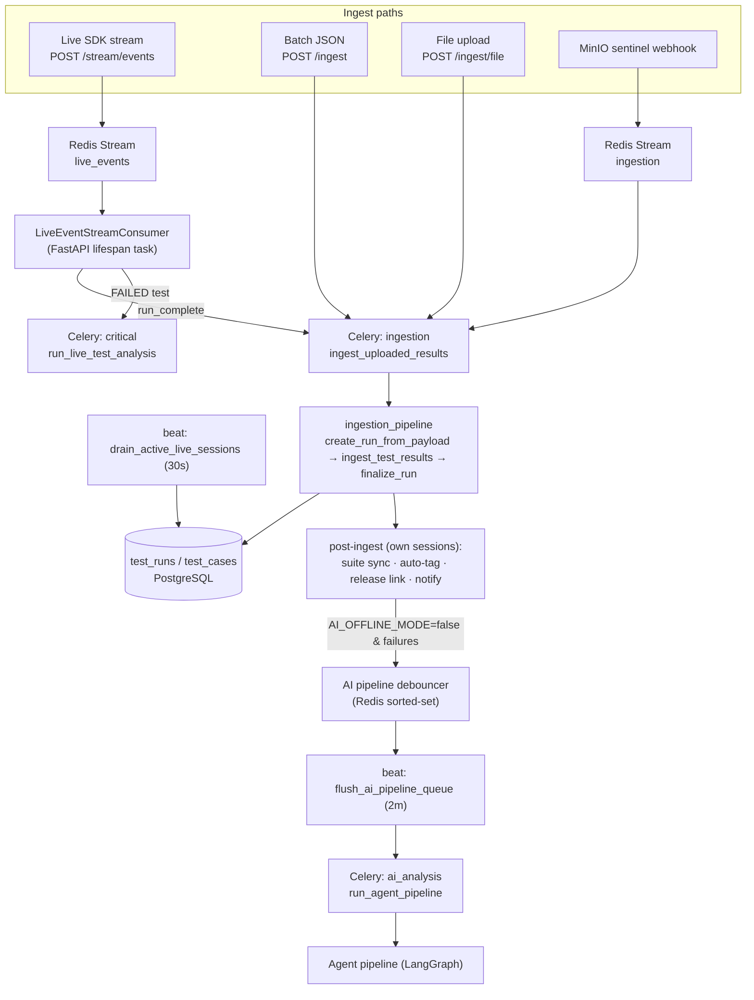
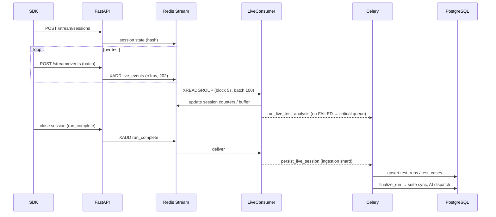
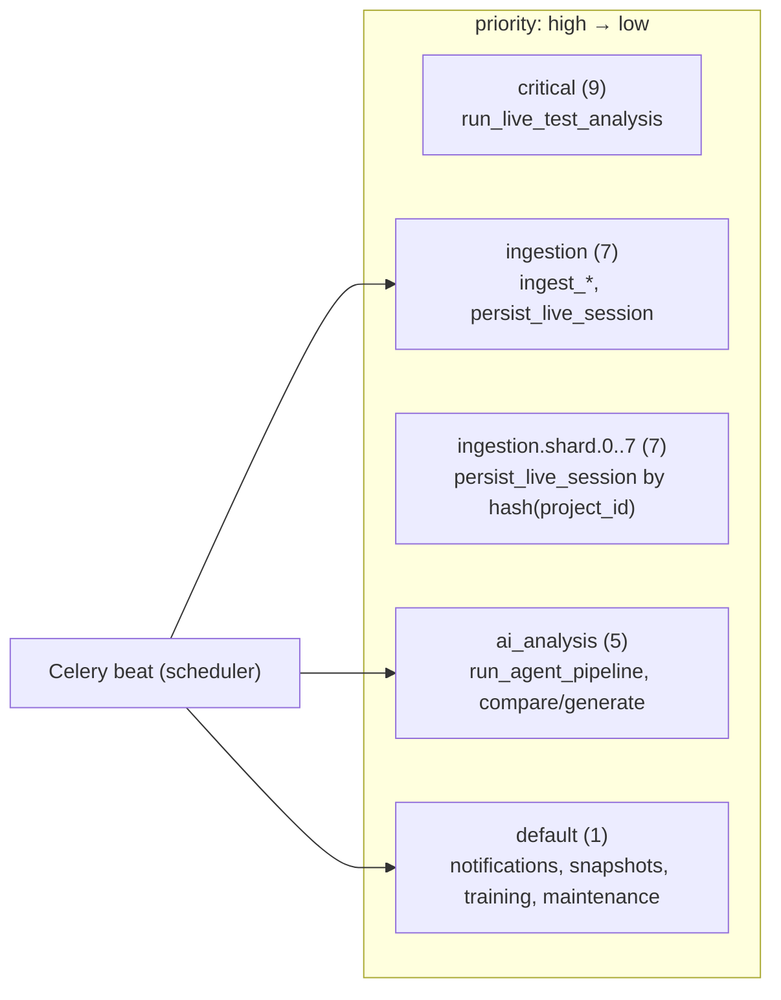
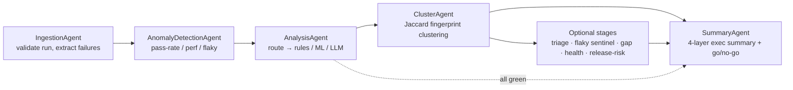

# TestLookup — Architecture

> Generated 2026-06-25 from the live implementation. This folder is the
> developer-facing architecture set:
>
> - **README.md** (this file) — system & runtime architecture, with diagrams.
> - **[DATABASE_SCHEMA.md](./DATABASE_SCHEMA.md)** — ER diagrams + full schema reference for all 96 PostgreSQL tables, plus the Mongo/Redis/MinIO/Chroma layout.
> - **[DEVELOPER_GUIDE.md](./DEVELOPER_GUIDE.md)** — conventions, quality-gate ratchets, how to add/fix code, and the recurring bug classes.
> - **[FLAKY_INTELLIGENCE.md](./FLAKY_INTELLIGENCE.md)** — the flaky-detection subsystem (FLK P1–P6): evidence layers, verdict assembly, quarantine lifecycle, step-flip surfaces.
> - **[RELEASE_GATE.md](./RELEASE_GATE.md)** — how GO / CONDITIONAL_GO / NO_GO is decided: input signals, policy layer, band floor, council synthesis, overrides.
> - **[AI_QUALITY.md](./AI_QUALITY.md)** — the mechanisms that keep the AI layer honest: semantic cache, the human-correction learning loop, evidence grading, cluster integrity.
> - **[INGESTION_SCALE.md](./INGESTION_SCALE.md)** — ingestion under load: admission gates, shard queues, buffer caps + the drainer, DLQ/recovery, and AI cost controls.
> - **[SECURITY.md](./SECURITY.md)** — identity, the authz guard family + HMAC-signed membership cache, tenancy layers, secure-by-default deployment, offline-first, audit.
> - **[DEPLOYMENT.md](./DEPLOYMENT.md)** — the topologies: compose variants, the release-image path, k8s base + per-target overlays, CI/CD pipelines, environment gotchas.
> - **[FRONTEND.md](./FRONTEND.md)** — the SPA: pages→hooks→services→one-Axios layering, Zustand client-state model, the six-theme token system, and the enforcing ratchets.
> - **[OBSERVABILITY.md](./OBSERVABILITY.md)** — metrics/traces/logs plus agent decision logs, the Grafana/alerting stack, and the health surfaces.
> - **[KNOWLEDGE_RAG.md](./KNOWLEDGE_RAG.md)** — the optional RAG layer: indexing sources → chunks, grounded generation with citations, and the redaction/faithfulness/staleness guards.
> - **[AI_EVALUATION.md](./AI_EVALUATION.md)** — model-ops: golden/feedback datasets, eval runs + drift, the model registry, and the pre-release gate that blocks regressing AI changes.
>
> The root [`ARCHITECTURE.md`](../ARCHITECTURE.md) is the short, marketing-adjacent
> overview; this folder is the detailed engineering reference.

TestLookup is **local-first test-failure intelligence for CI/QA**. It ingests
test results (JUnit, pytest, TestNG, Allure, Cypress, Playwright, Robot,
Cucumber), clusters failures, explains root causes (rules / ML / local-LLM), and
emits release-risk signals (GO / CONDITIONAL_GO / NO_GO) — surfaced via a web
UI, REST API, CLI, and an MCP server, and able to run fully offline.

---

## 1. System context

Who talks to TestLookup and what it depends on.

## 2. Containers & ports

| Component | Tech | Port (compose host) | Responsibility |
|-----------|------|---------------------|----------------|
| **Frontend** | React 18 + Vite + TS + Tailwind + Zustand + SWR | 3000 | Dashboard, analytics, admin |
| **Backend** | FastAPI + SQLAlchemy 2.0 (async) + Motor | 8000 | REST API, auth, ingestion orchestration, business logic |
| **MCP server** | Model Context Protocol (stdio + SSE) | 8002 | Tools/resources for AI clients; talks to the backend over HTTP |
| **CLI** | Typer + Rich | — | Terminal QA workflows over the REST API |
| **Workers** | Celery (+ beat) | — | Ingestion, AI pipeline, notifications, maintenance |
| **PostgreSQL** | 16 | 5433→5432 | Relational system of record (96 tables) |
| **MongoDB** | 7 | 27017 | Immutable logs, raw ingest blobs, run summaries |
| **Redis** | 7 | 6379 | Celery broker/result, live-session state, event Streams, cache |
| **MinIO** | S3-compatible | 9000 (API) / 9001 (console) | Report files, PDFs, compliance packs, RAG docs |
| **ChromaDB** | optional | 8001→8000 | Per-project embeddings for semantic search |
| **Ollama** | optional | 11434 | Local LLM for triage/summary |

> Postgres is published on **5433** (container 5432) to avoid colliding with a
> local Postgres; ChromaDB on **8001**; MinIO on **9000/9001**.

### Request layering

Every request flows through the same layers — keep the responsibilities sharp
(see [DEVELOPER_GUIDE](./DEVELOPER_GUIDE.md#2-backend-conventions)):

- **Routers** authenticate, enforce the per-resource access guard, and delegate. They **own the transaction** (`await db.commit()`); services stage changes and return.
- **Services** hold business logic and are mostly stage-only. A small allowlist owns commits (Celery-task-owned, orchestration, or dedicated write-session services).
- **Agents** run the AI pipeline asynchronously under Celery, each writing its own stage result.

## 3. Ingestion → analysis flow

There are four ways test results enter, all converging on the ingestion pipeline
and (when AI is enabled) the agent pipeline.

Key points:

- **Live path** is thin-producer / async-consumer: the SDK `POST` returns in ~1 ms after an `XADD` to the Redis Stream; a background consumer in the FastAPI lifespan drains it, updates per-session Redis state, and queues work. A 30 s beat task (`drain_active_live_sessions`) persists buffered events mid-session so the Redis buffer cap can't drop per-test rows.
- **`finalize_run()` is mandatory** after committing `test_case` rows — it triggers suite membership, auto-tagging, and AI dispatch. Skipping it leaves `/suites` empty while `/runs` is populated. The `backend.finalize-run` quality gate enforces this.
- **AI dispatch is gated** by `AI_OFFLINE_MODE` (default **True**) and debounced per project to batch bursty runs and respect the per-project LLM cost budget.

### Live-session sequence (happy path)

## 4. Celery topology

Four priority queues plus per-shard ingestion fan-out. Workers subscribe to all
queues; the broker is Redis (FIFO) with priority hints set for a RabbitMQ broker.

**Worker config:** `worker_prefetch_multiplier=1` (fair dispatch), `task_acks_late=True`
(safe retry on crash), `worker_max_tasks_per_child=200` (GC), soft/hard time
limits 29 min / 31 min.

**Notable beat tasks** (UTC):

| Task | Cadence | Purpose |
|------|---------|---------|
| `drain_active_live_sessions` | 30 s | Persist live-session buffer mid-run |
| `flush_ai_pipeline_queue` | 2 min | Drain debounce set → dispatch AI pipeline |
| `close_stale_live_sessions` | 2 min | Reap idle (>5 min) live runs |
| `reap_stuck_agent_pipelines` | 10 min | Fail crashed `running` pipelines |
| `backfill_unassigned_failures` | 15 min | Auto-assign failures to QA leads |
| `run_integration_health_probes` | 15 min | Probe Jira/Confluence/Splunk/etc. |
| `reindex_search` | hourly | Incremental ChromaDB reindex |
| `dispatch_scheduled_digests` | daily 07:00 | Email/Slack digests |
| `run_flaky_quarantine_maintenance` | nightly 04:00 | Flaky reclassification |
| `refresh_perf_baselines` | nightly 04:30 | Duration baselines |
| `reconcile_canonical_deletions` | nightly 05:30 | Mark stale canonical cases deleted |
| `run_duplicate_detection` | nightly 06:00 | Tiered duplicate detection |
| `take_coverage_snapshot` | daily 00:05 | Coverage baselines |
| `export_training_data` / `check_finetune_trigger` | weekly / daily | Continuous-learning pipeline |

> Exact schedules live in `backend/app/worker/celery_app.py` — treat this table
> as a map, not a contract.

## 5. AI analysis pipeline (LangGraph)

The agent pipeline is a LangGraph graph compiled into an **offline** (full) and a
**live** (summary-only) variant. Each agent subclasses `BaseAgent`, emits a
decision log + Prometheus metrics + an OTEL span, and checkpoints its result to
`agent_stage_results` so the pipeline can resume from the last good stage.

- **Mode routing** is centralized in `services/analysis_router.py` (`classify_test()`); never call the rules/ML/LLM engines directly (the `backend.analysis-router` gate enforces this). The router records `_routing` metadata (mode requested/resolved/used, fallback reason) so the UI can explain *why* a test was classified a given way.
- **Fallback chain**: in `auto` mode, if the local LLM (Ollama) model isn't installed/reachable, the router falls back to ML, then to the rules engine — so analysis degrades gracefully and never hard-fails on a missing model.
- **All-green fast path**: runs with no failures skip anomaly/analysis and go straight to a summary.

## 6. Data stores — who writes what

| Store | Primary writers | Notes |
|-------|-----------------|-------|
| **PostgreSQL** | `ingestion_pipeline`, agents (via `BaseAgent`), every router's service | System of record. See [DATABASE_SCHEMA](./DATABASE_SCHEMA.md). |
| **MongoDB** | ingestion (raw blobs), analysis agent (CoT), summary agent, live consumer | Immutable logs/blobs keyed by PG ids. |
| **Redis** | live producer/consumer, AI-pipeline debouncer, cache service, Celery | Broker + result backend + live state + streams. |
| **MinIO** | file-upload handler, report/compliance generators, knowledge sync, training export | Artifacts + presigned downloads. |
| **ChromaDB** | semantic-search service, `reindex_search` beat | Per-project collections. |
| **Ollama** | `llm_factory` via `analysis_router` | Optional; provider selectable. |

## 7. External surfaces

- **MCP server** (`mcp/`) — ~30 tools/resources/prompts over stdio (desktop AI clients) or SSE (:8002). Authenticates once with `TESTLOOKUP_USERNAME`/`PASSWORD`/`API_URL`, caches the JWT, and refreshes on 401. Exposes projects, runs, run-intelligence, deep investigation, search, reports, metrics, and enterprise surfaces (decision trail, flaky quarantine, LLM budget, governance).
- **CLI** (`cli/`) — Typer app: `auth`, `projects`, `runs`, `tests`, `search`, `intelligence`, `deep`, `reports`, `keys`, `upload`. Talks to the REST API with auto-JWT refresh.
- **Client SDKs** (`client/`) — Python (pytest plugin + async live SDK), Java (TestNG listener + JUnit5 extension), JS/TS (Jest reporter), Go. Shared wire contract: create session → stream events → close (triggers `persist_live_session`), or batch `POST /ingest`. The Python/Java SDKs emit a heartbeat to keep idle runs off the 5-minute reaper.

## 8. Offline-first design (`AI_OFFLINE_MODE`)

`AI_OFFLINE_MODE` **defaults to `True`** (`backend/app/core/config.py`). With it on,
all outbound/LLM-dependent work is skipped: ingestion completes without AI
dispatch, live-failure analysis is a no-op, GitHub Checks / outbound webhooks /
knowledge-RAG sync are skipped, and AI surfaces render "analysis unavailable
(offline mode)". Production sets it `False` to enable the pipeline.

> When adding any outbound integration, **check `AI_OFFLINE_MODE` first** — it is
> a recurring bug class. See
> [DEVELOPER_GUIDE §7](./DEVELOPER_GUIDE.md#7-recurring-bug-classes).
