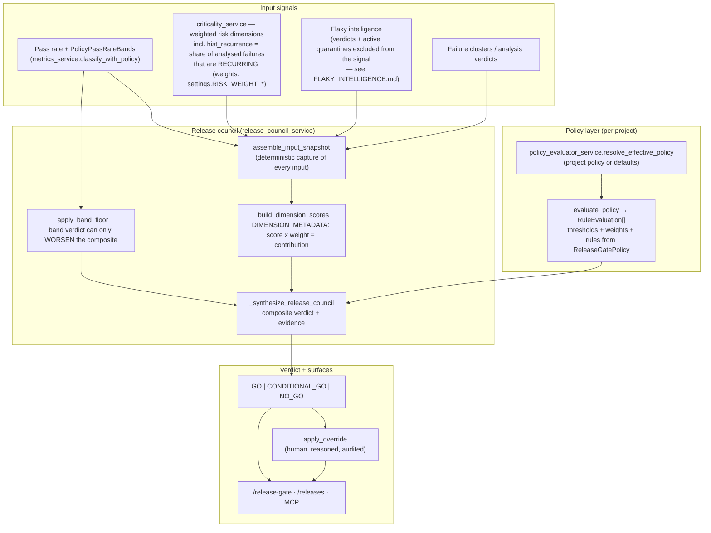

# Release Gate — decision architecture

> Companion to [README.md](./README.md). How a run (or release) becomes
> **GO / CONDITIONAL_GO / NO_GO**: the input signals, the policy layer, the
> release-council synthesis, and the human override path. Verified against the
> implementation 2026-07-02.

Two design principles run through this subsystem:

1. **Deterministic and auditable** — the council assembles an `input_snapshot`
   capturing *every* data source the decision depends on, so a verdict can be
   reproduced and explained after the fact.
2. **Fail-closed composition** — when independent signals disagree, the
   composition picks the *worse* verdict (`_worse_verdict`); a green signal can
   never soften a red one.

## 1. Decision flow

## 2. The policy layer

`services/policy_evaluator_service.py` evaluates a project's `ReleaseGatePolicy` (edited on `/policies`):

- `resolve_effective_policy` picks the project's active policy, falling back to defaults — pages and the evaluator always work against an *effective* policy, never a nullable one.
- `_extract_thresholds` / `_extract_weights` / `_extract_rules` read the policy's three configurable parts.
- `evaluate_policy` runs every rule into a `RuleEvaluation` and folds them into a `PolicyEvaluationResult` whose `recommendation` is `GO | CONDITIONAL_GO | NO_GO`. The folding is monotonic-downward: a hard violation forces `NO_GO`; a soft violation downgrades `GO → CONDITIONAL_GO`; nothing upgrades.

## 3. Risk dimensions and `hist_recurrence`

`services/criticality_service.py` scores weighted risk dimensions (weights from `settings.RISK_WEIGHT_*`). The one with history: **`hist_recurrence`** measures *real recurrence* — the share of analysed failures in the window that are recurring (`min(100, recurring/total_analysed × 80)`). It deliberately does **not** proxy recurrence from AI confidence scores (an earlier bug class): a model being confident about a failure says nothing about whether that failure keeps coming back.

Each dimension becomes a `DimensionScore {name, label, score, weight, contribution}` via `DIMENSION_METADATA`, so the UI can show exactly which dimension pushed the composite where.

## 4. Band floor — vocabulary and fail-closed rule

Pass-rate **bands** (`PolicyPassRateBands`, configured per project) classify the run's pass rate. Two subtleties the code guards, worth knowing when reading it:

- **Vocabulary mapping**: the band classifier emits `CONDITIONAL`, the gate vocabulary is `CONDITIONAL_GO` — `_normalize_verdict` maps between them. (Producer/consumer enum mismatches are a recurring bug class in this codebase; this is one of the guarded seams.)
- **Floor, not average**: `_apply_band_floor` lets the band only *worsen* the composite. A red band drags a green composite down; a green band never lifts a red composite (that would be fail-open).

## 5. The council synthesis and overrides

`services/release_council_service.py` is where it all converges:

- `assemble_input_snapshot(run_id)` captures every input the decision reads — pass rates, dimension scores, policy result, flaky/quarantine state — as one deterministic snapshot stored with the decision.
- `_synthesize_release_council` combines the policy recommendation, dimension scores, and band floor into the composite verdict with its evidence; `_worse_verdict` is the combining operator.
- `apply_override` is the human escape hatch: a permitted user can override the verdict **with a reason**, and the override is recorded alongside the original computed verdict — the gate never silently loses the machine's opinion.

Quarantined tests (see [FLAKY_INTELLIGENCE.md](./FLAKY_INTELLIGENCE.md)) are excluded from the failure signal while quarantine is active, which is the mechanism that stops known-flaky tests from permanently pinning a project at `NO_GO`.

## 6. Adjacent: the agent-stack gate

`services/eval_gate_service.py` is a *different* gate with the same shape: it evaluates whether the **AI agent stack itself** (models, prompt versions, datasets) is fit to release, via `build_agent_stack_gate_manifest` + checksummed manifests and per-gate results folded into an overall status. It shares the fail-closed philosophy but gates the AI layer, not your test run.

## 7. Where it surfaces

- **`/release-gate`** (and `/release-gate/:runId`) — the verdict, the dimension breakdown, the evidence, and the override control.
- **`/releases`** — gate status per tracked release.
- **`/policies`** — the editor for thresholds, weights, rules, and pass-rate bands.
- **MCP / REST** — the same verdict payloads, for CI pipelines that block on the gate.
