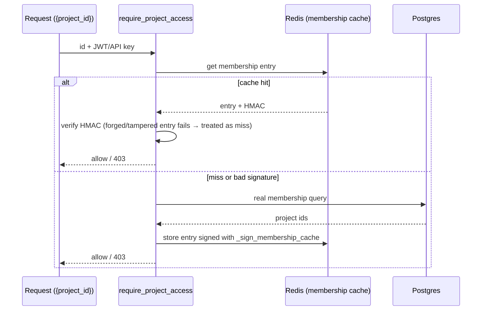

# Security & Tenancy — architecture

> Companion to [README.md](./README.md). How TestLookup authenticates,
> authorizes, isolates tenants, and fails closed — plus the guard rails that
> keep those properties from regressing. Verified against the implementation
> 2026-07-02.

## 1. Identity & tokens

- **JWT access + refresh** — the SPA holds a short-lived access token and
  refreshes it through a single-flight refresh flow (one refresh even when
  many requests 401 together). API clients use **API keys** (Bearer / 
  `X-API-Key`), created per user under Settings → API Keys; streaming SDKs use
  project-scoped keys plus per-session tokens.
- **Revocation** — `core/token_revocation.py`: token validation consults a
  revocation list in addition to signature/expiry, so logout and key
  revocation take effect immediately rather than at token expiry. The check
  **fails closed** — if the revocation store cannot be reached, the request is
  answered 503 rather than honoured unchecked (see §7 for the availability
  trade-off).
- **MFA (TOTP)** — *shipped 2026-08-05, migration 0117.* Previously this
  section said MFA had to come from an IdP; it no longer does. RFC 6238 TOTP
  with ±1 step of drift tolerance, ten single-use recovery codes (SHA-256
  digests only), and a workspace policy that can require a second factor for
  a role and everything above it. See §1a for the mechanism, which is the part
  most likely to be got wrong on a re-implementation.
- **Account lockout** — *shipped 2026-08-05.* N consecutive failed password
  **or** second-factor attempts lock the account for a cooldown. State lives on
  `users` (`failed_login_attempts`, `locked_until`), not in the rate limiter:
  `main.rate_limit_auth` keeps counters in worker memory and is a per-worker,
  per-IP ceiling, which cannot express "this account has failed N times across
  the fleet". Postgres can, is already read on the login path, survives a
  restart, and — unlike a Redis-backed counter — has no fail-open/fail-closed
  dilemma to resolve. It cannot throttle attempts against usernames that do
  not exist; that stays the IP limiter's job, and counting failures for
  non-existent accounts would be an enumeration oracle in its own right.

### 1a. Why the second factor is not a claim on an access token

`core/deps.get_current_user` trusts any JWT whose `type` claim is `"access"`,
and `bootstrap.register_routers` mounts that dependency router-wide. A
"half-authenticated" access token carrying an `mfa_pending` marker would
therefore be fully authenticated on every one of the ~300 existing handlers,
none of which know to look for the marker. There is no marker that would have
been safe.

Instead `core/security.create_mfa_token` mints tokens with their own `type`
claims — `mfa_challenge` (password accepted, second factor owed) and
`mfa_enroll` (password accepted, policy requires enrollment). `decode_token`
rejects a type mismatch **at the decode layer**, the same defence that already
separates access from refresh tokens, so presenting one as a bearer token
fails before any user is loaded. They are short-lived
(`MFA_CHALLENGE_TTL_SECONDS`, default 300 s) and single-use — consumption
reuses the existing `revoke_jti` denylist rather than introducing a second
store with its own availability semantics. `create_mfa_token` raises on any
attempt to mint one with type `access`.

Two more properties that are easy to lose:

- **Replay of a TOTP code inside its own validity window is rejected.**
  `users.mfa_last_used_step` records the highest accepted time-step and a code
  is honoured only when its step is strictly greater. Postgres again, for the
  same reason as lockout.
- **"Enrolled but the seed will not decrypt" denies, it does not pass.**
  The TOTP seed lives in `secret_refs` (scope `user_totp`) and
  `secret_service.read_secret` returns `None` both for "never stored" and for
  "stored but undecryptable" — so after an `APP_SECRET_KEY` rotation without
  `APP_SECRET_KEY_PREVIOUS`, every enrolled seed reads back as absent. Rounding
  that to "MFA is off" would silently disable the control workspace-wide at the
  worst possible moment. `mfa_service.load_totp_secret` distinguishes the two
  states and the login path answers **503** for the broken one.

**API keys are exempt by construction.** MFA is enforced where interactive
credentials are *minted* (`POST /auth/login`), not on every request, so a
CI-embedded key — which cannot type a code — keeps working when an admin turns
the policy on. `mfa_service.mfa_gate_applies` is written as
`credential_kind(user) == CREDENTIAL_KIND_JWT` so an unknown credential kind
falls out of the "interactive" bucket rather than being assumed to be one.
The corollary is stated in §7.

**SSO-managed accounts are exempt from the requirement.** `/api/v1/sso/acs`
does not consult the MFA policy at all: the IdP has already asserted the
identity and, per the customer's own policy, performed its own MFA. A local
second factor on top would mean every federated user holding a seed we control
and the IdP knows nothing about — a lockout risk for no added assurance. The
exemption is from the *requirement* only; an SSO-managed user who enrolls
voluntarily is still challenged on the local password path.
`mfa_service.is_sso_managed` checks two signals, because
`scim_service.scim_create_user` only creates the `federated_identities` link
`if sso_config_id and external_id` — a SCIM user provisioned without either
looks purely local. The unconditional `SCIM_USER_CREATED` identity event on
that same code path is the second signal.

**Breakglass is a script, not an endpoint.** `backend/scripts/mfa_breakglass.py`
clears MFA and lockout for one user. It is gated on `MFA_BREAKGLASS_ENABLED`
in the backend environment (mirroring `SSO_ADMIN_FALLBACK_ENABLED` — no in-app
toggle, so enabling it takes deployment-level access), requires a `--reason`,
and writes an `MFA_BREAKGLASS_RESET` identity event in the same transaction as
the reset. It is deliberately not an admin API: a user who can reset their own
second factor does not have one, and an endpoint that resets *another* user's
factor is an account-takeover primitive behind whatever the weakest admin
session is. Note that `IdentityEventType.ADMIN_FALLBACK_LOGIN` is **not** this
— that is the SSO fallback in `routers/auth.py` and says nothing about a second
factor.

## 2. Authorization — the guard family and the signed cache

Every router whose path carries a resource id (`{project_id}`, `{run_id}`,
`{release_id}`, …) depends on the matching `require_*_access` guard from
`core/deps.py`, and the guard **verifies the id that was provided** — not just
the None path. (The distinction is a recurring bug class: a guard that only
gates "no id supplied" leaves the direct-object reference wide open. The IDOR
sweeps hit exactly this on several routers; the convention plus its
architectural test now enforce the correct shape.)

Membership lookups are cached in Redis — and because an authorization cache is
itself an attack surface, entries are **HMAC-signed**:



A Redis compromise (or a bug writing to the wrong key) therefore cannot mint
authorization: an unsigned or mis-signed entry simply fails HMAC and falls
through to the database.


### The ratchet's blind spot — ids that don't arrive in the path

`tests/test_architectural_authorization.py` matches routers whose **path**
declares a resource id and requires the matching guard. An id that arrives as a
**query parameter** or a **request-body field** is therefore invisible to it —
the check simply never applies.

This is not hypothetical. Three separate endpoints shipped unguarded through
that gap and were fixed:

| endpoint | id source | what leaked |
|---|---|---|
| `GET /digests/preview` | query | another tenant's digest content — the access check ran **only when `project_id` was absent**, i.e. only when there was nothing to guard |
| `POST /digests/subscriptions` | body | a persistent daily email subscription bound to a project the caller can't see; the delivery task re-reads `project_id` off the row and never re-checks membership |
| `GET /audit-dashboard/events` | query | another project's audit trail; a member of one project fell through to a completely unscoped query |

**Grepping for the guard name does not close this.** In the digests case
`get_accessible_project_ids` *was* imported and called — inside the one branch
that could not leak. The call site looked correct in review and in a grep.

**What to do instead.** For any id that does not arrive in the path, call
`resolve_project_scope(db, user, requested_project_id)` explicitly: it raises
403 for a non-admin naming a project they are not a member of, returns the
membership set when none is named, and leaves ADMIN unrestricted. When writing
the id to a row that a background job will later act on, verify at **write**
time — the job will not.

> Verify with a **non-admin** account. ADMIN bypasses membership everywhere, so
> an admin-only probe cannot detect a tenancy bug. An account with *zero*
> memberships is also a poor probe: several endpoints short-circuit on the empty
> set, so "no access" and "broken scoping" look identical. Use an account that
> is a member of **exactly one** project.


## 3. Tenancy — project scoping as defence-in-depth

The project is the tenancy boundary, enforced at more than one layer:

- **Queries** — data access is project-scoped in SQL (and fingerprint lookups
  are scoped per project — a global fingerprint index would leak cross-tenant
  test existence).
- **Vector stores & caches** — ChromaDB collections are created per project;
  the semantic analysis cache is per-project too (see
  [AI_QUALITY.md](./AI_QUALITY.md)). Content-addressable caches being
  tenant-scoped is an explicit convention: same error text from two customers
  must not share a cache entry.
- **Rate limiting** — ingest budgets are charged per project, with the project
  resolved server-side (see [INGESTION_SCALE.md](./INGESTION_SCALE.md)).

## 4. Secure by default (deployment posture)

The naive path — `cp .env.example .env && docker compose up` — must not
produce an insecure install:

- `.env.example` ships `APP_ENV=production`, `DEV_AUTO_LOGIN_ENABLED=false`,
  `APP_DEBUG=false`. The compose files default the same way
  (`${APP_ENV:-production}`) as a second layer for partial `.env`s.
- **Startup fail-fast** — in production/staging, `Settings.
  critical_security_failures` (the CRITICAL subset of
  `validate_production_secrets()`) refuses to boot on default/guessable
  secrets. Dev is never blocked (the check emits nothing outside
  production/staging); `scripts/gen-dev-env.sh` / `make quickstart` generate
  random local secrets and re-enable dev conveniences deliberately.
- **Dev auto-login** is a 404 unless explicitly enabled — the endpoint that
  mints an admin JWT for local demos cannot exist in a default deployment.
- **Redis is authenticated** and the authz cache signed (above), closing the
  "internal service, no auth needed" gap.

## 5. Offline-first as a security property

`AI_OFFLINE_MODE` defaults to **True**, and every outbound integration
short-circuits on it *before* any feature-flag check. The consequence: a
default install provably sends nothing anywhere — no LLM API, no webhook, no
external fetch — regardless of how feature flags are set. New integrations are
required to join the existing offline gate list (with tests), not add their
own ad-hoc checks.

Notification channels are the one class judged by **residency** rather than
switched off: a Slack-compatible webhook or mail relay on the LAN still works
offline, a public one is refused, and `OFFLINE_NOTIFICATION_ALLOWED_HOSTS` is the
operator's explicit, per-host exception (re-audit H10). The integration-health
probes follow the gate of the integration they probe.

**Ceiling semantics (2026-08-03).** The environment variable is a *hard
ceiling*, not a default. AI settings are also stored in the database
(`app_settings.ai_config`), and the runtime resolver merges the two — but the
merge for this one field is deliberately not "DB wins":

```
effective_offline = settings.AI_OFFLINE_MODE  OR  db_override.ai_offline_mode
```

The stored override may only ever make the system **more** restrictive. When
the environment says offline, nothing reachable from the application — no API
call, no admin, no settings row — can re-enable outbound LLM egress; the only
lever is the environment itself, plus a restart. (Before this, LLM egress was
the one outbound path that honoured the DB override, so an ADMIN could turn
cloud API calls back on from `/settings/ai` while Jira, webhooks, GitHub,
GitLab, the Fixer and the Investigator all stayed blocked by the same env var.
The env var now means the same thing everywhere.)

Resolution is centralised in `services/ai_config_resolver.resolve_offline_mode`
so every consumer inherits it — `llm_factory.get_llm()`, the `/settings/ai`
read + write endpoints, and the `/settings/ai/model-status` probe that renders
the fallback chain. The resolver publishes **provenance** next to the flag
(`offline_mode_source`: `env` | `override` | `not_offline`, plus
`offline_mode_env_pinned`), and the AI settings page renders the toggle
**disabled with the reason and the remedy** when the environment pins it —
an ignored click is how an operator ends up believing egress is enabled when
it is not. A `PUT` that tries to disable offline mode while the environment
pins it is refused with **409**, not silently recorded.

For customer-supplied URLs that *are* fetched when integrations are enabled
(knowledge sources), fetching is restricted by a **domain allowlist**
(`_validate_url_domain`). Note its scope honestly: it constrains *which hosts*
may be fetched; combining it with network-level egress policy is the
recommended posture for hardened deployments.

## 6. Audit & data hygiene

- **Audit log** — security-relevant mutations (quarantine transitions, gate
  overrides, admin actions) flow through `audit_log_service` into
  append-oriented storage (PostgreSQL audit tables + immutable Mongo event
  streams), so "who did what" survives the UI.
- **PII redaction at boundaries** — a stated convention for anything leaving
  the system (exports, training corpora, LLM prompts): redact at the boundary,
  not at the source, so internal analysis keeps fidelity while exports stay
  clean.

## 7. Where these properties stop

Two boundaries are worth naming here, because every section above is
easier to over-read than to under-read:

- **Application-level encryption covers secrets, not bulk data.**
  `services/secret_service.py` (Fernet/MultiFernet derived from
  `APP_SECRET_KEY`, failing closed on a weak or empty key) protects
  integration credentials and provider API keys. Everything else — test
  data, failure text, analyses, reports, audit rows in
  PostgreSQL/MongoDB/MinIO — is written in the clear as far as the app is
  concerned. Encryption at rest is delegated to the storage/platform
  layer and the operator must configure it.
- **In-transit protection is inherited from the deployment target.** The
  app serves plain HTTP behind whatever ingress fronts it; the OpenShift
  overlay terminates TLS at the Route (see
  [DEPLOYMENT.md](./DEPLOYMENT.md)). There is no in-cluster mTLS between
  the backend, the workers, and the datastores.

Similarly, the audit tables in §6 are append-only **by application
convention** — no triggers, restricted grants, or WORM storage prevent
direct modification — and an enabled retention policy deliberately
deletes project-scoped audit rows past the audit clock.

MFA and lockout (§1, §1a) have their own boundaries, and they are the ones
an auditor will ask about:

- **An API key is a single-factor credential that bypasses MFA, permanently.**
  This is not an oversight — a CI pipeline cannot present a TOTP code — but it
  does mean a user subject to the policy can create a key and use it as a
  second way in. Treat key issuance as the sensitive operation it is: keys are
  per-user, listed under Settings → API Keys, revocable, and can be pinned to
  one project. There is currently no policy switch to forbid key creation for
  MFA-required roles.
- **Sessions minted before the policy changed are not retroactively
  challenged.** Turning the requirement on is enforced at `/auth/login` and,
  since 0117, re-evaluated on every `/auth/refresh` — so a live session is
  bounced to enrollment within one access-token lifetime rather than one
  refresh-token lifetime (7 days). It is not enforced per request.
- **Lockout is per account, not per source.** An attacker who knows a username
  can lock its owner out for the cooldown by failing enough times. The window
  is bounded (default 15 minutes), failures while already locked do not extend
  it, and `scripts/mfa_breakglass.py` clears it — but the denial-of-service is
  real and inherent to lockout. Set `lockout_enabled: false` if that trade is
  wrong for your deployment.
- **The lockout response leaks account existence.** A locked account answers
  429 rather than the generic 401. The lock is checked *after* password
  verification, so only someone who already typed the correct password sees
  it, and the pre-existing `403 Account disabled` branch leaks the same class
  of fact. The alternative — a generic 401 — leaves a locked-out user retrying
  forever with no idea why.
- **`identity_events` still has no retention clock.** MFA verification
  failures and lockouts write rows there, so a sustained credential-stuffing
  campaign grows that table without bound (the US-11.4 purge does not touch
  it — the table has no project scope). This is why there is deliberately *no*
  per-attempt `LOGIN_FAILED` event: the MFA events that exist are either
  operator-initiated or bounded by the lockout threshold. Prune out-of-band if
  volume becomes a problem.
- **Recovery codes are 80-bit values protected by a plain SHA-256 digest**,
  not a password KDF. That is adequate because there is nothing to
  brute-force at that entropy — the same reasoning as `ApiKey.key_hash` — but
  it is a deliberate choice, not an omission.

Access-token revocation (§1) **fails closed** as of 2026-08-03: when the
revocation store (Redis) cannot be consulted, `get_current_user` answers
**503**, not 401 — the honest signal is "revocation cannot be verified
right now", and 401 would send the SPA into a re-login loop that cannot
succeed.

> **Correction (2026-08-05): between 2026-08-03 and 2026-08-05 that 503
> did not reach clients.** `get_current_user` raised it correctly, but the
> shared dual-auth dependency it is called from
> (`get_current_user_or_api_key` / `get_api_key_context`, injected
> router-wide by `bootstrap.register_routers`) caught **every**
> `HTTPException` from the bearer path in order to fall through to the
> `X-API-Key` path, and ended at a generic 401 "Authentication required".
> Since no route depends on `get_current_user` directly, the documented
> behaviour was unobservable: a Redis outage arrived at the SPA as
> 401-everywhere and produced exactly the re-login loop described above.
> **As of 2026-08-05 only a 401 from the bearer path falls through to the
> API key**; every other status — 503 today, any future 429/5xx —
> propagates unchanged, `Retry-After` header included. The paragraph below
> now describes what clients actually receive.

Two consequences worth stating plainly:

- **A Redis outage is an authentication outage.** `/auth/login` and
  `/auth/refresh` are Postgres-only and keep working — they will happily
  mint tokens — but every request carrying one gets 503 until Redis
  returns. Recovery is to restore Redis. An operator who consciously
  accepts unenforced revocation can set `AUTH_REVOCATION_FAIL_OPEN=true`
  and restart; it is environment-only (no in-app toggle), defaults to
  false, and logs an ERROR on every use.
- **The write path is still best-effort.** `revoke_jti` /
  `revoke_all_user_tokens` cannot record anything while Redis is down, so
  a logout or password change issued *during* an outage is not persisted
  and that token becomes usable again once Redis recovers. They log at
  ERROR with a metric rather than raising, because `/auth/logout` and
  `/auth/change-password` must still commit their Postgres work
  (refresh-family revocation, which is durable). Refresh-token
  revocation therefore remains the durable half of the mechanism; the
  access-token half is bounded by `JWT_ACCESS_TOKEN_EXPIRE_MINUTES`.

## 8. Mapping these properties to control families

For the auditor-facing view — which of these properties supports which
SOC 2 / GDPR / HIPAA control family, with the concrete surface to point
at and the limitation on each — see
[user-guide/compliance.md → Control-family mapping](../user-guide/compliance.md#control-family-mapping).
It is framed as **enablement, not certification**, and it carries an
explicit
["what TestLookup does NOT provide"](../user-guide/compliance.md#what-testlookup-does-not-provide)
section plus an evidence-gathering quickstart. Content is not duplicated:
this document explains how the properties work, that one says which
control question each answers.

## 9. What enforces all this

These properties are guarded, not aspirational: the quality-gate suite
(`scripts/quality_gate.py`) and architectural tests ratchet the conventions —
authorization guards on id-bearing routers, transaction boundaries, the
offline-gate list, tenant scoping patterns — so a PR that violates one fails
CI rather than relying on review memory. See
[DEVELOPER_GUIDE.md](./DEVELOPER_GUIDE.md) for the full gate list.
