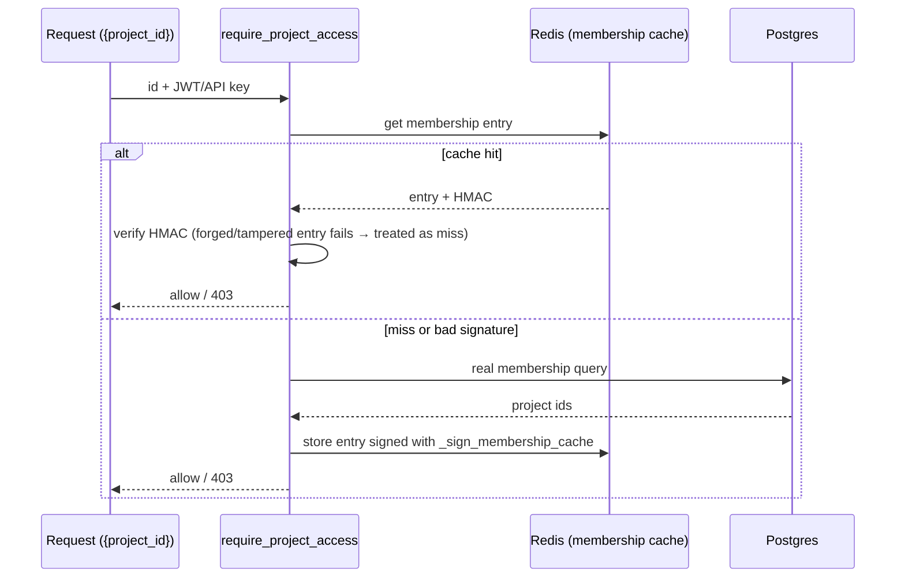

# Security & Tenancy — architecture

> Companion to [README.md](./README.md). How TestLookup authenticates,
> authorizes, isolates tenants, and fails closed — plus the guard rails that
> keep those properties from regressing. Verified against the implementation
> 2026-07-02.

## 1. Identity & tokens

- **JWT access + refresh** — the SPA holds a short-lived access token and
  refreshes it through a single-flight refresh flow (one refresh even when
  many requests 401 together). API clients use **API keys** (Bearer / 
  `X-API-Key`), created per user under Settings → API Keys; streaming SDKs use
  project-scoped keys plus per-session tokens.
- **Revocation** — `core/token_revocation.py`: token validation consults a
  revocation list in addition to signature/expiry, so logout and key
  revocation take effect immediately rather than at token expiry.

## 2. Authorization — the guard family and the signed cache

Every router whose path carries a resource id (`{project_id}`, `{run_id}`,
`{release_id}`, …) depends on the matching `require_*_access` guard from
`core/deps.py`, and the guard **verifies the id that was provided** — not just
the None path. (The distinction is a recurring bug class: a guard that only
gates "no id supplied" leaves the direct-object reference wide open. The IDOR
sweeps hit exactly this on several routers; the convention plus its
architectural test now enforce the correct shape.)

Membership lookups are cached in Redis — and because an authorization cache is
itself an attack surface, entries are **HMAC-signed**:

A Redis compromise (or a bug writing to the wrong key) therefore cannot mint
authorization: an unsigned or mis-signed entry simply fails HMAC and falls
through to the database.

## 3. Tenancy — project scoping as defence-in-depth

The project is the tenancy boundary, enforced at more than one layer:

- **Queries** — data access is project-scoped in SQL (and fingerprint lookups
  are scoped per project — a global fingerprint index would leak cross-tenant
  test existence).
- **Vector stores & caches** — ChromaDB collections are created per project;
  the semantic analysis cache is per-project too (see
  [AI_QUALITY.md](./AI_QUALITY.md)). Content-addressable caches being
  tenant-scoped is an explicit convention: same error text from two customers
  must not share a cache entry.
- **Rate limiting** — ingest budgets are charged per project, with the project
  resolved server-side (see [INGESTION_SCALE.md](./INGESTION_SCALE.md)).

## 4. Secure by default (deployment posture)

The naive path — `cp .env.example .env && docker compose up` — must not
produce an insecure install:

- `.env.example` ships `APP_ENV=production`, `DEV_AUTO_LOGIN_ENABLED=false`,
  `APP_DEBUG=false`. The compose files default the same way
  (`${APP_ENV:-production}`) as a second layer for partial `.env`s.
- **Startup fail-fast** — in production/staging, `Settings.
  critical_security_failures` (the CRITICAL subset of
  `validate_production_secrets()`) refuses to boot on default/guessable
  secrets. Dev is never blocked (the check emits nothing outside
  production/staging); `scripts/gen-dev-env.sh` / `make quickstart` generate
  random local secrets and re-enable dev conveniences deliberately.
- **Dev auto-login** is a 404 unless explicitly enabled — the endpoint that
  mints an admin JWT for local demos cannot exist in a default deployment.
- **Redis is authenticated** and the authz cache signed (above), closing the
  "internal service, no auth needed" gap.

## 5. Offline-first as a security property

`AI_OFFLINE_MODE` defaults to **True**, and every outbound integration
short-circuits on it *before* any feature-flag check. The consequence: a
default install provably sends nothing anywhere — no LLM API, no webhook, no
external fetch — regardless of how feature flags are set. New integrations are
required to join the existing offline gate list (with tests), not add their
own ad-hoc checks.

For customer-supplied URLs that *are* fetched when integrations are enabled
(knowledge sources), fetching is restricted by a **domain allowlist**
(`_validate_url_domain`). Note its scope honestly: it constrains *which hosts*
may be fetched; combining it with network-level egress policy is the
recommended posture for hardened deployments.

## 6. Audit & data hygiene

- **Audit log** — security-relevant mutations (quarantine transitions, gate
  overrides, admin actions) flow through `audit_log_service` into
  append-oriented storage (PostgreSQL audit tables + immutable Mongo event
  streams), so "who did what" survives the UI.
- **PII redaction at boundaries** — a stated convention for anything leaving
  the system (exports, training corpora, LLM prompts): redact at the boundary,
  not at the source, so internal analysis keeps fidelity while exports stay
  clean.

## 7. Where these properties stop

Two boundaries are worth naming here, because every section above is
easier to over-read than to under-read:

- **Application-level encryption covers secrets, not bulk data.**
  `services/secret_service.py` (Fernet/MultiFernet derived from
  `APP_SECRET_KEY`, failing closed on a weak or empty key) protects
  integration credentials and provider API keys. Everything else — test
  data, failure text, analyses, reports, audit rows in
  PostgreSQL/MongoDB/MinIO — is written in the clear as far as the app is
  concerned. Encryption at rest is delegated to the storage/platform
  layer and the operator must configure it.
- **In-transit protection is inherited from the deployment target.** The
  app serves plain HTTP behind whatever ingress fronts it; the OpenShift
  overlay terminates TLS at the Route (see
  [DEPLOYMENT.md](./DEPLOYMENT.md)). There is no in-cluster mTLS between
  the backend, the workers, and the datastores.

Similarly, the audit tables in §6 are append-only **by application
convention** — no triggers, restricted grants, or WORM storage prevent
direct modification — and an enabled retention policy deliberately
deletes project-scoped audit rows past the audit clock. Access-token
revocation (§1) **fails open** on a Redis outage rather than denying
every request.

## 8. Mapping these properties to control families

For the auditor-facing view — which of these properties supports which
SOC 2 / GDPR / HIPAA control family, with the concrete surface to point
at and the limitation on each — see
[user-guide/compliance.md → Control-family mapping](../user-guide/compliance.md#control-family-mapping).
It is framed as **enablement, not certification**, and it carries an
explicit
["what TestLookup does NOT provide"](../user-guide/compliance.md#what-testlookup-does-not-provide)
section plus an evidence-gathering quickstart. Content is not duplicated:
this document explains how the properties work, that one says which
control question each answers.

## 9. What enforces all this

These properties are guarded, not aspirational: the quality-gate suite
(`scripts/quality_gate.py`) and architectural tests ratchet the conventions —
authorization guards on id-bearing routers, transaction boundaries, the
offline-gate list, tenant scoping patterns — so a PR that violates one fails
CI rather than relying on review memory. See
[DEVELOPER_GUIDE.md](./DEVELOPER_GUIDE.md) for the full gate list.
