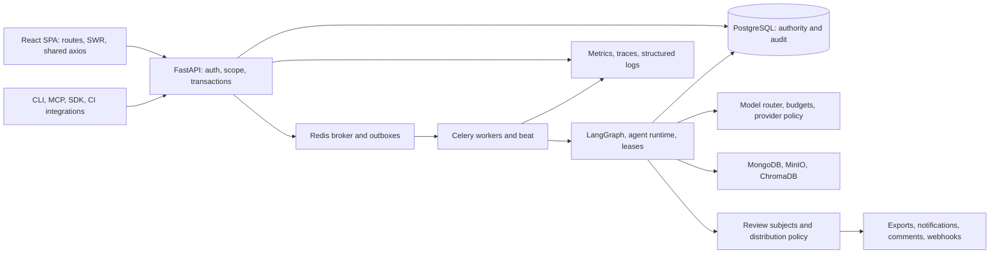

# Execution Package for GPT‑5.6 Sol
**Prepared:** 2026-09-16. **Mode:** planning only; no tests, fixes, deployments,
external delivery, or merge performed while preparing this package.
**Inspected base:** local `main` and cached `origin/main` both at
`34110eace555423a4326b15e3ba502ac3ac2e4d4` (PR #119). Remote freshness must be
checked at execution. **Single branch:** `codex/exploratory-quality-release`.
The planning documents are initially uncommitted on that branch.

## Start here

Read these four documents in order. They are one execution contract:

1. This file: architecture, coverage, risks, sequencing, agent assignments,
   invariants, and completion rules.
2. [Mission catalogue](EXPLORATORY_MISSIONS.md): M01–M26, including positive,
   negative, boundary, race, outage, persona, and operational missions.
3. [Execution runbook](EXPLORATORY_RUNBOOK.md): commands, defect/fix/review
   workflow, homelab deployment, rollback, and one-PR merge procedure.
4. [Evidence templates](EXPLORATORY_EVIDENCE_TEMPLATES.md): environment,
   mission, defect, review, deployment, and release records to instantiate.

The objective is defensible release confidence, with every discovered defect
fixed and protected by **both a unit test and a deployed end-to-end regression**.
No finite exploratory programme can prove that all unknown defects have been
found. Report examined scope and residual risk, not an assertion of zero
unknown defects. A skipped mission or unavailable provider is not a pass.

The latest request supersedes the earlier per-story PR loop: use one branch,
one PR, and one merge for this programme. Keep logical local commits per
reviewed defect. Do not reopen completed T2/T4 or other shipped stories as
new implementation work. Do not schedule background execution from this
planning handoff. If execution spans sessions, resume from the evidence ledger.
The earlier 20-minute break applies after the final merge, if additional work
is subsequently requested; there are no intermediate merges here.

## 1. Knowledge map

### Architecture and observable boundaries

Code is the behavioral authority. Start with `backend/app/bootstrap.py`,
`backend/app/routers/`, `backend/app/core/deps.py`, `models/postgres.py`,
`models/enums.py`, and `frontend/src/App.tsx` and its imported route lists.
The diagram describes logical boundaries, not a promise that every path uses
every store. Trace each mission through the actual handler and consumers.

| Feature / user outcome | Owning code or repository surface | Critical behavior | Missions |
|---|---|---|---|
| Authentication, users, roles, SSO/MFA/SCIM | auth/SSO/SCIM routers, `core/deps.py`, shared frontend auth/API services | Authentication and project membership remain authoritative on every request | M01, M02, M20 |
| Projects, run lists, dashboards, saved views | projects/runs routers, SWR hooks, project selector | Scope changes invalidate visible data; URL, cache and filters agree | M02, M17, M19 |
| Uploaded and streamed test evidence | ingest routers, `ingestion_pipeline.py`, live stream services, outboxes | Durable acceptance, honest counts, deduplication and downstream processing | M03, M04, M14, M23 |
| Run intelligence, clusters, evidence, triage | run-intelligence router, agents, evidence/snapshot services | Explanations link to the correct immutable evidence and project | M04, M09, M10 |
| Local defects and external Jira issues | defect promotion/Jira services, idempotency ledger | Release attribution and no duplicate external side effects | M05, M06 |
| Releases, gates, policies and outcomes | release-readiness routes, policy evaluator, release outcome service | Reproducible decision, auditable override, review-aware consumption | M06, M07 |
| Human reviews and report distribution | `review_request_service.py`, `report_distribution_policy.py`, report/notification consumers | Exact subject, separation of duties, no unintended unreviewed distribution | M07, M08 |
| Agent configs, invoke, tools, budget and models | config resolver/service, invoke router, capability registry, `model_router.py` | Tighten-only authority, offline ceiling, bounded spend and execution | M11, M12, M25 |
| Custom workflows, reviewer and evaluations | workflows router/compiler, reviewer, eval services | Published authority immutable, eval evidence trustworthy | M13, M25 |
| Lease recovery, cancellation, DLQ and observability | state machine, pipeline lease/retry services, worker tasks, alerts | Old workers cannot write; recovery terminates honestly and is observable | M14, M15 |
| Test management, suites, plans, quarantine, ownership | test-management routers/services, lifecycle service, frontend pages | Valid role/reason transitions, history, release/quarantine effects | M16 |
| Search, RAG, knowledge, conversational assistance | search/RAG/knowledge services, relevant UI drawers/pages | Scope, citations, safe rendering and explicit degraded behavior | M09, M10 |
| Settings, connectors, notifications, digests | integrations/settings routers, notification workers, digest services | Persisted configuration, masked secrets, accurate delivered content | M08, M18 |
| Retention, deletion, export, API keys and audit | retention/deletion services, key routers, activity ledger | Protected data survives; revoked authority ends; sensitive changes auditable | M20, M21 |
| SDK, CLI, MCP, deployment and upgrade | `client/`, `cli/`, `mcp/`, `homelabsetup/`, `k8s/` | Public contract parity and verified serving image/schema | M22, M26 |

**Inventory reconciliation:** before exploration, enumerate all registered UI
routes, mounted API routers, CLI commands and MCP tools. Assign each to one of
these missions in the ledger. If a feature is absent from this table, append
a bounded charter under the nearest mission and execute it. No silent scope
omission; inspect feature flags and hidden/role-restricted routes as well.

### Registered UI route map at the inspected base

These routes come from `frontend/src/App.tsx`, including its `appRoutes` and
`managementRoutes` arrays. Leading `/` is normalized here. Every route also
inherits M02 scope, M19 usability and its appropriate role-negative checks.
Management routes are UI-gated to QA Lead/admin; the backend must independently
enforce the actual operation's role. A route declaration is not test coverage.

| Registered paths | Primary mission |
|---|---|
| `/login`, `/reset-password`, `/getting-started`, `/settings/profile` | M01; recovery/MFA in M20 |
| `/docs`, `/docs/:docId` | M19 links/search/navigation; M22 documented API/client examples |
| `/overview`, `/value-metrics`, `/coverage`, `/coverage/suite`, `/trends` | M17 |
| `/intelligence`, `/runs`, `/runs/:runId`, `/runs/:runId/intelligence`, `/runs/:runId/tests/:testId`, `/failures`, `/my-failures` | M03–M04, M09 |
| `/runs/compare`, `/deep-investigate`, `/deep-investigate/:runId` | M04/M10; review distribution in M07–M08 |
| `/suites`, `/suites/:suiteId`, `/canonical-test-cases/:canonicalId`, `/test-management`, `/flaky-coach`, `/quarantine`, `/ownership` | M16 |
| `/defects` | M05 |
| `/search` | M09 |
| `/chat` | M10 |
| `/agents`, `/agents/run/:runId`, `/settings/ai-agents`, `/settings/agent-activity` | M11–M12, M14–M15 |
| `/agents/workflows` | M13 |
| `/release-gate`, `/release-gate/:runId`, `/releases`, `/policies`, `/policies/:policyId` | M06 (include `policyId=new`) |
| `/reviews`, `/reports/summary` | M07–M08 |
| `/live` | M23 |
| `/projects` | M02/M19; synthetic project setup |
| `/activity`, `/settings/audit` | M15/M20/M21 audit reconciliation |
| `/users`, `/settings/sso`, `/settings/mfa-policy`, `/settings/api-keys` | M20 |
| `/settings`, `/settings/notifications`, `/settings/integrations`, `/settings/digests`, `/settings/integration-health`, `/settings/github`, `/settings/gitlab`, `/settings/webhooks` | M18/M08 |
| `/settings/ai`, `/settings/ai-eval` | M25/M11 |
| `/settings/storage`, `/settings/project-data`, `/settings/retention` | M21 |
| `/settings/performance` | M24/M17 |
| `/settings/seed-data`, `/settings/feature-flags` | M18; synthetic fixtures/isolated feature variants only |
| `/settings/billing` | M17 cost/usage display and M18 supported settings; no real purchase |

Test unknown paths and `/` redirect to `/overview` in M19. Single-project
requirements come from `frontend/src/config/routeScope.ts`; all-project mode
may correctly show a project picker, rather than being an application failure.
For each parameterized path exercise valid, missing/deleted and foreign IDs.
Known follow-ups such as comparison narratives without a canonical review
subject require explicit gap classification; do not assume all route families
already have the same review contract.

### Behavior and risk map

| Risk | Required oracle and invariant | Priority |
|---|---|---|
| Tenant disclosure or privilege escalation | Project B's identifiers, counts, exports, search results and cached rows never appear to A-only actor; validate server refusal, not just hidden buttons | P0 |
| Review bypass / unsafe action | Current proposing-agent mode must permit `act` AND the exact proposing subject must have accepted review; JWT reviewer restrictions persist | P0 |
| Dropped evidence / double side effect | Accepted upload/stream events reconcile to durable records; retried operation creates at most one logical effect | P0 |
| Incorrect release GO | Defect release lineage, evidence freshness, policies, review gate and override history agree | P0 |
| Stale writer / false success | Fence blocks stale attempt; public `completed` means output ready, not necessarily human accepted | P0 |
| Secret disclosure / egress | No provider credentials in configs, logs, artifacts or client response; local mode cannot be loosened | P0 |
| Destructive retention or migration | Protected subject/evidence survives; scoped deletion reconciles stores; restore proof precedes destructive exercise | P0 |
| Unusable recovery after VPN change | Explicit failure/retry, retained correct-scope data, bounded polling and no duplicate submission | P1 |
| Incorrect analytics / lifecycle / search | Exact fixture counts, boundary semantics, persistence across reload and correct audit trail | P1 |
| Inaccessible or misleading UI | Keyboard completion, focus recovery, labels, readable errors, truthful AI suggestions and empty states | P1 |
| Latency, queue growth, model degradation | Recorded environment-specific baselines and budgets, bounded load, recovery and alert clearing | P1 |

Priority orders work; it does not excuse leaving a confirmed lower-severity
defect unfixed. If fixing conflicts with an invariant or needs a new product
decision, stop that dependent path, report the decision, and continue safe
independent missions. The release remains incomplete.

### Existing evidence versus remaining proof

These are repository and prior-record observations, not new test results.
Refresh measurements during execution and retain the source SHA of each run.

| Layer | Existing evidence at inspected base | What it does not establish |
|---|---|---|
| Backend | Unit/regression suites; CI `--cov-fail-under=74`; distinct real PostgreSQL/Mongo/Redis integration lane | Browser-to-worker full-stack behavior or third-party delivery |
| Frontend unit | Prior recorded 235 files / 1,769 tests; 62.22% statements, 57.05% branches, 54.38% functions, 63.77% lines | Live auth, database authority, real sockets or provider correctness |
| Frontend floors | `vitest.config.ts`: statements 60, branches 55, functions 51, lines 61 | No coverage percentage proves business correctness |
| Browser blocking lane | `frontend/tests/ci-e2e/`: auth/deep links, review decisions/roles, keyboard shell/project dialog, project-switch outage | HTTP is controlled; these are browser contract regressions, not deployed system E2E |
| Browser live lane | `frontend/tests/e2e/`, Chromium/Firefox/WebKit config, real-login global setup | Some specs import mock helpers or conditionally skip; audit every test before counting it as live proof |
| Cross-service business integration | `test_ingest_intelligence_defect_release_postgres.py` carries a shared release ID through the service path | Still uses controlled dependencies and does not prove actual Redis delivery and full UI journey |
| Investigator review | Canonical subject, trigger attribution and distribution tests shipped in PR #119 | Actual email/webhook/comment deliveries and post-accept replay need live capture |
| MCP / CLI | Separate measured floors 41 / 62; prior recorded 41.96% / 63.16%; SDK invocation separate | Deployed authentication, tool discovery and scoped use with real backend |
| Architecture | 43 documented quality guards; current mypy file baseline supersedes the historical 373 count | Passing source checks does not replace functional assertions |
| Earlier live work | T22 recorded Podman lite live verification on 2026-09-15 | It is historical and not evidence for the next homelab build; paired local SLM/LLM inference remains open |

Use `CODE_COVERAGE_EXPANSION.md` for dated measurements; prioritize its remaining
Test Management lifecycle, notification delivery, release UI, RAG, integration,
analytics and digest targets. Do not inflate coverage with assertion-free
rendering or mocks that return the expected result without testing behavior.

### Documentation discrepancies

The former gap report and behavior matrix still described Investigator subjects
and package floors as missing. This package corrects those statements and the
roadmap's service-fixture status. Historical handover inventory and architecture
§0 also mix pre-implementation language with later shipped notes. Their new
status notices distinguish historical design from current code. The homelab
overview's Redis “in-mem” label is stale: its manifest enables AOF and a PVC;
the overview is corrected. None of these corrections claims a fresh live pass.

## 2. Exploration strategy

Use 60–90 minute sessions: 10 minutes preparation, 40–60 minutes investigation,
10–20 minutes evidence and debrief. Stop a session at its timebox, record the
next hypothesis, and continue in another session if required. Timeboxes are
planning units, not permission to silently drop incomplete scope.

For every mission apply:

- **Structure, function, data, platform, operations, time (SFDPOT)**; add a
  dedicated **interface** axis (often written SFDIPOT): browser/API/worker/store
  boundaries, version mismatches, errors, and externally delivered payloads.
- **HICCUPPS consistency oracles:** history, product image, comparable products,
  claims, user expectations, product consistency, purpose and standards. Code
  and explicit requirements decide contracts; competitor behavior is a prompt
  to investigate, not authority to redesign TestLookup.
- **RCRCRC regression selection:** recent changes, core functions, risky areas,
  configuration-sensitive behavior, repaired defects and chronic failures.
  Tag each defect with the applicable axes and select neighboring retests.
- **Data tour:** missing/null/empty, zero/one/many, `limit-1/limit/limit+1`,
  duplicate/out-of-order, long text, Unicode/RTL, malformed input and dates.
  Read actual schema limits first; do not invent accepted maxima.
- **Scenario/state tour:** new user → ingest → triage → defect → release;
  cancel/back/reload/retry at every intermediate state; role changes and races.
- **Interface/error tour:** browser, REST, CLI, MCP, sockets, queues, reports,
  webhooks; distinguish rejection, ambiguity, degraded output and success.
- **Operations/time tour:** deployment during session, network loss, deadlines,
  timezone/DST, recovery, backups and alert firing/clearing.

Personas are separate actual accounts: instance admin/operator; project QA Lead
producer; different QA Lead reviewer; QA Engineer; viewer; A-only nonmember of
B; unauthenticated visitor; keyboard-only user. API-key and MCP principals are
separate credentials. Do not substitute an admin account for role testing.

Pairwise combinations follow single-axis checks: project switch + timeout;
review accept + stale tab; upload retry + worker restart; revoke key + in-flight
request; provider loss + budget exhaustion; deploy + cached frontend assets.
Every pair needs a recorded expected invariant before fault injection.

## 3. Execution sequence and dependencies

| Phase | Work and exit condition |
|---|---|
| A — Orient | Read handover, architecture §§0/4/5/7/8/12, Developer Guide §1; inspect latest origin/main and open PRs; preserve local planning edits; inventory routes and required tools. Record base/candidate/environment manifests. |
| B — Establish baseline | Execute Appendix B and current CI-equivalent local checks on clean origin/main. If main is red, stop new fix work and report it as required by the owner. Do not waive a red baseline. Missing infrastructure is BLOCKED, not product failure or pass. |
| C — Prepare live data | Discover actual homelab context/URL, verify image/schema, create namespaced synthetic projects and accounts, capture rollback evidence, configure delivery sinks; do not reset existing user data. |
| D — First exploration | M01–M08 and M11–M12 first; then M09–M10, M13, M16–M22. Start with current stable deployment and record its actual image SHA, even if different from local main. Findings must reproduce against the relevant candidate before coding. |
| E — Operational exploration | M14–M15, M23–M25 in disposable infrastructure or a proven dedicated homelab test stack. M26 supplies deployment and rollback rehearsal. Shared namespace chaos is blocked until isolation/maintenance scope is established. |
| F — Fix loop | For each confirmed defect: capture → reproduce → unit + real E2E fail → minimal fix → both pass → mutation → independent review → commit on the single branch. Re-enter the affected mission and adjacent risk pairs. |
| G — Candidate verification | Freeze code; full local regression, full live mission matrix and all new E2E; homelab deploy candidate through M26; re-explore repaired and adjacent paths. Any defect returns to F. |
| H — One publication | Publish one PR only after local/homelab gates. Resolve CI/Codacy findings on the same branch. Require green checks for the latest head. Merge main into branch if it advances; retest affected areas and candidate. Merge once. |
| I — Close | Verify merged tree/image relationship, main CI and post-merge homelab smoke; final release record lists evidence, defects, deviations and residual risks. Stop; no perpetual discovery loop. |

Do not bulk-run legacy live suites before identifying destructive tests, fixture
ownership, skipped paths and mocking. Dry selection/read-only inventory first,
then execute reviewed test groups against synthetic projects.

### Bounded autonomous iteration

Continue while there are confirmed defects, unexecuted applicable missions,
missing unit/E2E pairs, failed gates or unresolved regressions. At each session
boundary persist the ledger and next exact command/hypothesis. No repeated
unchanged CI polling, no new PR per defect, no unbounded random fuzzing.

Completion requires all applicable missions and boundary/race matrices executed;
all discovered defects fixed with the required proof; independent reviews
resolved; candidate homelab evidence; latest-head CI green; one merged PR and
post-merge verification. Run two clean focused retest passes for repaired
critical paths after the last fix. If a dependency prevents completion, report
partial progress explicitly and keep the release blocked rather than claiming
completion or automatically waiving a mission.

## 4. Specialized agent assignments

Sol is the coordinator and only committer, branch manager, deployer and PR
owner. Use specialized child agents as requested, not separate user tasks or
feature branches. With four total agent slots, keep at most three children.
Shared files require exclusive ownership; agents never switch branch or commit.

| Agent | Bounded responsibility | Required return |
|---|---|---|
| Security/authority QA | M01–M02, M07–M08, M11–M12, M20–M21 | Mission records with actor/project negatives; reproducible defects; no fixes |
| Product/accessibility QA | M03–M06, M09–M10, M16–M19, M22 | UI/API outcomes, screenshots/traces, boundary and browser matrix |
| Reliability/eval QA | M13–M15, M23–M26 | Controlled fault/recovery evidence, telemetry, exact model/image/data provenance |
| Bug-Fix Developer | One assigned defect and its owned files; rotate a QA slot when needed | Minimal patch, added unit and E2E, failure-before/pass-after evidence, mutation results, impact analysis |
| Code Reviewer | Read-only review of each uncommitted fix and both tests; not its author | File and integration findings, severity, test adequacy, APPROVE or CHANGES_REQUIRED |

Two agents must not inject faults or mutate the same project simultaneously.
Serialize global settings, migrations and homelab deployment. QA may run
independent read-only missions concurrently with Sol's local evidence work.
Defect fixes and reviews operate one at a time. Reuse idle agents; spawning is
not a reason to duplicate suites, PRs or expensive model evaluations.

**QA assignment template:** “Execute Mxx using the common protocol and its
preconditions. Own project/fixture IDs […]. Record actual image SHA and actor.
Do not change application code, branch, shared settings or unrelated data.
Return PASS/FAIL/BLOCKED, evidence paths, tested variants and defect records.”

**Developer assignment template:** “Fix EXP-BUG-nnn on the existing branch in
files […]. Add a unit test and a real end-to-end test that fail on the old
behavior; retain that proof. Preserve all package invariants. Prove mutation
applied and was killed. Do not commit/push. Return patch, commands, results,
scope and risks for independent reviewer.”

**Reviewer assignment template:** “Review EXP-BUG-nnn before commit. First
inspect each changed file, then callers/contracts/auth/transactions/migrations/
workers/UI/evidence across files. Challenge both tests: would they fail if the
bug returned? Verify deployed E2E is not mocked. Return actionable findings
and verdict against the exact diff; any later change invalidates approval of
the changed portion. Do not edit or commit.”

## 5. Non-negotiable constraints

- Preserve `workflow_run_state.TRANSITIONS`, public status vocabulary and the
  single status/mode writers (`workflow_run_state.py`, `agent_config_service.py`).
- Preserve fencing, offline ceiling and provider checks, tighten-only config,
  `extra="forbid"`, no stored endpoint/API key fields, `CapabilitySpecV1` fields,
  and pinned wire shapes (additive only).
- Review accept/reject stays JWT-only; no MCP mutation tool. D1 (migrate both
  legacy policies) and D3 (Investigator review subject) are already shipped.
  D2 selected a user-configured release date, but current code has only the
  boolean `REVIEW_GATE_ENFORCED` switch: date-driven activation is not yet
  implemented. Do not turn on shared enforcement as a deployment side effect.
  Exercise both modes only in isolated test scope and report the scheduling
  implementation as a product gap until it ships.
- Preserve legitimate draft exceptions: authorized project or interactive
  draft policy must watermark and audit; rejected/superseded output cannot use
  a draft exception when enforcement is on. Do not replace this with a blanket
  “all pending exports always fail” test.
- Test only existing retention protections (release linkage, published reports,
  compliance/evidence authority). Legal holds have no current table/service and
  remain a product gap; do not present them as a failed live feature.
- Never modify historical migrations. New migration needs one head, real
  downgrade, and concurrent indexes on existing tables in `autocommit_block()`
  with `if_not_exists`. Migration rollback is tested on disposable data first.
- Never lower coverage floors or refresh all guard baselines; use `--only`
  for a justified individual guard adjustment. No disabling CI/Codacy gates.
- Do not promote model defaults without fresh inference-backed E9.3 evidence.
  A historical source-review attestation or mocked provider does not qualify.
- Keep changelog, relevant architecture §12 shipped note/deviations, API docs,
  guard documentation and test inventory consistent with actual changes.
- No force-push or rebase; merge origin/main into this branch on conflicts.
  Do not stage unrelated files, local auth state, raw traces with tokens,
  secrets, kubeconfig, untracked `NUL`, temporary pytest directories or SDK staging.

## 6. Acceptance checklist for the final report

- Every M01–M26 row has actual environment/build, variants, assertions and
  evidence, or an explicitly reported blocking dependency; no invented passes.
- Every bug has severity, reproduction, unit and deployed E2E identifiers,
  failing baseline proof, passing fixed proof, killed mutation, independent
  pre-commit review, commit SHA and homelab retest.
- Full local regression and current CI-equivalent checks pass with skip counts
  explained; covered dependency tests did not silently skip.
- Performance/reliability comparisons use the same data/environment; budgets
  and fault scope were recorded before tests, and alerts fire and clear.
- Image digests, source SHA, schema head, prior rollback state and final serving
  state are recorded. Health responses alone are not rollout evidence.
- One PR and one merge, green latest-head CI/Codacy, post-merge homelab smoke.
- Final message says what shipped, PR number, deviations, remaining operational
  or product gaps, and whether the programme is complete or blocked.

## Execution Package for GPT‑5.6 Sol

**Launch instruction:** Execute this file and its three linked companions from
`codex/exploratory-quality-release`. Begin at phase A; preserve the planning
documents and refresh origin/main before establishing the baseline. Use the
specialized child-agent assignments above. Do not skip the mandatory unit plus
real E2E regression for any defect, or independent review before any fix commit.
Work through M01–M26 and the inventory reconciliation, follow the bounded fix
loop, deploy and verify on homelab, and publish one PR for one green merge.
Record evidence using the templates. If access or a new owner decision blocks
a dependency, identify it precisely, continue independent work and leave the
release incomplete until resolved. All commands, dependencies and stop/merge
criteria are in the runbook; no further strategic planning is required.
