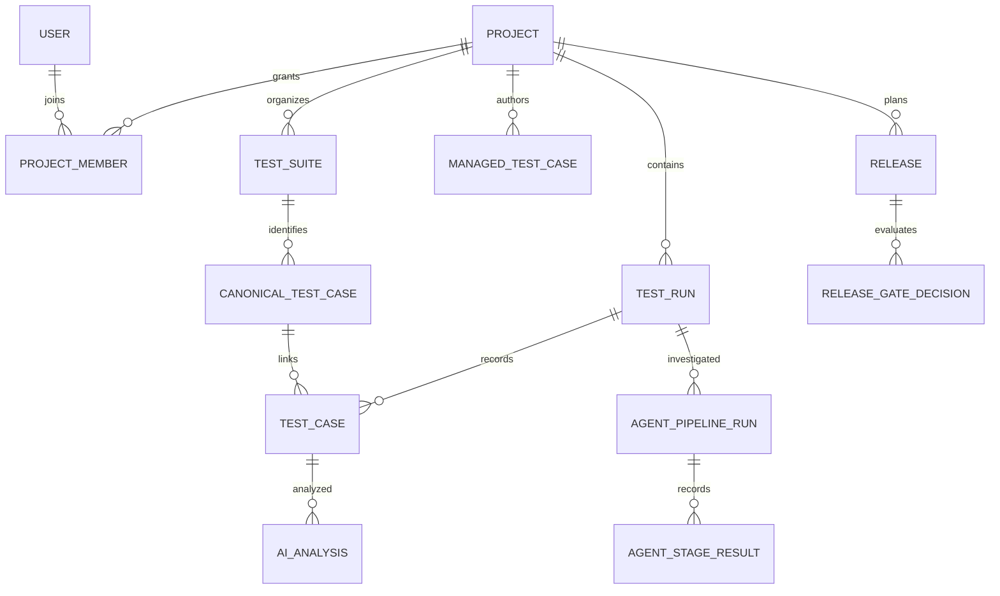

# Data architecture and model guide

[Documentation home](../README.md)

The [generated data dictionary](../reference/data-dictionary.md) lists all 139 SQLAlchemy tables, every column/type/nullability/default, FK/delete rule, indexes, constraints and ORM relationship declarations. [Public schemas](../reference/schemas.md) and [Python contract declarations](../reference/python-contracts.md) cover wire and internal structures. [Migration inventory](../reference/migrations.md) is the schema-history map.

## Storage ownership

| Store | Data | Durability/consistency implications |
|---|---|---|
| PostgreSQL | Projects, members, runs, executions, canonical/authored tests, analyses, release/review/policy/agent ledgers, audit and outboxes | Relational transactions, FK/unique constraints and guarded transitions; deployed schema comes from Alembic |
| MongoDB | Allure/TestNG/raw payload collections, API payloads, execution logs, AI payloads, pod events, run summaries, decision snapshots/reports/attempts, live events | Flexible documents and independently maintained indexes; no transaction with PostgreSQL |
| Redis | Celery broker/result state, live source/fan-out streams, session buffers, upload status, caches, quotas and debounce | TTL and eviction policies matter; an expired upload status is not deletion of a PostgreSQL run |
| MinIO/S3/local provider | Queued report bodies, attachments/evidence, exports, knowledge/training files | Metadata/payload writes can fail separately; storage provider and retention must be configured coherently |
| ChromaDB | Retrieval/search embeddings and derived indexes | Optional/derived data; embedding model/version affects compatibility and offline packaging |

Core Mongo collection constants and startup index keys are declared in [db/mongo.py](../../backend/app/db/mongo.py); this is not an exhaustive collection registry. Some services select their own collection names, such as [pipeline_event_log](../../backend/app/services/pipeline_event_log.py#L27). Published decision documents are read from Mongo by [decision_report_service](../../backend/app/services/decision_report_service.py#L113), so Mongo evidence/report data must be included in backup and restore. Index creation is best-effort at startup; inspect logs for failures. Storage interface/provider selection is in [db/storage.py](../../backend/app/db/storage.py). Never infer global atomicity from a successful write to one store.

## Core relational concepts

This is a conceptual subset, not a complete FK diagram. Refer to the dictionary for exact columns, optional links and delete behavior.

`TestCase` is a run-specific execution. `CanonicalTestCase` represents a stable test identity across executions. `ManagedTestCase` is authored/reviewed content with a lifecycle; these concepts must not be merged in analytics or UI types. A run can carry suite/CI/release/environment metadata without implying that every test belongs to an authored case.

Test fingerprints derive from class and test name (SHA-256 truncated to 16 hex characters in the legacy helper). Run ingestion identity is a separate source-aware hash; CI run URL/provider/repository/build context prevents accidental reuse across jobs. Database uniqueness and deterministic run IDs make duplicate delivery converge, while distinct sources can receive disambiguated build labels. [ingestion helpers](../../backend/app/services/ingestion.py), [pipeline](../../backend/app/services/ingestion_pipeline.py).

## Validation and serialization

Pydantic validates request types, lengths, enums, array bounds and declared cross-field validators. SQLAlchemy types and DB constraints supply a second boundary. Services enforce project scope, lifecycle legality, authority/version checks and business invariants. JSONB's flexibility does not validate arbitrary nested data; agent and evidence contract versions are therefore important.

UUIDs and datetimes serialize through Pydantic/route serializers; API clients should use the declared ISO date/time shapes. Numeric units differ: test duration inputs commonly use milliseconds, retry/deadline configuration uses seconds, and confidence fields must follow their own declared scale. Do not infer one confidence range across all schemas. Model validators, `model_dump`, custom serializers and explicit response dicts can normalize fields. [serializers](../../backend/app/models/serializers.py).

Unknown execution environment means not recorded; it is not silently a shared “default” environment. Execution time and ingestion time can differ, especially for delayed file upload; release attribution uses execution context where available. [run environment](../../backend/app/services/run_environment.py), [execution time](../../backend/app/services/execution_time.py).

## Mutation and lifecycle discipline

Handlers generally own commit boundaries; services stage mutations, audit entries and outbox intents in the caller's session where designed. Do not add a service-level commit that splits the unit of work. PostgreSQL row locks, expected-status updates and lease fencing protect concurrent transitions. Release current-decision replacement explicitly flushes demotion before promotion to satisfy partial unique indexes.

Deletion spans multiple stores and derived state. Retention, deletion jobs and run tombstones prevent late asynchronous writers from resurrecting removed data. Bulk operations must retain project boundaries and audit records. Restore/backup must cover all authoritative stores coherently; a PostgreSQL-only backup is not a complete evidence backup.

Schema changes require a migration, ORM update, schema/serializer update where applicable, tests, generated dictionary regeneration and client review. This package inspects model metadata and migration files; it does not assert that an external database has applied them.
