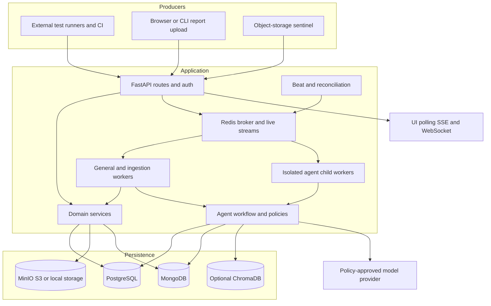

# Architecture overview

[Documentation home](../README.md)

TestLookup is a modular Python backend deployed as API and worker processes, with a separate React SPA and MCP adapter. Domain services share SQLAlchemy models and Pydantic contracts. Celery/Redis moves long-running ingestion, analysis and scheduled work out of HTTP handlers. It is not a set of independently versioned domain microservices: changes to shared models/contracts generally ship together.

## Components and ownership

| Component | Responsibility | Key implementation |
|---|---|---|
| React 19 / TypeScript SPA | Routes, role-aware controls, polling/streaming, charts, review and authoring UX | [App](../../frontend/src/App.tsx), [API client](../../frontend/src/services/api.ts) |
| FastAPI API | Request validation, auth, scope, orchestration, serialization | [main](../../backend/app/main.py), [bootstrap](../../backend/app/bootstrap.py), `backend/app/routers` |
| Domain services | Ingestion, identity, release, governance, reporting, retention, integrations | `backend/app/services` |
| Celery workers | Parse/persist telemetry, execute pipelines, notifications and housekeeping | [tasks](../../backend/app/worker/tasks.py), [configuration](../../backend/app/worker/celery_app.py) |
| Beat | Periodic dispatch and reconciliation | [beat schedule](../../backend/app/worker/celery_app.py) |
| Agent runtime | Registry, planner, frozen workflow, checkpoints, leases, tools and review | [workflow](../../backend/app/agents/workflow.py), [registry](../../backend/app/services/agent_capability_registry.py) |
| PostgreSQL | Authoritative relational state and durable orchestration records | [models](../../backend/app/models/postgres.py) |
| MongoDB | Rich evidence, summaries, decision documents and raw/sanitized payload collections | [Mongo collection/index registry](../../backend/app/db/mongo.py) |
| Redis | Broker/results, live streams, fan-out, session buffers, quotas/caches/debounce | `backend/app/streams`, [Redis client](../../backend/app/db/redis_client.py) |
| Object storage | Queued uploads, artifacts, exports and training/knowledge assets | [storage providers](../../backend/app/db/storage.py) |
| Model/vector services | Configured local/cloud inference and optional retrieval | [LLM factory](../../backend/app/services/llm_factory.py), [semantic search](../../backend/app/services/semantic_search.py) |
| CLI/MCP/SDK | API consumption and producer integration | [integration map](integrations.md) |

## Request and process lifecycle

`main.py` constructs the app and middleware, exposes `/api-docs`, registers routers, and uses lifespan for startup/shutdown. Production security checks can refuse startup; production additionally verifies PostgreSQL connection budget. Mongo indexes are ensured best-effort. Live source consumption and per-process fan-out tasks start with the API; shutdown cancels them and closes clients.

Public-router registration means “handler chooses its own credential mechanism,” not “no authentication.” Examples are signed webhooks, SCIM bearer tokens, shared-report tokens and invocation stream tickets. Protected routers inherit dual JWT/API-key auth, then enforce resource and role checks. Literal routes must be registered ahead of colliding variable paths. [API guide](../api/README.md).

The same database session must not serve concurrent SQL operations. Services can overlap independent Mongo and PostgreSQL work, but query sequentially on a shared `AsyncSession`. Worker loop/client initialization is explicit because async DB/Mongo clients are tied to event loops. [run intelligence](../../backend/app/services/run_intelligence_service.py), [loop runner](../../backend/app/worker/loop_runner.py).

## Reliability boundaries

Database transactions are local to PostgreSQL; there is no global transaction across PostgreSQL, Mongo, Redis and object storage. Durable outboxes, reconciliation, idempotent identities, tombstones and leased work reduce partial-failure risk. They do not make every side effect globally exactly once. Result views can lag ingest acceptance and live aggregates can precede detail materialization. [Data architecture](data-model.md), [design trade-offs](design-decisions.md).

Scaling API replicas also increases DB pools, live fan-out consumers and client connections. Worker concurrency must fit the DB connection budget and model capacity. Dedicated `agent_children` workers avoid parent pipelines consuming every slot while waiting for children. Queue declarations and actual worker subscriptions must match; deployment profiles differ. [Deployment](../operations/deployment.md).
