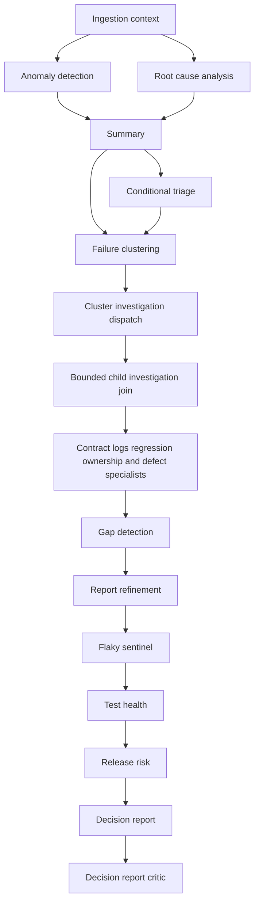

# AI and agent pipeline

[Documentation home](../README.md)

The agent workflow consumes persisted run/evidence context. Deterministic rules/statistics, trained classifiers, model calls and external evidence tools all contribute; not every stage uses an LLM. [Capability registry](../../backend/app/services/agent_capability_registry.py), [catalog](../../backend/app/services/agent_catalog.py), [planner](../../backend/app/services/agent_planner.py), [workflow](../../backend/app/agents/workflow.py) are the primary runtime sources.

## Entrypoints and configuration

Run finalization/manual triggers dispatch a pipeline. Public agent invocation selects a catalog capability and its dependency closure within the ordinary workflow engine. Sync mode still dispatches worker work and waits a bounded time; it is not a second synchronous engine. Invocation supports a stored subject; concrete input schemas in the catalog do not imply arbitrary raw payload execution is accepted by the invoke endpoint. Poll or obtain a short-lived single-use event ticket for progress. [invocation API](../reference/api/agent-invocations.md).

Per-project settings, provider ceilings, model tier, tool allowlist, cost/token/time limits and workflow authority are resolved/frozen. Config and workflow changes participate in review/evaluation and version authority. Read the actual resolved configuration and provenance rather than assuming `.env` alone chooses every stage's model.

## Workflow graphs

The offline graph has ingestion, anomaly detection, root-cause analysis, summary and conditional triage. Anomaly/root-cause branches converge at summary; all-green guards prevent unnecessary failure analysis. The live post-run graph uses ingestion then summary because live analysis has its own path.

The deep graph adds the following structure; optional/conditional nodes can be skipped and the persisted plan records the selected path:

This diagram compresses specialist fan-out and conditional branches. The actual executable topology and versioned workflow compiler are authoritative; do not treat the planner's inventory order as a sequence diagram.

Cluster child investigations use an isolated worker queue and durable dispatch/join records. Investigators gather bounded hypotheses/evidence and synthesize results. Fixer/action proposal workflows use explicit capability and action policy; enabling intelligence does not grant blanket permission to mutate an external system.

## Model routing and output

Modes are `rules`, `ml`, `llm`, `auto`. The legacy auto router prefers a usable trained classifier, otherwise a reachable model, otherwise rules. Project/stage tier routing adds SLM/LLM choices, promoted models, escalation reasons and deterministic fallback metadata. All modes aim at compatible analysis/summary shapes, but provenance and evidence quality differ. [analysis router](../../backend/app/services/analysis_router.py), [model router](../../backend/app/services/model_router.py).

Inputs are sanitized run/test/history/evidence structures. Prompt versions, model/config resolution, tool calls, costs, token observations, input hashes and stage output contracts support traceability. Typed outputs and JSON parsing/repair validate shape; they do not establish factual correctness. Deterministic report assembly/criticism and human review supply separate controls. RAG adds registered source sync → chunking → retrieval → grounded draft generation → evaluation/review; it is not identical to the failure-classification workflow.

## Retry, resume, cancellation and deadlines

Internal states are pending/running/retry_wait/completed/passed/failed. Public pending/running/retry_wait is `in_progress`. Degradation lives in metadata. Accepted review can advance completed to passed; no-report paths use explicit not-applicable review semantics. [state machine](../../backend/app/services/workflow_run_state.py).

The shared retry policy defaults to five total attempts, base 30 seconds, exponential growth capped at 600 seconds before ±20% jitter. Validation, policy denial, budget exhaustion, rejected review and cancellation are non-retryable; model/time/tool/lease failures can retry according to policy. Individual tasks/stages can have their own bounded retry behavior, so this is not a universal retry count. [retry policy](../../backend/app/services/retry_policy.py).

Automatic retry resumes frozen authority. Manual retry compares current behavior-affecting configuration; incompatible authority causes a new linked run. Checkpoint reuse verifies stage/input/config/version/evidence authority and pipeline-bound outputs; blindly copying stage JSON is unsafe. Leases/fencing prevent stale attempts from overwriting current results. Cancellation is cooperative and records failure/cancellation meaning without inventing another public status.

The default pipeline wall-clock budget is 1,500 seconds. Decision report and critic are deadline-exempt deterministic terminal stages so a budget-truncated run can still explain missing work. Actual latency includes debounce (default 60-second age plus beat cadence), queue wait, evidence calls, model inference, child joins and retries. No per-test 300 ms LLM promise is supported by this documentation.

## Determinism and evaluation

Frozen plans, hashes, pinned tags and prompt versions improve replayability. They do not make stochastic inference, changing external evidence, floating runtime settings or hardware bit-for-bit deterministic. Keep outcome, stage quality, model tier, evidence provenance and human acceptance separate. Model training/promotion depends on labeled data, configured gates and evaluations; a scheduled export is not automatic proof of improvement. [AI quality deep dive](../../architecture/AI_QUALITY.md), [testing](../operations/testing.md).
