# Ingestion pipeline

[Documentation home](../README.md)

## Entry paths

| Path | Input and purpose | Processing |
|---|---|---|
| `POST /api/v1/ingest` | JSON `IngestPayload`: project, build and result list, optional CI/environment/commit context | Store queued JSON payload, dispatch `ingest_uploaded_results`, return 202 |
| `POST /api/v1/ingest/file` | Multipart file/project/build plus optional format/context and `run_ai` | Bounded upload → object storage → file worker → parser → normalized ingestion |
| Storage webhook | Sentinel/object notification for stored reports | Validate/authenticate → fetch sentinel/results → existing shared persistence/finalization |
| `/api/v1/stream/*`, `/ws/events/{run_id}` | Session/batched/single live events | Redis buffering/source streams → materialization and completion handling |

Exact fields, auth dependencies and declared errors: [ingest reference](../reference/api/ingest.md), [stream reference](../reference/api/live-stream.md), [live reporting](../reference/api/live-reporting.md), [webhooks](../reference/api/webhooks.md).

## Inputs and bounds

Supported explicit file formats are `auto`, `junit`, `testng`, `allure`, `cypress`, `playwright`, `pytest`, `robot`, `cucumber`, `nunit`, `trx`, `xunit`. Auto detection inspects content; extensions alone are not authoritative. ZIP reports are traversed using bounded archive helpers. Cypress/Playwright parser gates are configurable; migrations enable them by default in the current migration history, but operators can override them.

The file route reads 1 MiB chunks and rejects above 50 MiB or zero bytes. Archive defaults are 200 MiB aggregate expanded bytes, 5,000 entries, 50 MiB per entry and maximum expansion ratio 100. [safe archive](../../backend/app/services/safe_archive.py), [configuration](../reference/configuration.md). Limits apply at different layers and are not promises of capacity.

JSON batches require a nonempty build label (at most 100 characters), at least one result within the declared maximum, and test name/status. Accepted statuses are `PASSED|FAILED|SKIPPED|BROKEN`; durations are nonnegative milliseconds. Persisted parser results can additionally be `UNKNOWN`. `environment` is optional. The multipart route explicitly accepts `executed_at`; the JSON `IngestPayload` at this snapshot does not expose that field. Avoid assuming parity from similarly named client options.

## Processing sequence

```mermaid
flowchart LR
  Input[Batch file or sentinel] --> Auth[Authenticate and resolve project]
  Auth --> Admission[Validation quota and backpressure]
  Admission --> Payload[Store queued payload]
  Payload --> Dispatch[Celery dispatch]
  Dispatch --> Parse[Parse and normalize]
  Parse --> Collapse[Collapse duplicate test identities]
  Collapse --> Persist[Persist run cases and evidence]
  Persist --> Finalize[Finalize aggregates history suites and attribution]
  Finalize --> Outbox[Durable downstream intents]
  Outbox --> AI[AI pipeline and notifications]
```

The router applies project authorization before charging admission quota. The per-project batch default is 200/minute; single live events have a separate 20,000/minute default. Redis memory admission defaults to 75% of configured `maxmemory`, with an optional absolute fallback. The checks can fail open on infrastructure read errors, so monitor them.

Source-aware identity combines project/build and available CI context. Re-delivery converges on the canonical run; a specific CI run URL avoids conflating separate jobs sharing a build label. Run-ID resolution at the API and the worker use the shared identity logic. Per-run test fingerprints collapse duplicates with worst outcome winning. Fingerprint prefetch is chunked below asyncpg parameter limits. Row rejection metadata is bounded and avoids persisting full driver parameter values. [pipeline](../../backend/app/services/ingestion_pipeline.py).

## Failure, status and observability

File task state is `pending → parsing → ingesting → succeeded|failed`, updated atomically in Redis with immutable terminal states and a 24-hour TTL. Read it at `GET /api/v1/ingest/uploads/{task_id}` under project authorization. A missing/expired status is not proof the run never existed. The JSON batch path does not promise the file-status lifecycle; follow its run/task behavior separately.

Parsing/storage/worker errors can happen after 202. Inspect upload error/progress, run rejection evidence, `run.received` activity, worker logs, task attempts, ingestion metrics and DLQ where applicable. A status write is best-effort and can fail independently. Run-level aggregates must reflect accepted durable cases rather than the submitted row count. Queued payloads may contain sensitive evidence, so object storage access and retention are part of the security boundary.

The system uses multiple stores and some direct dispatches: do not infer an atomic object-write/broker/SQL transaction or universal exactly-once processing. The downstream outbox improves recovery after durable run work, but does not turn every entrypoint into one transaction. [test-run pipeline](test-runs.md), [limits](../handoff/limitations.md).
