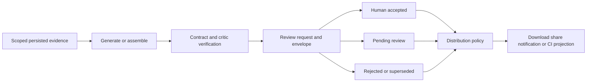

# Reporting, summaries and release decisions

[Documentation home](../README.md)

“Report” covers several products. They have different inputs, aggregation and approval semantics.

| Output | Inputs and behavior | Code |
|---|---|---|
| Run intelligence | Combines run counts, analyses, clusters, baseline diff, risks/actions and stored summary/decision views | [run intelligence](../../backend/app/services/run_intelligence_service.py) |
| AI run summary | Structured executive/incident/evidence/action layers plus provenance | [summary agent](../../backend/app/agents/summary_agent.py), [summary assembler](../../backend/app/services/summary_assembler.py) |
| Decision report | Evidence-bound assembled decision document and separately tracked generation/verification attempts | [decision report](../../backend/app/services/decision_report_service.py), [critic](../../backend/app/agents/decision_report_critic_agent.py) |
| Project summary | Window or latest-per-suite aggregation, pass/fail/skip/flaky views | [summary report](../../backend/app/services/summary_report_service.py) |
| Downloadable HTML/PDF | Composed report and sanitized renderer, with review-aware export policy | [composition](../../backend/app/services/report_composition_service.py), [reports route](../../backend/app/routers/reports.py) |
| Evidence/compliance ZIP | Related artifacts and audit evidence under scope/policy controls | [evidence bundle](../../backend/app/services/evidence_bundle_service.py), [compliance](../../backend/app/services/compliance_pack_service.py) |
| Release/phase decision | Policy and evidence rollup with stored snapshot/reasons/history | [release gate decisions](../../backend/app/services/release_gate_decision_service.py), [phase gate](../../backend/app/services/release_phase_gate_service.py) |

## Aggregation and evidence

Project summary has two populations. `window` counts each non-null test fingerprint once, using its most recent status within the window; only when there are no fingerprinted case rows does it fall back to summed run aggregates. `latest` sums run aggregates from the latest run per `primary_suite_name` within the window; a missing suite name groups by run ID. Neither is an average of run percentages. [Window query](../../backend/app/services/summary_report_service.py#L302), [latest query](../../backend/app/services/summary_report_service.py#L405).

| Response field | Calculation | Consumer meaning |
|---|---|---|
| `totals.pass_rate_pct` | passed / total × 100 | UI **Pass %** headline; total includes skipped and any unknown outcomes |
| `totals.weighted_pass_rate_pct` | passed / (passed + failed + broken) × 100 | Evaluated-only percentage; skips and unknowns are excluded |
| `totals.pass_rate_basis` | Currently always `unique_tests` | Describes the usual window path, but is misleading for `latest` and the aggregate fallback |

Both percentages round to one decimal and return zero for a zero denominator. For 70 passed, 15 failed, 5 broken and 10 skipped, the headline is **70.0%** and the weighted field is **77.8%**. [Service assembly](../../backend/app/services/summary_report_service.py#L176), [UI tiles](../../frontend/src/pages/SummaryReportPage.tsx#L335), [behavior tests](../../backend/tests/test_summary_report_service.py#L310).

**Known baseline defect:** the summary routes accept and authorize `release_id`, but `build_summary_report` forwards it only to the top-failing-tests query. Headline totals, suite breakdowns and step metrics are called without the release argument, while flaky count is project-wide/recent-history. The screen and PDF can therefore mix scopes. Do not treat this report as uniformly release-filtered. This was confirmed with isolated service-call probes in both modes; fixing application filtering and basis labels remains open in the [documentation review action register](../reviews/2026-09-18-documentation-action-register.md). [Route](../../backend/app/routers/summary_report.py#L84), [service call sites](../../backend/app/services/summary_report_service.py#L134).

Flaky count uses the most recent ten executions per fingerprint, with minimum-history, mixed-outcome and transition requirements; it has no selected calendar-window or release filter. Flaky rate divides that count by the selected total and caps it at 100%. It is not an all-time cumulative count or a window-only rate. [Flaky calculation](../../backend/app/services/metrics_service.py#L780). Retain the field names, selected mode and population when presenting these metrics. The overview dashboard counts executions and can legitimately differ from the summary's unique-test population.

Run aggregates may precede live detail rows; per-suite breakdown reads cases while headline totals can use run aggregates. Mixed visibility during finalization is expected and should not be mistaken for a durable equality invariant. A stored accepted report and the latest failed generation attempt are separate objects; displaying the latest attempt must not silently replace a valid report's authority.

## Report lifecycle and distribution

With `REVIEW_GATE_ENFORCED=false`, policy refusals are generally observed/audited for rollout. With enforcement active, accepted/non-AI output can be distributed. A pending draft needs project permission or an authorized interactive `include_unreviewed` request and receives a draft watermark plus audit. Rejected/superseded output cannot use that pending-draft exception. HTTP responses can expose `X-TestLookup-AI-Generated` and `X-TestLookup-Review-State`; clients should preserve review meaning in downloads, search snippets, notification payloads and MCP output. [distribution service](../../backend/app/services/report_distribution_policy.py).

Share links use their own token/access/expiry semantics and remain subject to report policy. They are implemented in this snapshot. Compliance packs are exports of evidence; generating one is not a legal compliance certification.

## Release decisions

Run-level release signals and release/phase-level policy decisions are related but distinct. Release-level persisted verdicts include `GO`, `CONDITIONAL_GO`, `NO_GO`, `NOT_EVALUATED`. Insufficient evidence is a real state; do not coerce it to green. Review gating can project `PENDING_REVIEW` on outward-facing verdicts when configured.

Current release decisions are append-only records with previous rows demoted, policy/evidence snapshot, denominator and reasons retained. Partial unique indexes enforce at most one current decision for release/phase scope, with a flush between demotion and promotion. Overrides and recomputation must preserve authority/history. Always check which release, phase, policy version, run set, environment and baseline the verdict describes.

## Export and notification failures

Export generation can fail separately from analysis, and delivery can fail separately from generation. Long-running work belongs on workers or renderer thread offload where implemented. Diagnose storage, renderer errors, report availability, review refusal, destination policy and retry/DLQ records independently. Do not bypass current report review by replaying an old webhook payload; delivery paths must re-evaluate policy.
