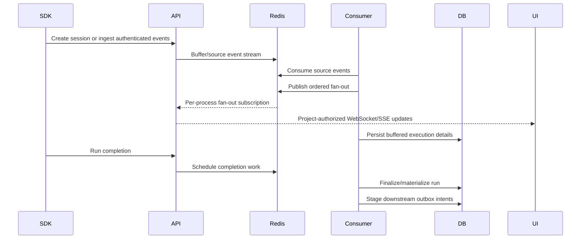

# Test-run and live execution lifecycle

[Documentation home](../README.md)

External test runners execute suites and create results. TestLookup's run lifecycle starts at ingestion/session creation, materializes results, finalizes aggregates and triggers intelligence. Test management drafts and AI investigation are separate execution domains.

## Batch/file lifecycle

`create_run_from_payload` establishes source identity and an `IN_PROGRESS` row. Normalized results upsert `TestCase` records; evidence can populate steps, attachments, history and Mongo documents. Finalization computes totals/status, synchronizes canonical suites/cases, applies attribution/ownership and stages follow-on work. Trace the exact hooks in [ingestion](../../backend/app/services/ingestion.py), [pipeline](../../backend/app/services/ingestion_pipeline.py) and [tasks](../../backend/app/worker/tasks.py).

The shared terminal grading rule is deliberately conservative:

- No executed tests (`passed + failed + broken <= 0`) → `STOPPED`.
- Any failed or broken execution → `FAILED`.
- Otherwise any unknown outcome → `STOPPED`.
- Otherwise → `PASSED`.

Only apply this at finalization. A newly started run with zero results remains `IN_PROGRESS`. `SKIPPED` is not proof of successful execution. [status implementation](../../backend/app/services/run_status.py).

## Live pipeline

Source processing and client fan-out are separated so multiple API processes can deliver the same ordered event to their own connected clients. Clients must authenticate and remain within project access. Live identifiers can be non-UUID slugs; responses expose the canonical `test_run_id` for navigation to UUID-based run APIs. Do not construct run links from the raw live slug.

Live aggregates can be visible before all case rows. Session drain/finalization paths and stale-session recovery reconcile details and downstream work. A producer that forgets completion should not leave the UI permanently active; recovery is scheduled through beat and worker tasks. The exact cadence/thresholds are configuration and code, not a delivery SLA. [stream service](../../backend/app/services/stream_service.py), [recovery](../../backend/app/services/live_run_recovery_service.py), [fan-out](../../backend/app/streams/live_fanout.py).

## Durable downstream work

`run_downstream_outbox` records operations such as live persistence, pipeline dispatch, suite comparison, run/transition/AI-summary notifications and run-completed webhooks. The intent carries a run, project, operation, input version, queue and payload. Reconciliation retries eligible work and leases execution; idempotency protects repeated delivery. The service declares separate dispatch, execution and finalization recovery limits. [outbox](../../backend/app/services/run_downstream_outbox.py).

Tombstones/deletion checks stop delayed writers from recreating deleted runs. Cancellation of an AI pipeline does not necessarily cancel the external CI job or delete its results. A completed test run may have a pending/failed AI pipeline and vice versa; APIs and UI must show these dimensions separately.

## Logs and outputs

Keep project ID, canonical run ID, task ID, pipeline ID and stage/invocation ID distinct in diagnostics. Structured logs, project activity, ingestion counters, live lag/queue metrics, task status and durable outbox/pipeline rows answer different questions. Final products are persisted execution records, history and aggregates, followed by analysis/report records. Exported reports are governed by the [reporting pipeline](reporting.md).

The generated [worker task/queue/schedule reference](../reference/worker-operations.md) covers every declared task and the beat schedule.
