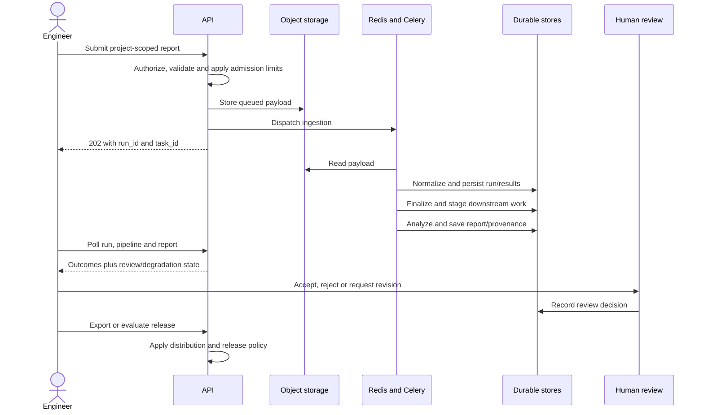

# User journeys and end-to-end workflows

[Documentation home](../README.md)

## First useful run

1. Start the development stack or sign in to an existing installation. Complete password change/MFA when required; login HTTP 200 may still be an MFA challenge.
2. Create/select a project and ensure the caller is a member. Set suite/environment/ownership/release conventions before importing production history.
3. Upload a report with project and build information, or configure a scoped CI client. Supply CI run URL/repository/provider where available to distinguish jobs that reuse build numbers.
4. Retain the accepted `run_id` and `task_id`. For files, poll the upload task through parsing and ingestion; then inspect the persisted run. A 202 response alone is not proof of parsing success.
5. Open Run Intelligence/Agents to follow analysis, inspect failures and evidence, and identify skipped/degraded stages. Review a report when it enters the review queue.
6. Compare with an appropriate earlier run; check release association, policy, missing evidence and current review state before exporting or interpreting a release verdict.

## CI integration

Use a service account or API key with the required project scope; persist it in the CI secret store. Choose the batch/report path when only final results are needed, and live events when real-time feedback is useful. Preserve run identity across retries. Respect `Retry-After` on 429/503 responses. Poll completion rather than treating upload acceptance as a gate decision. The CLI's `ci-verdict` applies its documented run/quarantine semantics; it is not automatically identical to every release-level gate. [Integration guide](../architecture/integrations.md).

## Failure triage

The engineer opens an assigned failure, reads the raw/sanitized evidence and history, examines AI classification and confidence, and makes a human correction or creates a defect. A QA lead can manage quarantine and ownership. Classification feedback supplies a learning signal; the existence of feedback does not prove a new model is trained or promoted. Connectors can be unavailable or policy-disabled, so “defect identified” and “external issue created” are separate outcomes.

## Release decision

Link eligible runs to releases/phases, check attribution and evidence completeness, evaluate the selected policy, and inspect reasons/conditions. A release-level verdict can be `NOT_EVALUATED` when evidence is insufficient. A report review gate may project `PENDING_REVIEW` for outward-facing consumers when enforced. Authorized overrides are auditable; a later recalculation must not erase the decision history. [Reporting](../pipelines/reporting.md).

## Authoring and knowledge

Register permitted knowledge sources, synchronize/chunk/index content, retrieve evidence, generate draft tests/plans/strategies and review before lifecycle promotion. Source synchronization status, retrieval matches, generation and acceptance are separate steps. For lifecycle-enabled projects, use the transition endpoint and allowed-action response. Editing a `ManagedTestCase` does not retroactively change `TestCase` execution evidence.

## Administrator handoff

Before enabling team use, verify secrets/identity, memberships, storage, all required queue consumers, beat, migration head, backup restore, ingress routes and deployment identity. Set review/egress/feature policies intentionally. Add alerts for stalled ingestion, failed tasks, DLQ growth and degraded AI. [Operations](../operations/deployment.md).
