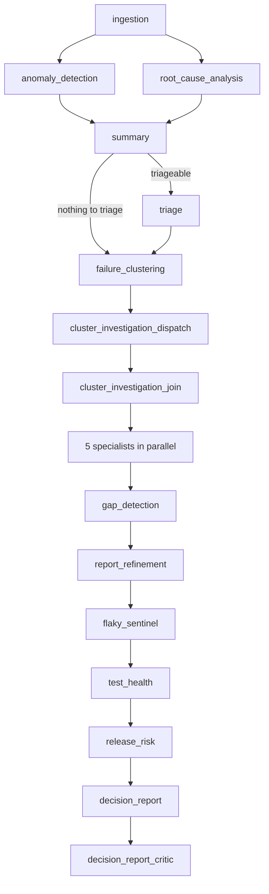
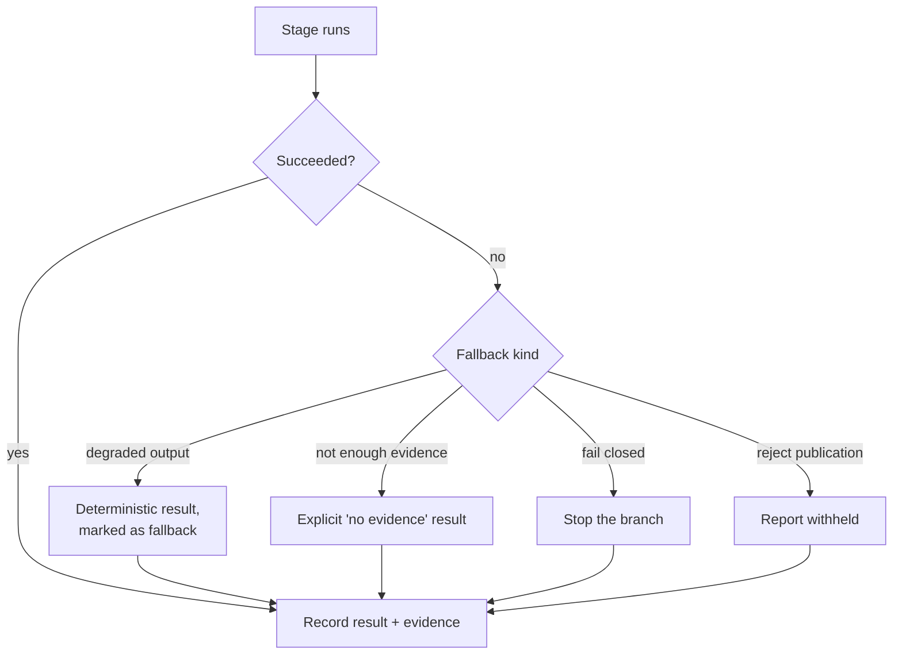

# AI agents and the pipeline

When a run finishes, TestLookup can run an **analysis pipeline**: a fixed sequence of stages, each performed by an agent. Some agents are pure arithmetic; some call a language model. This page says which is which, what each may read, and what happens when one fails.

> **Important.** Every agent's output is advisory. None of them changes your tests. Exactly one stage can change state outside its own record — `defect_commander` — and it is off by default. See [Permissions](#permissions-what-an-agent-may-do).

## Pipeline shape

There are four workflow types. The **deep** pipeline is the full one:

**In words:** ingestion validates what was stored. Anomaly detection and root-cause analysis run in parallel, then both feed the summary. From the summary the pipeline either triages (if any analysis is confident enough) or goes straight on to clustering. Clustering groups similar failures; a dispatch/join pair handles optional per-cluster child investigations. Five specialists then run **in parallel**, followed by gap detection and report refinement, the flaky and test-health stages, the release-risk score, the decision report, and finally a critic that verifies the report before it is published.

> **Note.** The five specialists are deliberately at the *same depth* in the graph. A predecessor at a different depth makes the join fire twice and re-runs everything downstream — a real incident this topology exists to prevent.

## The stages

| Stage | What it does | Permission | Fallback when it fails |
|---|---|---|---|
| `ingestion` | Validates persisted run facts, collects failed test IDs | read-only | fail closed |
| `anomaly_detection` | Compares pass rate to a branch-aware baseline | read-only | degraded output |
| `failure_clustering` | Groups similar failures by error text | read-only | one cluster per test |
| `cluster_investigation_dispatch` | Plans optional per-cluster child investigations | read-only | skip children, fail closed |
| `root_cause_analysis` | Per-test category and explanation | read-only | degraded output |
| `cluster_investigation_join` | Collects the child investigations | read-only | continue without children |
| `summary` | Run-level summary | read-only | degraded output |
| `triage` | Proposes/creates tickets for qualifying failures | **propose action** | degraded output |
| `contract_validation` | REST contract checks, scoped to the run | read-only | not enough evidence |
| `log_intelligence` | Log/trace evidence per cluster | read-only | not enough evidence |
| `regression_watchman` | Regression vs known-flake vs environment | read-only | degraded output |
| `change_ownership` | Baseline diff and cluster ownership | read-only | not enough evidence |
| `defect_commander` | Promotes a cluster to a defect | **mutating** | degraded output |
| `gap_detection` | Finds gaps in the draft report | read-only | degraded output |
| `report_refinement` | Improves the draft report | read-only | degraded output |
| `flaky_sentinel` | Investigates flaky-classified tests | read-only | degraded output |
| `test_health` | Scores automation-defect tests | read-only | degraded output |
| `release_risk` | Risk score and GO / CONDITIONAL_GO / NO_GO | read-only | deterministic release policy |
| `decision_report` | Assembles the decision report | read-only | degraded output |
| `decision_report_critic` | Verifies the report before publication | read-only | **reject publication** |

Twenty stages, in the order the deep pipeline plans them. A **standard** (offline)
run is much shorter — `ingestion`, `anomaly_detection`, `root_cause_analysis`,
`summary`, `triage` — so a run's Intelligence page will show five stages, not
twenty, unless it was a deep run.

A separate **investigation** workflow runs a planner, five parallel hypothesis agents (infrastructure, commit, environment, known-flaky, regression) and a synthesis stage.

## Permissions: what an agent may do

The capability registry gives every stage a permission, and it is enforced as a property of the pipeline, not left to each agent's good behaviour:

- **`read_only`** — the overwhelming majority. Reads run data, writes only its own stage record and findings.
- **`propose_action`** — `triage`. Proposes work; ticket creation is gated by confidence thresholds and configuration.
- **`mutating`** — `defect_commander` alone. It writes a `Defect` row and, when Jira is configured, files a ticket. **It is off unless a project feature flag is explicitly enabled**, and a missing flag evaluates to off.

> **Warning.** Turning on `defect_commander` means deep runs start creating defect records. Ticket filing additionally requires Jira to be enabled. See [Administration](/docs/administration).

## Rules, models and generated text

The router picks the first available of **ML → LLM → Rules**, and falls back rather than failing when a tier is unavailable:

- **ML** — used when a trained model exists for the project. When none is trained, the router records that and moves on.
- **LLM** — used when a provider is configured and reachable.
- **Rules** — deterministic pattern matching. Always available, and the floor under everything else.

The router records which mode was *requested*, which was *resolved*, and why — for example *"auto: no trained ML model; LLM provider configured and not known-unavailable"*. That trail is stored with the run, so you can always tell what produced a given answer.

> **AI output is advisory, not authoritative.** Every analysis carries a confidence score and provenance showing which engine produced it, and results below the configured confidence threshold are marked as needing human review. An LLM-written explanation is the least authoritative output in the system — read it as the first hypothesis a colleague would offer.

## What happens when a stage fails

**In words:** a stage that succeeds records its result and the evidence behind it. A stage that fails takes its declared fallback: most produce a deterministic degraded result marked as a fallback; the evidence-scoped specialists return an explicit *"not enough evidence"*; ingestion and cluster dispatch fail closed rather than continue on bad data; and the decision-report critic withholds publication rather than publish something it could not verify.

The important property: **a failed stage is recorded as failed.** It does not silently vanish, and an empty result is stated as an empty result rather than dressed up.

## Every stage records what it did

Each stage writes:

- a **stage row** with status and timing,
- **timeline events** when it starts and completes,
- a **decision trail** — the non-obvious branches it took and why, in its own words,
- an **agent contract** carrying whether a fallback was used, a confidence value, evidence references and a decision reason.

The pipeline is then **verified** against the plan it was given. The verifier checks, among other things, that every planned stage completed, that no unplanned stage ran, that routing rationales were persisted, and that any agent producing output also produced a contract. If that verification fails, the decision report is not published.

> **Note.** This is why you may see a run marked `partial`. It means the pipeline produced output but its own verification did not pass — deliberately visible rather than hidden.

## Budgets and configuration

Pipelines carry a budget (LLM calls, tokens, cost, seconds) allocated across stages that use a model. A stage that cannot reserve budget records a stop reason instead of running unbounded. Provider and model selection is administrative — see [Administration](/docs/administration).

## Human-in-the-loop

- Every AI-produced category or explanation can be **corrected**; the correction is stored alongside the original.
- Decision reports carry their evidence, so a reviewer can check the reasoning rather than the wording.
- Nothing an agent produces is treated as final by the release gate — see [Releases and gates](/docs/releases).

## Related

- [How decisions are made](/docs/decisions) — the decision tables
- [Investigating failures](/docs/failure-analysis)
- [Architecture](/docs/architecture) — where the workers and queues sit
