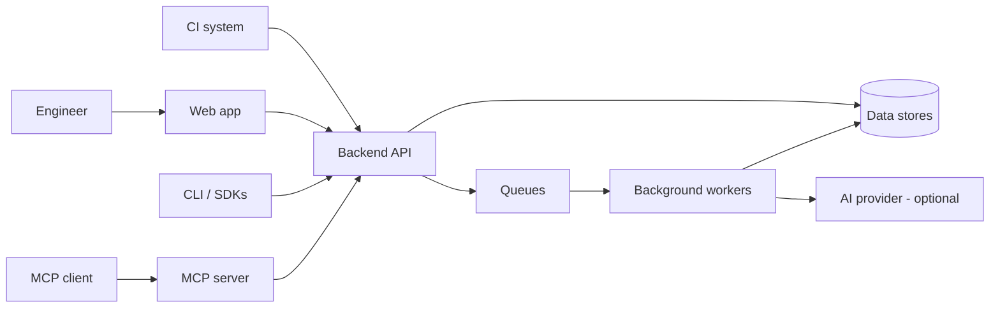
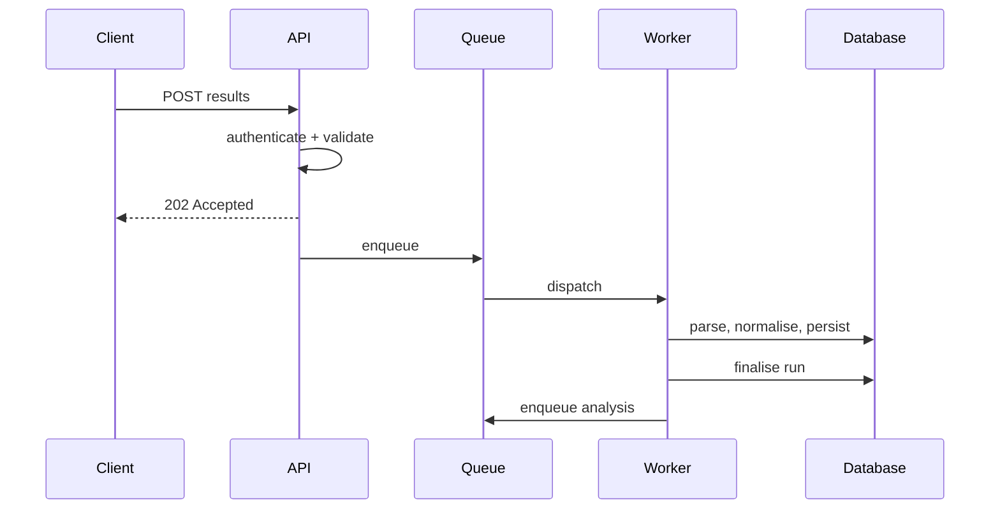
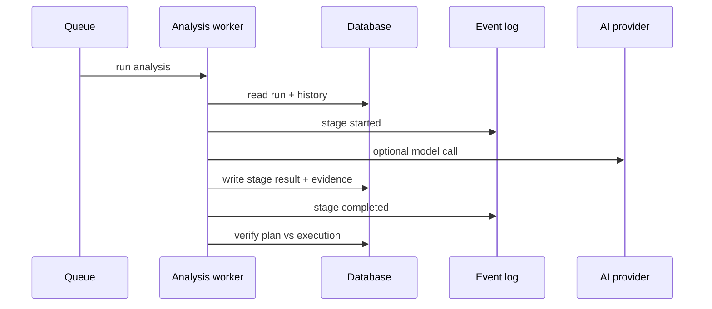
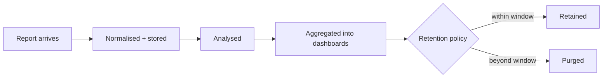

# Architecture

Enough of the shape to reason about where something went wrong.

## System context

**In words:** people use the web app; CI systems, the CLI and SDKs use the backend API directly; MCP clients reach it through the MCP server. The API reads and writes the data stores and enqueues background work. Workers do the slow parts — parsing, analysis — and may call an AI provider when one is configured.

## Components

| Component | Role |
|---|---|
| **Web app** | React single-page app; the UI you use |
| **Backend API** | HTTP API, authentication, authorisation, request handling |
| **Relational database** | Runs, tests, projects, users, defects, audit |
| **Document store** | Pipeline event logs and immutable audit streams |
| **Cache / broker** | Queue broker, feature-flag cache, live event streams |
| **Object storage** | Reports, packs, uploaded documents |
| **Vector store** *(optional)* | Semantic search |
| **AI provider** *(optional)* | Hosted or local model access |
| **Workers** | Ingestion parsing, analysis pipeline, scheduled sweeps |
| **MCP server** | Model-context-protocol access for AI clients |

> **Note.** The vector store and AI provider are optional. Without them, semantic search falls back to keyword matching and analysis falls back to rules — the product works, with fewer capabilities.

## Ingestion path

**In words:** the API accepts and validates, returns 202 immediately, and queues the work. A worker parses and persists, finalises the run, and queues analysis. Nothing slow happens in the request.

## Analysis path

**In words:** a worker reads the run and its history, and for each stage records a start event, optionally calls a model, writes the result with its evidence, and records completion. At the end the pipeline verifies what executed against the plan it was given.

## Queues

Work is separated by priority so a burst of one kind cannot starve another — a critical lane, an ingestion lane, an AI-analysis lane and a default lane, with ingestion further sharded.

> **Tip.** "Analysis is slow" and "ingestion is slow" are different problems on different lanes. Knowing which is queued narrows it quickly.

## Data lifecycle

**In words:** a report is normalised and stored, analysed, and rolled into aggregates. Retention policy decides how long the underlying records are kept; purging is an administrative setting.

## Deployment

TestLookup is deployed as containers — web app, API, workers, and the data stores — behind a single ingress. The ingress routes API traffic, health, metrics, webhooks and the API reference to the backend; everything else is served by the web app.

> **Note.** The API reference (Swagger) is at **`/api-docs`**. This page you are reading is at `/docs`, served by the web app.

## Related

- [AI agents and the pipeline](/docs/ai-agents)
- [Administration](/docs/administration)
