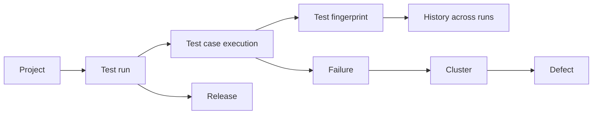

# Concepts and terminology

The vocabulary the product uses, defined once. Terms appear in the order you meet them.

## The core chain

**In words:** a project contains test runs. A run contains test case executions. Each execution maps to a fingerprint, which is what gives a test history across runs. A failed execution is a failure; similar failures group into a cluster; a cluster can be promoted to a defect. Runs can be associated with a release.

## Definitions

**Project** — the isolation boundary. Runs, tests, failures, defects and search results belong to exactly one project. Users see only projects they are a member of. Deleting a project is a *soft delete*: rows remain but it disappears from listings.

**Test run** — one execution of a suite, identified by project + build number. Carries totals, pass rate, branch, timing.

**Test case execution** — one test's outcome inside one run: status, duration, error message, stack trace.

**Test fingerprint** — a stable identity for a test derived from its name and location. This is what lets TestLookup follow a test across runs and branches. **Rename a test and its history follows the old fingerprint.**

**Suite** — the grouping a test belongs to. Taken from the report where present, inferred otherwise.

**Build and branch** — your CI's identifiers, carried through as metadata. Branch matters because baselines are branch-aware.

**Status** — normalised outcome. *Passed*, *failed*, *broken* (an error rather than an assertion failure), *skipped*, *unknown*. Failed and broken are kept distinct because they mean different things in triage.

**Failure** — a failed or broken execution. The unit of investigation.

**Cluster** — a group of failures that look alike by error text. Lets one investigation cover many failing tests. When clustering is unavailable, each test becomes its own cluster.

**Flaky test** — a test whose result changes without the code under test changing. Scored, not asserted — see [Flaky tests](/docs/flaky).

**Quarantine** — a recommendation and a record that a test should be isolated. **TestLookup does not modify your suite**; acting on it is a change you make.

**Defect** — a tracked problem promoted from a cluster, with severity and evidence. May be linked to an external ticket when an issue tracker is configured.

**Release** — a named grouping of runs used for readiness assessment.

**Release gate** — the policy evaluated for a release, producing GO / CONDITIONAL_GO / NO_GO **as a recommendation**.

**Analysis pipeline** — the sequence of stages run after a run finishes. See [AI agents and the pipeline](/docs/ai-agents).

**Agent** — one stage of that pipeline. Some are pure arithmetic; some call a model. Each records what it did.

**Confidence** — how much evidence sits behind a result. Deliberately *not* folded into scores: a test seen 4 times and one seen 400 can produce the same number, and collapsing that is how a thin-history guess starts looking like a measurement.

**Evidence** — the specific records a conclusion was drawn from. Every agent result carries references to its evidence, so a claim can be checked rather than believed.

**Classification** — the category assigned to a failure.

**Search index** — the store backing search. Semantic search requires a vector store; without it, search falls back to keyword matching.

**Report** — a generated artefact: run summary, decision report, export. See [Reports and outputs](/docs/reports).

**Human feedback / correction** — your judgement recorded against a result. Stored **alongside** the original, never silently replacing it.

## Relationships worth remembering

- **A fingerprint outlives a run.** History, flakiness and regression detection all hang off it.
- **A cluster is a convenience, not a truth.** It groups by resemblance; two identical messages can have different causes.
- **A defect is a decision.** Something produced a recommendation and, normally, a person accepted it.
- **A release gate reads signals, it does not create them.**

## Related

- [Getting started](/docs/getting-started)
- [How decisions are made](/docs/decisions)
