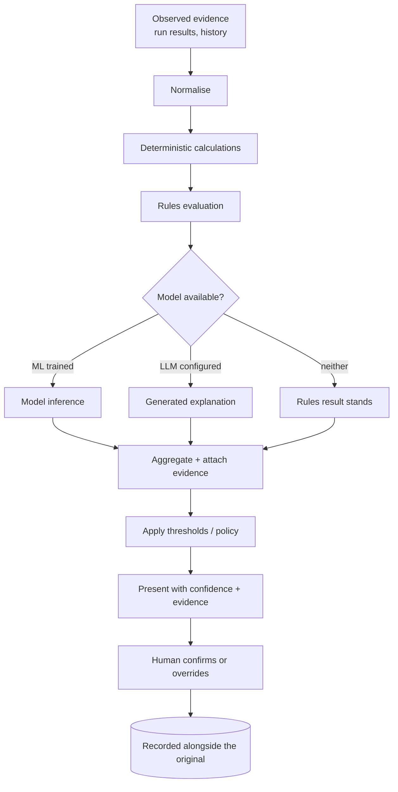
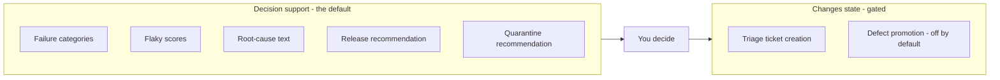

# How decisions are made

Every number and sentence TestLookup shows you comes from one of four places. This page names which, decision by decision, so you always know how much weight to put on what you are reading.

## The four kinds again

| Kind | Reproducible? | Treat it as |
|---|---|---|
| **Observed evidence** | Yes — it is a record | Fact about your data |
| **Deterministic calculation** | Yes — same inputs, same answer | Arithmetic; check the formula |
| **Statistical / model output** | Approximately | A weighted signal |
| **Generative (AI) text** | No | A suggestion to confirm |

## The general shape

**In words:** evidence is normalised, then deterministic calculations and rules run over it. Where a trained model or configured LLM exists the pipeline adds their output; where neither does, the rules result stands on its own. Results are aggregated with their evidence, thresholds are applied, and the whole thing is presented with a confidence indication. A human confirmation or override is recorded **alongside** the original rather than replacing it — so the trail always shows both what the system said and what a person decided.

## Decision tables

### Failure classification

| | |
|---|---|
| **Inputs** | Error message, stack trace, test metadata, history for the fingerprint |
| **Deterministic logic** | Rules-based pattern matching; always available and the fallback |
| **AI involvement** | ML classification where a model is trained; LLM explanation where a provider is configured |
| **Confidence** | Reported per analysis; the routing trail records which mode produced it |
| **User override** | Yes — corrections are stored |
| **Output** | Category + explanation + evidence |

### Flaky identification

| | |
|---|---|
| **Inputs** | Outcome history, retries, environment outcomes, duration statistics |
| **Deterministic logic** | Weighted mean of four rates (0.45 / 0.25 / 0.20 / 0.10) |
| **AI involvement** | **None.** This is arithmetic |
| **Confidence** | Separate band from observation count; **no score below 5 observations** |
| **User override** | Yes — a human judgement can be recorded |
| **Output** | Score 0–1 + confidence band + the signals behind it |

### Similar-failure matching

| | |
|---|---|
| **Inputs** | Error text of the failure, project-scoped history |
| **Deterministic logic** | Clustering over error text; per-test fallback if it fails |
| **AI involvement** | Embeddings where semantic search is configured |
| **Confidence** | Relevance ordering, not a probability |
| **User override** | N/A — you judge relevance |
| **Output** | Ranked candidates within the project |

### Root-cause suggestion

| | |
|---|---|
| **Inputs** | Failure evidence, cluster context, optional log/trace and contract evidence |
| **Deterministic logic** | Evidence gathering and scoping |
| **AI involvement** | **Generative — the text is model-written** |
| **Confidence** | Reported, with the evidence it drew on |
| **User override** | Yes |
| **Output** | A hypothesis to confirm, never a finding |

### Defect recommendation

| | |
|---|---|
| **Inputs** | Cluster, member analyses, criticality dimensions |
| **Deterministic logic** | Criticality scoring → severity |
| **AI involvement** | Generated title/description text |
| **Confidence** | Severity band + scores |
| **User override** | Yes — approval is a human step |
| **Output** | A proposed defect. **Automatic creation is off unless enabled** |

### Release readiness

| | |
|---|---|
| **Inputs** | Run metrics, failure and flaky signals, policy |
| **Deterministic logic** | Scored across dimensions → risk score → recommendation; a documented model version is recorded |
| **AI involvement** | Narrative only |
| **Confidence** | Risk score + blocking issues + conditions for go |
| **User override** | Yes — with an audit trail |
| **Output** | GO / CONDITIONAL_GO / NO_GO **as a recommendation** |

### Quarantine recommendation

| | |
|---|---|
| **Inputs** | Flaky score, confidence band, history |
| **Deterministic logic** | Threshold over the score |
| **AI involvement** | None required |
| **Confidence** | Inherited from the flaky band |
| **User override** | Yes — approval is human |
| **Output** | A recommendation and a record. **Nothing changes your suite** |

### Agent routing

| | |
|---|---|
| **Inputs** | Project configuration, trained-model availability, provider reachability |
| **Deterministic logic** | Router picks rules / ML / LLM and records requested vs resolved mode with a reason |
| **AI involvement** | None — this decides *whether* AI is used |
| **Confidence** | N/A |
| **User override** | Via configuration |
| **Output** | The mode used, stored with the run |

## Decision support vs automated change

**In words:** almost everything TestLookup produces is decision *support* — it tells you something and waits. Only two paths change state beyond TestLookup's own records, and both are gated: triage ticket creation is threshold- and configuration-bound, and defect promotion is off unless a project flag is explicitly enabled.

## Auditability

For any run you can recover: the plan the pipeline was given, which stages were selected and why, which mode analysed each test, each stage's decision trail, the evidence behind each contract, and the verification result. If the pipeline could not verify its own output, the decision report is withheld rather than published.

## Related

- [AI agents and the pipeline](/docs/ai-agents)
- [Flaky tests](/docs/flaky)
- [Releases and gates](/docs/releases)
