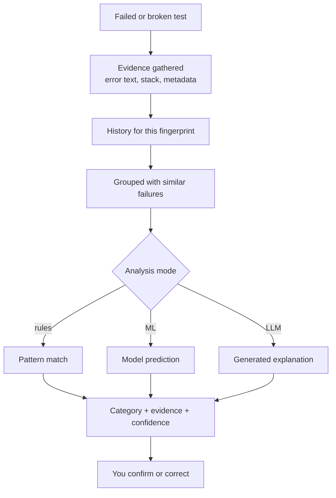

# Investigating failures

What happens to a failed test between ingestion and the explanation you read, and how to correct it when it is wrong.

## The path a failure takes

**In words:** a failed or broken execution has its evidence gathered — error text, stack trace, metadata — then its history is looked up by fingerprint and it is grouped with similar failures. The router picks rules, a trained model, or a language model, and the result is presented as a category with its evidence and a confidence indication. You confirm or correct it, and that judgement is recorded.

## What you see on a failure

- **Category** — what kind of problem this looks like.
- **Evidence** — the specific records behind the category. This is the part to read first.
- **Confidence** — how much sits behind it.
- **Similar failures** — others in the project that resemble it.
- **Suggested root cause**, where a model produced one.

> **Important.** The suggested root cause is generated text. It is the first hypothesis a colleague would offer, not a finding. Check it against the evidence.

## Separating what you are looking at

| On screen | Kind | Weight |
|---|---|---|
| Error message, stack trace | Observed evidence | Fact |
| Failure counts, pass rate | Deterministic | Reproducible |
| Category from rules | Deterministic | Reproducible |
| Category from a model | Model output | A signal |
| Root-cause narrative | Generative | Confirm before acting |
| Your correction | Human | Authoritative |

## Correcting a classification

Corrections are stored alongside the original rather than overwriting it, so the trail shows both what the system said and what you decided. Recording a correction is worth doing even when the category is close but wrong — a human judgement on a failure is the most reliable signal in the system.

Required role: `QA_ENGINEER` or higher.

## Promoting to a defect

A cluster can become a tracked defect with a severity derived from criticality scoring. Where an issue tracker is configured, a ticket can be filed.

> **Warning.** Automatic promotion during the pipeline is **off by default** and gated by a project feature flag. Manual promotion is always available. See [Administration](/docs/administration).

## Limitations

- **Clusters group by resemblance.** Two identical messages can have different causes.
- **Rules are patterns.** A novel failure mode falls outside them.
- **Model output reflects its training.** A project unlike the training data gets weaker predictions.
- **Generated text is fluent regardless of evidence quality.** Fluency is not confidence.

## Related

- [Flaky tests](/docs/flaky) — for tests that flip rather than fail
- [How decisions are made](/docs/decisions)
- [Search and discovery](/docs/search)
