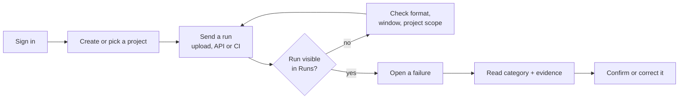

# Getting started

The shortest path from an empty account to a run you can explore. About ten minutes. Every other page assumes you have done this once.

> **Before you start.** You need a TestLookup URL and an account. Your administrator provides both — this guide never contains credentials. If you are the administrator setting up a fresh deployment, see [Administration](/docs/administration).

## 1. Sign in

Open your TestLookup URL and sign in with the username and password you were given. On success you land on **Overview**.

If sign-in fails, check with your administrator that the account is active — see [Troubleshooting](/docs/troubleshooting#permission-and-access-problems).

## 2. Create or pick a project

A **project** is the isolation boundary. Runs, tests, failures, defects and search results belong to exactly one project, and users only see projects they are a member of.

- **Settings → Projects → New** to create one. The name is yours; whoever creates it becomes a member.
- Already have projects? Pick one from the project selector in the header.

### "All Projects" mode

The selector also offers **All Projects**, which aggregates across every project you can see. Two things to know:

- Some pages are **project-scoped** and stay empty in All Projects mode until you pick one. If a page looks blank, check the selector first — it is the most common cause.
- Aggregate numbers in All Projects mode span projects with different suites and cadences. They are useful for spotting outliers, less useful as a single "quality score".

> **Note.** A project that has been deleted is *soft-deleted* — its rows remain but it disappears from listings, and its runs stop appearing in run lists. If historical runs vanished, ask an administrator whether the project was deleted.

## 3. Send your first test run

There are three routes in. Pick one.

### Option A — upload a file (fastest to try)

Use the upload control in the app and select a report your suite already produces (JUnit XML, TestNG, Allure, Cypress, Playwright, pytest, Robot, Cucumber, NUnit, TRX, xUnit, or a zipped archive). TestLookup detects the format from the content.

### Option B — POST a JSON batch (good for a first API test)

`POST /api/v1/ingest` accepts a batch directly. `project_id`, `build_number` and `results` are required; each result needs `test_name` and `status`.

```bash
curl -X POST "$TESTLOOKUP_URL/api/v1/ingest" \
  -H "X-API-Key: $TESTLOOKUP_API_KEY" \
  -H "Content-Type: application/json" \
  -d '{
    "project_id": "<your-project-uuid>",
    "build_number": "local-1",
    "framework": "junit",
    "results": [
      {"test_name": "checkout_completes", "status": "PASSED", "duration_ms": 120, "suite_name": "Checkout"},
      {"test_name": "checkout_declines_expired_card", "status": "FAILED", "duration_ms": 90,
       "suite_name": "Checkout", "error_message": "AssertionError: expected 402, got 500"}
    ]
  }'
```

A successful call returns **202 Accepted** — the work is queued, not finished. See step 4.

### Option C — upload a report file over the API

```bash
curl -X POST "$TESTLOOKUP_URL/api/v1/ingest/file" \
  -H "X-API-Key: $TESTLOOKUP_API_KEY" \
  -F "project_id=<your-project-uuid>" \
  -F "build_number=local-1" \
  -F "file=@target/surefire-reports/TEST-CheckoutTest.xml"
```

### Getting an API key

**Settings → API keys**, or `POST /api/v1/keys`. The key is shown **once** — store it in your CI secret store immediately. Ingestion endpoints accept either an `X-API-Key` header or a normal signed-in session, so you can experiment from the browser before wiring CI.

> **Warning.** Never commit an API key, paste it into a ticket, or put it in a build log. Treat it like a password. See [Security and privacy](/docs/security).

## 4. Confirm it arrived

Ingestion is asynchronous — `202` means *accepted for processing*, not *stored*. Verify:

1. Open **Runs**. Your `build_number` should appear within a few seconds.
2. Open the run. You should see per-test rows with statuses and durations.
3. If you sent a failure, it should appear in the failure views for that project.

Via the API:

```bash
curl -s -H "X-API-Key: $TESTLOOKUP_API_KEY" \
  "$TESTLOOKUP_URL/api/v1/runs?project_id=<your-project-uuid>&size=10"
```

The response is a page object: `{"items": [...], "total": N, "page": 1, "size": 10, "pages": N}`.

> **Tip.** Run listings default to the **last 30 days**. If you back-fill older history and cannot see it, pass `days=0` for all time.

## 5. Look around

With one run in, the useful next stops are:

- **Runs → your run** — per-test outcomes, durations, error text.
- A failed test — its category and the evidence behind it. See [Investigating failures](/docs/failure-analysis).
- **Dashboards** — mostly empty after one run; they need history. See [Dashboards and metrics](/docs/dashboards).

> **Important.** Most of TestLookup's value is comparative — flakiness, trends and regression detection all need history. One run tells it very little. Flakiness scoring, for example, reports nothing at all below **5 observations** of a test.

## Common first-run problems

| Symptom | Most likely cause | What to do |
|---|---|---|
| `202` but no run appears | Still queued, or the file parsed to zero results | Wait a few seconds, refresh Runs; check the format is supported |
| Upload rejected as empty | Zero-byte file (a wrong path in `-F file=@…`) | Check the file has content locally |
| Run appears, no test rows | Report parsed but contained no cases | Open the report and confirm it has test entries |
| Page is blank, no error | Project selector on **All Projects**, or a time window with no data | Pick a project; widen the window |
| `401` from the API | Missing/expired key or session | Re-issue the key; confirm the header is `X-API-Key` |
| Suite names look wrong | Suite absent from the report and inferred | See [Getting results in](/docs/ingestion#suite-name-resolution) |

More in [Troubleshooting](/docs/troubleshooting).

## The minimal end-to-end loop



**In words:** sign in, choose a project, send a run, and check it appears under Runs. If it does not, the usual causes are an unsupported format, a time window that excludes it, or the wrong project selected. Once the run is visible, open a failure, read the category and the evidence attached to it, and confirm or correct the classification.

## Where to go next

- **Wire it into CI** — [Getting results in](/docs/ingestion)
- **Learn the vocabulary** — [Concepts and terminology](/docs/concepts)
- **Understand the outputs** — [How decisions are made](/docs/decisions)
- **Task recipes** — [Step-by-step workflows](/docs/workflows)
