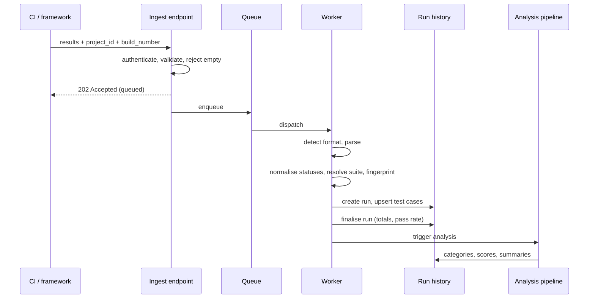

# Getting results in

Everything TestLookup knows starts here. This page covers every route in, what happens to a report after it arrives, and how to tell whether it worked.

## The routes in

| Route | Endpoint | Best for |
|---|---|---|
| **File upload** | `POST /api/v1/ingest/file` | Reports your framework already writes |
| **JSON batch** | `POST /api/v1/ingest` | Custom harnesses, scripts, quick tests |
| **Streaming / live** | `POST /api/v1/stream/ingest` | Long suites you want to watch as they run |
| **CLI / SDKs** | wrap the above | CI pipelines |

All of them authenticate with either an `X-API-Key` header or a signed-in session.

## Supported formats

Format is detected from the **content**, not the filename. The parser dispatch lives in `worker/tasks.py`; the sniffing rules in `routers/ingest._detect_format`.

| Format | Detected by |
|---|---|
| **TestNG** | `<testng-results`, or a `configurationmethod` marker |
| **Robot Framework** | `<robot` root element |
| **NUnit 3** | `<test-run` root element |
| **Visual Studio TRX** | `<TestRun` plus the VisualStudio TeamTest namespace |
| **xUnit.net v2** | `<assemblies`, or `<assembly` with a `test-framework` attribute |
| **JUnit / Surefire** | `<testsuite` or `<testsuites` — also the default |
| **Playwright** | JSON with a top-level `config` containing `projects` |
| **pytest** (`--json-report`) | JSON with top-level `exitcode` **and** `root` |
| **Cypress** (Mochawesome) | JSON with top-level `stats` carrying `passes` / `failures` |
| **Cucumber** | JSON array of feature objects with `elements` |
| **Allure** | Allure result JSON (object or array) |
| **Archive** | A zip containing any of the above |

XML markers are checked before JSON, most-specific first. TRX in particular contains no `<testsuite` marker, so without its own rule it would fall through to the JUnit default and parse to **zero results** — the ordering is deliberate.

> **Note.** If your format is not listed, convert to JUnit XML (nearly every framework can emit it) or post a JSON batch directly.

## What happens after you send it



**In words:** the endpoint authenticates, validates and immediately returns **202 Accepted** — the work is queued, not done. A worker picks it up, detects the format, parses it, normalises each result, resolves the suite name, computes a fingerprint per test, creates the run and upserts the test cases, then finalises the run totals. Finalisation triggers the analysis pipeline, which writes categories, scores and summaries back.

> **Important.** `202` means *accepted*, not *stored*. A report that parses to zero results still returned 202. Always verify — see [Confirming it worked](#confirming-it-worked).

## Key behaviours

### Project and run resolution

`project_id` and `build_number` identify the run. A repeated `(project, build_number)` is **idempotent** — re-sending the same build updates the existing run rather than creating a second one. Useful for retries; surprising if you reuse build numbers across genuinely different runs.

> **Tip.** Idempotent here means *the duplicate is absorbed*, not *the row is overwritten wholesale*. Re-sending updates the run's timestamps but does not necessarily replace every scalar field.

### Test fingerprints

Each test gets a **fingerprint** — a stable identity derived from its name and location — so the same test can be followed across runs and branches. History, flakiness and regression detection all depend on it. Rename a test and its history follows the old fingerprint.

### Suite-name resolution

Suite comes from the report where present. When it is absent, TestLookup infers it, and for some frameworks the suite is only declared at session level. This is the most common source of "the suite name looks wrong" — see [Troubleshooting](/docs/troubleshooting).

### Status normalisation

Framework-specific outcomes are mapped onto a common vocabulary — passed, failed, broken, skipped, unknown. **Broken** (an error rather than an assertion failure) is kept distinct from **failed**, because they mean different things when you are triaging.

### Empty and malformed input

A zero-byte upload is rejected with **400** rather than accepted. Earlier behaviour accepted it, auto-detected it as JUnit, and parsed it to zero results — success reported, nothing ingested. A parse error is recorded as a parse error rather than surfacing as an empty run.

## Confirming it worked

1. **Runs** should list your `build_number` within seconds.
2. Open it — per-test rows with statuses and durations.
3. Or via API:

```bash
curl -s -H "X-API-Key: $TESTLOOKUP_API_KEY" \
  "$TESTLOOKUP_URL/api/v1/runs?project_id=<uuid>&size=10"
```

Returns `{"items": [...], "total": N, "page": 1, "size": 10, "pages": N}`.

> **Tip.** Listings default to the **last 30 days** and exclude runs belonging to deleted projects. Pass `days=0` for all time. If a run is missing, check the window and the project before assuming ingestion failed.

## CI integration

The pattern is the same everywhere: run tests, then post the report.

```bash
# after your test step, regardless of its exit code
curl -sf -X POST "$TESTLOOKUP_URL/api/v1/ingest/file" \
  -H "X-API-Key: $TESTLOOKUP_API_KEY" \
  -F "project_id=$TESTLOOKUP_PROJECT" \
  -F "build_number=$CI_BUILD_NUMBER" \
  -F "branch=$CI_BRANCH" \
  -F "file=@reports/junit.xml"
```

> **Important.** Run the upload step **even when tests fail** — that is exactly the run you want recorded. In most CI systems that means an `always()` / `if: always()` condition.

Store the API key in your CI secret store. See [API, CLI, SDKs and MCP](/docs/integrations).

## Troubleshooting

| Symptom | Likely cause | Check |
|---|---|---|
| 202 but no run | Still queued, or parsed to zero results | Wait, refresh; confirm the report has test entries |
| 400 "empty" | Zero-byte file, usually a wrong path | `ls -l` the file locally |
| Run exists, no tests | Format detected but no cases found | Open the report; check it is not a summary-only file |
| Wrong format detected | Missing a distinctive marker | Send with an explicit format, or convert to JUnit |
| Suite names wrong | Suite absent from the report | See suite resolution above |
| 401 | Bad or missing key | Confirm the header is `X-API-Key` |

## Related

- [Getting started](/docs/getting-started)
- [Concepts and terminology](/docs/concepts)
- [Troubleshooting](/docs/troubleshooting)
