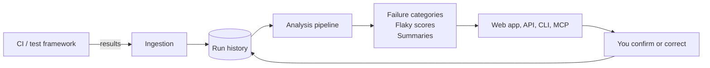

# What TestLookup is

TestLookup collects the results your test suites already produce, keeps their history, and helps you answer three questions faster: **what broke, whether it matters, and whether it has broken before.**

It does not run your tests. Your CI system, your framework and your test code stay exactly as they are. TestLookup reads what they emit.

> **Start here.** If you have never used TestLookup, follow [Getting started](/docs/getting-started) — sign in, create a project, send one run, confirm it arrived. It takes about ten minutes and every other page assumes you have done it.

## The problems it is built for

- **A failure list with no memory.** CI tells you a test failed today. It rarely tells you that the same test failed on four unrelated branches this month, or that it passed on a re-run without anyone changing anything.
- **Triage that starts from scratch every time.** Someone reads a stack trace that a colleague already read last week.
- **"Is this release safe?" answered by feel.** Release conversations often come down to whoever remembers the most.
- **Flaky tests nobody can name.** Everyone knows the suite has them; few teams can list them with evidence.

## What it does

- **Keeps run history** per project, with per-test outcomes, durations and error text.
- **Groups failures** that look alike, so one investigation can cover many failing tests.
- **Categorises failures** and attaches the evidence behind the category.
- **Scores tests for flakiness** from observed history, and says "not enough data" when there isn't enough.
- **Summarises a run** and produces release-readiness signals.
- **Surfaces all of it** through the web app, a REST API, a CLI, SDKs and an MCP server.

## What it does not do

- It does not execute, retry, quarantine or modify your tests. Quarantine in TestLookup is a **recommendation and a record**, not an action taken against your suite.
- It does not decide whether you ship. Release output is a recommendation with its reasoning attached.
- It does not guarantee a root cause. Root-cause text is a **suggestion to confirm**, never a finding.

## Four different kinds of output — and why the difference matters

This is the single most important idea on this page. TestLookup mixes four kinds of statement, and they carry very different weight:

| Kind | What it means | How much to trust it | Example |
|---|---|---|---|
| **Observed evidence** | Something recorded as it happened | It is a fact about your data | "This test failed in 7 of the last 20 runs" |
| **Deterministic calculation** | Arithmetic over that evidence, same inputs → same answer | Reproducible; check the formula | Pass rate, failure counts, run duration |
| **Statistical / model output** | A score or prediction from history | A weighted signal, not a verdict | Flakiness score and its confidence band |
| **Generative (AI) text** | Wording produced by a language model | **A suggestion to confirm** | Root-cause narrative, run summary prose |

Throughout the product and this documentation, AI-generated conclusions are labelled and carry the evidence they were built from. When an agent has nothing to work with, it is designed to say so rather than produce confident-sounding text — an empty result stated plainly is more useful than a fluent guess.

> **Important.** Never treat a generated root cause as a finding. Treat it as the first hypothesis a colleague would offer — worth reading, worth checking.

## Who it is for

| Role | Typical use | Permission level |
|---|---|---|
| **Viewer** | Read dashboards and reports | `VIEWER` |
| **Tester** | Look at runs and failures for their work | `TESTER` |
| **QA engineer** | Triage failures, manage suites, correct classifications | `QA_ENGINEER` |
| **QA lead / manager** | Ownership, release gates, team-wide views | `QA_LEAD` |
| **Platform administrator** | Users, API keys, AI configuration, retention, flags | `ADMIN` |

Roles are defined in `models/postgres.py` as `UserRole`. Higher roles include the abilities of lower ones. Individual pages in this guide name the role a task needs.

## How the pieces fit together

**In words:** your CI or test framework sends results to ingestion. Ingestion normalises and stores them as run history. The analysis pipeline reads that history and produces signals — failure categories, flakiness scores, summaries. Those reach you through the web app and the programmatic interfaces. When you confirm or correct something, that correction is recorded alongside the original.

That last arrow matters: **you are part of the loop, not a recipient of it.**

## Where to go next

- **New here?** [Getting started](/docs/getting-started)
- **Want the vocabulary?** [Concepts and terminology](/docs/concepts)
- **Sending results from CI?** [Getting results in](/docs/ingestion)
- **Wondering how a number was produced?** [How decisions are made](/docs/decisions)
