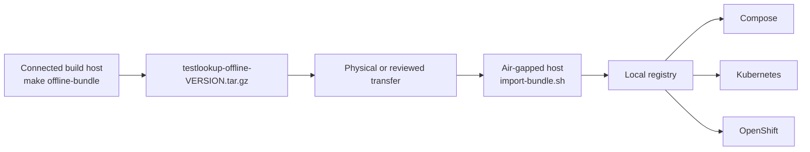

# Air-gapped install

Installing TestLookup on a network that cannot reach Docker Hub, GHCR, PyPI or
npm — a classified enclave, a regulated production segment, or any site where
egress is blocked by policy.

The mechanism is an **offline install bundle**: one tarball containing every
container image, the Kubernetes manifests, the Compose files, checksums, and an
import script. You build it once on a connected host, carry it across the
boundary, and import it on the other side. Nothing in the install path touches
the internet.



---

## 1. What you need

**On the build host** (has internet + your container engine):

| Requirement | Notes |
|---|---|
| `docker` (or `podman`) | Podman works unchanged — the scripts only use flags both implement. `DOCKER=podman` if it isn't behind a `docker` shim. |
| `bash`, `tar`, `gzip` | Git Bash is fine on Windows. |
| `sha256sum` / `shasum` / `openssl` | Required. The build **fails** rather than shipping an unverifiable bundle. |
| `kubectl` or `kustomize` | Optional — used to pre-render the Kubernetes manifests. Without it the bundle ships the raw Kustomize sources instead. |
| `syft` | Optional but **strongly recommended** — this is what puts real SBOMs in the bundle. See [§7](#7-sboms-what-you-actually-get). |
| Disk | ~8 GB free (~3 GB bundle, plus the images in the engine's store). |

**On the air-gapped side:**

| Requirement | Notes |
|---|---|
| `docker` (or `podman`) | To `docker load` the images. |
| A container registry the target can pull from | Harbor, Artifactory, Nexus, the OpenShift internal registry, a plain `registry:2` — anything. Compose can also run straight off the loaded local images. |
| `kubectl` / `oc` | Kubernetes and OpenShift targets only. |

---

## 2. What is in the bundle

```
testlookup-offline-<version>/
├── README.md                  # a condensed copy of this procedure
├── MANIFEST.json              # images, sha256, image ids, per-image SBOM status
├── images.manifest.txt        # the source-of-truth manifest it was built from
├── checksums.sha256           # every other file in the bundle
├── images.list                # "<tar>\t<image ref>" — what import-bundle.sh reads
├── images/*.tar               # one `docker save` archive per image
├── sbom/*.spdx.json           # only when the build host had syft
├── compose/                   # docker-compose.release.yml + .airgap.yml + .env.example
├── k8s/testlookup-airgap.yaml # rendered manifests, placeholders intact
├── k8s/base/, k8s/overlay/    # raw Kustomize sources, for customizing
└── import-bundle.sh           # verify → load → retag → push → next steps
```

**Images included** (default, `core`):

| Image | Role |
|---|---|
| `testlookup/backend` | API + Celery workers + beat + seed job (all one image) |
| `testlookup/frontend` | nginx serving the SPA |
| `testlookup/mcp` | MCP server (SSE) |
| `postgres:16-alpine`, `mongo:7`, `redis:7-alpine` | datastores |
| `minio/minio` (**two tags** — see [§8](#8-the-deliberate-minio-version-skew)), `minio/mc` | object storage + bucket setup |
| `busybox:1.36` | worker init containers on Kubernetes |

`ollama/ollama` and `chromadb/chroma` are **opt-in** — add `--with-llm`. They add
roughly 2 GB and are only useful if you also transfer the model blobs
separately ([§9](#9-local-llm-in-an-air-gap)).

Every one of these comes from **`deploy/images.manifest.txt`**, the single
source of truth. Compose, the Kubernetes manifests, the OpenShift overlay and
the mirror scripts are all checked against it in CI, so the bundle cannot
silently miss an image the deployment needs.

---

## 3. Build the bundle (connected host)

```bash
git clone https://github.com/anandtopu/testlookup && cd testlookup

# Optional but recommended — this is what produces real SBOMs:
#   https://github.com/anchore/syft   (install it before building)

make offline-bundle
```

Output:

```
dist/testlookup-offline-0.1.0.tar.gz
dist/testlookup-offline-0.1.0.tar.gz.sha256
```

Useful flags (`make offline-bundle ARGS="…"`):

| Flag | Why |
|---|---|
| `--version 1.2.3` | Override the tag baked into the app images (defaults to the `VERSION` file). |
| `--created-at 2026-08-03T00:00:00Z` | Pin the bundle timestamp. **Pass this from your release pipeline** — otherwise the wall clock goes in and two builds of the same commit differ. |
| `--with-llm` | Add Ollama + ChromaDB. |
| `--skip-build` | Reuse app images already in the local engine. |
| `--dry-run` | Print the plan (also `make offline-bundle-plan`). |

Preview what would be shipped without building anything:

```bash
make offline-bundle-plan
```

### Reproducibility

With the same commit, the same images and the same `--created-at`, the bundle
is byte-for-byte identical file by file — the assembly step contributes no
timestamps or ordering of its own (GNU `tar --sort=name` + `gzip -n`). What is
*not* reproducible is the container build itself: `pip`/`apt` resolve fresh
layers. If you need a bit-identical artifact across two runs, build the images
once and re-run with `--skip-build`.

---

## 4. Transfer and verify

Carry **both** files across. On the far side, before anything else:

```bash
sha256sum -c testlookup-offline-0.1.0.tar.gz.sha256
tar xzf testlookup-offline-0.1.0.tar.gz
cd testlookup-offline-0.1.0

./import-bundle.sh --verify-only        # checks every file in the bundle
```

`--verify-only` reads `checksums.sha256` and stops. It **fails closed**: a
mismatch, or the absence of any sha256 tool, aborts the install. Do not use
`--skip-verify` for a production install.

---

## 5. Import

```bash
./import-bundle.sh \
    --registry registry.internal \
    --username <user> --password <pass> \
    --push
```

What happens, in order:

1. checksums verified (again — the import is the gate, not just the unpack);
2. every `images/*.tar` is `docker load`ed. **This never contacts a registry**,
   which is what makes the step work with zero egress;
3. each image is retagged into your registry;
4. with `--push`, they are pushed there;
5. the Kubernetes manifests are rendered with your registry substituted in;
6. the exact next commands for each target are printed.

### The naming contract

`--registry` is a **base**. Images land at `<base>/<ref>`:

```
--registry registry.internal
    → registry.internal/testlookup/backend:0.1.0
    → registry.internal/postgres:16-alpine
```

A repository path is fine (`artifactory.example.com/testlookup-docker`). Do
**not** append `/testlookup` yourself — the app refs already carry it. This is
the same layout `openshiftsetup/mirror-images.sh` uses, so one mirrored
registry serves Compose, Kubernetes and OpenShift identically.

Without `--push`, the images are only retagged locally — enough for the Compose
target on the same host, not enough for a cluster.

---

## 6. Deploy

### 6a. Docker Compose

```bash
cd compose
bash scripts/gen-dev-env.sh            # or copy .env.example and fill it in

cat >> .env <<'ENV'
TESTLOOKUP_REGISTRY=registry.internal
TESTLOOKUP_VERSION=0.1.0
ENV

docker compose -f docker-compose.release.yml -f docker-compose.airgap.yml up -d
```

`docker-compose.airgap.yml` is the piece that makes Compose air-gap-capable.
`docker-compose.release.yml` alone hardcodes Docker Hub references for
postgres, mongo, redis and MinIO with no way to redirect them; the override
re-points **every** image — app and third-party — at `$TESTLOOKUP_REGISTRY`.
Both variables are mandatory: Compose refuses to start rather than silently
falling back to `docker.io`, which is the exact failure this file prevents.

`make dev` and the public `install.sh` one-liner are unaffected — they never
load the override.

Then confirm:

```bash
docker compose -f docker-compose.release.yml -f docker-compose.airgap.yml ps
curl -f http://localhost:8000/health/ready
```

### 6b. Kubernetes

```bash
kubectl create namespace testlookup

kubectl -n testlookup create secret docker-registry local-registry \
    --docker-server=registry.internal \
    --docker-username=<user> --docker-password=<pass>
kubectl -n testlookup patch serviceaccount default \
    -p '{"imagePullSecrets":[{"name":"local-registry"}]}'

# Application secrets — generate your own; nothing is baked into the bundle.
kubectl -n testlookup create secret generic testlookup-secrets \
    --from-literal=APP_SECRET_KEY="$(openssl rand -hex 32)" \
    --from-literal=JWT_SECRET_KEY="$(openssl rand -hex 32)" \
    --from-literal=POSTGRES_PASSWORD="$(openssl rand -base64 18 | tr -d '=/+')" \
    --from-literal=DATABASE_URL="postgresql+asyncpg://testlookup_user:<pg-password>@testlookup-postgres:5432/testlookup" \
    --from-literal=MONGO_URI="mongodb://testlookup-mongo:27017" \
    --from-literal=MINIO_ACCESS_KEY="testlookup_minio" \
    --from-literal=MINIO_SECRET_KEY="$(openssl rand -base64 18 | tr -d '=/+')" \
    --from-literal=WEBHOOK_SECRET="$(openssl rand -hex 32)"

kubectl apply -f k8s/testlookup-airgap.rendered.yaml
kubectl -n testlookup rollout status deploy/testlookup-backend --timeout=300s
```

Re-run `import-bundle.sh` with `--storage-class <your class>` if the rendered
file still contains `STORAGE_CLASS_PLACEHOLDER`; the script warns and lists any
placeholder it could not resolve rather than letting you apply a broken
manifest.

To customize before applying, edit `k8s/overlay/` and re-render:

```bash
kubectl kustomize k8s/overlay > my-manifests.yaml
```

### 6c. OpenShift

Everything from 6b, plus:

```bash
oc adm policy add-scc-to-user anyuid -z default -n testlookup
```

The stock infra images (postgres, mongo, MinIO, nginx) run as fixed UIDs and
need `anyuid` under `restricted-v2`. The rendered manifests already contain the
OpenShift **Routes** (edge TLS, HTTP→HTTPS redirect). Supply the hostnames at
import time:

```bash
./import-bundle.sh --registry registry.internal --push \
    --apps-domain apps.ocp.example.com \
    --storage-class ocs-storagecluster-ceph-rbd
```

If your build host *can* reach both the internet and the cluster's registry,
the older registry-to-registry path is still available and does the same job
without a tarball:

```bash
make k8s-mirror-images-openshift          # seed Artifactory
make k8s-deploy-openshift-artifactory     # build, push, deploy
```

The offline bundle exists for the case that host does **not** exist.

---

## 7. SBOMs: what you actually get

`MANIFEST.json` records an SBOM status **per image**, and the bundle never
implies an SBOM exists when it does not.

| `sbom_mode` | Meaning |
|---|---|
| `syft` | Real SPDX SBOMs under `sbom/`, one per image, generated on the build host. Each image entry points at its file. |
| `unavailable` | **No SBOMs in this bundle.** Every image entry carries an explicit `"status": "unavailable"` with the reason. |

The reason `unavailable` is even possible: the published GHCR images *do* carry
BuildKit SBOM and provenance attestations (`.github/workflows/release.yml`
builds with `sbom: true`, `provenance: mode=max`), but those attestations live
in the **registry manifest list** — `docker save` copies image layers and
config, not attestations. There is no way to carry them into a tarball as-is.

So, to get SBOMs into a bundle, do one of:

- **install [syft](https://github.com/anchore/syft) on the build host** before
  running `make offline-bundle` (the supported path); or
- while still connected, export the attestation separately and hand it over
  with the bundle:

  ```bash
  docker buildx imagetools inspect \
      ghcr.io/anandtopu/testlookup/backend:<tag> --format '{{json .SBOM}}' \
      > backend.sbom.json
  ```

The `sha256` values in `MANIFEST.json` are checksums **of the tar files** —
they verify the transfer. `image_id` is the image config digest reported by the
container engine, and `repo_digest` is the registry digest when the image was
pulled rather than built locally.

---

## 8. The deliberate MinIO version skew

The bundle ships **two** MinIO server tags, and this is intentional:

| Surface | Tag | Why |
|---|---|---|
| Compose | `RELEASE.2024-11-07T00-52-20Z` | `make dev` documents the MinIO Console on port 9001. MinIO removed the object browser from the community console in the 2025-04 releases, so moving Compose forward would break a documented workflow. |
| Kubernetes / OpenShift | `RELEASE.2025-09-07T16-13-09Z` | What the existing clusters already run. Rolling a live MinIO server *backwards* is riskier than leaving it pinned. |

Both are recorded in `deploy/images.manifest.txt` with the reasoning inline,
both ship in the bundle, and CI fails if either moves — so the skew stays a
decision, not an accident. If you standardize on one tag in your environment,
change the manifest first; the drift guard will then tell you every file that
needs to follow.

---

## 9. Local LLM in an air-gap

`--with-llm` bundles the Ollama and ChromaDB **images**, not the models. Model
blobs (4–14 GB each) must be transferred separately:

```bash
# connected host
docker run --rm -v ollama_models:/root/.ollama ollama/ollama:0.5.4 ollama pull qwen2.5:7b
docker run --rm -v ollama_models:/root/.ollama -v "$PWD":/out busybox:1.36 \
    tar czf /out/ollama-models.tar.gz -C /root/.ollama .
# air-gapped host: restore that tarball into the ollama_models volume / PVC
```

Without models, TestLookup degrades exactly as designed: `ANALYSIS_MODE=auto`
falls back to the ML classifier and then the rules engine. `AI_OFFLINE_MODE`
defaults to `true`, so no outbound integration is attempted regardless.

---

## 10. Troubleshooting

| Symptom | Cause / fix |
|---|---|
| `CHECKSUM MISMATCH` on import | The bundle was corrupted or altered in transit. Re-transfer; do not install it. |
| `No sha256 tool available` | Install `coreutils` or `openssl` on the target. `--skip-verify` exists but leaves you unverified. |
| `ImagePullBackOff` referencing `docker.io/...` | Something bypassed the retag. On Compose, you forgot `-f docker-compose.airgap.yml`; on Kubernetes, you applied the raw overlay instead of the rendered file. |
| `..._PLACEHOLDER` in a manifest | Re-run `import-bundle.sh` with `--storage-class` / `--apps-domain`. The placeholders deliberately do not resolve so an un-rendered apply fails loudly instead of pulling from the wrong registry. |
| Compose exits with "TESTLOOKUP_REGISTRY must be set" | Working as designed — set both `TESTLOOKUP_REGISTRY` and `TESTLOOKUP_VERSION` in `.env`. |
| Infra pods `CrashLoopBackOff` on OpenShift | `anyuid` was not granted (§6c). |
| Bundle build fails pulling images | The build host lost internet, or a TLS-intercepting proxy is in the way — see [DEPLOYMENT.md §5](../architecture/DEPLOYMENT.md). |

---

## 11. For maintainers

- **`deploy/images.manifest.txt`** is the single source of truth for images.
  Add or bump an image there **first**, then update the surfaces.
- `make images-check` (CI job **Images — Manifest drift**) asserts Compose, the
  Kubernetes manifests, the `openshift-artifactory` overlay and the OpenShift
  mirror scripts all agree with it, and that no compose file carries a floating
  `:latest`.
- `make images-check-test` runs the guard's own regression tests — they prove
  it fails on drift, not just that it passes today.
- The **Offline bundle** workflow builds a bundle with the network on, then
  verifies checksums, `docker load`, retag and an offline application-module
  import inside `--network none` containers. It proves *bundle integrity and
  offline import*, not a full-stack end-to-end deployment.

## Related

- [architecture/DEPLOYMENT.md](../architecture/DEPLOYMENT.md) — every deployment topology
- [user-guide/administration.md](./administration.md) — backup, restore, upgrades
- [user-guide/sizing.md](./sizing.md) — capacity planning
